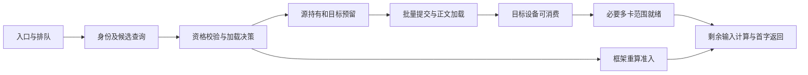
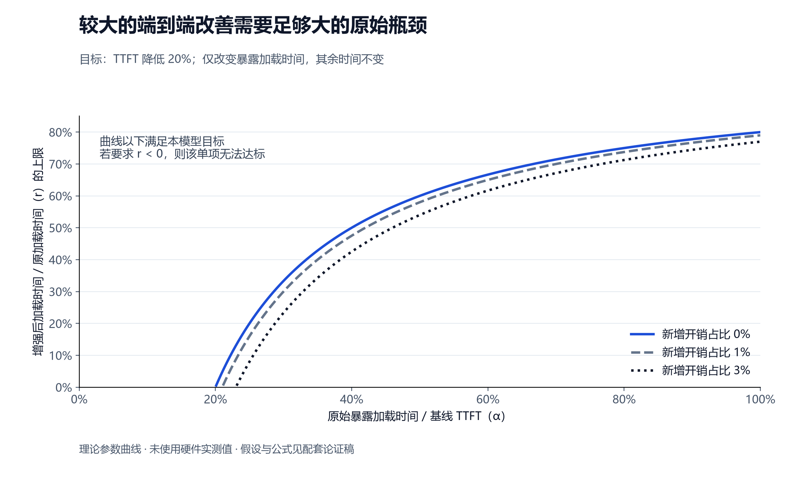
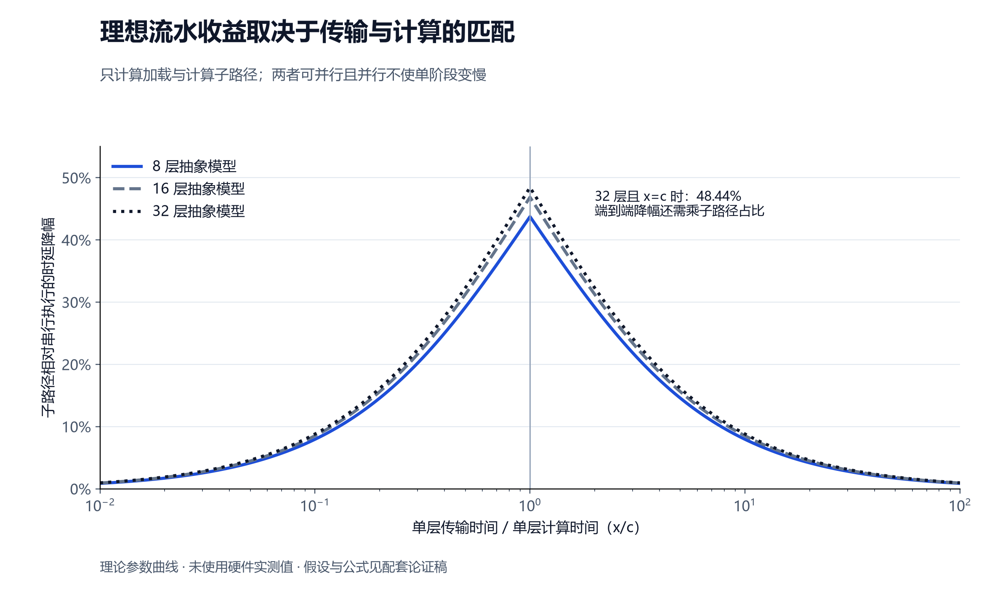
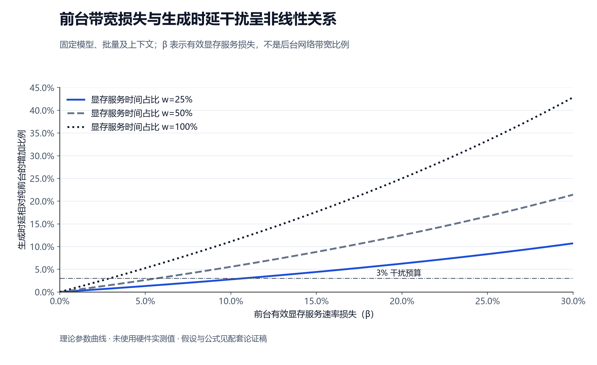
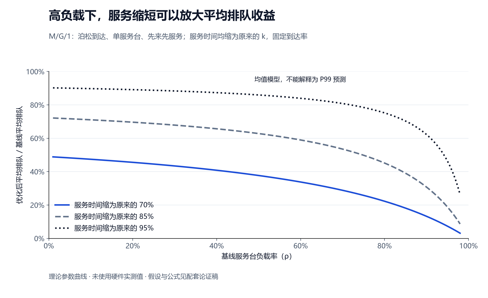

# 统一异构 KVCache 存储池：推理性能理论建模与 KPCL 通信需求推导

> 版本：V1.0，2026-09-07。用途：技术评审中的条件化论证、研发范围选择与通信库需求提炼。
>
> 本文建立“业务场景 → 在线指标 → 执行依赖 → 瓶颈 → 软件机制 → 可检验条件”的分析方法。公式是模型内推导，曲线是确定性参数扫描，不是硬件实测或项目性能预测。现有提前验证继续开展，其结果用于逐步收紧参数范围。

## 1. 本轮可支持的判断与已有证据

项目可以先证明：在明确的业务、资源与接口条件下，某种机制能够减少关键路径等待或限制尾部时延，并反求达到业务目标所需的参数。理论论证当前要交付的是**可复算的收益条件、不能成立的区域、机制对应的接口要求**。这些结果可以支持研发路线选择。

用户本轮提供的观测如下，保留原始精度，不将其变成精确数据集：

| 已有信息 | 当前可采用的表达 | 不能由此推出的结论 |
|---|---|---|
| 测试方式 | 单个请求，不同输入 Token 长度下的前缀匹配查询时延 | 并发查询容量、生产请求分布或尾时延 |
| 16K Token，TCP | 几个毫秒级 | 精确均值、P50、P99 |
| 16K Token，RDMA | 几百微秒级 | 吞吐上限或排队时延 |
| 16K Token，URMA | 比 RDMA 进一步降低约 30%～40% | 端到端 TTFT 同比例下降 |
| 尚缺信息 | 查询计时起止、重复次数、端到端占比、分布、并发、版本与拓扑 | 不以默认值补齐 |

URMA 指通用远程直接内存访问，提供用户态高性能远端通信接口。RDMA 指远程直接内存访问，由通信设备访问授权内存。TCP 指面向连接的可靠网络传输协议。KPCL 指本项目使用的底层通信接口库，封装通信机制并报告完成与错误。用户所称 URMEM 与既有文档中的 UBMEM 命名暂不合并，具体接口以库团队定义为准。

本文中的 KVC 软件指缓存状态管理、加载准入、执行依赖组织和资源控制部分。KVCache 指大模型注意力键值缓存，保存历史 Key/Value 激活状态以复用历史计算。自研增量必须与已经支持缓存复用的可用基线比较。

## 2. 在线指标必须落到同一组时间戳

设请求到达指定观测边界的时刻为 $t_0$，第 $j$ 个输出 Token 可见时刻为 $t_j$，输出总数为 $M$。

\[
\mathrm{TTFT}=t_1-t_0
\]

TTFT 为首字生成延迟。必须区分客户端观测和服务端执行观测，入口排队、网络返回是否包含由计时边界确定。

\[
\mathrm{ITL}_j=t_j-t_{j-1},\quad j=2,\ldots,M
\]

ITL 为相邻输出 Token 的时间间隔，描述生成期间的局部停顿。若客户端按多 Token 数据块接收，则块间隔不能直接当作逐 Token 间隔。

\[
\mathrm{TPOT}=\frac{t_M-t_1}{M-1}
=\frac{1}{M-1}\sum_{j=2}^{M}\mathrm{ITL}_j,\quad M>1
\]

TPOT 为每个输出 Token 的平均生成耗时；单 Token 输出不参与该定义的统计。请求级 TPOT 的 P99 与所有 Token 间隔的 P99 是两种指标。短暂停顿可能被请求内平均稀释。

P99 表示 99% 样本不超过的时延分位值。本文使用 $Q_p(X)$ 表示随机变量 $X$ 的 $p$ 分位数，$F_X(t)=\Pr(X\le t)$ 表示分布函数。尾部波动至少同时观察 $Q_{0.99}$ 和 $Q_{0.99}-Q_{0.50}$，不能只观察 P99/P50 比值。

失败与超时请求保留在到达请求分母中。成功样本时延分位数与成功率共同报告，避免删除最慢失败样本后得到虚假的 P99 改善。

## 3. 业务场景与比较对象

### 3.1 四类主要场景

| 场景 | 首要指标 | 主导依赖 | 本文分析重点 |
|---|---|---|---|
| 长公共前缀或多轮会话复用 | TTFT | 缓存查询、加载、设备接入、剩余输入计算 | 重算节省与加载成本、流水、数据位置 |
| 已接入本地缓存的持续生成 | TPOT、ITL | 每步模型计算、显存访问、多卡通信 | 后台干扰、调度间隙、资源隔离 |
| 多请求、多源、多卡并发加载 | TTFT P99、ITL P99 | 汇聚队列、最后一个必要子流、共同资源 | 突发控制、组完成、依赖时限 |
| 冷会话恢复或容量压力 | TTFT P99、恢复期间 ITL | 存储读出、正文加载、换出进度 | 可服务容量、恢复预算、后台稳定性 |

Prefill 指输入预计算，处理提示词并建立缓存。Decode 指后续逐字生成。前缀复用直接减少 Prefill；对 Decode 的影响要通过少排队、少换入或少资源争用解释。该边界与 [vLLM 官方说明](https://docs.vllm.ai/en/latest/features/automatic_prefix_caching/#limits)一致。

### 3.2 两组问题必须分开计算

1. **复用与重算比较**：判断给定场景是否值得采用外部缓存。
2. **自研增强与已有缓存系统比较**：判断自研软件的额外机制是否值得实现。

若基线已经跳过相同的前缀计算，不能把这部分通用缓存收益再次记为自研收益。理论基线必须写明是否支持逐层加载、动态选路、原生设备传输和前后台限速；已有的能力不重复归因。

### 3.3 业务画像的最小参数

固定或扫描：模型结构和布局、输入长度 $n$、可复用的连续前缀长度 $p$、输出长度、请求到达过程、多卡切分、缓存位置、资源共享拓扑、后台工作量及失败模式。

“请求命中概率”与“单请求可复用前缀比例”是不同变量。不能默认到达突发、前缀长度、命中、位置和并发相互独立。16K 输入长度也不等于 16K 缓存复用长度。

## 4. 用执行依赖计算 TTFT，而非把模块时延相加

DAG 指有向无环依赖图，表达任务的先后关系。每个节点 $v$ 的执行时间为 $d_v$，完成时刻为 $f_v$，前置节点集合为 $\mathrm{pred}(v)$：

\[
f_v=d_v+\max_{u\in\mathrm{pred}(v)} f_u.
\tag{1}
\]

入口设为零时刻，最后节点是首个 Token 在约定边界可见。无前置节点时使用其实际释放时刻。

同一个请求的候选依赖如下，框架支持逐层执行时可在加载后分出逐层计算分支：

式 (1) 对**已确定的合法执行日程**成立。共享网卡、显存、CPU 或计算引擎上的先后执行，必须作为资源约束边或资源等待节点加入图；不能只画数据依赖后假设所有任务可并行。加载分支与重算分支是候选路径，不要求同一请求同时执行。

三条记账规则：

- 多卡数据到齐若已在加载组完成中计入，随后只加额外协调耗时。
- 设备可见性若已包含在传输完成定义中，不再次添加。
- 网络排队、存储读出、布局转换已经由某个服务节点承担时，不再另加同名预算。

固定其他节点与日程时，缩短一个节点 $\delta$，总完成时间最多缩短 $\delta$；非关键节点可以缩短而不改变 TTFT。某条路径缩短后，另一条路径可能成为新的关键路径。队列负载改变时需重新计算日程，不能沿用旧关键路径占比。

## 5. 命题一：现有查询加速的直接贡献可以严格限定

在查询完全串行暴露、其他环节不变的简化场景，设基线查询耗时为 $q$，其他时间为 $U$，查询占比 $f=q/(U+q)$，查询自身加速倍数为 $s$：

\[
T_0=U+q,\qquad T_1=U+q/s
\]
\[
\frac{T_0-T_1}{T_0}=f(1-1/s),\qquad
\frac{T_0}{T_1}=\frac{1}{1-f+f/s}.
\tag{2}
\]

这是阿姆达尔定律在该路径上的直接展开。若 URMA 相比 RDMA 将查询时延降低比例记为 $r_q\in[0.3,0.4]$，则：

\[
\text{TTFT 直接降幅}=r_q f\in[0.3f,0.4f].
\tag{3}
\]

要仅靠该机制使 TTFT 降低 $\gamma=20\%$，需 $f\ge\gamma/r_q$，即查询原占比约为 50%～66.7%。这不符合“查询占比较小”的前提，因此该单项不能承担显著端到端收益的主要论据。

式 (3) 使用同口径的标量耗时，不适用于把查询 P99 除以 TTFT P99。查询与其他工作并行时，直接收益还可能更低。

查询加速仍可降低短前缀使用门槛；在查询服务自身接近饱和时，还可能降低排队。这两类额外作用需另建模型，现有单请求数据不能证明其并发收益。

## 6. 命题二：从模型结构建立字节量和计算量，反求复用条件

### 6.1 缓存字节量

对常规全层注意力，设层数为 $L$、每层 KV 头数为 $H_{kv}$、每头维度为 $d$、每元素字节数为 $w$，复用前缀为 $p$：

\[
V_{\mathrm{logical}}=2LpH_{kv}dw.
\tag{4}
\]

系数 2 分别对应 Key 和 Value。各层不同则逐层求和。逐卡使用真实 KV 头数、复制、填充和布局计算 $V_r$，不能总是除以张量并行度。张量并行指将模型运算分配到多张加速卡协同执行。

式 (4) 不直接覆盖潜在注意力压缩、滑动窗口或混合状态模型；这些模型从实际状态清单计算。量化、对齐、重传、临时变换和副本决定实际字节数。

对于物理资源 $e$，按经过该资源的实际操作求和得到 $V_e$。同一对象在网卡、总线、显存上消耗的字节可能不同。所谓 Host CPU 零数据拷贝，只说明 CPU 不搬运正文，不能自动推出绕过主机内存或不占用显存带宽。

### 6.2 可节省的输入计算

在固定稠密因果注意力结构中，用 $a$ 表示每个 Token 的投影及前馈等运算量系数，$b$ 表示每对因果注意力位置的运算量系数：

\[
F(n)=an+b\frac{n(n+1)}{2}.
\]

复用连续前缀 $p$ 后，后缀仍需对前缀做注意力计算。需要的运算量为：

\[
F_{\mathrm{suffix}}(n,p)=a(n-p)+b\frac{n(n+1)-p(p+1)}{2}.
\]
\[
\Delta F=ap+b\frac{p(p+1)}{2}.
\tag{5}
\]

式 (5) 说明计算节省不能普遍按命中 Token 比例线性外推。它是结构运算量模型；运行时间还受实际批量、算子效率、显存访问和调度影响。

物理下界可写为 $T\ge\max(F/P_{\max},V_{\mathrm{mem}}/B_{\max})$，其中 $P_{\max}$、$B_{\max}$ 是计算与带宽上限。这种 Roofline（以算力与带宽限制判断瓶颈的方法）下界用于排除不可能情况，不能作为可交付耗时上界。[LBNL 对 Roofline 的说明](https://cs.lbl.gov/what-we-do/cutting-edge-computing/)

### 6.3 从 TTFT 目标反求加载预算

在顺序加载模型中，$P_0$ 为完整输入计算时间，$P_s$ 为复用后的剩余输入计算时间，$U_0,U_1$ 为其他路径时间，$H$ 为查询、决策、授权和接入开销，$A$ 为加载中的固定及排队开销，$B$ 为该模型中的实际有效传输速率：

\[
T_{\mathrm{recompute}}=U_0+P_0,
\quad T_{\mathrm{reuse}}=U_1+H+A+V/B+P_s.
\]

要求相对重算降低 $\gamma$，得到：

\[
V/B\le R_{\mathrm{budget}},\quad
R_{\mathrm{budget}}=(P_0-P_s)+(U_0-U_1)-H-A-\gamma T_{\mathrm{recompute}}.
\tag{6}
\]

若 $R_{\mathrm{budget}}>0$，需 $B\ge V/R_{\mathrm{budget}}$。若预算非正且 $V>0$，该顺序路径无法达标。右侧是时间预算，符号中的 $R_{\mathrm{budget}}$ 不表示带宽。

式 (6) 在上述精确模型内是等价条件。把未知排队设为零，或把峰值带宽代入 $B$，只能得到乐观可行性筛查。要形成条件充分性，需用开销上界与可保证带宽下界代入，并覆盖真实依赖。

### 6.4 相对已有复用系统的自研增量

若两套系统消费相同前缀、剩余计算相同，则 $P_s$ 抵消。设基线暴露加载时间占 TTFT 的比例为 $\alpha$，增强后该时间变为原来的 $r$，新增控制开销占基线 TTFT 的比例为 $\eta$；其他项目不变：

\[
G=\frac{T_0-T_1}{T_0}=\alpha(1-r)-\eta.
\tag{7}
\]

达到目标 $G\ge\gamma$ 需：

\[
r\le 1-\frac{\gamma+\eta}{\alpha}.
\tag{8}
\]

这给出“显著”的独立检验：如果瓶颈占比 $\alpha<\gamma+\eta$，即使该瓶颈完全消除，也不够达标。不能把改善后台容量、查询和流水的百分比直接相加。

图中 20% 是待论证目标，新增开销比例是参数扫描，均不代表项目测量值。

### 6.5 单请求可行之外还需长期资源稳定

设到达率为 $\lambda$，$I_i$ 为请求 $i$ 是否选择加载的指示变量，$V_{i,e}$ 是该请求在资源 $e$ 上需要的工作字节量，后台持续流量为 $b_e$，资源有效容量为 $C_e$：

\[
\lambda\,\mathbb E[I_iV_{i,e}]+b_e<C_e,\quad\text{对每个共享资源 }e.
\tag{9}
\]

这通常是稳定工作的必要条件，不能独立保证尾时延。只有独立且大小固定时才能将期望拆成命中概率乘平均对象大小。多个独立链路可聚合，经过同一个接收端口的流不能简单相加峰值带宽。

此外，任意时间窗内必须按时完成的工作量不能超过该时间窗可提供的服务量。平均负载低于容量仍可能因短时突发错过截止时间。

## 7. 命题三：逐层流水可以减少暴露加载时间，但收益有精确边界

考虑一个已有源缓存、顺序传输、顺序计算且可相互重叠的两级流水模型。$x_l$ 表示第 $l$ 层达到可消费状态所需的传输阶段时间，$c_l$ 表示该层消费计算时间，$A_l$ 为该层数据可用时刻，$F_l$ 为计算完成时刻：

\[
A_l=A_{l-1}+x_l,\quad
F_l=\max(F_{l-1},A_l)+c_l,\quad A_0=F_0=0.
\tag{10}
\]

若源侧也是逐层生成，则传输还需等待源释放时刻；若并行网卡、变换阶段或资源争用改变日程，则回到式 (1)。

当每层 $x_l=x,c_l=c$ 时，递推可得：

\[
T_{\mathrm{pipe}}=x+c+(L-1)\max(x,c),
\quad T_{\mathrm{serial}}=L(x+c).
\]
\[
\Delta T=(L-1)\min(x,c).
\tag{11}
\]

当 $x=c$，这段加载与计算子路径的最大相对降幅为 $(L-1)/(2L)$。理论示例 $L=32$ 时为 48.4375%；这个数字是抽象流水公式的结果，不是项目 TTFT 预测。端到端还包含入口排队、控制和输出等时间，且基线可能已经有流水。

“隐藏的传输占比”与“端到端时延降幅”分母不同。理论隐藏比例 $(L-1)\min(x,c)/(Lx)$ 可以很高，却不等于 TTFT 同比例降低。

本机制的成立条件：框架允许按层或按合法范围消费；有计算任务可以重叠；设备可见性正确关联；预取目标显存充足；并行执行没有将传输或计算显著拖慢。若并行后每层耗时变成 $x',c'$，必须用 $x',c'$ 重新计算，而不能沿用串行耗时。

**向 KPCL 反推**：提供分段完成与目标可见事件，表达前置依赖，限制提交批次等待和预取深度。优先级跟随当前最紧的计算依赖，不永久把所有首层大数据置于最高级。

## 8. 命题四：TPOT 改善可以从共享带宽干扰直接推导

### 8.1 一个可解释的显存带宽受限模型

HBM 指高带宽显存。固定模型、批量和上下文，假设每步生成中有一段暴露在关键路径上的显存服务时间 $m=D/B$，其余不可重叠时间为 $t_f$。$D$ 为该步实际显存访问量，$B$ 为纯前台时的有效显存服务速率。

定义 $\beta\in[0,1)$ 为后台干扰造成的**有效服务速率损失比例**，它不是后台网络带宽比例：

\[
\tau_0=t_f+m,\quad
\tau(\beta)=t_f+\frac{m}{1-\beta},\quad
w=\frac{m}{\tau_0}.
\tag{12}
\]

这里 $w$ 是纯前台生成时间中暴露显存服务的占比。定义干扰率 $I=(\tau(\beta)-\tau_0)/\tau_0$，直接相减得到：

\[
I=\frac{w\beta}{1-\beta}.
\tag{13}
\]

若要求 $I\le\varepsilon$，则：

\[
\beta\le\frac{\varepsilon}{w+\varepsilon}.
\tag{14}
\]

以项目既有 3% 干扰目标为预算：当 $w=1$，模型要求 $\beta\le0.03/1.03\approx2.913\%$；当 $w=0.5$，要求 $\beta\le0.03/0.53\approx5.660\%$。$w$ 的取值只是条件扫描，没有假定目标平台是哪一种。

这将“保障 TPOT”变为明确的软件控制要求：识别并限制会降低前台有效显存服务速率的后台操作。仅给网卡分配逻辑队列不能证明 $\beta$ 已受控。

若基线干扰为 $\beta_0$，增强后为 $\beta_1$，在同一模型下：

\[
\tau(\beta_0)-\tau(\beta_1)
=m\left(\frac{1}{1-\beta_0}-\frac{1}{1-\beta_1}\right).
\tag{15}
\]

它可以计算相对已存在限速策略的增量，无需把基线假设为完全无隔离。

### 8.2 同时约束后台必要进度

后台所需最低资源不能消失。若为了满足式 (14) 而把必要换出、恢复和重建全部停止，可能导致容量枯竭或积压增长。必须同时满足前台损失预算和后台长期稳定条件 (9)。

若二者没有交集，应减少加载字节、调整数据位置、增加独立资源或缩减场景承诺；单纯调节优先级无法突破总容量。

### 8.3 生成波动的敏感度

\[
\frac{\partial\tau}{\partial\beta}=\frac{m}{(1-\beta)^2}.
\tag{16}
\]

背景占用越高，相同幅度的占用波动越容易形成生成时延波动。仅当 $t_f,m$ 固定且随机性只来自 $\beta$ 时，利用单调变换可得：

\[
Q_p(\tau)=t_f+\frac{m}{1-Q_p(\beta)}.
\tag{17}
\]

真实环境的批量、上下文、计算和调度也在变化时，不能直接套用 (17)，需按同类业务分桶或使用联合模型。式 (16) 仍说明减少高占用及其突发的优化方向。

## 9. 命题五：用到达约束和最低服务约束建立尾时延边界

### 9.1 从吞吐指标转向可提供的服务

设 $A(t)$ 为进入某资源的累计字节量，任意长度 $u$ 的区间满足：

\[
A(t+u)-A(t)\le\sigma+\rho u.
\tag{18}
\]

$\sigma$ 是允许的突发字节量，$\rho$ 是长期到达速率。二者组成到达约束。系统向该流提供速率—时延服务曲线：

\[
\mathcal B(u)=R[u-\theta]_+,\quad [z]_+=\max(z,0).
\tag{19}
\]

$R$ 是可保证的最低服务速率，$\theta$ 是最大服务启动延迟及阻塞预算。服务曲线约束累计服务，允许短期起伏，不是“每个时刻都按固定速率发送”的假设。

### 9.2 推导时延上界

对于无丢失、按序服务的流，寻找让累计服务追上累计到达的水平时间偏移 $d$：

\[
\sigma+\rho u\le R(u+d-\theta).
\]
\[
d\ge\theta+\sigma/R+(\rho/R-1)u.
\]

当 $R\ge\rho$ 时，右侧对 $u\ge0$ 的最大值在 $u=0$ 达到，于是：

\[
D_{\max}\le\theta+\frac{\sigma}{R}.
\tag{20}
\]

工程上保留 $R>\rho$ 的余量。以上是网络演算的经典边界，含适用条件；不是通过假设正态分布得到 P99。[Le Boudec 与 Thiran，《Network Calculus》§1.4](https://leboudec.github.io/netcal/latex/netCalBook.pdf)

要让该资源延迟不超过预算 $D^*$，可反求：

\[
\sigma\le R(D^*-\theta),\quad D^*>\theta,\quad \rho<R.
\tag{21}
\]

即使峰值链路速率不变，降低突发 $\sigma$、提高最低可用服务 $R$、缩短不可抢占阻塞 $\theta$，也能收紧时延上界。它们分别对应 KVC 的发起节奏与准入、KPCL 的资源服务、底层操作粒度。

### 9.3 不把整形等待移出 TTFT

如果 KVC 在库调用之前排队以限制 $\sigma$，这部分上游等待仍属于请求 TTFT。应从请求入口起计算“整形等待 + 网络服务 + 接入”。需要时限的前台流只能在可调度条件内接纳；不必要的投机加载可以取消或延期，但取消后的重算也需资源预算。

因此，降低库内 P99 并不自动意味着端到端 P99 降低。模型必须覆盖整形器之前的真实到达过程。

### 9.4 后台干扰如何进入服务约束

若总资源有严格服务曲线 $C[u-\theta_0]_+$，竞争后台受到 $\sigma_b+\rho_bu$ 约束，则一种保守的前台剩余服务为：

\[
\mathcal B_f(u)=[C(u-\theta_0)-\sigma_b-\rho_bu]_+
\]
\[
R_f=C-\rho_b,\quad
\theta_f=\frac{C\theta_0+\sigma_b}{C-\rho_b},\quad C>\rho_b.
\tag{22}
\]

此处采用严格服务和受界竞争流的剩余服务模型；前台具体调度若有更强保证，可使用更紧的边界。式 (22) 表明后台平均速率和后台突发均影响前台等待。给每条流平均分带宽，不能单独限定短时阻塞。

不可抢占的最大操作 $q$ 在服务速率 $C$ 下可以产生约 $q/C$ 的阻塞，需纳入 $\theta$。应用描述符大小不一定等于硬件不可抢占粒度，需由接口和设备语义确认。

**一种可构造的控制机制**：若在这个共享资源上给予前台严格高优先级，后台最多有一个大小为 $q$ 的不可抢占操作阻挡前台，且总资源具有上述严格服务保证，那么前台可以获得：

\[
\mathcal B_f(u)=[C(u-\theta_0)-q]_+
=C[u-(\theta_0+q/C)]_+.
\]

于是前台延迟界为 $D_f\le\theta_0+(\sigma_f+q)/C$。为满足 $D_f\le D^*$，可要求 $q\le C(D^*-\theta_0)-\sigma_f$，右侧必须非负。这将“缩短不可抢占操作、区分前后台”与时延预算直接连接。若右侧为负，单靠拆小后台操作不够，还需降低前台突发或增加可保证服务。

该构造要求优先级在真实瓶颈上生效，并约束所有阻塞来源。仍需对受限的前台到达率证明后台获得足够剩余服务；不能靠后台永久饥饿实现生产承诺。如果基线已有同等调度，按实际差异重新计算。

### 9.5 从局部界到 P99 的两种方式

**确定性方式**：若所有真实到达与服务都满足约束，(20) 是该模型下的延迟上界，因而也限制 P99。它不保证这个界就是实际 P99。

**概率方式**：给依赖图中各阶段设界 $b_v$，并有 $\Pr(d_v>b_v)\le\delta_v$。把 $b_v$ 代入式 (1)，得到总界 $B_G$。由并集上界：

\[
\Pr(T>B_G)\le\sum_v\delta_v.
\tag{23}
\]

若总超界概率预算不超过 0.01，则 $Q_{0.99}(T)\le B_G$。该方法不要求阶段独立，但可能保守。当前缺乏分布时，$\delta_v$ 是待满足的接口要求，不能写成已经达到。

**两个优化前后的上界相比，只能说明边界收紧，不能直接证明实际 P99 降幅。** 要证明百分比改善，需独立的基线分位数下界，或建立同一工作负载下逐样本的时间支配关系。

## 10. 命题六：多卡协同需要针对组完成而非单流平均

Coflow 指协同传输流组，为同一计算步骤提供必要数据的多条关联子流。设 $T_r$ 为从共同组起点到第 $r$ 个必要成员设备可消费的时间：

\[
T_{\mathrm{group}}=\max_{r=1,\ldots,k}T_r.
\tag{24}
\]

这里的组完成以“所有必要成员”为边界；额外状态协调单独计时。某卡可以提前执行不依赖其他卡的局部工作，因此组数据晚到对整步计算的影响仍用依赖图确定。

若各成员独立且同分布，才有：

\[
F_{\mathrm{group}}(t)=F(t)^k,\quad
Q_{0.99}(T_{\mathrm{group}})=F^{-1}(0.99^{1/k}).
\tag{25}
\]

理论示例 $k=8$ 时，单成员需达到约 99.87445% 分位，才能对应组的 99% 分位。不能将各卡普通 P99 直接当成整组 P99。

不依赖独立性时，利用并集上界：

\[
\Pr(T_{\mathrm{group}}>t)\le\sum_{r=1}^{k}\Pr(T_r>t).
\tag{26}
\]

8 个必要成员平均分配 1% 风险预算时，每个成员的尾概率不超过 0.125%，即要求 99.875% 覆盖率。若各流完全相关，则不存在独立模型中的放大；共享拥塞需作为共同随机因素建模。

**向软件反推**：记录共同组起点、必要成员、剩余字节、截止时间及共享接收瓶颈；优化最后一个必要成员的到齐时间。多卡状态同步只统一动作，不自动增加慢卡带宽。所有流共享同一满载接收口时，仍受总字节量/容量下界限制。

### 10.1 请求路径混合也决定 TTFT 的 P99

设命中路径的请求比例为 $h$，命中、未命中条件分布分别为 $F_h,F_m$。由全概率公式，不要求命中与时延独立，就有：

\[
F_T(t)=hF_h(t)+(1-h)F_m(t).
\]

如果某一尾分位阈值以上已经没有命中样本，且该分位 $p>h$，则有 $F_m(t)=(p-h)/(1-h)$。此时继续缩短已经很快的命中路径，不必改变该尾分位。要改善全部请求的 TTFT P99，还需检查未命中重算排队、失败回退和高压力路径。

因此，理论参数扫描应同时保留路径混合比例及条件分布。不能把单一命中场景的分位数当作全业务分位数。

## 11. 命题七：选择加载或重算可以有明确的误差保护条件

设候选动作 $i$ 的真实剩余完成成本为 $C_i$，预测为 $\widehat C_i$。在同一决策时刻，假设所有候选误差满足 $|C_i-\widehat C_i|\le e$，并且一次选择不会改变比较所用的外部服务条件。

选取预测最小的动作 $j$，可得：

\[
C_j\le\widehat C_j+e
\le\widehat C_{i^*}+e
\le C_{i^*}+2e,
\tag{27}
\]

其中 $i^*$ 是真实最优动作。相比最优动作的代价损失不超过 $2e$，还应另外计入新增决策开销。

要保守放行加载，可要求：

\[
\widehat C_{\mathrm{load}}+2e<\widehat C_{\mathrm{recompute}}.
\tag{28}
\]

更一般地，若成本范围为 $[C_i^-,C_i^+]$，则 $C_{\mathrm{load}}^+<C_{\mathrm{recompute}}^-$ 为保守净收益条件。还需加载与剩余计算不超过请求剩余时限。

已花掉的查询时间在当前选择时属于共同沉没成本，但要计入整次请求的收益对账。全体请求同时改变选择可能改变算力或网络队列，须配合总资源准入，不能把单请求误差界当成集群稳定性证明。

## 12. 平均排队的放大效应可作为辅助论证

在泊松到达、单服务台、先来先服务、服务时间独立同分布且与到达独立的 M/G/1 模型中，$S$ 为服务时间，$\lambda$ 为到达率，$\rho=\lambda\mathbb E[S]<1$：

\[
\mathbb E[W_q]=\frac{\lambda\mathbb E[S^2]}{2(1-\rho)}.
\tag{29}
\]

如果服务时间逐个缩为 $S'=kS$，$0<k<1$，且到达率固定：

\[
\frac{\mathbb E[W'_q]}{\mathbb E[W_q]}
=\frac{k^2(1-\rho)}{1-k\rho}.
\tag{30}
\]

该模型说明，接近饱和时，降低服务时间和其二阶矩可以显著降低平均排队。长任务、重复预计算和大批次提交会影响服务时间分布。

本公式只证明该排队模型中的均值关系。动态批处理、多卡组同步和非泊松到达不满足假设时，不能直接用它预测生产 TTFT；更不能把平均等待降幅标成 P99 降幅。[MIT，M/G/1 Queues，第 2～6 页](https://web.mit.edu/modiano/6.263PRIVATE/6.263old2/lec8.pdf)

## 13. 把模型转换为 KPCL 通信模式与能力需求

### 13.1 统一负载记录

一条传输任务定义为：

\[
J_i=(a_i,d_i,\mathrm{group}_i,\mathrm{pred}_i,
\mathrm{src}_i,\mathrm{dst}_i,V_i,\mathcal E_i,
\mathrm{visible}_i,\mathrm{failure}_i).
\tag{31}
\]

分别表示释放时刻、截止时刻、关联流组、前置依赖、源与目标、真实字节量、经过的共享资源、目标可消费条件和失败动作。另记录物理分段、层/卡范围、允许并行度及缓冲区生命周期。

这组记录同时服务于推理依赖模型和通信回放。改变包长而丢掉共同到达、层依赖或共享拓扑，会失去原场景的主要瓶颈。

### 13.2 从目标向接口逐项反求

| 模式 | 从模型取得的需求 | KVC 持续运行职责 | KPCL/平台机制职责 |
|---|---|---|---|
| 高频小控制消息 | 查询路径预算、消息率、突发、尾概率 | 查询合并、本地摘要、失败快速返回 | 有限排队、服务预留、可靠完成 |
| 分段前缀加载 | 式 (6) 的有效带宽及固定开销预算 | 选择副本、范围、布局与路径 | 批量提交、真实完成量、可见性 |
| 层间加载流水 | 式 (10) 的层数据到齐时间 | 建立依赖、限制预取、选择就绪范围 | 依赖事件、分段完成和设备同步 |
| 多卡协同加载 | 式 (24)～(26) 的组完成与风险预算 | 定义必要成员、统一动作、慢流策略 | 逐成员状态、接收信用、实际路径 |
| 前后台混压 | 式 (14) 的资源损失预算和式 (9) 的后台进度 | 控制发起、加载准入和后台节奏 | 可验证的限速、资源观测和反压 |
| 多源同时汇聚 | 式 (21) 的突发上限、最低服务和启动延迟 | 选择来源、合并请求、控制并发 | 接收在途量、队列服务与拥塞反馈 |
| 一对多热点分发 | 源出口和逐目标完成预算 | 副本位置、树状中继、目标选择 | 逐目标完成、重传、慢目标隔离 |
| 超时、撤销与恢复 | 截止时间、终止访问和缓冲复用时刻 | 降级决策、代际和生命周期 | 查询部分完成、取消、排空和错误边界 |

源端广播与多源向同一接收点汇聚分别建模，不混称拥塞。软件中继可减少源出口压力，不能声称消除所有目标所需的全网字节。

### 13.3 可以直接写入联合需求的表达

“在指定源/目标、分段、并发组、背景到达约束和设备可见性定义下，该类任务获得不低于 $R$ 的服务、最大启动延迟不高于 $\theta$，允许突发不超过 $\sigma$，并按任务时限报告完成或受控失败。”

其中数值从业务预算反求，能力未确认时记录为需求，不写成已发布 API 保证。若 KPCL 只负责内存通信，存储读出和持久化由存储后端承担，不能将远端 SSD 直接视为内存句柄。

## 14. 在未知参数下如何给出有用结论

为每个参数记录来源与范围：用户观测、模型结构、公开物理规格、设计控制值、待测运行值。硬件峰值用于物理下界；调度可保证的服务下界用于条件充分性；二者不能互换。

### 14.1 四种结论等级

| 结论 | 判定方式 | 可在评审中如何使用 |
|---|---|---|
| 物理上不可行 | 理想条件下的耗时下界仍超过预算，或长期工作量超过容量 | 排除路径、缩减场景或改变部署 |
| 存在可行参数区域 | 至少一组参数满足目标，且没有已知物理冲突 | 说明路径有条件可行，列明参数要求 |
| 参数范围内有保证 | 有依据的输入范围内，所有允许情况都满足目标 | 条件化承诺，并列出边界来源 |
| 当前信息不足以判定 | 必需参数既无界，也无可用服务契约 | 保留变量，用敏感度选择最小补充工作 |

### 14.2 区间论证

设基线时间有独立下界 $T_0^-$，优化后时间有覆盖全部开销的上界 $T_1^+$。如果：

\[
T_1^+\le(1-\gamma)T_0^-,
\tag{32}
\]

则给定范围内具备相对降幅保证。若只比较两个假设均值，或两个乐观下界，不能得到该结论。对 P99 使用相应分位数界；对同一请求建立逐样本时间支配也可以推出分位数支配。

### 14.3 使用敏感度缩小补证范围

优先补充能改变结论符号或可行区域的参数，而非平均分配资源完成所有分项：

1. 暴露加载占比 $\alpha$：决定相对已有缓存基线是否有显著改善空间。
2. 每层数据可用与计算依赖：决定流水是否可用及 $x/c$ 比值的范围。
3. 前台显存服务占比 $w$ 与损失 $\beta$：决定 TPOT 干扰机制是否是主要瓶颈。
4. 突发 $\sigma$、服务 $R,\theta$ 和共同组起点：决定尾部要求是否可实现。

这些参数当前可以先保留区间，并使用已有配置、代码路径、平台接口契约和少量已有日志约束；不要求暂停理论工作等待全量硬件实测。后续提前验证每产出一项数据，即替换对应变量并重新计算。

## 15. 本轮建议优先论证的三个命题

| 优先级 | 评审命题 | 关键公式 | 反例与收缩条件 |
|---|---|---|---|
| 1 | 在加载暴露较大、框架支持逐层消费的复用场景，自研依赖执行减少首字关键路径时间 | (7)～(11) | 基线已经充分流水，或真正瓶颈是其他路径 |
| 2 | 在持续生成受后台共享带宽影响的场景，自研准入和资源控制降低 TPOT 及 ITL 波动 | (12)～(17) | 生成受算力主导且后台没有相关干扰，或后台最低进度无法保留 |
| 3 | 在多源、多卡和突发混压场景，自研流组与到达控制收紧可提供的尾时延边界 | (18)～(26) | 上游整形等待抵消收益，底层不能提供服务约束，或共享容量不足 |

查询加速作为已知事实进入控制开销参数。远端直读、复杂分层和条件硬件卸载作为扩展，不能成为上述三条主论证必须全部成立的前提。

## 16. 可直接用于评审的表述

目前我们已经获得单请求前缀查询的协议对照结果，但该环节在首字时间中的占比较小。理论模型也给出相同结论：查询自身降低 30%～40%，只能按其端到端占比折算收益。因此我们不以这项微基准推定整套软件的端到端提升。

我们的主论证是三个可复算命题。第一，按计算依赖组织缓存加载，可以减少暴露在首字关键路径上的等待，其收益由加载占比、层间计算与传输比例共同决定。第二，控制后台对显存、总线及执行资源的干扰，可以降低逐字生成耗时；模型能够反求满足 3% 干扰目标所需的资源损失上限。第三，约束多源突发、最低服务和多卡组完成，可以建立明确的尾时延预算，并转换为 KPCL 的通信模式和接口要求。

当前交付的是这些命题成立的参数区域、不可行区域和实现条件。已有查询数据作为已知参数，后续提前验证逐步替换其余变量。评审可以据此检查优化是否作用于主要瓶颈、资源要求是否合理，以及哪些实现值得优先投入。

## 17. 校验、复算与来源

### 17.1 配套资产

- [理论模型复算脚本](推理性能理论建模_配套/derive_and_plot.py)：计算公式、生成四张参数曲线，并检查递推与闭式、阈值、单位和边界。
- [参数与已有观测](推理性能理论建模_配套/parameters.json)：区分用户概述、未知绝对值和纯理论扫描参数。
- [计算结果与校验记录](推理性能理论建模_配套/verification.json)：只记录数学计算检查，不标为硬件性能通过。
- 脚本使用 Python、NumPy 和 Matplotlib。执行 `python derive_and_plot.py`，输出写到脚本所在目录，可覆盖本套件自行生成的曲线与校验文件。

### 17.2 校验范围

重点核对：同口径比较、公式量纲、闭式与独立递推一致性、流水无法使用/只有一层/强不平衡等边界、TPOT 干扰阈值、多卡独立与相关边界、服务曲线水平偏移、平均排队与 P99 不混用、相对重算与相对已有复用不混用。

复算记录包含 31 组、1505 个数学检查用例。四幅 PNG 已逐图检查标签、坐标、条件说明与可读性。结论适合以“带适用条件的理论论证”提交评审，硬件参数是否落入可行区域仍由后续验证收敛。

本轮数学检查通过不等于条件已在目标设备成立。未知查询绝对值保持为空；未引入硬件时延样本、假造实验分布或外部产品性能数字。

### 17.3 项目依据

- [用户指定的验证总纲](../提前验证方案设计/验证计划方案设计/00_统一异构KVCache存储池_关键技术原型验证总体实施方案设计.md)：验证专题与阶段目标。
- [构建方案 V1.0](../KVC存储池构建方案设计_V1.0.md)：第 9、10、12、13、16、19 章，准入、接口、组通信、资源与测量边界。
- [公共验证契约](../提前验证方案设计/验证计划方案设计/Benchmark公共契约与证据分级规范.md)：基线、统计分母、证据等级和原始事件要求。
- 用户 2026-09-07 本会话提供的 16K 单请求查询结果概述：作为观测线索，未获原始记录。

### 17.4 外部机制依据

- [vLLM：Automatic Prefix Caching](https://docs.vllm.ai/en/latest/features/automatic_prefix_caching/#limits)：前缀复用的直接作用边界。
- [LBNL：Roofline Performance Model](https://cs.lbl.gov/what-we-do/cutting-edge-computing/)：计算与带宽的物理限制；不作为目标设备效率依据。
- [Jean-Yves Le Boudec、Patrick Thiran：Network Calculus](https://leboudec.github.io/netcal/latex/netCalBook.pdf)：到达、服务、延迟和剩余服务的条件化分析。书中理论不证明 KPCL 已提供所需服务契约。
- [Eytan Modiano，MIT：M/G/1 Queues](https://web.mit.edu/modiano/6.263PRIVATE/6.263old2/lec8.pdf)：平均排队的二阶矩及负载关系；不用于推定生产 P99。

公式 (1)～(32) 在相应假设下进行了面向本项目的展开；经典概率及排队关系与项目参数化推导分开表达。外部资料于 2026-09-07 核对。
