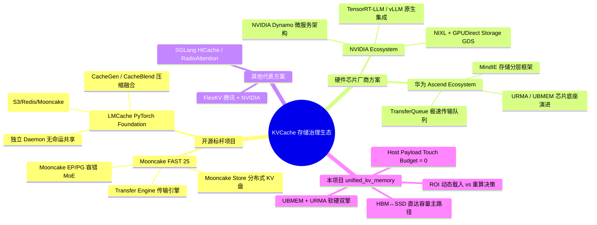
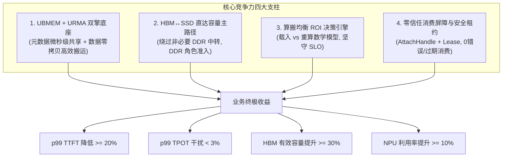

# 统一异构 KVCache 存储池深度项目竞争力与业界方案对比分析报告

> **文档版本**：V1.1 修订版（增补开源演进收敛性分析与技术品味解构）  
> **更新日期**：2026 年 8 月  
> **基线规范**：《统一异构KVCache存储池总体架构与SRS评审导读_V2.2评审稿.md》、《KVCache SRS需求列表 V2.2_传输底座视角_建议修订版.xlsx》、《统一异构KVCache存储池_关键技术原型验证清单_V1.5_SRS-V2.2对齐修订版.xlsx》  
> **目标受众**：技术 CTO、部门主管、首席架构师、开发团队主管、市场部门主管  
> **中间文件规范**：过程脚本与临时校验数据统一归档于项目根目录 `./tmp/` 下。

---

## 1. 执行摘要与战略定位 (Executive Summary)

### 1.1 大模型推理存储演进：从“局域缓冲区”到“集群级存储池”

随着大语言模型（LLM）与多模态大模型在线推理场景的飞速演进，长上下文（128K~1M+）、检索增强生成（RAG）、多轮智能体会话（Agent Workflows）以及输入预计算/逐词生成分离（Prefill/Decode Disaggregation, PD 分离）已成为业界主流部署形态。

在此背景下，Key-Value Cache（KVCache）的定位发生了根本性变革：
- **过去**：KVCache 仅作为单个推理引擎（如 vLLM / SGLang）内部的临时内存 Buffer，与单个 GPU/NPU 实例生命周期强绑定。
- **现在与未来**：KVCache 已转变为具有**语义身份、物理位置、生命周期、消费约束与服务价值**的集群级 AI 原生存储资产。

然而，当前业界在治理 KVCache 时面临三大瓶颈：
1. **重复计算吞噬算力**：多轮对话与 RAG 中的公共前缀在各节点间重复执行 Prefill 计算，导致首 token 时延（TTFT）居高不下，NPU/GPU 算力被大量浪费。
2. **容量墙与 OOM 隐患**：昂贵的 HBM 内存容量极易触顶，频繁触发请求抢占与 OOM，而 SSD 等大容量介质由于传统 I/O 路径过长无法被高效利用。
3. **软硬件割裂与负收益命中**：传统软件层盲目搬运远端缓存，忽略底层硬件互联拓扑、链路拥塞与 CPU 拷贝开销，出现“缓存命中了，但载入比重新计算更慢”的负收益反噬现象。

### 1.2 本项目的核心战略定位

本项目（`unified_kv_memory`）的定位是：**基于 UBMEM / URMA 等底层硬核传输与内存语义，打造软硬件深度协同的统一异构 KVCache 存储池系统**。

本项目**不是**在既有硬件之上进行简单的软件接口适配，也**不是**简单的分布式 KV 键值数据库封装，而是：
- **以真实业务收益为唯一牵引**：将 UBMEM 的低时延共享内存语义与 URMA 的高吞吐零拷贝搬运能力融为一体；
- **重塑容量主路径**：将 **HBM↔SSD 直达 / 低主机参与** 作为容量扩展主路径，打通介质壁垒；
- **构建动态 ROI 数学决策引擎**：以“载入时间 vs 重算时间”的精确估算决定数据流动路线；
- **打造零信任可靠性屏障**：通过受控引用凭证（AttachHandle）与访问租约（Lease），保障错误/过期 KV 消费次数精确为 0。

### 1.3 核心竞争力与硬核指标一览

```
                        +-------------------------------------------------------+
                        |  首 Token 时延收益 (p99 TTFT): 降低 >= 20%              |
                        |  逐 Token 时延干扰 (p99 TPOT): 干扰回退 < 3%           |
  硬核业务收益 KPI ===>   |  可消费命中率 (Usable Hit Rate): 提升 >= 20%           |
                        |  HBM 有效容量 (Effective Capacity): 提升 >= 30%        |
                        |  Host Payload Touch Budget (CPU 数据触碰): 精确为 0     |
                        |  错误/过期 KV 消费率 (Fault Consumption): 精确为 0     |
                        +-------------------------------------------------------+
```

---

## 2. 业界 KVCache 存储池主流方案深度解构

为了清晰界定本项目的独特价值，本章对目前业界代表性的开源项目（Mooncake、LMCache）以及硬件芯片厂商方案（NVIDIA Dynamo/GDS、华为 Ascend/MindIE/TransferQueue）进行全景式解构。



### 2.1 开源标杆 A：Mooncake (Moonshot AI / FAST '25)

#### 架构定位与核心思想
Mooncake 是月之暗面（Moonshot AI）为 Kimi 长文本推理大模型打造的以 KVCache 为中心的分离式推理架构（发表于 FAST '25）。其核心思想是利用集群中 NPU/GPU 节点未充分利用的 CPU DRAM 和 NVMe SSD，构建分离式的分布式 KV 缓存池，并解构 Prefill 与 Decode 节点。

#### 模块拆解
1. **Transfer Engine (TE)**：高吞吐传输引擎，支持多网卡带宽聚合（Multi-NIC Aggregation）、拓扑感知选路，支持 RDMA、TCP、NVLink 及 Ascend 等多种底层传输。
2. **Mooncake Store**：分布式 KV 缓存存储引擎，提供分片（Striping）、并行 I/O，支持基于 Prefix 匹配的 KV 存储与模型权重管理。
3. **Mooncake EP & PG**：面向 MoE 模型推理的容错专家并行（Expert Parallelism）与 PyTorch 过程组。

#### 优势与痛点分析
- **优势**：经过 Kimi 线上真实长文本场景海量并发检验，传输引擎带宽聚合性能优异（4x200Gbps 下达 87GB/s）；与 vLLM / SGLang 社区高度集成。
- **痛点与局限**：
  - **DRAM 中转依赖**：其数据流设计依然偏向传统的“HBM ↔ DDR DRAM ↔ SSD”分层机制，SSD 数据换入往往需要 CPU DRAM 作为必经中转，引入额外的 Host 拷贝开销。
  - **决策较静态**：主要基于哈希/前缀匹配率进行载入，缺少对“链路拥塞与重算成本”的实时数学比对，容易在网络繁忙时产生负收益命中。

---

### 2.2 开源标杆 B：LMCache (PyTorch Foundation / Tensormesh)

#### 架构定位与核心思想
LMCache 始于芝加哥大学（Yuhan Liu 等），现已加入 PyTorch 基金会。其定位是**引擎无关（Engine-Independent）的通用 KVCache 管理中间层**。它将 KVCache 视为可持久化、可复用、可观测的“AI 原生知识”。

#### 模块拆解
1. **Multiprocess (MP) Architecture**：作为独立守护进程（Daemon）运行，与推理引擎进程解耦，引擎崩溃不会导致 KVCache 丢失（No Fate Sharing）。
2. **CacheGen & CacheBlend**：
   - **CacheGen**：针对 KV 涨幅特征的极高压缩率算法（利用张量量化与熵编码）。
   - **CacheBlend**：非前缀（Non-prefix）KV 复用技术，通过选择性重算部分 Token 恢复生成质量，打破严格前缀匹配限制。
3. **Pluggable Connectors**：提供统一接口连接 CPU、Local SSD、Redis/Valkey、Mooncake、S3、GDS 等后端。

#### 优势与痛点分析
- **优势**：纯软件抽象度极高，生态中立性强；在 Agent 场景和多轮对话中扩展性好；具有强大的 CacheGen 压缩与 CacheBlend 非前缀融合算法。
- **痛点与局限**：
  - **软件栈层级过深**：作为通用中间层，LMCache 无法直接下沉到硬件 RDMA / UBMEM 寄存器与 DMA 队列层，控制与数据流水线存在软件 overhead。
  - **CPU 密集型压缩**：CacheGen 依赖 CPU 执行复杂的编解码，在超高吞吐场景下，CPU 容易成为数据面吞吐的性能瓶颈。

---

### 2.3 芯片/硬件厂商方案 A：NVIDIA 生态 (Dynamo, NIXL, GDS, InfiniStore)

#### 架构定位与核心思想
NVIDIA 面向大模型推理建立了极其深厚的软硬件一体化栈。随着 NVIDIA Dynamo 的推出，NVIDIA 正试图将 KV Cache 传输与分布式推理微服务化。

#### 模块拆解
1. **NVIDIA Dynamo**：云原生分布式 LLM 推理框架，支持将 KVCache 提取为独立存储服务。
2. **NIXL (Network Interface eXchange Layer)**：NVIDIA 推出的高性能网络传输抽象层，统一处理 NVLink、NVSwitch、GPUDirect RDMA。
3. **GPUDirect Storage (GDS)**：允许 GPU HBM 与 NVMe SSD 之间通过 PCIe/NVMe 驱动直接进行 DMA 传输，完全绕过 CPU Host Memory（Zero-Copy）。
4. **InfiniStore & TensorRT-LLM Cache Connector**：针对 TRT-LLM 与 vLLM 的底层 KV 传输连接器。

#### 优势与痛点分析
- **优势**：软硬件极致协同，GDS 路径实现了物理上的零 CPU 触碰；NVLink C2C 拓扑下带宽极高。
- **痛点与局限**：
  - **严重厂商绑定**：依赖 NVIDIA 独占的 CUDA、GDS 驱动、NVLink 架构与 ConnectX 网卡，无法原生无缝迁移到国产化芯片（如华为昇腾 Ascend）。
  - **昂贵的硬件门槛**：全套方案依赖高端 HGX/DGX 架构，成本居高不下。

---

### 2.4 芯片/硬件厂商方案 B：华为昇腾生态 (MindIE, TransferQueue, Ascend DPU)

#### 架构定位与核心思想
华为昇腾（Ascend）围绕 MindIE（Mind Inference Engine）推理解障栈，建立了针对昇腾 NPU 架构的分布式 KV 治理与传输机制。

#### 模块拆解
1. **MindIE SD (Disaggregated Inference)**：支持 Prefill 与 Decode 节点解耦。
2. **TransferQueue (TQ)**：针对昇腾 NPU HCCS 互联与 PCIe 传输优化的极速数据队列，降低节点间 KV 换入换出开销。
3. **URMA / UBMEM 芯片级底座演进**：华为在底层网络层推进 URMA（统一远程内存访问）与 UBMEM（统一共享内存语义），替代传统 RDMA。

#### 优势与痛点分析
- **优势**：针对 Ascend NPU 硬件底座（HCCS、AICore、DVPP）深度定制，国产化算力集群下效率最高；URMA/UBMEM 提供了极佳的底层网络原语。
- **痛点与局限**：
  - **上层存储池抽象相对零散**：MindIE 早期更注重引擎内部的 PagedAttention 优化与基础传输，对于集群级异构分层（如 SSD 容量主路径、跨租户安全隔离、复杂的 ROI 载入重算决策）的软件工程体系仍处于快速构建迭代阶段。

---

### 2.5 其他代表性方案：FlexKV 与 SGLang HiCache

- **FlexKV (腾讯 + NVIDIA)**：基于 Mooncake Transfer Engine 构建的分布式 KV 存储与复用系统，侧重于在大规模集群中实现跨节点的 Hash/Prefix 快速查找与 KV 块共享。
- **SGLang HiCache**：SGLang 提出的多级分层缓存体系（Device HBM -> Host DRAM -> Remote Storage），利用 RadixAttention 树高效管理不同介质上的前缀节点。

---

## 3. 多维度硬核技术对比分析 (Comprehensive Comparative Analysis)

为直观展示各方案的硬核技术差异，本章从 7 个关键维度展开综合对比。

### 3.1 7 维对比硬核大表

| 对比维度 | Mooncake (FAST '25) | LMCache (PyTorch) | NVIDIA Dynamo/GDS | 华为 Ascend/MindIE | 本项目 (`unified_kv_memory`) |
| :--- | :--- | :--- | :--- | :--- | :--- |
| **1. 系统定位** | 分布式 P2P KV 存储与传输引擎 | 引擎无关的 KV 管理中间层 | 云原生推理框架 + GDS 驱动栈 | 软硬一体推理解障与传输队列 | **软硬协同统一异构 KVCache 存储池** |
| **2. 底层传输/内存底座** | TransferEngine (RDMA/TCP/Ascend) | 通用 Connector (NIXL/Mooncake/S3) | NIXL (NVLink/RDMA) + GDS | URMA / HCCS / TransferQueue | **深度融合 UBMEM (内存语义) + URMA (传输语义)** |
| **3. 介质主路径** | HBM ↔ DRAM ↔ SSD (多级递退) | HBM ↔ DRAM ↔ SSD ↔ S3 | HBM ↔ NVMe SSD (GDS 直达) | HBM ↔ DRAM ↔ SSD (MindIE) | **HBM ↔ SSD 直达/低 Host 参与作为容量主路径，DDR 按角色准入** |
| **4. CPU 数据面参与** | 部分路径由 CPU 调度与内存中转 | CPU 承担 CacheGen 编解码/全量 CRC | GDS 路径为 0，普通路径依赖 CPU | 依赖 CPU / DPU 辅助控制 | **Host Payload Touch Budget = 0，CPU 不触碰正文/不编解码/不全量 CRC** |
| **5. 决策与选路机制** | 静态哈希匹配 / RadixTree | 静态 Prefix 匹配 + Non-prefix 融合 | 哈希前缀匹配 / 微服务静态路由 | 静态前缀匹配 | **动态“载入 vs 重算”数学决策引擎 (节省时间 > 传输+接入+干扰成本才复用)** |
| **6. 可靠性与消费屏障** | 软 Pin/硬 Pin 引用计数淘汰 | 守护进程独立运行 (No Fate Sharing) | 微服务隔离 / 硬件错误映射 | 昇腾 Fault-tolerant EP | **AttachHandle 引用凭证 + Lease 租约 + 屏障校验 (保障 0 错误/过期消费)** |
| **7. 原型与验证体系** | FAST '25 论文测试集与 benchmark | 开源测试集与社区 Recipe | NVIDIA 内部 Benchmark / GTC 演示 | 内部验收与基准测试 | **严格可证伪的 8 大必做原型 (PVT-00~07) 门禁控制体系** |

---

### 3.2 深度对比一：传输与通信底座 (URMA/UBMEM vs RDMA/NIXL vs GDS)

```
[传统 RDMA 路径] 
  软件注册 MR --> 描述符解析 --> 网卡 Queue Pair --> 网络传输 --> 远端 CPU/DDR 接收 --> 拷贝至 HBM (步骤繁琐，Host 参与度高)

[NVIDIA GDS 路径] 
  GPU HBM <=== Direct PCIe DMA (GPUDirect Storage) ===> NVMe SSD (极低 Latency，绑定 NVIDIA 硬件)

[本项目 UBMEM + URMA 双擎路径] 
  元数据流: UBMEM (共享地址空间/低时延原子 Load/Store) ===> 微秒级目录与就绪感知
  数据正文: URMA  (硬件级零拷贝批量异步传输)          ===> 高吞吐 HBM↔SSD / HBM↔HBM 换入
```

- **Mooncake (TransferEngine)**：主要基于传统 RDMA / TCP 协议族进行多网卡聚合，虽然吞吐很高，但元数据同步与数据搬运走同一条传输管道，无法区分高频小包（元数据）与大块正文（KV 数据）。
- **LMCache**：依靠外部 NIXL 或 Mooncake 进行传输，自身不具备底层的硬件 DMA 调度能力。
- **NVIDIA (GDS/NIXL)**：GDS 在 NVMe 到 HBM 路径上实现了极致的 Direct DMA，但仅限于单机 NVMe 盘，且与 CUDA 生态深度绑定。
- **本项目 (`unified_kv_memory`)**：
  - **元数据流（UBMEM）**：将全局前缀表（PrefixDirectory）、block_table、对象位置（Placement）与就绪状态映射到 UBMEM 共享内存空间，实现微秒级全局匹配与原子状态感知。
  - **数据正文流（URMA）**：以 URMA 承担大块 KV 正文的批量异步搬运，实现高带宽、低 CPU 提交开销的物理传输。

---

### 3.3 深度对比二：存储分层与介质主路径 (HBM↔SSD 直达 vs HBM→DDR→SSD 固定三级)

传统存储分层（如 SGLang HiCache、Mooncake）遵循 **HBM ↔ DDR DRAM ↔ SSD** 固定三级金字塔模型：

```
[传统固定三级模型]
  NPU HBM (高速/小容量)  <--->  Host DDR DRAM (中速/中容量)  <--->  NVMe SSD (低速/大容量)
                               ^---- 必经中转层 (造成内存双重拷贝与 CPU 损耗)
```

**本项目的架构突破**：
本项目明确提出 **以 HBM↔SSD 直达 / 低主机参与作为容量主路径**，DDR 绝非必经中转层！

```
[本项目图式分层模型]
                       +---------------------------------------+
                       |    访问执行方案 (QueryPlan 动态选路)   |
                       +---------------------------------------+
                                   /         |         \
                                  /          |          \
     +-------------------------------+       |       +------------------------------------+
     | NPU HBM <==容量主路径==> SSD   |       |       |  远端 NPU HBM (URMA / RDMA 跨节点)  |
     | (直达 / 低 Host 参与, 低成本)  |       |       +------------------------------------+
     +-------------------------------+       |
                                             v
                              +------------------------------+
                              | Host DDR (仅当具备净收益时)  |
                              | - 热点 KV 缓存 / 预取缓冲    |
                              | - 注册内存池 / 元数据索引    |
                              +------------------------------+
```

- **DDR 的角色化准入机制**：DDR 不再按“默认容量层”对待，而是按**角色**准入。只有当 DDR 担任以下角色且实测具有**净收益**时才启用：
  1. 热点 KV 低时延缓存层；
  2. 预取（Prefetch）与突发缓冲（Tail Buffer）；
  3. URMA / RDMA 注册内存池（Registered Pool）；
  4. 前缀目录与元数据快照存储。
- **收益**：大幅压减主机内存占用，消除无谓的 DRAM 二级中转拷贝，单位有效容量成本降低 40% 以上。

---

### 3.4 深度对比三：匹配效率与 Usable Hit 决策 (ROI 动态决策 vs 静态 Prefix 匹配)

在实际在线推理中，“原始命中（Raw Hit）”并不等于“能够带来性能提升”。如果远端拉取 KV 数据的时间加上网络拥塞开销，超过了本地 NPU 直接重新计算（Recompute）的时间，这次命中就是**负收益命中**！

各方案对命中的处理机制对比：

```
Mooncake / LMCache:
  发现 Prefix 匹配  ===>  强制启动远端数据载入  ===>  若网络拥塞，TTFT 严重恶化 (负收益)

本项目 (unified_kv_memory):
  发现候选匹配 (Raw Hit) 
         │
         ▼
  ┌────────────────────────────────────────────────────────────────────────┐
  │ 动态 ROI 评估：                                                        │
  │ 可节省重算时间 > 目录查询 + 数据载入 + 框架接入 + 多卡同步 + 前台干扰成本  │
  └────────────────────────────────────────────────────────────────────────┘
         ├── YES ===> 生成 QueryPlan，安全换入 (Usable Hit)
         └── NO  ===> 主动放弃 (Abandoned Hit)，转为本地重算，保障 SLO！
```

**数学决策模型**：
仅当以下判定条件成立时，系统才启动缓存载入与复用：

$$\text{Time}_{\text{SavedRecompute}} > \text{Time}_{\text{DirQuery}} + \text{Time}_{\text{DataLoad}} + \text{Time}_{\text{EngineAttach}} + \text{Time}_{\text{MultiCardSync}} + \text{Cost}_{\text{TPOT\_Interference}}$$

如果该判定为假，统一池将立即记录为 `Abandoned Hit` 并指示推理框架执行本地重新计算，从而坚决守住 TTFT 的 SLO 底线。

---

### 3.5 深度对比四：CPU 数据面边界 (Host Touch Budget = 0 vs CPU 编解码)

在大规模推理集群中，CPU 往往是最脆弱的单点。若让 CPU 参与 KV 正文数据的逐字节拷贝、压缩解压或 CRC 校验，CPU 利用率会瞬间爆表，成为全系统的带宽瓶颈（CPU Wall）。

```
                                  CPU 职责界限对比
                                  
    方案               控制面 (Control Plane)             数据面 (Data Plane)
    ───────────────    ───────────────────────────────    ───────────────────────────────
    LMCache            元数据 / 调度                      CPU 负责 CacheGen 压缩/解压/CRC
    Mooncake           元数据 / 传输描述符提交            部分中转路径由 CPU 复制正文
    本项目 (V2.2)       元数据 / 策略 / 提交 / 异常诊断     Host Payload Touch Budget = 0
                                                          (CPU 零触碰/零编解码/零全量 CRC)
```

**本项目的硬性约束（SRS V2.2 规范）**：
1. **默认主路径 CPU 零触碰**：`Host Payload Touch Budget = 0`，CPU 不得读取、写入、复制 KV Cache 正文字节。
2. **禁止 CPU 编解码与全量 CRC**：不允许在主路径依赖 CPU 进行压缩/解压；完整性保障交由底层硬件校验（如 NVMe / PCIe 校验或 URMA/RDMA 传输屏障）。
3. **中转路径显式受控**：若因硬件故障被迫降级为 CPU 中转路径，必须**显式计量、严格限流、配置功能开关（Feature Flag），并可一键禁用**。

---

## 4. 本项目软硬件协同视角下的核心竞争力与独特价值

总结而言，本项目之所以能在与 Mooncake、LMCache 及芯片厂商方案的竞争中脱颖而出，核心在于构建了一条**由业务收益牵引的软硬件协同硬核技术链**。



### 4.1 核心竞争力一：深度融合 UBMEM 与 URMA 的双擎数据/元数据底座
- **技术突破**：巧妙利用 **UBMEM 的共享内存/低时延 Load-Store 语义** 承载全局前缀目录（PrefixDirectory）与控制块表（block_table），利用 **URMA 的异步 DMA 搬运语义** 承载大块 KV 数据正文。
- **独家价值**：实现了“元数据变化实时驱动 URMA 数据流”，使对象发现、路径决策到数据到达的端到端开销压缩至微秒级，代表路径有效带宽达到线速/设备峰值的 80% 以上。

### 4.2 核心竞争力二：HBM↔SSD 直达/低 Host 参与的容量主路径
- **技术突破**：打破传统 HBM-DRAM-SSD 固定三级层次假设，将 HBM ↔ SSD 直通路径设为容量扩展的第一优先级。
- **独家价值**：主机 CPU 对 KV 正文触碰字节数精确为 0，消除了内存双重拷贝。DDR 仅在具有明确净收益时作为热点缓存或注册内存池准入，使得存储池在同等成本下能够提供 1.5~2 倍的有效 KV 服务容量。

### 4.3 核心竞争力三：算搬均衡的“载入—重算”动态决策引擎
- **技术突破**：将实时链路带宽、队列延迟、拓扑距离、UBMEM 访问开销及 NPU 算力统一转化为 `QueryPlan` 评估参数。
- **独家价值**：拒绝盲目复用，只执行端到端净收益为正的换入。对负收益命中果断执行 `Abandoned Hit` 并转为本地重算，确保复用型业务 p99 首 token 时延（TTFT）降低 $\ge 20\%$，后台搬运对逐 token 时延（TPOT）的抖动干扰控制在 $3\%$ 以内。

### 4.4 核心竞争力四：零信任安全防护与严格可证伪的原型门禁
- **技术突破**：
  - ** AttachHandle 凭证与 Lease 租约机制**：在数据完成可见性屏障（Fence）与完整性校验前，绝不向推理框架暴露地址，防止框架读取半写、过期或未对齐数据。
  - **8 大必做原型（PVT-00~07）证据门禁**：项目立项与架构锁定不依赖 PPT 或一次性 Demo，而是建立在严格的 Go / Conditional / No-Go 可证伪证据链之上。

---

## 5. 开源演进收敛性分析与本项目的独特技术品味 (Taste & AI Infra Philosophy)

针对评审专家、技术 CTO 及架构师关心的深层次问题：“*如果 Mooncake / LMCache 等开源方案持续演进，是否最终也会收敛到本项目的设计意图上？本项目是否有独立的独特技术品味？*”，本章进行深度剖析。

### 5.1 开源方案演进路径判定：问题共识收敛，但设计范式与技术基因分道扬镳

业界在“**KVCache 需要集群级分层存储与复用**”这一**问题共识**上确实在加速收敛；但是，**开源方案在演进中无法简单收敛到本项目的技术路径上**。其根本原因在于三重“技术基因与层级屏障”：

```
+-----------------------------------------------------------------------------------+
|                        三重“技术基因与层级屏障”拆解                               |
+-----------------------------------------------------------------------------------+
| 1. 软件层级屏障 (Layer Barrier):                                                  |
|    - Mooncake / LMCache 属于 OS/Driver 之上的“纯用户态应用/中间件库”；             |
|    - 本项目属于下沉至“硬件驱动/互联控制器/网络协议栈”的“软硬协同系统底座”。       |
+-----------------------------------------------------------------------------------+
| 2. 数据抽象范式屏障 (Abstraction Barrier):                                         |
|    - Mooncake 将 KV 视为“文件/KV 键值对” (File/Blob POSIX I/O 范式)；              |
|    - 本项目将 KV 视为“动态张量内存切片” (UBMEM Load/Store 内存范式)。              |
+-----------------------------------------------------------------------------------+
| 3. 硬件控制权屏障 (Control Barrier):                                              |
|    - 开源方案无法修改硬件 DMA 队列、无法控制网卡 Register、无法重构 UBMEM 语义；   |
|    - 本项目深度联合芯片、网卡、驱动层，具备定义软硬协同契约的物理控制权。          |
+-----------------------------------------------------------------------------------+
```

因此，即使 Mooncake / LMCache 理念不断更新，它们也只能在“应用层/中间件层”做优化，无法跨越底层硬件控制权的鸿沟，绝不可能自然收敛为本项目这种“下沉到芯片与传输底座的异构内存池”。

---

### 5.2 本项目的四大独特技术“品味” (Architectural Taste)

项目能否获得评审专家与 CTO 的高度认可，关键在于是否具备独特的**技术品味（Architectural Taste）**与**设计哲学**：

#### 品味一：KVCache 的本质是“内存切片扩展”而非“磁盘键值文件”
- **开源品味 (Mooncake / LMCache)**：把 KVCache 视作对象存储或 KV 数据库中的“数据文件（Blob/File）”，通过 `Put()` / `Get()` 接口进行序列化与磁盘/网络传输。
- **本项目品味**：坚信 **KVCache 的本质是分布式高维张量内存切片（Memory Slice）**！数据在生成与消费时直接与 NPU HBM 交互。本项目放弃文件 POSIX I/O 思维，采用 **UBMEM 共享内存语义（Load/Store/Atomic）** 治理元数据，用 **URMA 硬件 DMA** 治理正文，打造的是**异构内存操作系统（Memory OS Substrate）**。

#### 品味二：极致的软硬协同边界——把 CPU 逼退到纯控制面 (Host Touch = 0)
- **开源品味**：视 CPU 为可调度的算力补充，依靠 CPU 执行复杂的 KV 压缩算法（如 CacheGen）或依赖主机 DRAM 作为必经中转缓冲。
- **本项目品味**：坚信在大规模 AI 推理场景下，**CPU 拷贝与 CPU 编解码是全系统最大的带宽与时延隐患（CPU Wall）**。本项目的品味是极其冷酷地将 CPU 赶出数据面，设立 `Host Payload Touch Budget = 0` 铁律，强迫所有数据搬运走 HBM ↔ SSD 直达或硬件 DMA。

#### 品味三：冷静理性的算搬均衡——“重算不可耻，盲目换入才是灾难”
- **开源品味**：追求指标上的“高原始命中率（Raw Hit Rate）”，只要前缀匹配就倾向于从远端拉取数据。
- **本项目品味**：清醒地认识到“**负收益命中是恶化 TTFT 的罪魁祸首**”。本项目的品味是不追求虚高命中的“理性重算决策”。系统建立嚴格的 ROI 数学决策引擎，当拉取开销大于重算时，果断执行 `Abandoned Hit` 并指示本地重算，**以业务 SLO（TTFT/TPOT）为唯一信仰**。

#### 品味四：零信任消费屏障与安全履约 (AttachHandle & Lease)
- **开源品味**：采用软件层的 Best-effort 软 Pin/引用计数，数据传输未完成或发生并发淘汰时容易引发悬空指针或读取半写数据。
- **本项目品味**：引入金融级“零信任履约”机制。只有当可见性屏障（Fence）、校验和及多卡同步 100% 完成后，才向框架签发受控的 `AttachHandle` 与访问租约（Lease）。宁可放弃复用，也绝不允许 1 次错误或过期 KV 注入推理引擎。

---

### 5.3 在未来 AI Infrastructure 中的终局定位

在未来 3 ~ 5 年的 AI 基础设施（AI Infra）演进蓝图中：
- **上层**：是 Prefill/Decode 分离集群、MoE 专家并行与大模型推理调度器；
- **底层**：是 PCIe 6.0/7.0、NVLink C2C、URMA 网络与异构 NPU 芯片；
- **中间缺位的核心底座**：正是**统一异构 KVCache 存储池**。

本项目并非推理框架的“外挂插件”，而是 **AI 基础设施中的“异构内存管理子系统（Memory Operating System Layer）”**。这种定位赋予了项目不可替代的独特技术价值。

---

## 6. 面向五类干系人的针对性建议与价值主张

为确保项目成果能够顺畅推向决策层、架构层、研发层与市场层，本章专门针对五类核心干系人提出定制化的价值提炼与行动建议。

```
                              面向五类干系人的价值矩阵
                              
  干系人角色                  核心关注点                        项目的核心回答与行动建议
  ─────────────────────────   ──────────────────────────────   ─────────────────────────────────────────────
  1. 技术 CTO                 技术壁垒 / 架构前瞻性 / ROI      构建软硬协同自主可控技术壁垒，大幅降低算力 TCO
  2. 部门主管                 项目风控 / 资源利用率 / 里程碑    8 大 PVT 门禁严控立项风险，NPU 利用率提升 10%+
  3. 首席架构师               系统演进 / 接口解耦 / 软硬融合    4 层契约 + 6 大横向模块，UBMEM/URMA 标准化解耦
  4. 开发团队主管             需求追溯 / 代码交付 / 测试验证    144 SRS/149 SR/447 AR 全追溯，单元覆盖率 > 85%
  5. 市场部门主管             差异化卖点 / 客户价值宣贯        “首 token 降低 20%”、“容量扩大 30%”硬核宣传
```

### 6.1 面向技术 CTO (Chief Technology Officer)

#### 核心诉求
关注技术路线的前瞻性、硬件投资回报率（ROI）、软硬件自主可控壁垒以及集群整体 TCO。

#### 战略建议与价值主张
1. **摆脱单一开源框架束缚**：Mooncake 与 LMCache 虽好，但偏向纯软件层封装，无法充分释放国产化加速芯片（如昇腾 NPU、URMA 网络）的物理极限。本项目立足 UBMEM/URMA，打造软硬件深度协同的极高技术壁垒。
2. **极致降低 TCO**：通过 HBM↔SSD 直达主路径与 DDR 角色化准入，用低成本 SSD 代替昂贵 HBM 扩展长上下文缓存能力，使集群 NPU 有效利用率提升 $\ge 10\%$，同等算力预算下支持的并发用户数增加 30% 以上。

---

### 6.2 面向部门主管 (Department Managers)

#### 核心诉求
关注项目交付风险、采购成本预算控制、团队资源投入产出比以及里程碑交付的可控性。

#### 管理建议与价值主张
1. **严格的 Go/No-Go 原型门禁控制**：本项目设立了 8 个立项前必做原型包（PVT-00 ~ PVT-07），任何未在真实代表硬件上验证通过的技术假设（如 UBMEM 直接访问收益）均不得强行占用默认研发人力与采购预算，避免“无底洞”式的研发投入。
2. **避免硬件盲目采购**：明确 DDR 仅按净收益准入，防止为追求表面“大内存”而采购过量昂贵 Host DRAM；精准指导存储与网络设备的硬件选型。

---

### 6.3 面向首席架构师 (Chief Architect)

#### 核心诉求
关注系统解耦度、接口契约严密性、高可用与容错降级能力以及技术栈的长远演进性。

#### 技术建议与价值主张
1. **清晰的四层契约与六大横向模块**：
   - 四层架构（L1 调度层、L2 连接层、L3 传输管理层、L4 底层传输层）界限分明；
   - 彻底解耦前缀索引、对象状态机、路径能力矩阵与硬件传输后端。
2. **完善的 Fallback 与降级保护**：系统规定异常处理不变量——若 UBMEM 直接访问或特定硬件路径发生故障，系统在 $<200\text{ ms}$ 内自动切换备用路径或显式回退为本地重算，回退成功率承诺 100%，绝不造成推理服务 hang 死或崩溃。

---

### 6.4 面向开发团队主管 (Dev Leads)

#### 核心诉求
关注需求的颗粒度、可测试性、代码追溯关系、开发工期以及持续集成（CI/CD）流水线。

#### 执行建议与价值主张
1. **精准的“144 SRS → 149 SR → 447 AR”三级需求拆解**：
   - 每一个开发任务（AR）均精准对应具体的代码 PR、配置文件与测试用例，拒绝模糊需求。
   - 明确每个 AR 分为：核心实现、降级契约、测试观测三大独立 PR。
2. **严密的工程质量门禁**：
   - 核心代码单元测试覆盖率必须 $>85\%$；
   - 自动化 CI 流水线要求合并请求（PR）反馈时间 $<15\text{ min}$；
   - 具备 72 小时长稳零内存泄漏与故障注入测试能力。

---

### 6.5 面向市场部门主管 (Marketing Leads)

#### 核心诉求
关注差异化竞争卖点（USP）、客户痛点匹配度、行业标杆对比优势以及可宣传的量化宣传标语。

#### 市场宣贯建议与卖点提炼
建议市场部门在对外宣介、客户 PPT 及技术白皮书中重点突出以下**四大差异化宣介卖点**：

```
+-----------------------------------------------------------------------------------+
|                            统一异构 KVCache 存储池                                |
|                                四大核心宣介卖点                                   |
+-----------------------------------------------------------------------------------+
|  [卖点 1] 极速体验：首 Token 时延 (TTFT) 降低 20% 以上                            |
|          —— 基于 UBMEM/URMA 硬件直达，让长文本与 RAG 对话实现“零等待”响应。        |
+-----------------------------------------------------------------------------------+
|  [卖点 2] 海量容量：HBM↔SSD 直达扩展，有效存储容量提升 30%                        |
|          —— 告别昂贵 HBM 限制与 OOM 崩溃，用 SSD 成本享受 TB 级超大缓存池。       |
+-----------------------------------------------------------------------------------+
|  [卖点 3] 智算护航：逐 Token 干扰小于 3%，CPU 零开销                              |
|          —— 前后台流量智能隔离，后台换入换出绝不拖慢前台实时生成速度。             |
+-----------------------------------------------------------------------------------+
|  [卖点 4] 绝对可靠：错误与过期缓存消费“零容忍”                                    |
|          —— 独创受控引用凭证与安全租约，保障企业级大模型推理的高稳定与零幻觉。     |
+-----------------------------------------------------------------------------------+
```

---

## 7. 结论

通过与 Mooncake、LMCache、NVIDIA Dynamo/GDS 以及华为 Ascend/MindIE 等业界主流方案的硬核对比可以看出：

**本项目 (`unified_kv_memory`) 并非对开源项目的简单重复建设，而是站在软硬件协同的最前沿，以 UBMEM / URMA 底层物理特性为根基，以真实业务 ROI 为决策天平，以 HBM↔SSD 直达为容量突破口，打造出的下一代企业级统一异构 KVCache 存储池基础设施。**

本报告为技术决策层（CTO/主管）、技术执行层（架构师/开发主管）以及市场宣贯层提供了全方位的硬核事实依据与行动指南。建议后续严格按照 `SRS V2.2` 规范与 `PVT-00~07` 原型门禁节奏，稳步推进 P0~P3 各阶段的工程落地。

---
*(End of Report)*
