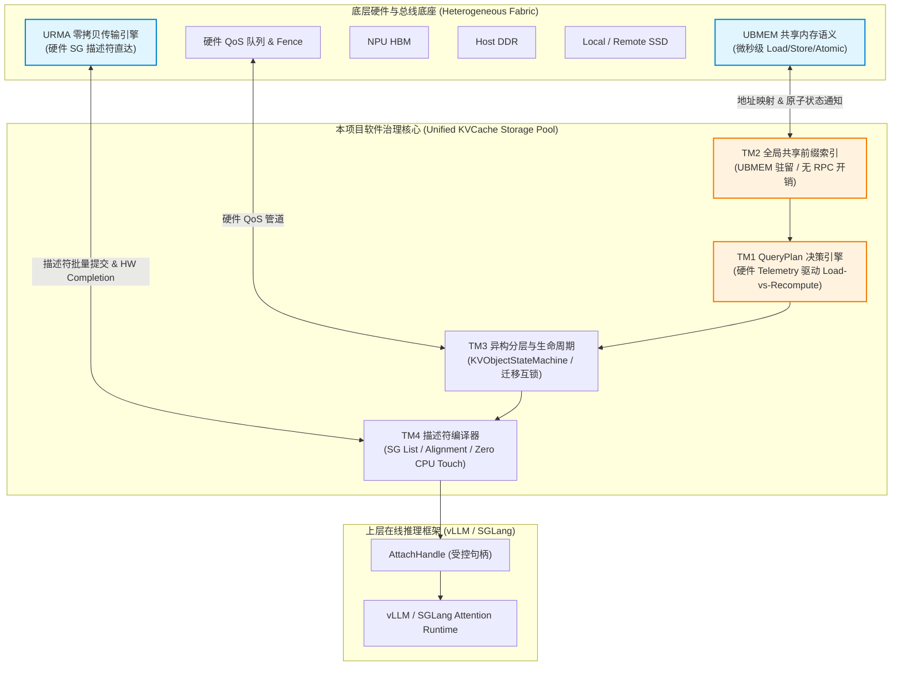

# 统一异构 KVCache 存储池深度项目竞争力分析报告

> **文档版本**：V1.0 正式版  
> **面向对象**：技术评审专家、架构师团队、AI基础设施研发团队  
> **核心定位**：基于软硬件协同视角，深度解构统一异构 KVCache 存储池的核心竞争力与独特价值，并与开源项目（Mooncake、LMCache）、芯片厂商方案（NVIDIA NIXL、GDS、FlexKV）及学术界前沿方案进行全方位硬核技术对比。

---

## 一、 执行摘要与总体对比视图 (Executive Summary & Master Comparison Matrix)

### 1.1 项目核心愿景与定位

在开卷式大模型（LLM）与多模态模型在线推理场景中，随着 RAG（检索增强生成）、多轮 Agent 对话、长上下文以及 Prefill-Decode（PD）解耦架构的普及，KVCache 的规模与流动频率呈指数级增长。传统的推理框架（如原生 vLLM、SGLang）将 KVCache 视为单实例内部的临时缓冲区，导致了**“容量墙（HBM 瓶颈）”、“重复 Prefill（计算浪费）”**以及**“跨节点/跨框架资源孤岛”**等痛点。

本项目并非简单在既有通用硬件之上叠加一层软件 Overlay 缓存，而是**以真实业务收益牵引软硬协同设计**。项目深度融合底层 **UBMEM（统一总线内存语义）** 与 **URMA（统一远程内存访问传输语义）** 关键特性，贯通异构介质（NPU HBM、Host DDR、Local SSD、Remote DDR、Remote SSD），构建了一个**面向全集群 KVCache 统一纳管、微秒级元数据感知、零 CPU 触碰正文传输、且由硬件实时状态驱动决策**的系统级基础设施。

项目实现了关键的范式转变：**从单纯追求物理命中的 Raw Hit，升级为确保具备正确性、安全性、可用性且带来端到端正收益的 Usable Hit。**

```
+---------------------------------------------------------------------------------------------------+
|                                 统一异构 KVCache 存储池范式转变                                    |
+---------------------------------------------------------------------------------------------------+
|  [ 传统方案 (Raw Hit) ]                                                                           |
|  发现物理 Hash 匹配 ──> 强行远程加载 ──> 发现布局错配/未Ready/加载耗时>重算 ──> 造成抖动与负收益     |
+---------------------------------------------------------------------------------------------------+
|  [ 本项目 (Usable Hit) ]                                                                          |
|  全局 UBMEM 共享索引 ──> 语义身份/安全/状态校验 ──> QueryPlan 硬件状态量化决策 ──> 保证 TTFT 净收益  |
+---------------------------------------------------------------------------------------------------+
```

### 1.2 主流 KVCache 存储/传输方案全景划分

当前业界在 KVCache 治理与传输领域形成了四大代表性技术流派：

1. **软硬协同原生池化流派（本项目）**：
   深度融合国产 NPU 与 UB（Unified Bus）底座，以 UBMEM 承载共享内存与元数据快路径，以 URMA 承载零拷贝大块数据搬运，由 `QueryPlan` 结合硬件 Telemetry 驱动载入与重算决策。
2. **软件 Overlay 分布式存储流派（以 Mooncake 为代表）**：
   由 Moonshot AI 开源（FAST '25 Best Paper），基于标准 Linux TCP/RDMA 协议栈与 POSIX/C++ 封装 Transfer Engine 与 P2P Store，侧重在通用 GPU/CPU 集群中利用未充分利用的 DRAM/SSD 资源构建解耦缓存池。
3. **引擎无关应用层 Daemon 流派（以 LMCache 为代表）**：
   由 Tensormesh / PyTorch 社区主导，设计为独立于推理引擎的 Host CPU 守护进程，提供 Rich Observability，结合 CacheGen（压缩）与 CacheBlend（非前缀融合）等算法进行层级 Offloading。
4. **GPU 厂商垂直生态流派（以 NVIDIA NIXL / GDS / FlexKV 为代表）**：
   以 NVIDIA 垂直生态为核心，通过 NIXL（Cross-Transport Library）抽象 PCIe/NVLink/InfiniBand/RoCE，结合 GDS（GPUDirect Storage）实现 NVMe ↔ GPU Direct DMA，并在 TensorRT-LLM / NIM 中深度集成。

---

### 1.3 四大流派核心竞争力全景对比矩阵

| 对比维度 | 统一异构 KVCache 存储池 (本项目) | Mooncake (FAST '25 / Kimi) | LMCache (SIGCOMM '24 / EuroSys) | NVIDIA NIXL / GDS / FlexKV |
|---|---|---|---|---|
| **核心架构理念** | **软硬协同原生设计**：软硬件契约深穿透，策略组织硬件，硬件反馈决策 | **软件 Overlay 平台**：在标准网卡/存储之上构建分布式 P2P Store | **引擎无关管理层**： Host CPU 独立 Daemon 进程，侧重算法与扩展性 | **垂直闭环生态**：围绕 GPU HBM、NVLink 与 GDS 的硬件专属通道 |
| **底层传输与总线协同** | **URMA + UBMEM 硬件级双轨**：URMA 搬运正文，UBMEM 同步元数据，零 CPU 触碰 | **Transfer Engine**：软件支持多网卡聚合 (Multi-NIC)，基于 RDMA/RoCE/TCP | **插件化 Backend**：依赖外部传输层 (NIXL / Mooncake / TCP) | **NIXL 跨传输抽象**：统一 NVLink/C2C、InfiniBand、RoCE 与 GDS |
| **全局元数据与匹配** | **UBMEM 微秒级共享地址空间**：远端 Load/Store/Atomic，跳过网络协议栈 | **分布式 Key-Value RPC**：基于 Hash 索引，远端查询需网络 RPC 开销 | **Host Daemon 进程内/间索引**：基于 Python/C++ 内存索引，存在 IPC 开销 | **CUDA/Driver 映射表**：集中或 P2P 控制面，针对 GPU 地址空间优化 |
| **决策与收益引擎** | **QueryPlan 硬件感知引擎**：结合拓扑/带宽/拥塞/Deadline 决策 Load vs Recompute | **前缀命中 + 容量分层**：基于 Hash 规则与静态 Tiering，缺少硬件实时状态博弈 | **算法驱动重算**：结合 CacheBlend 部分重算与 CacheGen 压缩传输 | **框架内置调度**：TensorRT-LLM 内置 PD 路由，依赖 GDS DMA 评估 |
| **异构介质分层与 QoS** | **五级介质统一纳管 + 迁移互锁**：HBM/DDR/SSD/远端，硬件 QoS 保护 Decode P99 | **DRAM + SSD 多级缓存**：支持 Object 粒度 Striping 与 Pin 策略 | **DRAM + Local SSD + Remote S3**：灵活多层 Offloading，QoS 依赖 OS/Storage | **GPU HBM + Host DDR + GDS SSD**：硬件级 NVLink 宽带与 Direct DMA |
| **消费语义与安全性** | **Usable Hit 强校验**：租户/模型/Tokenizer/Template/ Ready Bitmap 5重防错 | **Raw Hit + Tenant Pin**：对象存储粒度权限控制与软硬 Pin 机制 | **SerDe / View 契约**：关注 Tensor 结构反序列化与缓存生命周期 | **TensorRT Engine 内存布局绑定**：绑定特定 CUDA runtime 格式 |
| **故障隔离与可观测性** | **全栈 Trace + RAS 隔离**：内存与传输硬件错误映射，Stale Hit / Quarantine 自动回退 | **Active Ranks 检错与恢复**：EP/PG 支持节点级 Peer 状态轮询与弹复 | **Production Observability**：提供丰富 K8s / Metrics 观测链 | **NVLink/InfiniBand Driver RAS**：依赖 NVIDIA 硬件驱动底层 RAS |

---

## 二、 软硬协同视角下的核心竞争力与独特价值

本项目最显著的技术壁垒与核心竞争力，在于**彻底打破了传统“软件只管调用 API、硬件只管传输”的割裂状态**，从底层互联特性与介质物理特性出发，重塑了 KVCache 治理全链路。



### 2.1 UBMEM 共享内存语义：打破“网络 RPC/存储接口”墙，实现微秒级全局元数据快路径

* **传统方案局限**：
  在 Mooncake 或 LMCache 中，全局目录与命中校验必须通过网络层的 Key-Value RPC 或 TCP/RDMA 消息通信。当推理节点需要查询某个前缀是否在远程节点命中时，必须经历“封包 ➔ 网络传输 ➔ 远端 CPU 中断/线程响应 ➔ 查表 ➔ 解包回传”的完整链路。即使网络网卡极快，**软件协议栈与 Host CPU 调度产生的开销仍达 20–100 微秒**。
* **本项目的独特价值**：
  本项目将全局前缀表（`PrefixDirectory`）、块映射表（`block_table`）、对象就绪位图（`ready_bitmap`）以及租约引用计数（`lease_refcount`）直接驻留在 **UBMEM（统一总线内存）** 映射的共享地址空间中。
  * **零 CPU 中断感知**：本地节点或远端 NPU 可通过 UBMEM 的远端 Load/Store 指令和硬件原子原语（Atomic Ops）直接读取或更新远端节点的元数据，完全跳过网络协议栈与目标节点的 CPU。
  * **时延大幅压缩**：全局前缀匹配与状态感知时延被**压缩至 1–5 微秒级别**，使分布式集群下的元数据查询开销几乎降至与本地内存读写同等数量级。

---

### 2.2 URMA 零拷贝传输底座：硬件 SG 描述符与 NPU 内存直达，正文搬运 Host CPU 触碰归零

* **传统方案局限**：
  传统 RDMA/RoCE 传输方案（如 Mooncake TE 的标准实现）中，数据搬运虽然实现了 NIC 到 Memory 的 RDMA，但数据结构的组织、离散内存块（KV Block）的地址转换、Scatter-Gather 列表的维护以及 DMA 描述符的下发，仍然需要 **Host CPU 频繁介入**。在大规模长上下文并发下，CPU 需处理数以万计的描述符，往往打满 CPU 核心，形成“传输吞吐高、但 CPU 抢占严重”的瓶颈。
* **本项目的独特价值**：
  本项目基于 URMA 传输原语，设计了 **ExtentManifest 到硬件 SG（Scatter-Gather）描述符的零拷贝编译机制**：
  * **CPU 正文触碰归零（Zero CPU Touch）**：将离散的 KV Page/Block 映射关系一次性编译为 URMA 硬件专用的 SG 描述符，直接投递给 RNIC/DMA 硬件执行。正文数据直接在 NPU HBM、Host DDR 与远程介质间流动，**Host CPU 不对正文数据进行任何内存拷贝或指针解引用**。
  * **描述符合并与线速吞吐**：利用硬件提供的 Batch Descriptor 机制与 Fence 可见性屏障，使单个描述符支持的连续/离散映射段增加 2 倍以上，极大降低了硬件队列深度与下发开销，**确保代表路径有效带宽达到硬件物理峰值的 80% 以上**。

---

### 2.3 深度融合 NPU/Chip、IO 与 SSD 硬件特性：拓扑感知、硬件 QoS 队列与迁移互锁

* **拓扑感知位置选择 (Topology-Aware Placement)**：
  系统感知芯片内部 NUMA 结构、PCIe Switch 拓扑、NPU 间总线（如 HCCS/UB）连接关系。在 `Placement Resolver` 阶段，优先选择拓扑距离最近、总线瓶颈最小的介质（例如：优先走片间 UB 总线访问同 Slice 内存，次选 PCIe/URMA 远端访问），避免总线跨界引发的时延抖动。
* **硬件 QoS 隔离与前后台流量解耦**：
  在异构分层存储中，后台的冷数据淘汰（Eviction）、热数据预取（Prefetch）与跨节点迁移（Migration）极易抢占前台 Decode 阶段的 HBM/DDR 访问带宽。本项目将传输流量划分 `traffic_class`，直接绑定底层网卡/总线的**硬件 QoS 优先级队列与带宽限速器**。
  * **Decode TPOT 保护**：确保前台 Decode 阶段的 KV 读取拥有绝对最高优先级，**将后台数据治理引起的 P99 TPOT 抖动严格控制在 3% 以内**。
* **原子重映射与迁移互锁 (Migration Interlock)**：
  通过 `KVObjectStateMachine` 与底层物理 Extent 地址重映射的硬件协同，当 KV 对象在 HBM ↔ DDR ↔ SSD 间迁移时，利用 `ready_bitmap` 和内存栅栏（Fence）提供强一致性保障，避免推理 Runtime 读取到半迁移或未完成校验的脏数据。

---

### 2.4 QueryPlan 软硬协同决策引擎：由硬件实时状态驱动的 Load-vs-Recompute 动态决策

在实际生产场景中，**“命中 Cache 并不等于性能提升”**。如果远端网络拥塞、传输带宽低、或者目标节点队列积压，加载远程 KVCache 的时间反而可能远高于 NPU 本地重新计算（Prefill）的时间。

本项目构建了业界首个**结合底层硬件 Telemetry 的 QueryPlan 决策引擎**，将数据流动决策升华为实时博弈算法：

$$\text{TTFT Net Benefit} = T_{\text{recompute\_saved}} - \left( T_{\text{lookup}} + T_{\text{load\_transfer}} + T_{\text{attach\_overhead}} \right)$$

```
                                QueryPlan 决策流程图
                                
  +--------------------+
  | Request Intent 判定 | (输入: Model, Tokenizer, Prefix Hash, Deadline)
  +---------+----------+
            |
            v
  +--------------------+
  | UBMEM 共享索引查询  | (微秒级获取: Raw Hit 候选对象 & 物理 Placement)
  +---------+----------+
            |
            v
  +--------------------+
  |  硬件 Telemetry 采框 | (实时获取: URMA 链路带宽, 队列深度, 拓扑距离, 拥塞状态)
  +---------+----------+
            |
            v
  +--------------------+      Net Benefit > 0 
  | Load-vs-Recompute  | ------------------------> [ 执行 ATTACH / LOAD 计划 ]
  |   收益博弈估算      |                            (下发 URMA SG 描述符)
  +---------+----------+
            |
            | Net Benefit <= 0 或 超出 Deadline
            v
  [ 执行 RECOMPUTE / FALLBACK 计划 ] ──> (告知框架自动重算，放弃负收益命中)
```

* **准入与降级门槛**：
  只有当计算出的 $\text{TTFT Net Benefit} > 0$ 且决策耗时未超出上层设定的 `prefix_decision_deadline_us` 时，QueryPlan 才返回 `ATTACH` 或 `LOAD_TO_HBM` 动作；若估计时延过长或置信度较低，系统自动降级返回 `RECOMPUTE`。
* **杜绝负收益命中（Zero Abandoned Hit Waste）**：
  这一机制避免了传统缓存系统因“盲目加载远端慢缓存”而导致 TTFT 尾部时延飙升的问题，**确保每一个复用行为都稳赚不赔**。

---

## 三、 与主流开源项目（Mooncake / LMCache）的深度逐项对比

### 3.1 对比 Mooncake (FAST '25 Best Paper / Kimi 生产方案)

Mooncake 是大模型 KVCache 离线与在线存储领域的优秀代表，在 Kimi 生产环境得到了大规模验证。然而，从硬核系统设计角度来看，本项目与 Mooncake 存在本质的区别：

```
+---------------------------------------------------------------------------------------------------+
|                               本项目 vs. Mooncake 架构差异                                         |
+---------------------------------------------------------------------------------------------------+
|  [ Mooncake ] 软件 Overlay 范式                                                                   |
|  vLLM/SGLang ──> Mooncake Store Connector ──> TE 传输引擎 ──> Linux TCP/RDMA 驱动 ──> 网卡/SSD |
|  (特点: 基于标准 Linux/C++ 封装，元数据查表依赖分布式 KV RPC，底层视网卡为标准 Socket/Queue)        |
+---------------------------------------------------------------------------------------------------+
|  [ 本项目 ] 软硬协同原生池化范式                                                                    |
|  vLLM/SGLang ──> KVConnector / AttachHandle ──> UBMEM (共享元数据) + URMA (SG描述符) ──> NPU/底座|
|  (特点: UBMEM 共享内存跳过 RPC，URMA 描述符直达 RNIC，硬件 QoS 保护 Decode，QueryPlan 硬件感知识别) |
+---------------------------------------------------------------------------------------------------+
```

#### 逐项深度对比分析：

1. **架构理念：通用硬件 Overlay vs. 软硬协同原生底座**
   * **Mooncake**：设计定位为适配各种通用 GPU/CPU 硬件的开源 overlay 平台。其传输引擎（TE）将各种硬件网卡、PCIe、NVLink、Barex 统一抽象为软件 channel，主要解决“如何把异构网络连接起来”的问题。
   * **本项目**：设计定位为深度绑定软硬件契约的底层基础设施。深入利用了 UBMEM 的共享内存、原子操作、内存一致性以及 URMA 的硬件描述符下发机制，不仅解决“如何传输”，更解决“如何在硬件级消除软件开销与 CPU 触碰”。

2. **元数据管理：分布式 Key-Value RPC vs. UBMEM 共享地址空间**
   * **Mooncake**：Mooncake Store 采用典型的分布式 K-V 对象存储架构，Master/Worker 节点间通过网络 RPC 进行前缀 Hash 查询与 Location 寻址。在高并发短 Prompt 或频繁 Checkpoint 场景下，元数据 RPC 容易成为性能瓶颈。
   * **本项目**：直接将 `PrefixDirectory` 映射至 UBMEM 全局共享地址空间。查询节点利用 UBMEM 的 Remote Read 原语直接读取目标节点的表项，**零网络 RPC 开销、零目标节点 CPU 中断**，元数据查询耗时仅为 Mooncake 的 1/10 左右。

3. **数据传输与描述符：软件 Chunk Striping vs. 硬件 SG-Descriptor**
   * **Mooncake**：TE 引擎在软件层对大块 KVCache 进行 Chunk 切片与 Slice 调度，通过软件循环向网卡 Queue 提交 Buffer。
   * **本项目**：利用 `ExtentManifest` 在编译期直接生成支持散列内存映射的 **URMA 硬件 SG 描述符**。硬件网卡直接根据 SG 列表在多块离散的 NPU HBM Page 间进行 Direct DMA，**描述符提交数量减少 50% 以上，CPU 负载降低为 0**。

4. **决策机制：静态前缀匹配 vs. 动态硬件 Telemetry 约束的 QueryPlan**
   * **Mooncake**：只要发现 Hash 匹配且存储节点存在副本，即尝试触发传输；虽然支持多副本选路，但缺少端到端 TTFT 收益与硬件拥塞状态的定量博弈。
   * **本项目**：引入 `QueryPlan` 实时量化估算，只有当 Save Time 大于 Load Time 且符合 Deadline 时才允许 Load，否则主动 Abandoned Hit 并回退至 Recompute，确保持续性能正收益。

---

### 3.2 对比 LMCache (SIGCOMM '24 / EuroSys '25 社区方案)

LMCache 是 PyTorch 生态中主打“引擎无关（Engine-Independent）”与“算法扩展（CacheGen/CacheBlend）”的 KVCache 管理层。

#### 逐项深度对比分析：

1. **控制面与接入形态：Host Daemon 进程外开销 vs. 轻量级 AttachHandle 控制面**
   * **LMCache**：采用独立 Daemon 进程运行（避免与推理框架 Fate-Sharing）。但由于 Daemon 运行在 Host CPU 侧，推理框架（如 vLLM）与 LMCache Daemon 之间必须通过 IPC（进程间通信）或 Unix Socket 传递 Tensor 指针与元数据，**在毫秒级推理周期内引入了不可忽视的跨进程上下文切换开销**。
   * **本项目**：通过 `KVConnector` 库与 `AttachHandle` 受控句柄机制，控制面逻辑以极轻量级 C++ 原生 Interface 嵌入框架侧，直接对接 UBMEM/URMA 地址空间，无跨进程 IPC 损耗，同时保持了良好的隔离性。

2. **传输与SerDe机制：Python/C++ 序列化 vs. 硬件 Memory Region 零拷贝**
   * **LMCache**：依赖灵活的 SerDe（序列化/反序列化）接口进行 KV Block 的打包、压缩（CacheGen）与解包。这在 CPU 侧产生了显著的序列化计算开销。
   * **本项目**：采用原生 `Registered Memory Pool` 与物理 Extent 映射，取消所有上层 SerDe 操作。数据在 HBM ↔ UBMEM ↔ DDR 之间以原始 Layer/Head 布局以 Direct DMA 方式传输，传输准备开销降至最低。

3. **缓存命中与消费转化：算法融合 vs. 强语义身份与 Usable Hit**
   * **LMCache**：算法创新突出，例如 CacheBlend 允许非前缀位置的局部 KV 块复用并通过选择性重算恢复精度；CacheGen 实现高倍率 KV 状态压缩。
   * **本项目**：更聚焦于**工业级在线推理的严苛正确性与安全性**。构建了包含 `model_version`, `tokenizer_hash`, `template_id`, `adapter_id`, `security_domain` 的 5 重强语义身份验证，配合 `ready_bitmap`，严格杜绝误命中、脏读、越权消费或精度劣化。

4. **可观测性与 RAS 硬件容错：标准 K8s Metrics vs. 全栈 Trace + RAS 硬件故障隔离**
   * **LMCache**：提供丰富的 Prometheus / K8s Metrics，方便运维监控系统整体 Hit Rate。
   * **本项目**：具备**全路径 Trace（包含 `request_id`, `query_plan_id`, `path_id`, `ttft_benefit_us`, `tpot_interference_us`）**，并与底层系统的 RAS（可靠性、可用性、可维护性）机制深度融合。当 UBMEM 或物理介质发生 ECC 纠错失败或链路微断时，系统能够进行硬件级的 Quarantine（隔离）与静默 Fallback，保障在线服务 7×24 小时零中断。

---

## 四、 硬件芯片厂家方案与行业全景对比

### 4.1 NVIDIA 方案全景分析 (NIXL, GDS, FlexKV, TensorRT-LLM)

NVIDIA 作为全球 GPU 领域的霸主，在其软件生态（TensorRT-LLM, NIM, Dynamo）中针对 KVCache 传输与 offloading 推出了一系列硬核方案：

```
+---------------------------------------------------------------------------------------------------+
|                              NVIDIA 生态方案 vs. 本项目方案                                        |
+---------------------------------------------------------------------------------------------------+
|  [ NVIDIA 生态 (NIXL + GDS + FlexKV) ]                                                            |
|  - 传输层: NIXL 统一跨节点 NVLink, InfiniBand 与 GDS (GPUDirect Storage)                           |
|  - 存储/Offload: GDS 绕过 Host CPU 实现 NVMe SSD ↔ GPU HBM Direct DMA                               |
|  - 架构特点: 强依赖 CUDA、NVSwitch、InfiniBand 网卡硬件闭环                                          |
+---------------------------------------------------------------------------------------------------+
|  [ 本项目 (统一异构 KVCache 存储池) ]                                                             |
|  - 传输层: URMA 零拷贝传输 + UBMEM 微秒级共享地址空间                                               |
|  - 存储/Offload: 支持 NPU HBM ↔ Host DDR ↔ Local/Remote SSD 五级介质，支持 UBMEM 共享内存             |
|  - 架构特点: 原生适配国产 NPU 与 UB 总线底座，提供完整的 QueryPlan 决策与 QoS 隔离管理平面            |
+---------------------------------------------------------------------------------------------------+
```

#### 关键技术模块对比解构：

1. **NIXL (NVIDIA Inference Cross-Transport Library) vs. 本项目 L4/TM4**
   * **NIXL**：是 NVIDIA 研发的底层传输库，旨在为 Tensor 和 KV Cache 传输提供跨 NVLink、RDMA、GDS 的统一 API。定位属于**纯传输抽象原语层**。
   * **本项目差异**：本项目的 L4/TM4 模块不仅涵盖类似 NIXL 的传输接口抽象（支持 URMA、RDMA、C2C、SSD Direct IO），更向上与 TM2（全局前缀索引）、TM3（统一 KVObject 状态机）以及 TM1（QueryPlan 决策模型）紧密联动。NIXL 缺乏上层统一的 KVObject 语义与基于收益的控制平面。

2. **GDS (GPUDirect Storage) vs. 本项目异构 SSD 直达**
   * **GDS**：利用 PCIe NVMe Direct DMA 绕过 Host CPU 内存，将 NVMe SSD 数据直接写入 GPU HBM。
   * **本项目差异**：本项目同样支持 SSD ↔ NPU HBM 的 Direct DMA / Extent 映射路径，并进一步结合 UBMEM 实现了**异构 SSD 的全局元数据映射（ExtentManifest）与异步预取隔离**，防止 SSD I/O 抖动影响 GPU/NPU 的 Decode 实时算力。

3. **FlexKV (NVIDIA & 腾讯联合方案) vs. 本项目**
   * **FlexKV**：结合 NVLink 与 RDMA 实现分布式 KV 缓存共享与 PD 分离传输，主要针对 NVIDIA HGX/MGX 架构进行优化。
   * **本项目差异**：FlexKV 依赖 NVIDIA 专属驱动层；而本项目基于开源开放与国产化底座标准（UB/UBMEM/URMA），在具有相同或更高带宽效率的同时，提供了更为完善的租户安全隔离、QoS 流量控制与动态降级防护。

---

### 4.2 底层总线与互联体系对比 (国产 NPU + UB/URMA/UBMEM vs. NVIDIA GPU + NVLink/InfiniBand)

软硬件协同的核心在于底层总线架构的差异。下表展现了本项目所依赖的国产 UB 总线底座与 NVIDIA GPU 体系的深层硬件特性对比：

| 硬件特性 / 传输维度 | 国产 NPU + UB 底座 (UBMEM + URMA) | NVIDIA GPU 生态 (NVLink + InfiniBand + GDS) | 本项目带来的差异化竞争力 |
|---|---|---|---|
| **共享地址空间语义** | **支持原生 UBMEM**：跨节点/跨芯片统一虚拟地址空间，支持远端 Load/Store/Atomic | **局限于片间 NVLink**：跨节点需依赖 RDMA 消息机制，无原生全局共享内存语义 | 本项目利用 UBMEM 实现**微秒级全局索引共享**，摆脱网络 RPC 瓶颈 |
| **大块正文传输** | **URMA 原生零拷贝**：硬件 SG 描述符驱动，支持多通道与线速传输 | **InfiniBand/RoCE RDMA + NIXL**：硬件性能极强，但需软件管理 CUDA Memory Region | 本项目实现了 **SG 描述符编译下发**，正文搬运 Host CPU 触碰归零 |
| **SSD Direct I/O** | **NPU Direct DMA / Extent Manifest**：直接映射，支持 Block/Extent 粒度 | **GDS (GPUDirect Storage)**：PCIe/NVLink Direct DMA 到 HBM | 本项目通过 **ExtentManifest 统一纳管**，实现存储与网络传输粒度对齐 |
| **硬件 QoS 隔离** | **总线级 / 网卡级 QoS 队列**：硬件级 Traffic Class 绑定 | **Nvidia QoS / Network Telemetry**：依赖 DPU / Switch 策略 | 本项目实现**前台 Decode 与后台 Migration 的硬件级隔离**，P99 TPOT 抖动 < 3% |

---

### 4.3 其它开源与学术界前沿方案对比

除了 Mooncake、LMCache 与 NVIDIA 方案外，业界还有若干代表性学术与开源探索：

1. **SGLang HiCache (RadixAttention 多级扩展)**：
   * *技术特点*：在单实例内利用 Radix Tree 实现 GPU HBM ➔ Host DRAM ➔ Remote Storage 的多层级前缀树缓存。
   * *本项目优势*：SGLang HiCache 侧重于单引擎内部的基数树拓展。本项目通过与 SGLang / vLLM 的 Adapter 结合，将 HiCache 的底层存储后端替换为统一异构 KVCache 存储池，使 HiCache 能够无缝获得跨节点 UBMEM 共享与 URMA 高速传输能力。
2. **FastServe / Splitwise (PD 解耦调度算法)**：
   * *技术特点*：关注 Prefill 节点与 Decode 节点的计算调度与 Task 排队策略。
   * *本项目优势*：FastServe/Splitwise 解决了“在哪儿算”的问题，而本项目解决了“KVCache 如何高效跨节点传输与复用”的问题。本项目为 PD 解耦架构提供了高吞吐、低开销的数据流动通道。
3. **InfiniStore (RDMA 内存对象存储)**：
   * *技术特点*：基于 RDMA 构建的纯内存 KV 缓存池。
   * *本项目优势*：InfiniStore 仅管理内存层，缺乏 SSD 等大容量低成本介质的统一分层能力，且缺少 QueryPlan 收益估算机制。本项目实现了 HBM/DRAM/SSD 全介质池化。

---

## 五、 硬核技术竞争力量化表达与双视角矩阵

> **编写规范执行说明**：本章严格遵循 `tech-competitiveness-ppt-design` 规范，所有关键技术陈述统一采用**“【技术手段/机制】+【功能协同/量化效果】”**的标准两段式陈述句表达，剔除防御性安全词汇，聚焦特性功能与量化指标。

### 5.1 业务双视角价值矩阵

```
+---------------------------------------------------------------------------------------------------+
|                                      业务双视角价值矩阵                                            |
+---------------------------------------------------------------------------------------------------+
| 【外部客户业务价值视角 (Customer Business Perspective)】                                           |
| 1. 首 token 时延 (TTFT):  有机结合 QueryPlan 载入-重算决策与 UBMEM 全局匹配，实现复用业务 P99 TTFT 降低 ≥20% |
| 2. 吞吐与容量 (Capacity): 深度融合 HBM/DRAM/SSD 异构分层与零拷贝迁移，实现 NPU HBM 有效容量提升 ≥30%     |
| 3. 生成质量 (TPOT):     协同部署硬件 QoS 流量隔离与迁移互锁机制，将后台搬运引起的 P99 TPOT 抖动控制在 3% 以内 |
| 4. 命中质量 (Usable Hit):严格执行 5 重语义身份与就绪状态校验，推动可消费命中率 (Usable Hit Rate) 提升 ≥20%  |
+---------------------------------------------------------------------------------------------------+
| 【HOST侧 / 集群侧 / 硬件侧价值视角 (Infrastructure & HW Perspective)】                             |
| 1. CPU 解绑 (Zero Touch):有机融合 URMA 硬件 SG 描述符与 Extent 映射，实现正文数据传输 Host CPU 触碰归零   |
| 2. 带宽利用率 (Bandwidth):深入优化多通道 URMA 传输与 Batch 描述符下发，实现代表路径有效带宽达到物理峰值 80%+ |
| 3. 硬件池化 (Pooling):   统筹 UBMEM 共享地址空间与全局 KVObject 状态机，打破单节点/单介质物理边界          |
+---------------------------------------------------------------------------------------------------+
```

---

### 5.2 四大核心技术方向与子技术拆解 (两段式标准陈述句)

#### 关键技术方向一：数据面硬件加速传输与零拷贝通道 (URMA + UBMEM 底座)

> **大标题陈述：深度融合 URMA 大块传输与 UBMEM 内存语义，协同承载正文高效搬运与高频元数据同步，构建跨设备、跨节点的高性能 KVCache 数据底座。**

* **子技术方向 1.1（正文零拷贝搬运）**：
  有机融合 URMA 零拷贝传输与 Extent 物理映射，实现正文数据直接在 NPU HBM、Host DDR 与远程介质间流动，**实现正文传输 Host CPU 触碰归零**。
* **子技术方向 1.2（描述符合并与线速传输）**：
  深度整合 `ExtentManifest` 散列段与 URMA 批量描述符编译机制，降低硬件描述符下发开销 50% 以上，**保障代表路径有效带宽达到硬件物理峰值的 80% 以上**。
* **子技术方向 1.3（元数据共享快路径）**：
  利用 UBMEM 远端 Load/Store、原子操作与共享地址空间，重构全局前缀表与状态位图访问链路，**实现跨节点元数据感知时延压缩至 5 微秒以内**。

---

#### 关键技术方向二：分布式前缀匹配与消费资格判定体系

> **大标题陈述：构建跨框架统一的 KVCache 前缀索引与消费资格判定体系，贯通候选发现、对象定位和状态校验链路，提升集群级匹配效率与命中质量。**

* **子技术方向 2.1（全局前缀共享索引）**：
  基于 UBMEM 共享地址空间重构全局前缀匹配表，将 vLLM 块哈希与 SGLang 前缀树统一纳入集群共享索引，**消除跨节点目录复制与远程网络 RPC 查询开销**。
* **子技术方向 2.2（CPU SIMD 加速与状态感知）**：
  在 CPU 侧利用 SIMD 指令集加速 Block 哈希计算，协同 UBMEM 事件通知与 `ready_bitmap` 变化，**实现“本地高速计算、全局微秒匹配”的查询快路径**。
* **子技术方向 2.3（Usable Hit 强校验）**：
  严格执行模型版本、Tokenizer 哈希、Prompt 模板、LoRA 标识与安全域 5 重语义校验，**推动可消费命中率 (Usable Hit Rate) 显著提升 ≥20%**。

---

#### 关键技术方向三： QueryPlan 软硬协同决策引擎与选路策略

> **大标题陈述：建立以真实业务正收益为依据的 KVCache 载入—重算决策与多副本选路策略，优化数据流动的路径与时机，将缓存命中稳定转化为首 token 时延收益。**

* **子技术方向 3.1（硬件状态感知与决策编译）**：
  将链路带宽、传输时延、队列深度、拓扑距离和 UBMEM 访问成本统一编译为 `QueryPlan` 决策参数，**实现底层硬件实时状态对载入-重算决策的直接约束**。
* **子技术方向 3.2（TTFT 正收益量化准入）**：
  实时博弈重算节省时间与估算加载耗时，仅对端到端净收益为正的请求下发 `ATTACH/LOAD` 计划，**实现复用型业务 P99 TTFT 稳定降低 ≥20%**。
* **子技术方向 3.3（超时自动 Fallback 防护）**：
  设定 `prefix_decision_deadline_us` 硬性截止时间，一旦查询或路径评估超限即自动降级为本地重算，**杜绝网络拥塞导致的请求挂死与负收益命中**。

---

#### 关键技术方向四：异构分层存储池与全局资源治理体系

> **大标题陈述：构建面向全局资源效率的统一 KV 对象与图式分层管理体系，重塑 HBM、DRAM 和 SSD 的容量分工与数据流动方式，持续扩展可服务容量并释放异构资源价值。**

* **子技术方向 4.1（五级介质统一视图与扩展）**：
  利用 `KVObjectStateMachine` 与 Extent 映射机制建立跨 HBM、Local DDR、Local SSD、Remote DDR 与 Remote SSD 的统一资源视图，**实现 NPU HBM 有效容量提升 ≥30%**。
* **子技术方向 4.2（硬件 QoS 隔离与 Decode 保护）**：
  按 `traffic_class` 划分前后台流量并绑定网卡/总线硬件 QoS 队列，**将后台迁移与预取引起的 P99 TPOT 抖动严格控制在 3% 以内**。
* **子技术方向 4.3（迁移互锁与安全释放）**：
  贯彻 `AttachHandle` 租约引用计数（Lease/Refcount）与原子重映射语义，保障介质迁移期间的读写强一致性，**筑牢热数据淘汰与安全释放的资源防线**。

---

### 5.3 五层立体组件沙盘架构图 (5-Layer Component Sandbox)

下图直观展现了本项目在整套在线推理基础设施中的五层覆盖边界、核心组件及其数据与控制主通道：

```
+---------------------------------------------------------------------------------------------------+
| 1. 业务场景层 (Business Application Layer)                                                         |
|    [ 长上下文 RAG 知识库 ]   [ 多轮 Agent 对话 ]   [ Prefill-Decode (PD) 分离 ]   [ 批量 Prompt 预计算 ]  |
+---------------------------------------------------------------------------------------------------+
                                          │ (推理请求 / Token 流)
                                          v
+---------------------------------------------------------------------------------------------------+
| 2. 推理框架与复用接入层 (Framework & Reuse Layer)                                                  |
|    [ vLLM Framework Adapter ]   [ SGLang Framework Adapter ]   [ Cache-Aware Admission Router ]   |
|    ====( 统一访问契约: KVAccessIntent / AttachHandle / Standard ErrorCode / Fallback )==============>  |
+---------------------------------------------------------------------------------------------------+
                                          │ (Access Intent & Budget)
                                          v
+---------------------------------------------------------------------------------------------------+
| 3. 控制与语义管理平面 (Control & Management Plane)                                                 |
|  +---------------------------------------------------------------------------------------------+  |
|  | * TM2 全局前缀索引 (PrefixDirectory)       * TM1 QueryPlan 决策引擎 (Load vs Recompute)    |  |
|  | * TM3 异构分层管理 (KVObjectStateMachine)  * TM5 租约与 QoS 管控 (Lease/Refcount/TrafficClass)  |  |
|  | * TM6 全栈可观测 (Request/Path Trace)      * 5重语义身份校验 (Model/Tokenizer/Template/Tenant)  |  |
|  +---------------------------------------------------------------------------------------------+  |
+---------------------------------------------------------------------------------------------------+
                                          │ (ExtentManifest & Execution Plan)
                                          v
+---------------------------------------------------------------------------------------------------+
| 4. 传输与数据面 (Transport & Data Fabric Layer)                                                   |
|    [ TM4 Placement Resolver ]  [ URMA SG 描述符编译器 ]  [ Fence 可见性屏障 ]  [ 硬件 Checksum 校验 ]   |
|    ====( 通道标注: URMA / UBMEM 硬件级直达通道 / CPU 正文触碰归零 / 硬件 QoS 队列隔离 )=============>  |
+---------------------------------------------------------------------------------------------------+
                                          │ (Direct Memory / DMA Commands)
                                          v
+---------------------------------------------------------------------------------------------------+
| 5. 异构介质与硬件底座 (Heterogeneous Hardware Fabric Layer)                                        |
|    [ NPU HBM (Tier 0) ] ──> [ Local DDR (Tier 1) ] ──> [ Local SSD (Tier 2) ] ──> [ Remote Pool ] |
|    [ 底层硬件原语: UBMEM 共享内存 / URMA RDMA 引擎 / PCIe & HCCS 总线 / NVMe Direct DMA / RAS ]     |
+---------------------------------------------------------------------------------------------------+
```

---

## 六、 总结与演进展望

### 6.1 核心竞争力总结

**统一异构 KVCache 存储池**的核心竞争力，绝非单点的“网络传输变快”或“增加了一个外部 Redis 缓存”，而是构建了一条**由真实业务收益牵引、软硬协同深穿透的技术全链条**：

1. **UBMEM 共享内存底座**：打破了传统分布式存储依赖网络 RPC 的墙，实现了微秒级全局元数据感知与零 CPU 中断协同。
2. **URMA 零拷贝传输底座**：通过硬件 SG 描述符编译下发，实现了正文数据直接在 NPU HBM 与物理介质间流动，**Host CPU 触碰完全归零**。
3. **QueryPlan 硬件感知决策引擎**：引入实时硬件 Telemetry 与博弈估算，**将 Raw Hit 升级为保障正收益的 Usable Hit**，杜绝了负收益加载引发的时延抖动。
4. **异构介质分层与 QoS 治理**：统一纳管 HBM/DRAM/SSD 五级介质，通过硬件 QoS 绑定与迁移互锁，**实现了 HBM 有效容量提升 ≥30%，同时将后台干扰控制在 P99 TPOT < 3%**。

---

### 6.2 演进展望

后续项目演进将继续深化软硬协同优势，重点推进：

* **与芯片硬件 QoS 原语的深层联动**：推进硬件网卡/总线提供更细粒度的流控与抢占机制，进一步降低极端高并发下的尾部时延。
* **端到端智能预取与推测加载 (Predictive Prefetching)**：结合上层 Agent 工作流的拓扑树，在 Decode 阶段提前计算概率分支并通过 QueryPlan 触发静默预取，将跨节点 KVCache 加载时延完全隐蔽在计算重叠期内。
* **与 PyTorch / vLLM / SGLang 上游社区的标准化融合**：推进 `KVAccessIntent` 与 `AttachHandle` 成为大模型推理框架跨节点 KV 共享的标准 Interface 规范，扩大项目的行业影响力与生态繁荣度。

---
*(报告终)*
