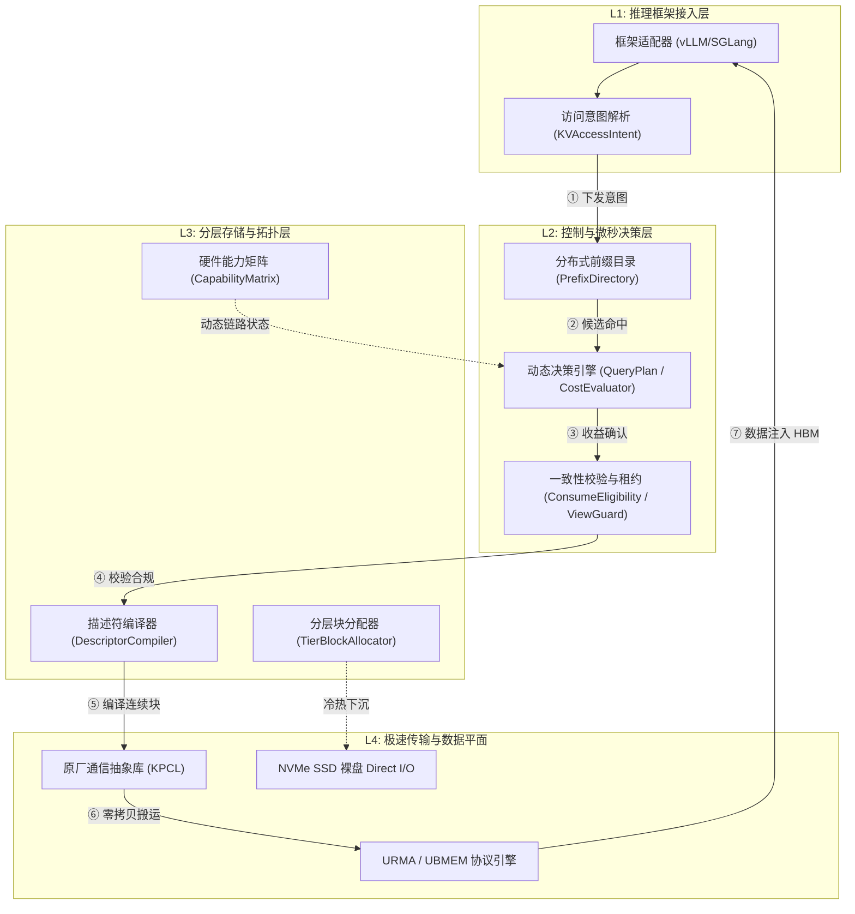
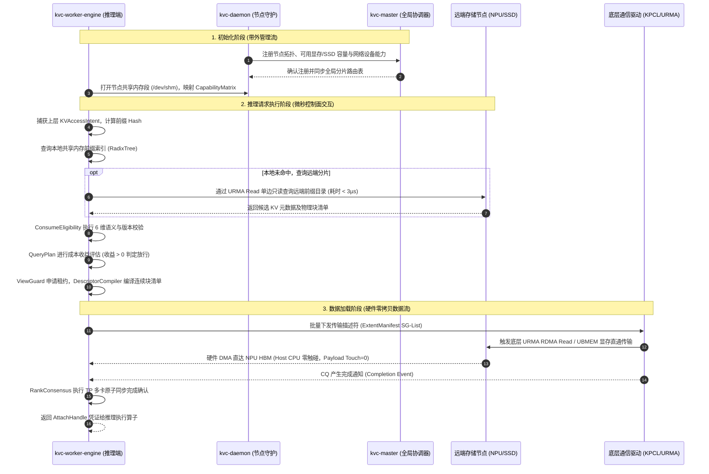
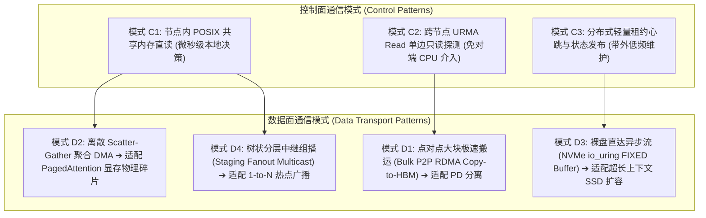

# 统一异构 KVCache 存储池顶层架构设计与技术思考

围绕**面向国产 AI 硬件的统一异构 KVCache 存储与调度底座（以下简称 KVC 存储池、KVC 软件或本软件）**的前期需求分析、系统导入与详细架构设计，结合项目中既有的 SRS 需求规格与 V2.3.1 全量需求分解树，针对存储池构建、拓扑分布、全生命周期元数据体系、三层架构隔离、通信模式映射、底层通信库（KPCL）抽象、端到端性能逐层拆解模型以及可靠性设计展开系统性的顶层设计分析。

---

## 专题一：顶层架构设计总体原则与软件架构设计范式

### 1.1 顶层架构设计总体原则

构建本软件的核心目标，是在大模型（LLM）推理集群中，将分散在各计算节点、多级介质中的 KVCache（大模型注意力键值缓存：自回归生成中缓存的历史 Key 与 Value 激活状态张量，用于避免后续 Token 重复计算）转化为逻辑统一、物理异构、微秒级可调度、生产级安全一致的原厂软硬件协同系统。系统设计严格遵循以下六大架构设计原则：

1. **控制面微秒决策与数据面零拷贝双流彻底分离**：
   - 控制面处理元数据查找、语义检查、路径决策与租约调度，追求微秒级低延迟与极轻开销；
   - 数据面严格坚持 **Host CPU 零数据拷贝（CPU 仅负责下发控制指令，不参与正文数据搬运，Host Payload Touch Bytes 严格为 0）**，KV 张量数据直接经由底层物理通道在专用硬件与存储介质间直通流转。
2. **净加速收益驱动决策（拉取与加载总开销 < 本地直接重算耗时）**：
   - 系统坚决摒弃“盲目缓存命中”逻辑。原始命中（Raw Hit）仅代表目录中存在候选块，只有经过微秒级成本预估，确认拉取加载、多卡同步与框架挂载的总开销明确小于本地直接重算耗时，且业务有正向加速收益时，才执行加载；否则主动回退至本地直接重算（Fallback to Recompute）。
3. **多维度语义一致性与租约校验（生产级 0 错误消费）**：
   - 彻底杜绝陈旧、半写、跨版本或权限失效的脏块被上层推理引擎消费。建立基于模型架构、词表哈希、提示词模板、LoRA 适配器、完成就绪位（Ready）与租约有效性（Lease）的 6 维语义校验防线。
4. **介质拓扑感知与非对称分层扩展**：
   - 摒弃“HBM $\rightarrow$ DDR $\rightarrow$ SSD”传统的逐级串行拷贝假设。将“NPU HBM ↔ 本地 NVMe SSD 裸盘直达”确立为大容量扩展主路径，Host DDR（主机内存）仅作为条件角色（热点缓冲、跨节点直通与注册池），按需准入。
5. **开源生态外壳与原厂硬件极速内核协同**：
   - 深度兼容并适配主流推理框架（vLLM、SGLang）与开源传输生态（Mooncake 等），保留上层标准的调度意图捕获接口，但在底层彻底重塑原厂硬件通信与存储调度引擎，实现原厂软硬件深协同。
6. **张量并行（Tensor Parallelism, TP）多卡原子协同**：
   - 针对分布式推理 TP=4/TP=8 多卡场景，将多卡状态同步与加载倾斜消除作为一等公民设计，通过原子 Doorbell 敲击消除时序偏斜，杜绝集合通信死锁。

---

### 1.2 软件架构全景图（Architecture Landscape）

本软件自顶向下划分为四层逻辑契约，横向解耦为管理层、控制面与数据面：

```text
========================================================================================================================
                                     统一异构 KVCache 存储池总体软件架构全景图
========================================================================================================================
┌──────────────────────────────────────────────────────────────────────────────────────────────────────────────────────┐
│                                          L1: 推理框架接入层 (Connector Layer)                                        │
│  ┌────────────────────────────────────────────────────────┐  ┌─────────────────────────────────────────────────────┐  │
│  │  Framework Connector (vLLM / SGLang Engine Adapter)   │  │  Intention Capture (KVAccessIntent 意图感知与捕获)   │  │
│  │  - 模型/分词器语义签名提取    - 请求时限/SLO 预算注入   │  │  - 目标 HBM Buffer 地址声明   - 局部重算容忍度标记    │  │
│  └────────────────────────────────────────────────────────┘  └─────────────────────────────────────────────────────┘  │
└──────────────────────────────────────────┬─────────────────────────────────────────────────▲─────────────────────────┘
                                           │ 下发 KV 访问意图 (KVAccessIntent)               │ 挂载可消费凭证 (AttachHandle)
                                           ▼                                                 │
┌────────────────────────────────────────────────────────────────────────────────────────────┴─────────────────────────┐
│                                    L2: 状态控制与微秒决策层 (Control & Microsecond Decision)                          │
│  ┌──────────────────────────────┐  ┌──────────────────────────────┐  ┌────────────────────────────────────────────┐  │
│  │ TM2: 分布式前缀索引目录      │  │ TM1: QueryPlan 动态决策引擎  │  │ TM5: 消费资格校验与安全守卫                │  │
│  │ (PrefixDirectory)           │  │ (Dynamic Cost Evaluator)     │  │ (ConsumeEligibility & ViewGuard)           │  │
│  │ • 分布式 RadixTree / ART     │  │ • 成本数学模型快速计算       │  │ • 6 维语义一致性校验 (模型/词表/模板/LoRA) │  │
│  │ • 负结果缓存 (Negative Cache)│  │ • 拉取开销 vs 本地重算对比   │  │ • 视图租约有效性管理与过期自动撤销         │  │
│  │ • 微秒单边 URMA 直读分片     │  │ • P99 < 5µs 快速路径裁决     │  │ • SIGBUS 异常捕获与回滚隔离                │  │
│  └──────────────────────────────┘  └──────────────────────────────┘  └────────────────────────────────────────────┘  │
└──────────────────────────────────────────┬─────────────────────────────────────────────────▲─────────────────────────┘
                                           │ 编译下发描述符清单 (ExtentManifest)             │ 传输与状态就绪通知 (Ready Event)
                                           ▼                                                 │
┌────────────────────────────────────────────────────────────────────────────────────────────┴─────────────────────────┐
│                                   L3: 分层存储与对象拓扑层 (Tiered Storage & Topology)                               │
│  ┌──────────────────────────────┐  ┌──────────────────────────────┐  ┌────────────────────────────────────────────┐  │
│  │ TM3: 异构分层块分配器        │  │ DescriptorCompiler 编译器    │  │ 拓扑感知与组播中继                         │  │
│  │ (TierBlockAllocator)         │  │ (Scatter-Gather Compiler)    │  │ (Topology & Staging Fanout)                │  │
│  │ • HBM ↔ NVMe SSD 裸盘直通    │  │ • 离散物理 Block 贪心合并    │  │ • 运行时硬件能力矩阵 (CapabilityMatrix)    │  │
│  │ • 4KB 扇区对齐与水位换出     │  │ • 64B POD Extent 描述符构建  │  │ • 树状中继多级接力广播分发                 │  │
│  │ • RCU 读-拷贝-更新无锁页迁移 │  │ • 提交开销降低 ≥40%          │  │ • NUMA / PCIe / 交换机拓扑近邻决策         │  │
│  └──────────────────────────────┘  └──────────────────────────────┘  └────────────────────────────────────────────┘  │
└──────────────────────────────────────────┬─────────────────────────────────────────────────▲─────────────────────────┘
                                           │ 下发批量硬件 SG 传输指令 (KPCL Descriptors)     │ 硬件完成队列中断/轮询 (CQ Events)
                                           ▼                                                 │
┌────────────────────────────────────────────────────────────────────────────────────────────┴─────────────────────────┐
│                                 L4: 极速传输与硬件数据平面 (Transport Data Plane & KPCL)                              │
│  ┌────────────────────────────────────────────────────────────────────────────────────────────────────────────────┐  │
│  │ KPCL 通信抽象库 (KVCache Platform Communication Library - 统一屏蔽底层硬件协议细节)                            │  │
│  │ • 设备内存零拷贝注册 (P2P Reg)  • 批量 SG 链式异步提交  • 硬件 QoS 优先级映射 (TC0/TC1)  • 多卡原子 Doorbell 协同 │  │
│  └──────────────────┬───────────────────────────────────────────┬───────────────────────────────────┬─────────────┘  │
│                     ▼                                           ▼                                   ▼                │
│       ┌───────────────────────────┐               ┌───────────────────────────┐       ┌───────────────────────────┐  │
│       │ UBMEM 通信协议引擎        │               │ URMA 通信协议引擎         │       │ NVMe SSD 裸盘直达引擎     │  │
│       │ (统一总线内存直通共享协议)│               │ (通用远程直接内存访问协议)│       │ (io_uring FIXED Direct)   │  │
│       │ • 跨卡/跨节点内存直通映射 │               │ • 用户态低时延单边读写    │       │ • 绕过 Host DDR (Bypass)  │  │
│       │ • Direct-View 远端只读快照│               │ • Copy-to-HBM 批量数据搬运│       │ • P2P DMA 显存直通读写    │  │
│       └─────────────┬─────────────┘               └─────────────┬─────────────┘       └─────────────┬─────────────┘  │
└─────────────────────┼───────────────────────────────────────────┼───────────────────────────────────┼────────────────┘
                      ▼                                           ▼                                   ▼
┌──────────────────────────────────────────────────────────────────────────────────────────────────────────────────────┐
│                                          底层物理互联与异构存储介质硬件层                                            │
│  ┌──────────────────────────────┐  ┌──────────────────────────────┐  ┌────────────────────────────────────────────┐  │
│  │ NPU HBM (本地/远端芯片显存)  │  │ RoCE v2 / 原厂高速互联网络   │  │ NVMe SSD (PCIe Gen5 固态硬盘阵列)          │  │
│  └──────────────────────────────┘  └──────────────────────────────┘  └────────────────────────────────────────────┘  │
└──────────────────────────────────────────────────────────────────────────────────────────────────────────────────────┘
```



---

## 专题二：存储池的构建拓扑、部署方式与进程实体分布

### 2.1 典型集群硬件拓扑搭建指南

在大模型分布式推理集群中，典型的物理计算节点多采用“双路 CPU + 8 卡 NPU 加速卡”形态。为了实现微秒级控制面交互与数百 GB/s 级无拥塞数据传输，集群互联结构划分为三层网络拓扑：

1. **节点内 Scale-Up 互联拓扑**：
   - 8 张 NPU 芯片间通过片间高速总线（C2C / HCCS 等）实现全互联或网状互联，提供板级超高带宽（单向数百 GB/s）和亚微秒级延迟；
   - NPU 芯片与本地 NVMe SSD 通过 PCIe Gen5 Switch（交换芯片）相连，支持 GPUDirect Storage（显存直读存储技术，数据直接在 NVMe SSD 与显存之间通过 PCIe DMA 传输，完全绕过主机 CPU 与系统内存，即 GDS）风格的 P2P 直通，杜绝经过 CPU Host DDR 发生双倍带宽争用；
   - Host CPU 通过 PCIe 总线与 NPU、网卡交互，仅作为控制指令提交者与轻量元数据管理者。
2. **跨节点 Scale-Out 计算与存储专用网络拓扑**：
   - 采用双轨或多轨 RoCE v2 / 原厂高速互联网络。每个节点配备 4~8 端口 200Gbps/400Gbps 高速网卡；
   - **双流物理隔离**：计算网络（用于张量并行 TP、流水线并行 PP 的 AllReduce 等集合通信）与 KVCache 状态存储网络（用于跨节点 KV 传输、拉取与换出）采用独立物理端口或严格划分的 DSCP 优先级无损队列，从物理源头避免 KVCache 突发搬运冲垮前台生成的通信。
3. **分层介质存储拓扑**：
   - **第一层（L1-Tier）**：各节点 NPU HBM（容量通常为 64GB~192GB/卡），提供数 TB/s 超高带宽，存放当前正在执行 Decode 生成的活跃 KV；
   - **第二层（L2-Tier，条件角色）**：Host DDR 内存池（512GB~1TB/节点），通过 UBMEM（统一总线内存直通共享协议：支持跨节点与异构设备间直接共享内存地址空间的底层通信协议）或预注册内存池，作为热点 Prompt 缓冲与跨节点共享视图；
   - **第三层（L3-Tier，容量主体）**：各节点直连的 NVMe SSD（如 4×7.68TB U.2/E3.S SSD），提供每节点 30TB+ 的超大容量池，通过裸盘直接 I/O 承接超长上下文与多轮对话沉淀的温冷 KV。

---

### 2.2 进程实体职责、数量与部署方式设计

本软件按照“责任内聚、故障隔离、零路径开销”原则，解耦为五个核心软件进程实体：

| 进程实体名称 | 部署位置 | 实例数量与形态 | 核心职责与责任主体 |
| :--- | :--- | :--- | :--- |
| **`kvc-master`**<br>(全局元数据协调器) | 专用管理节点或以三节点 Raft 嵌入特定计算节点 | 1 个主节点 + 2 个热备节点 (Active-Standby) | • 集群全局存储拓扑、节点拓扑注册与健康状态探测；<br>• 全局租户安全域划分与访问密钥/凭证签发；<br>• 分布式前缀目录（PrefixDirectory）的全局分片路由表维护；<br>• **不在数据传输与单次请求处理的关键时延路径上**。 |
| **`kvc-daemon`**<br>(节点级存储守护进程) | 每个物理计算节点 | 每物理节点 1 个独立系统守护进程 (System Daemon) | • 本地硬件能力探测（实时生成并维护 CapabilityMatrix）；<br>• 本地 NVMe SSD 裸盘空间管理与 4KB 扇区分配（TierBlockAllocator）；<br>• 节点级 POSIX 共享内存段（`/dev/shm/kvc_shm`）初始化与生命周期管理；<br>• 后台异步冷热迁移流控与磁盘磨损均衡监管。 |
| **`kvc-worker-engine`**<br>(推理加速工作进程/引擎) | 运行在计算节点内 | 与推理框架工作进程（vLLM Worker）1:1 伴生，作为 C++ 动态库链接注入或紧密 Sidecar | • **关键性能路径执行者**：执行微秒级 KVAccessIntent 解析；<br>• 本地及跨节点 PrefixDirectory 查询；<br>• QueryPlan 决策引擎与 CostEvaluator 成本计算；<br>• ConsumeEligibility 6 维语义校验与 ViewGuard 租约申请；<br>• DescriptorCompiler 编译生成 ExtentManifest 硬件描述符；<br>• 调用 KPCL 库驱动 URMA/UBMEM 执行零拷贝正文搬运。 |
| **`kvc-multicast-relay`**<br>(组播中继分发代理，可选) | 集群树状汇聚计算节点 | 每集群若干个，按网络拓扑分层按需动态拉起 | • 承载 Staging Fanout（软件分层中继转发：利用集群计算节点建立树状中继转发拓扑，分层接力广播热点前缀数据）；<br>• 在 1-to-N 大模型前缀广播场景下，接力转发超长系统 Prompt，削减源端网卡发送流量达 60% 以上。 |
| **`kvc-exporter`**<br>(运维监控采集器) | 每个物理计算节点 | 每物理节点 1 个轻量采集进程 | • 采集并暴露 Prometheus 监控指标（命中率、拉取时延、丢包重算率、SSD 寿命等）；<br>• 异步汇聚分布式 Trace 链路记录，供故障诊断和离线对账分析。 |

---

### 2.3 进程实体间的信息交互流设计

进程间交互严格划分为**带外管理流**、**微秒控制面信令流**与**底层硬件零拷贝数据流**，时序交互如下：



---

## 专题三：全生命周期元数据体系设计（分类、存储、查询与多线程共享）

元数据是统一存储池的神经中枢。大模型首字延迟（TTFT）通常在数十至数百毫秒级别，若元数据查询消耗数毫秒，将严重侵蚀前缀复用带来的 Saved-Prefill（首字生成预计算节省：利用已缓存的 KV Cache 避免重复计算 Prompt，从而显著降低首 Token 延迟）红利。因此，元数据体系必须实现微秒级存取。

### 3.1 核心元数据类型梳理

系统定义了六大类关键元数据：

```text
┌──────────────────────────────────────────────────────────────────────────────────────────────────┐
│                                    统一存储池六大核心元数据分类体系                              │
├──────────────────────────────────────────────────────────────────────────────────────────────────┤
│ 1. 语义索引元数据 (Semantic Metadata)                                                            │
│    • 模型唯一签名 (Model Name + Architecture Hash)                                               │
│    • 分词器哈希 (Tokenizer Vocab Hash) 与提示词模板哈希 (Prompt Template Hash)                   │
│    • LoRA Adapter ID、权重版本号与多租户安全域 ID (Tenant Security Domain)                       │
│    • Prompt Token 序列前缀哈希树节点 (Radix Prefix Hash Nodes)                                   │
├──────────────────────────────────────────────────────────────────────────────────────────────────┤
│ 2. 对象拓扑与位置元数据 (Placement & Layout Metadata)                                            │
│    • KVObject 逻辑对象 ID 与生命周期状态 (Allocated / Writing / Ready / Evicting / Dead)          │
│    • 物理介质分布标记 (HBM_LOCAL / HBM_REMOTE / DDR_STAGING / SSD_RAW)                           │
│    • ExtentManifest 物理连续块清单 (Node ID, Device ID, Base Address / Sector LBA, Length, Align)  │
│    • 框架物理布局规格 (Num Layers, Num Heads, Head Dim, Block Size, Data Type: FP16/BF16/FP8)    │
├──────────────────────────────────────────────────────────────────────────────────────────────────┤
│ 3. 硬件能力与链路元数据 (CapabilityMatrix Metadata)                                              │
│    • 链路静态物理参数 (PCIe Gen5 带宽、RoCE 网卡线速、C2C 理论带宽)                               │
│    • 运行时动态探针参数 (微秒级往返时延 RTT、瞬时拥塞丢包率、可用带宽探测值)                     │
│    • NUMA / CPU Socket / PCIe 交换机亲和性拓扑距离矩阵                                            │
├──────────────────────────────────────────────────────────────────────────────────────────────────┤
│ 4. 安全访问与租约元数据 (Security & Lease Metadata)                                              │
│    • ViewGuard 访问租约有效时间戳 (Lease Epoch & Timeout Timestamp)                              │
│    • 可消费就绪位 (Ready Flag，经由内存屏障确保可见性)                                           │
│    • 活跃读取引用计数 (Atomic RefCount) 与多卡张量并行同步掩码 (TP Rank Bitmap)                  │
├──────────────────────────────────────────────────────────────────────────────────────────────────┤
│ 5. 存储空间分配元数据 (Block Allocation Metadata)                                                │
│    • HBM 预注册连续块分配位图 (Registered Fast Pool Bitmap)                                      │
│    • NVMe SSD 4KB 扇区逻辑块地址映射表 (LBA Sector Mapping Table)                                │
│    • 介质高低水位线与 LRU 冷热置换淘汰链表                                                       │
├──────────────────────────────────────────────────────────────────────────────────────────────────┤
│ 6. 运行观测与对账元数据 (Telemetry & Audit Metadata)                                             │
│    • 全链路 TraceID 与 RequestID                                                                 │
│    • 规划路径 (Planned Path) vs 实际执行路径 (Actual Path) 记录                                   │
│    • 决策耗时、传输耗时、重算节约时间、Host Payload Touch 检查凭证                                │
└──────────────────────────────────────────────────────────────────────────────────────────────────┘
```

---

### 3.2 部署位置、数据结构与自研 vs 开源选型

针对不同元数据的访问频次、并发度与一致性要求，采取差异化的存储与选型策略：

| 元数据类型 | 部署位置 | 存储载体与数据结构 | 选型权衡 (自研 vs 开源) | 设计考量与理由 |
| :--- | :--- | :--- | :--- | :--- |
| **前缀索引目录**<br>(PrefixDirectory) | 节点本地内存共享段 + 远端单边可读映射区 | 自研并发基数树（ART, Adaptive Radix Tree）+ 负结果哈希过滤器 (Negative Filter) | **坚决自研**<br>(拒绝 Redis / etcd) | 开源 Redis/etcd 基于 TCP RPC，往返耗时在 0.5~2ms，且有序列化开销，直接扼杀 TTFT。自研 ART 结合 POSIX 共享内存，读 P99 $< 1\mu\text{s}$；跨机借助 URMA Read 单边直读，耗时 $< 3\mu\text{s}$，无对端 CPU 锁中断。 |
| **物理连续块清单**<br>(ExtentManifest) | Worker 进程栈与寄存器通道 | 严格对齐的定长 64 字节 C++ 纯数据结构（POD: Plain Old Data Struct） | **全自研**<br>(拒绝 Protobuf / JSON) | Mooncake 采用 Python Pickle / JSON 跨进程传递，引入毫秒级反序列化和 GC 停顿。自研 64B POD 结构天然支持 memcpy 和 DMA 寄存器映射，零序列化开销。 |
| **硬件能力矩阵**<br>(CapabilityMatrix) | 节点共享内存段 (`/dev/shm/kvc_cap`) | 不可变原子快照表（Read-Mostly Atomic Snapshot Table） | **自研轻量探针** | 架构设计原则强调“不可变快照读取”。后台守护进程每 100ms 刷新一次，Worker 进程无锁只读读取，零加锁开销。 |
| **空间分配元数据**<br>(TierBlockAllocator) | 守护进程本地管理，共享给 Worker | 无锁多级位图（Lock-free Hierarchical Bitmap）+ 4KB 对齐块树 | **自研面向 NVMe/HBM 专用结构** | 传统文件系统（如 Ext4/XFS）存在复杂的 VFS 锁与 Inode 争用。自研位图专为大模型固定块大小（如 16/32/64 Tokens）定制，消除锁瓶颈。 |
| **集群全局分片路由**<br>(Cluster Topology) | `kvc-master` 协调节点 | 内存分片表 + 嵌入式 Raft 复制状态机（如 SOFAJRaft / braft） | **采用成熟工业级 Raft 开源内核** | 控制面低频配置与拓扑属于强一致性低频访问，复用成熟 Raft 状态机可确保容灾可靠性，避免重造轮子。 |

---

### 3.3 关键性能路径元数据的高并发与无锁化设计（消灭 TTFT/TPOT 瓶颈）

在大并发推理下，多 Worker 线程同时查询前缀目录并申请加载，极易在元数据层出现互斥锁争用，造成严重的长尾抖动（P99/P999 时延恶化）。为此，在关键性能路径上推行三项无锁设计：

1. **RCU（Read-Copy-Update，读-拷贝-更新：一种无锁读与宽限期延迟释放机制）在前缀树与页迁移中的应用**：
   - 读操作（查询前缀）占据 95% 以上请求。查询线程完全不加锁，直接基于内存屏障（Acquire/Release 语义）遍历 ART 树节点；
   - 写操作（插入新前缀或淘汰节点）在拷贝的副本上进行，通过原子 CAS 指令替换指针；原节点进入 Epoch 宽限期，待所有活跃读线程退出的静默期（Grace Period）后再由后台 GC 线程安全回收，确保 Reader 线程零等待。
2. **定长二进制 ExtentManifest 与 Cacheline 隔离设计**：
   - 为避免多核并发读写不同块引发 CPU L1/L2 缓存行的伪共享（False Sharing），所有元数据高频计数器与描述符均采用 `alignas(64)` 严格按 64 字节缓存行对齐；
   - 块描述符定义为紧凑二进制结构：
     ```cpp
     struct alignas(64) ExtentManifestPOD {
         uint64_t logical_prefix_id;   // 逻辑前缀 ID
         uint32_t start_token_idx;     // 起始 Token 索引
         uint32_t num_tokens;          // Token 长度
         uint64_t physical_dev_id;     // 物理设备与介质类型标识
         uint64_t base_address_or_lba; // 显存物理地址或磁盘 LBA 扇区号
         uint32_t length_bytes;        // 数据长度
         uint16_t block_layout_flags;  // 内存排布与对齐标志
         uint16_t lease_epoch_id;      // 租约世代号
         uint8_t  sha256_sig[32];      // 完整性/语义一致性摘要
     };
     ```
3. **负结果缓存（Negative Caching）前置拦截**：
   - 针对完全无历史前缀的“全新输入 Prompt”，设置节点级无锁 BloomFilter 与短时 LRU 负结果缓存。当识别到该前缀为冷数据时，在 $< 0.5\mu\text{s}$ 内直接返回“未命中”，上层立刻进入本地 Prefill 阶段，避免每次都做全量树遍历或跨机网络探测。

---

## 专题四：存储池三层架构（管理层、控制面、数据面）的设计与部署隔离

### 4.1 三层软件架构职责、实体与性能指标矩阵

为实现系统的高稳定性与超高性能，系统在逻辑与物理实现上严格实施三层解耦与部署隔离：

```text
┌──────────────────────────────────────────────────────────────────────────────────────────────────┐
│                                管理层 (Management Plane) - 运维、全局协同与生命周期               │
├──────────────────────────────────────────────────────────────────────────────────────────────────┤
│ • 核心实体：kvc-master, kvc-exporter, CLI 管理工具                                               │
│ • 核心职责：集群拓扑收集、配额管理、介质淘汰编排、节点上线/摘除、安全鉴权、Trace 归集            │
│ • 交互协议：gRPC / HTTP2 / Prometheus REST API                                                  │
│ • 时延目标：毫秒至秒级 (10ms ~ 1000ms)，故障恢复时间 < 500ms                                     │
└────────────────────────────────────────────────┬─────────────────────────────────────────────────┘
                                                 │ 异步下发拓扑、策略与配额
                                                 ▼
┌──────────────────────────────────────────────────────────────────────────────────────────────────┐
│                                控制面 (Control Plane) - 语义、决策与微秒调度                     │
├──────────────────────────────────────────────────────────────────────────────────────────────────┤
│ • 核心实体：kvc-worker-engine (内置控制模块), kvc-daemon (局部管理者)                            │
│ • 核心职责：前缀语义识别、6 维一致性校验、QueryPlan 成本决策、ViewGuard 租约管理、描述符编译      │
│ • 交互协议：进程内 C++ ABI、POSIX 共享内存无锁队列、底层单边 URMA Read 远端控制探测              │
│ • 时延目标：极度苛刻，单次决策 P99 < 5µs，跨节点元数据查询 P99 < 10µs                            │
└────────────────────────────────────────────────┬─────────────────────────────────────────────────┘
                                                 │ 下发硬件 SG 传输任务指令 (Host Payload Touch = 0)
                                                 ▼
┌──────────────────────────────────────────────────────────────────────────────────────────────────┐
│                                数据面 (Data Plane) - 高速搬运与零拷贝硬件直达                    │
├──────────────────────────────────────────────────────────────────────────────────────────────────┤
│ • 核心实体：KPCL 通信库、URMA/UBMEM Transport 驱动插件、io_uring NVMe 裸盘直达引擎               │
│ • 核心职责：NPU HBM ↔ NPU HBM 极速 RDMA 搬运、NVMe SSD ↔ NPU HBM P2P DMA、张量并行多卡原子同步 │
│ • 交互协议：用户态 URMA 原生队列、PCIe P2P Direct DMA、Linux io_uring FIXED Buffer              │
│ • 性能目标：物理带宽线速利用率 ≥ 80%，Host CPU 占用率 < 5%，零 Host CPU 数据正文触碰            │
└──────────────────────────────────────────────────────────────────────────────────────────────────┘
```

---

### 4.2 各层级底层硬件资源诉求分析

为保证三层架构各司其职且互不干扰，对底层硬件资源的分配与隔离提出刚性约束：

#### 1. CPU 核心与绑定策略（CPU Pinning）
- **管理层**：共享主机的常规核心（2~4 个通用 Core），采用标准 Linux 调度器，完全不争抢计算核心；
- **控制面**：每个推理 Worker 绑定独立的 1 个 CPU 高性能物理 Core（绑定 NUMA 亲和核心），专用于执行 QueryPlan 与描述符批量编译，杜绝线程上下文切换；
- **数据面**：由于数据搬运完全由 NPU DMA 引擎、网卡 DMA 与 NVMe 控制器硬件完成，数据面仅需极少量轮询线程处理完成队列（CQ, Completion Queue）。在 io_uring / URMA 异步中断驱动下，**数据面正文搬运消耗的 Host CPU 算力严格控制在单核 5% 以内**。

#### 2. 内存容量与总线带宽诉求
- **Host DDR 准入隔离**：系统严禁将 Host DDR 作为所有数据的中间缓冲转换层。数据面直接跨越 PCIe/网卡流向 NPU HBM，消除 Host DDR 内存带宽的饱和压力（保留 DDR 带宽给 CPU 处理业务逻辑）；
- **锁定内存（Pinned Memory）配额**：每个节点在 Host DDR 中仅预留 8GB~16GB 空间，用于注册固定通信缓冲区（Fast Buffer Pool）、POSIX 共享内存段以及 RDMA 门铃寄存器映射，所有页面锁定在物理内存中（`mlock`），杜绝页面换出（Page Fault）引起的致命尾延迟。

#### 3. PCIe TLP（事务层报文）与时延开销
- 在大模型推理过程中，过多的细碎小报文会导致 PCIe Switch 的 TLP 报文吞吐饱和并引发拥塞排队；
- **优化设计**：DescriptorCompiler 必须在软件层将离散分散的物理 Page 贪心聚合成大颗粒连续块（SG Extents），单次 DMA 传输请求大小保持在 64KB~1MB 以上，将 PCIe TLP 头部开销降至最低，充分发挥 PCIe Gen5 双向 128GB/s 的物理吞吐极限。

#### 4. 网络传输时延与 QoS 队列划分
- **拥塞安全隔离**：在物理网卡与交换机上启用 RoCE 优先级流控（PFC, Priority Flow Control）与明确拥塞通知（ECN）；
- **服务质量映射（QoS Mapping）**：
  - **TC0（最高优先级，无损队列）**：分配给大模型前台在线推理的张量并行同步信号（TP AllReduce）与 Layer 0 关键 KV 块优先传输；
  - **TC1（次高优先级，无损队列）**：分配给前台在线推理的剩余 KV 块拉取（Copy-to-HBM）；
  - **TC2（低优先级，尽力而为队列）**：分配给后台冷热数据下沉换出至 SSD 或跨节点复制，绝不挤占前台通信带宽。

---

## 专题五：控制面、数据面通信模式与上层 LLM 业务场景深度映射

### 5.1 典型 LLM 推理业务场景及核心性能诉求分析

大模型推理业务存在多样化的工作负载模式，不同场景对控制面决策和数据面通信提出了截然不同的物理要求：

| 典型推理场景 | 业务流量特征与瓶颈分析 | 控制面核心诉求 | 数据面核心诉求 |
| :--- | :--- | :--- | :--- |
| **场景 A：RAG 检索增强与知识库问答** | 具有极长的固定系统提示词与知识库文档前缀（4K~32K Tokens），并发请求间前缀高度重合，读多写少。 | • 微秒级完成长前缀 Hash 树精准命中；<br>• 识别部分前缀复用（Partial Match）。 | • 极速将 32K Token 对应的数百 MB KV 批量加载到 HBM；<br>• 极高吞吐，压低首字时延 TTFT。 |
| **场景 B：多轮智能体 (Agent) 对话与工具调用** | 会话上下文持续滚动增长，产生分支对话，冷热数据交织；单次交互追加少量新 Token，高频访问历史上下文。 | • 精细化生命周期管理与租约续期；<br>• 避免多分支会话导致显存暴涨。 | • 活跃前缀保存在本地 HBM，冷分支动态下沉至 NVMe SSD；<br>• 读写交织，要求换入换出零抖动。 |
| **场景 C：Prefill-Decode 算力与生成分离架构 (PD 分离)** | Prefill 节点专注长输入的大算力并发计算，计算完成后必须瞬间将生成的庞大 KV 状态全量转移到 Decode 节点生成。 | • 跨节点精确寻址目标 Decode 卡物理缓冲；<br>• 严格的可见性通知与消费权限同步。 | • 跨节点点对点大块并发突发搬运；<br>• 要求线速打满双向 400Gbps RDMA 带宽，搬运耗时极短。 |
| **场景 D：超长上下文 (128K~1M) 与大并发混压** | 上下文长度超出单卡显存容量，极易引发显存溢出（OOM）；长文本并发拉取极易造成网络 Incast（多对一突发网络拥塞：多个发送节点在极短时间内同时向单一接收节点回传数据包，导致交换机出端口缓冲区瞬间耗尽而引发的排队丢包风暴）。 | • QueryPlan 成本预估，防止负收益加载；<br>• 动态流控与接入准入控制。 | • HBM ↔ NVMe SSD 裸盘大吞吐并发；<br>• 消除 Incast 丢包，拥塞自适应退避。 |
| **场景 E：热点 Prompt 1-to-N 群体并发共享** | 突发热点事件导致数千个并发请求共享完全相同的长提示词（如热门新闻总结、爆款游戏规则）。 | • 识别单点热点副本，防止热点节点网卡被打爆。 | • 启动 Staging Fanout（树状组播分层中继）或网络硬件多播，接力广播分发。 |

---

### 5.2 控制面、数据面通信模式与技术实现机制

针对上述五类业务场景，系统沉淀出三类控制面模式与四类数据面模式：



1. **控制面实现机制**：
   - **单边微秒只读（One-sided Microsecond Read）**：在需要跨节点查找前缀时，客户端直接利用 URMA 单边 Read 操作，直接读取目标节点预先注册在全局地址空间的前缀基数树节点。整个过程**不需要目标节点的 CPU 介入，不触发目标节点中断**，往返时间（RTT）锁定在 $2\sim3\mu\text{s}$。
   - **ViewGuard 租约安全守卫机制**：当控制面决定采用只读共享或远端访问时，向拥有该数据的节点申请具有微秒级时间戳的视图租约（Lease）。在租约有效期内，数据持有者承诺不执行迁移、压紧或覆写；若租约过期或远端节点崩溃，底层触发 `SIGBUS` 信号，ViewGuard 异常处理器立即拦截信号并在 $< 500\mu\text{s}$ 内安全回退为本地重算，上层应用无感知。
2. **数据面实现机制**：
   - **Layer 0 硬件最高优先级提前点火（Early Pipelining）**：大模型第一层注意力层（Layer 0）计算时，后续 30+ 层的 KV 尚在传输中。数据面通过硬件优先级队列（TC0）优先保证 Layer 0 的 KV 数据先行到达，使 NPU 能立即启动 Prefill/Decode 计算，实现“算传重叠（Compute-Communication Overlapping）”，隐藏后续所有层的数据搬运时延。
   - **多卡张量并行原子 Doorbell 协同（RankConsensus）**：在 TP=8 多卡并行时，8 张卡各自独立向底层下发数据拉取往往会因细微时序差异出现非等比偏斜（木桶短板效应）。系统设计利用节点内共享内存与全局原子 Doorbell 机制，8 张卡在就绪后由主卡发起一次原子提交，确保 8 卡硬件 DMA 同步并行触发，彻底消除长尾偏斜（Skew 控制在 1.15 以内）。

---

## 专题六：底层通信库（KPCL）的业务流量特征抽象

### 6.1 KPCL 通信抽象库定位与架构边界

在本项目中，本软件为了保持对底层国产专用硬件互联协议的解耦演进，并消除跨平台兼容负担，明确在存储池与底层硬件驱动之间定义了一层专用的通信库——**KPCL（KVCache Platform Communication Library，面向大模型 KV 缓存的原厂高性能通信库）**。

- **KPCL 的职责**：KPCL 是纯通信原语与硬件资源调度的执行者。由专用通信团队负责底层具体实现（直接基于 URMA 用户态驱动、UBMEM 内存直通驱动与 RDMA Verbs 开发）；
- **本软件（KVC 软件）的定位**：本软件不负责 KPCL 内部协议的具体编码，而是**作为 KPCL 的核心上层业务方，系统性提出业务模型、流量特征并向 KPCL 导入严格的需求与接口契约**。

```text
┌────────────────────────────────────────────────────────────────────────────────────────┐
│               KVCache 统一异构存储池 (本软件核心逻辑与上层决策引擎)                  │
│       [QueryPlan 决策]   [ConsumeEligibility 校验]   [DescriptorCompiler 编译]        │
└───────────────────────────────────────────┬────────────────────────────────────────────┘
                                            │ 业务意图契约化调用 (ExtentManifest, TC 优先级, 原子组)
                                            ▼
┌────────────────────────────────────────────────────────────────────────────────────────┐
│           KPCL 通信抽象库 (KVCache Platform Communication Library, 需求导入层)         │
│  • 设备内存零拷贝虚拟地址管理 (P2P Virtual Memory Reg)                                  │
│  • 连续与离散描述符链表异步提交 (Asynchronous SG Chained Submission)                   │
│  • 业务流量自适应拥塞控制与步调整形 (Semantic Pacing & Congestion Control)             │
│  • 张量并行多流协同与原子完成屏障 (TP Coflow Barrier & Group Doorbell)                 │
└───────────────────────────────────────────┬────────────────────────────────────────────┘
                                            │ 驱动级底层原生 API 下发 (URMA / UBMEM / RDMA)
                                            ▼
┌────────────────────────────────────────────────────────────────────────────────────────┐
│                        底层硬件通信驱动与硬件协议引擎                                  │
│      [URMA 驱动 / 硬件队列]        [UBMEM 总线共享协议]        [PCIe P2P / GDS 驱动]    │
└────────────────────────────────────────────────────────────────────────────────────────┘
```

---

### 6.2 KPCL 业务流量模型与特征抽象

根据上层大模型推理行为，本软件将 KVCache 的底层通信流量提炼为四大核心物理模型：

#### 1. 突发巨脉冲模型（Bursty Macro-Pulse Traffic）
- **流量机理**：在 Prefill 阶段结束向 Decode 节点发送，或 RAG 场景从远端拉取 32K 上下文时，会在瞬时（$1\sim 5\text{ms}$ 内）爆发单流数十 MB 至数百 MB 的突发流量，随后进入数秒乃至数十秒的长周期空闲（Decode 阶段）。
- **对 KPCL 的诉求**：通信库必须支持“瞬时爆发线速压榨能力”，要求底层通信队列具备深度的缓冲区突发容忍度与硬件完成队列（CQ）高吞吐收割能力，杜绝脉冲到达引发的内存溢出或驱动死锁。

#### 2. 细粒度离散聚合模型（Scatter-Gather Extent Aggregation）
- **流量机理**：推理框架采用 PagedAttention（显存分页注意力机制）管理物理显存，一个完整的语义前缀在物理上被打碎为数百个非连续的 64KB/128KB 物理 Page。
- **对 KPCL 的诉求**：严禁在通信库外层将离散块拷贝为连续内存（违反零拷贝铁律）。KPCL 必须原生支持深度的硬件 Scatter-Gather 链表（SG-List），单次系统调用允许下发包含 256~1024 个 Extent 的传输请求，并在硬件层面单次完成搬运。

#### 3. 张量并行协同流模型（TP Coflow Co-flow Model）
- **流量机理**：在 TP=8 多卡张量并行下，8 张 NPU 卡分别拉取对应当前层的权重切片 KV。根据分布式计算阿姆达尔定律，**系统的整体计算启动时延取决于 8 张卡中最慢到达的那张卡（木桶效应短板）**。
- **对 KPCL 的诉求**：KPCL 必须建立 **Coflow（协同流组）**概念。通信库不仅要保证单流平均速度，更要保证 8 条并行子流的尾部同步率。通过网卡间协同调度，保证 8 条流的到达偏斜系数 $\mathrm{Skew} = T_{\mathrm{max}} / T_{\mathrm{min}} < 1.15$。

#### 4. 多对一突发汇聚模型（Incast Congestion Model）
- **流量机理**：当多个推理节点同时尝试从某个持有热门公共前缀（如特定百科知识库）的节点拉取数据时，引发 N-to-1 突发汇聚，导致发送端出端口或交换机入端口瞬间 Buffer Bloat（缓冲区膨胀）并产生持续丢包。
- **对 KPCL 的诉求**：KPCL 必须具备应用层感知的流控与退避能力，在上游通过基于 Credit 的滑动窗口或主动步调整形（Semantic Pacing），主动打散数据包突发，避免触发底层硬性重传。

---

### 6.3 导入给 KPCL 通信库的关键能力与接口契约诉求

基于上述流量特征，本软件向 KPCL 开发团队提出以下六大刚性能力诉求：

1. **统一设备地址注册与零拷贝直通（`kpcl_reg_mr`）**：
   - 支持跨节点直接注册 NPU HBM 设备物理地址，生成全局虚拟内存凭证（Global Key）；
   - 数据搬运全链路 Host CPU 正文触碰严格为 0（Payload Touch Bytes = 0）。
2. **Scatter-Gather 描述符批量链式提交（`kpcl_submit_extents`）**：
   - 接口直接消费本软件 DescriptorCompiler 编译出的 64B POD 结构体数组；
   - 单次 API 调用完成包含数百个离散物理块的任务提交，API 开销 $\le 1\mu\text{s}$。
3. **硬件 QoS 映射与优先级注入（`kpcl_set_qos`）**：
   - 支持逐请求指定流量优先级（区分 Layer 0 关键流、在线常规流、后台迁移流）；
   - 正确映射至底层的 DSCP / TC0 / TC1 硬件队列。
4. **张量并行协同 Doorbell（`kpcl_tp_group_doorbell`）**：
   - 支持绑定 TP=4/TP=8 多卡通道，通过一次硬件共享原子写触发多卡并发 DMA，消除单卡单独敲 Doorbell 引起的微秒级时序离散。
5. **亚微秒级单边无阻断探测（`kpcl_onesided_read`）**：
   - 提供极简的单边 RDMA/URMA Read 原语，用于控制面读取远端节点前缀索引，耗时确定性 $< 3\mu\text{s}$。
6. **快速故障感知与熔断拦截（`kpcl_fail_fast`）**：
   - 当通信链路发生光纤断开、对端卡死或硬件拥塞时，KPCL 必须在 $\le 200\mu\text{s}$ 内返回明确错误码，拒绝无限挂起，允许本软件迅速切换至本地重算。

---

## 专题七：端到端推理性能规格到底层各模块指标的逐层严密拆解模型

为了确保系统在生产落地时能够稳定兑现业务价值，必须从业务方最关心的顶层大模型服务等级目标（SLO）出发，建立严密的数学分解模型，将业务指标逐层推导并拆解到存储池各模块及底层 KPCL/硬件驱动的技术规格上。

### 7.1 业务级 SLO 北极星指标定义

对于大模型在线推理系统，最关键的业务指标包含：
1. **首字生成延迟 TTFT（Time To First Token）**：输入 Prompt 输入到产生第一个 Token 的延迟。目标：在 4K~8K 前缀命中下，**TTFT 降低 $\ge 20\%$**（基线本地重算 4K Token 耗时约 120ms，目标降至 30ms 以内）；
2. **单字生成延迟 TPOT（Time Per Output Token）**：Decode 阶段逐字吐出时延。目标：**后台数据换入换出对前台 TPOT 尾部时延干扰率 $< 3\%$**（基线 TPOT P99 为 25ms，混压下严禁超过 25.75ms）；
3. **系统并发吞吐（QPS）**：在相同硬件资源预算下，**合格服务吞吐提升 $\ge 10\%$**；
4. **服务可靠性**：错误数据消费次数严格为 0，故障自愈时延 $< 200\text{ms}$。

---

### 7.2 端到端 TTFT 时延预算的逐层分解模型

在发生前缀命中的场景下，端到端首字延迟物理构成为：
$$T_{\mathrm{TTFT}} = T_{\mathrm{intent}} + T_{\mathrm{meta}} + T_{\mathrm{decision}} + T_{\mathrm{consensus}} + T_{\mathrm{transfer}} + T_{\mathrm{attach}} + T_{\mathrm{prefill\_residual}}$$

各环节物理定义与严密时延预算拆解如下表所示：

```text
┌──────────────────────────────────────────────────────────────────────────────────────────────────┐
│                             端到端 TTFT 时延预算拆解漏斗 (总时延预算: ≤ 30ms)                     │
├───────────────────────────────┬─────────────────────────────┬────────────────────────────────────┤
│ 处理阶段与物理环节            │ 严密时延预算指标            │ 责任模块与硬件技术规格             │
├───────────────────────────────┼─────────────────────────────┼────────────────────────────────────┤
│ 1. 框架意图捕获 (T_intent)    │ P99 ≤ 2 µs                  │ L1 Framework Connector 语义抽取    │
│ 2. 元数据前缀查询 (T_meta)    │ P99 ≤ 3 µs                  │ L2 PrefixDirectory / ART 单边只读  │
│ 3. 动态成本决策 (T_decision)  │ P99 ≤ 3 µs                  │ L2 QueryPlan & CostEvaluator 算法  │
│ 4. 多卡一致性确认 (T_consensus)│ P99 ≤ 5 µs                  │ L2 ConsumeEligibility 6 维校验     │
│ 5. 描述符编译 (T_compiler)    │ P99 ≤ 5 µs                  │ L3 DescriptorCompiler 贪心合并     │
│ 6. 多卡 Doorbell (T_doorbell) │ P99 ≤ 2 µs                  │ L4 KPCL 原子同步 Doorbell 敲击     │
├───────────────────────────────┼─────────────────────────────┼────────────────────────────────────┤
│ 控制面与调度累计总耗时        │ P99 ≤ 20 µs (极轻量)        │ 占总预算 < 0.1%，彻底消除控制瓶颈   │
├───────────────────────────────┼─────────────────────────────┼────────────────────────────────────┤
│ 7. 数据面物理搬运 (T_transfer)│                             │                                    │
│    • 首字节网络延迟 (RTT)     │ ≤ 5 µs                      │ RoCE 无损交换机转发 + 网卡硬件延迟 │
│    • 数据正文传输耗时 (Payload)│ P99 ≤ 8.5 ms (以 400Gbps 下 │ 8 卡并行在 400Gbps 下线速吞吐     │
│                               │  拉取 32K Token/340MB 为例) │ 达到物理带宽利用率 ≥ 80% (≥40GB/s) │
│    • 多流偏斜抖动 (Skew_tail) │ P99 ≤ 1.0 ms                │ TP=8 Coflow 偏斜消除 (Skew < 1.15) │
├───────────────────────────────┼─────────────────────────────┼────────────────────────────────────┤
│ 8. 显存表挂载 (T_attach)      │ P99 ≤ 10 µs                 │ L1 框架 BlockTable 指针更新与绑定  │
│ 9. 残余 Token 计算 (T_residual)│ ≤ 20 ms                     │ NPU 矩阵计算算力执行未命中部分 Prefill│
├───────────────────────────────┼─────────────────────────────┼────────────────────────────────────┤
│ 端到端综合达成                │ 端到端 TTFT ≤ 29.5 ms        │ 相比本地重算 120ms，净降低 75% 以上 │
└───────────────────────────────┴─────────────────────────────┴────────────────────────────────────┘
```

---

### 7.3 底层 KPCL 与硬件驱动的刚性技术规格反推

由上述端到端时延预算漏斗，我们可以反向推导出对底层组件的刚性物理指标要求：

1. **KPCL 接口提交开销**：
   - `kpcl_submit_extents` 的 CPU 执行耗时必须严格 $\le 1\mu\text{s}$，函数内部禁止任何内存动态分配（`malloc` / `new`），禁止加全局互斥锁；
2. **URMA / RDMA 网卡驱动规格**：
   - 单边 Read/Write 的门铃寄存器写操作（Doorbell Ringing）开销 $\le 200\text{ns}$；
   - 硬件完成事件通知（CQE 产生到用户态感知）延迟 $\le 2\mu\text{s}$；
3. **物理网络传输规格**：
   - 交换机端到端转发延迟 $\le 1.2\mu\text{s}$；
   - 在高负载注入下，无损队列的丢包率必须严格为 0（由 PFC/ECN 闭环保证）；
4. **本地 NVMe SSD 裸盘读取规格**：
   - 在进行分层容量扩容读取时，io_uring FIXED Direct I/O 读取 128KB 物理块的 P99 延迟必须 $\le 80\mu\text{s}$；
   - 单盘持续随机读吞吐必须稳定在 $6.5\text{GB/s}$ 以上。

---

## 专题八：软件管理面、控制面、数据面可靠性设计

在生产级分布式 AI 推理集群中，服务器掉电、光纤误码、网络瞬时拥塞、显存越界等物理故障是常态。系统在可靠性设计上必须秉承“故障域严格隔离、快速感知、确定性快速失败、平滑优雅回退”的原则。

```text
┌──────────────────────────────────────────────────────────────────────────────────────────────────┐
│                                   三面全生命周期可靠性与容错防护体系                             │
├──────────────────────────────────────────────────────────────────────────────────────────────────┤
│ 管理面可靠性 (Management Reliability)                                                            │
│ • 状态机轻量化与元数据持久化：kvc-master 仅管理拓扑与安全路由，所有状态支持本地快照与 Raft 复制 │
│ • 节点故障无损摘除：心跳 500ms 丢失判定下线，自动从路由表中剔除失效节点，不影响存量节点本地推理 │
├──────────────────────────────────────────────────────────────────────────────────────────────────┤
│ 控制面可靠性 (Control Plane Reliability)                                                         │
│ • ViewGuard 视图租约与安全信号捕获：捕获 SIGBUS/SIGSEGV，杜绝进程崩溃，500µs 安全回滚重算        │
│ • ConsumeEligibility 6 维语义屏障：模型/词表/模板防呆校验，杜绝“张冠李戴”读取非法脏块           │
│ • 无锁 RCU 内存安全：双层宽限期保证（Host CPU + NPU Stream Event），彻底消灭 UAF 悬挂指针        │
├──────────────────────────────────────────────────────────────────────────────────────────────────┤
│ 数据面可靠性 (Data Plane Reliability)                                                            │
│ • 快速失败与超时熔断 (Fail-Fast)：KPCL 设定微秒级硬件传输超时，超时后立刻中断，回退本地重算      │
│ • 硬件双轨降级协同 (Dual-Track Fallback)：DPU 硬件加速通道异常时，500µs 内无缝平滑切回纯软通道 │
│ • 拥塞自适应退避 (SemanticQoS)：前台生成抖动超过 2% 时，后台 SSD 下沉和拉取自动停顿与微秒退避    │
└──────────────────────────────────────────────────────────────────────────────────────────────────┘
```

### 8.1 管理面可靠性：无单点瓶颈与状态自愈
- **Master 彻底旁路化**：`kvc-master` 绝不参与单次推理的元数据查询与数据转发。即使 `kvc-master` 进程瞬间崩溃，存量所有的推理 Worker 仍可基于本地共享内存中的分片路由快照正常运行数小时；
- **自愈式重启与重同步**：`kvc-daemon` 挂掉重启后，通过重新扫描本地 `/dev/shm` 共享内存段，在 $< 100\text{ms}$ 内迅速重建本地块分配状态，无需从网络全量冷加载。

### 8.2 控制面可靠性：ViewGuard 租约机制与 POSIX 信号安全恢复
- **SIGBUS 信号安全拦截恢复链路**：
  在利用远端直读（Direct-View）或共享内存时，若远端节点突发掉电或内存页异常注销，CPU 访问该映射地址会触发操作系统的 `SIGBUS` 致命信号。
  - **实现方案**：控制面通过 `sigaction` 预先注册定制的信号处理函数，在发起数据访问前使用 `sigsetjmp` 保存执行上下文环境；
  - 一旦触发 `SIGBUS`，信号处理器立即捕获并执行 `siglongjmp` 跳回安全恢复点，标记该数据块“租约破损（Lease Broken）”，并直接将访问执行方案转为“回退至本地重算（Fallback to Recompute）”，整个异常捕获与回滚过程在 $< 500\mu\text{s}$ 内闭环，保证推理服务主进程永不崩溃。

### 8.3 数据面可靠性：确定性快速失败与硬件双轨安全回退
- **硬性通信超时与熔断（Fail-Fast）**：
  - 数据面严禁采用阻塞式无界等待。KPCL 的每个传输任务均绑定硬件 Timer（如设置超时为预期传输时间的 3 倍，通常在 $5\sim 10\text{ms}$）；
  - 一旦发生传输超时或重传耗尽，立即向控制面返回 `ERR_TRANSFER_TIMEOUT`，控制面无缝将该批次 Token 转为本地并行重算，确保整个请求的 TTFT 具有确定性的时间上界。
- **软硬件双轨降级保障**：
  - 若系统配置了可选的 DPU（专用数据处理器）硬件安全卸载加速卡，系统将其定义为“条件加速轨”，而非主路径依赖；
  - 系统以 Raw Direct（原始直达路径：不依赖 DPU 协处理器，仅依靠底层网卡/SSD DMA 直达的最小基础数据通路）为基石底座。当 DPU 发生固件挂起、温度过高或加解密校验失败时，看门狗在 $< 500\mu\text{s}$ 内拉低就绪状态，数据流直接自动退避切换至纯软直通通路，保障生产连续性。

---

## 总结与顶层设计落地方向

通过上述八个专题的系统性头脑风暴与顶层架构设计，我们明确了 KVC 统一异构存储池的核心技术路线：
1. **架构本质**：这是一套以原厂软硬件协同为内核、开放开源生态为外壳、微秒控制面与零拷贝数据面双流分离的高性能存储底座；
2. **落地抓手**：
   - 以自研微秒级基数树与共享内存打通 **PrefixDirectory** 与 **QueryPlan**，确保 TTFT 关键路径不受阻碍；
   - 严格规范并导入 **KPCL 通信抽象库**，向底层硬件驱动明确流量特征诉求；
   - 坚持“NPU HBM ↔ NVMe SSD 直达”作为大容量扩展主路径，杜绝 Host DDR 成为带宽瓶颈；
   - 建立完备的 6 维语义校验与 ViewGuard 容错机制，守住 0 错误消费与生产级可靠性底线。

后续将基于本顶层设计框架，进一步下钻并冻结具体的 C++ 核心类名、数据结构头文件（如 `ExtentManifest.h`）、KPCL 标准 API 规范说明书以及对应的微基准性能验证套件。