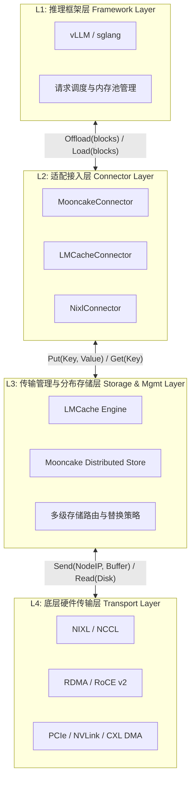

# 围绕KVCache的主流在线推理框架与传输卸载架构分析报告

## 1. 概述
在大型语言模型（LLM）的在线推理中，KVCache（键值缓存）是占用极高显存资源的关键数据。随着长文本、Agent工作流以及“预填充-解码（Prefill-Decode）”分离架构的普及，单机GPU显存已无法满足海量KVCache的常驻需求。因此，KVCache在GPU、本地DDR、SSD以及远端分布式存储池之间的**频繁卸载（Offload）与加载（Load）**成为了主流趋势。

本报告聚焦于两大主流推理框架（vLLM、sglang），深入剖析KVCache的管理、传输机制，并基于“框架层-适配层-管理层-传输层”的四层架构，推演未来高性能KVCache软硬件协同的技术演进，最后输出标准的需求规格说明（SRS）。

---

## 2. vLLM与sglang中KVCache的管理与传输分析

### 2.1 触发时机与管理机制
两大框架在KVCache的组织形式和调度策略上存在差异，导致卸载与加载的触发时机与逻辑各不相同：

| 维度 | vLLM (PagedAttention) | sglang (RadixAttention) |
| :--- | :--- | :--- |
| **内存组织** | 固定大小的物理块（Block-based），通常为16或32个Token。 | 基于Radix Tree（基数树）组织，以Prompt的前缀树节点为单位。 |
| **卸载(Offload)触发时机** | **1. 显存不足/抢占调度**：当Decode阶段发现空闲Block不足时，调度器会触发Preemption，将部分请求的KVCache卸载至CPU。 **2. 分布式缓存集群**：在Prefill-Decode分离架构中，Prefill节点算完后主动卸载。 | **1. 缓存驱逐机制**：Radix Tree容量达到上限时，依据LRU策略将最久未访问的树节点卸载至CPU/磁盘。 **2. 长上下文溢出**：生成极长文本时自动溢出至低速层。 |
| **加载(Load)触发时机** | **1. 请求恢复(Resume)**：被挂起的请求重新被调度执行时，从CPU加载回GPU。 **2. 前缀命中**：当新请求命中了已被Offload的前缀缓存时。 | **前缀树命中**：新请求进行Radix Match时，若命中已被驱逐的节点，立刻触发从CPU/本地磁盘向GPU的加载。 |

### 2.2 传输单位、大小与行为模式

**传输单位与大小：**
*   **基础单元**：单次传输以Block为基础。假设 `BlockSize=16`，模型为 `Llama3-8B`（隐层维数4096，32个KV头，FP16），则单个Block的大小约为：`16 * 32 * 128 * 2 (K和V) * 2 Bytes = 256 KB`。
*   **不连续性问题**：由于PagedAttention的碎片化特性，逻辑上连续的Token在GPU物理显存中是离散的Block集合。

**传输方式分析：**
1.  **vLLM的For循环传输痛点**：在传统实现中，由于要转移的数十个Block在源地址和目的地址上均不连续，底层框架往往采用`for`循环遍历Block映射表，多次调用`cudaMemcpyAsync`（或通过构建批量拷贝的Kernel）来传输。如果通过CPU循环下发指令，会带来极大的调度开销和PCIe/NVLink的小包碎包问题，带宽利用率极低。
2.  **sglang的连续优化**：由于Radix Tree节点具有较强的序列连续性，在设计底层存储时可以将树节点整体序列化后进行大块传输，传输效率天然优于极度离散的Paged Block传输。

### 2.3 第三方传输生态对接（Mooncake / LMCache / NIXL）
为了解决KVCache在分布式节点的流转，框架引入了多种协议插件：
*   **MooncakeStore / LMCache**：以Token的Hash或特征为Key，以KVCache Tensor为Value。当业务层触发加载时，优先向LMCache等引擎发起查询，LMCache引擎负责寻找最近的DDR/SSD位置。
*   **传输下沉**：为了避免For循环的性能损耗，连接层通常会将“离散的Block Index列表”整体打包下发给底层NIXL（Nvidia Inference Transfer Library）或RDMA通信库，由底层驱动利用硬件Scatter-Gather DMA（SGDMA）能力一次性完成多段内存的并发搬运。

---

## 3. 软件架构分析：自顶向下的四层剖析

我们将整个KVCache的生命周期自顶向下划分为**四个层次**，明确交互边界：

### 3.1 层次功能与边界定义

| 层次划分 | 核心功能特性 | 向上一层提供的接口/能力 | 传递信息格式与内容 |
| :--- | :--- | :--- | :--- |
| **L1 推理框架层** | 负责Attention算子执行、请求调度、Token Paging/Radix Tree结构维护。 | *(面向应用层暴露服务API)* | / |
| **L2 适配接入层** | **功能翻译**：将框架内特定的内存指针（如Block Table索引、物理块指针）序列化，并生成全局唯一的Key（例如基于Token Hash）。屏蔽下方不同存储引擎的差异。 | `offload_kv_cache(block_mapping)` `load_kv_cache(hash_key)` | 包含物理显存指针数组、Token特征签名、对应的逻辑序列长度及目标拓扑层级。 |
| **L3 传输与管理层** | 维护分布式/本地多级缓存池目录。实现数据的拓扑感知寻址（在本地DDR、SSD或远端节点中寻找）。执行LRU替换及预取逻辑。 | `async_put(key, tensor)` `async_get(key)` 提供数据命中状态与高速缓存读写能力。 | 全局唯一的Key、KVCache连续或离散的内存块（Tensor形式），异步回调上下文(Context)。 |
| **L4 底层传输层** | 实际完成介质间的比特流拷贝。支持GPUDirect RDMA绕过CPU，支持Scatter-Gather操作聚合零碎Block，规避软件层For循环导致的时延。 | `rdma_write(addr)` `dma_copy(src[], dst[])` 提供Wire-Speed无感传输与高并发吞吐能力。 | 物理内存地址空间映射表、远端RDMA Queue Pair信息、DMA事件同步原语（CUDA Event/Fence）。 |

---

## 4. 高性能KVCache技术推演

### 4.1 推演场景定义
**场景**：在包含十万卡级别的AI集群中，采用Prefill-Decode完全分离架构。用户的超长文本（百万Token）KVCache在GPU HBM、本地DDR、本地NVMe SSD、远端DDR之间随着请求生命周期剧烈漂移和复用。目标：极致提升TTFT（首字延迟）、降低TPOT（每字延迟）。

### 4.2 业务痛点与底层诉求推演

**1. 硬件时延与带宽的极致剥削：**
为了防止KVCache加载成为TTFT的瓶颈，我们对各介质访问特性的诉求如下：
*   **本地DDR (PCIe 5.0)**：带宽 ~64GB/s，时延 ~1us。诉求：需要主机侧提供直接的CXL.mem扩展支持，或使用NVLink-C2C技术实现CPU-GPU内存统一，消灭显式拷贝。
*   **远端DDR (RDMA 400G/800G)**：带宽 ~50-100GB/s，时延 ~2-5us。诉求：必须开启GPUDirect RDMA，避免远端网卡读数据进入CPU内存再进入GPU的Secondary Copy。
*   **本地SSD (NVMe PCIe 5.0)**：带宽 ~14GB/s，时延 ~50-100us。诉求：GPUDirect Storage (GDS)技术，让GPU直接打通SSD控制器。

**2. 核心痛点：流量风暴与业务阻塞：**
*   **痛点**：当多个微服务节点突然同时需要同一份热门长文本（如公共系统Prompt或文档库）的KV时，远端DDR和网络链路会引发“TCP/RoCE流量风暴”，导致拥塞丢包。
*   **痛点**：KVCache的拷贝占用PCIe带宽，若此时框架正在下发Compute Kernel或进行多模态张量的拷贝（前后处理共存），PCIe带宽竞争会导致算子下发饥饿，造成业务明显卡顿（TPOT毛刺）。

### 4.3 面向未来的KVCache架构演进思路

1.  **统一KVCache内存池 (Unified Memory Pool)**：
    利用**CXL (Compute Express Link)** 和 **NVIDIA Unified Memory (UM)** 技术。L1框架不再主动显式调用 `Memcpy` 进行Offload。相反，将KVCache申请在虚拟连续的统一地址空间内。借助硬件底层的Page Fault机制和CXL缓存一致性协议，当GPU命中缺失的KVCache时，硬件级控制器自动从本地或远端内存池预取，框架无需写一堆丑陋的调度器逻辑。
2.  **拓扑、形态、质量感知的KVCache内存管理**：
    *   **拓扑感知**：L3层（如Mooncake Store）维护集群物理网络拓扑图。获取KVCache时，优先从同一个TOR交换机下的节点获取，降低跳数。
    *   **传输形态感知**：底层依据数据量大小动态选择通道。若Block量小（碎），则打包后走RDMA Send/Recv；若为大段连续缓存（如sglang树节点），则走直接的RDMA READ操作。
    *   **传输质量感知**：结合流量控制模型，如果RDMA网卡监控到PFC风暴或RTT剧增，智能回退（Fallback）到从本地较慢的SSD中读取，甚至通知L1层“网络拥塞，建议重新计算(Recompute) KVCache”以时间换空间。

---

## 5. 软件需求规格说明书 (SRS)

结合四层架构模型，输出各组件的优化开发需求文档（SRS）：

### 5.1 推理框架层 (L1-Framework)
| 需求编号 | 需求描述 | 验收标准 | 优先级 |
| :--- | :--- | :--- | :--- |
| **L1-VLLM-REQ-001** | **离散Block聚合传输机制**：废弃For循环的同步/小异步传输下发机制。支持收集所有需要传输的Block物理指针，将其重组成Scatter-Gather List供底层调用。 | Block拷贝时延降低至少40%；通过Nsight工具验证仅出现单次大DMA传输请求。 | P0 |
| **L1-SGLANG-REQ-001** | **基于基数树节点状态的预取(Prefetch)**：当树搜索即将命中冷数据边界时，提前3-5步(Step)触发L2层的异步拉取。 | 缓存命中时，等待加载的时间占据总体TTFT比例低于5%。 | P1 |

### 5.2 适配接入层 (L2-Connector)
| 需求编号 | 需求描述 | 验收标准 | 优先级 |
| :--- | :--- | :--- | :--- |
| **L2-CONN-REQ-001** | **语义与哈希无缝映射**：将L1框架传来的逻辑上下文信息快速映射为256位一致性Hash Key，无需深拷贝数据本体即可完成建库。 | Key生成与查表开销单次<50微秒。 | P0 |
| **L2-CONN-REQ-002** | **异步回调上下文管理**：支持向L1返回Future对象。在数据从远端到达前，不阻塞推理框架的整体Event Loop调度。 | 适配器层不产生任何线程阻塞死锁；支持Python asyncio。 | P0 |

### 5.3 传输与管理层 (L3-Manager)
| 需求编号 | 需求描述 | 验收标准 | 优先级 |
| :--- | :--- | :--- | :--- |
| **L3-MOON-REQ-001** | **全网拓扑感知路由寻址**：建立DDR、SSD、远端节点的多级分层索引目录，并具备网络拓扑距离计算能力，优先从RTT最短节点拉取。 | RTT探测精度达到微秒级；跨交换机拉取频率降低至少30%。 | P0 |
| **L3-LM-REQ-001** | **流量风暴抑制与降级重算协商**：当并发访问某一热点Key导致网络带宽饱和时，触发限流并向L1反馈`RECOMPUTE_SUGGESTED`标志。 | 在100个并发拉取同一100K Token的压测下，无PFC死锁或断流情况。 | P1 |

### 5.4 底层硬件传输层 (L4-Transport)
| 需求编号 | 需求描述 | 验收标准 | 优先级 |
| :--- | :--- | :--- | :--- |
| **L4-NIXL-REQ-001** | **硬件级SGDMA与NVLink协同**：提供基于C/C++底层库，能够解析L1传来的离散指针列表，利用网卡或PCIe控制器的硬件SGDMA机制执行单指令多地址搬运。 | 实现零CPU干预；内存吞吐率达到总线理论上限的85%以上。 | P0 |
| **L4-NIXL-REQ-002** | **GPUDirect Storage(GDS)深度集成**：当数据位于本地NVMe SSD时，绕过System RAM，直接将KVCache经PCIe刷入GPU HBM。 | 相较于传统`Disk->CPU->GPU`路径，吞吐提升200%，CPU占用率<5%。 | P1 |

---
**本报告从框架源码结构、系统工程、硬件网络等维度全方位解析了高性能KVCache的现状与未来，旨在为新一代Agentic LLM基础设施建设提供技术基石与路标。**
