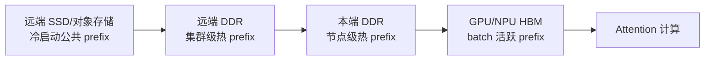
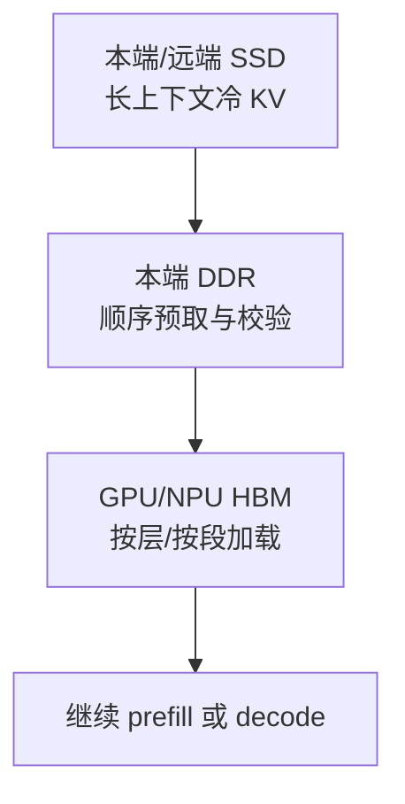
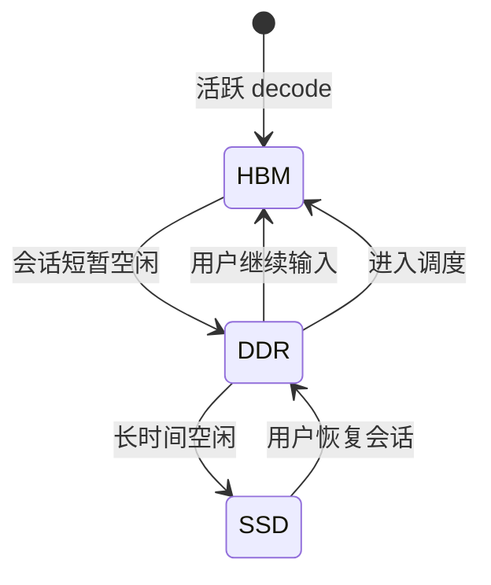
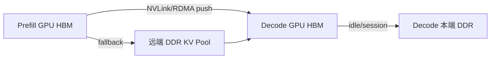
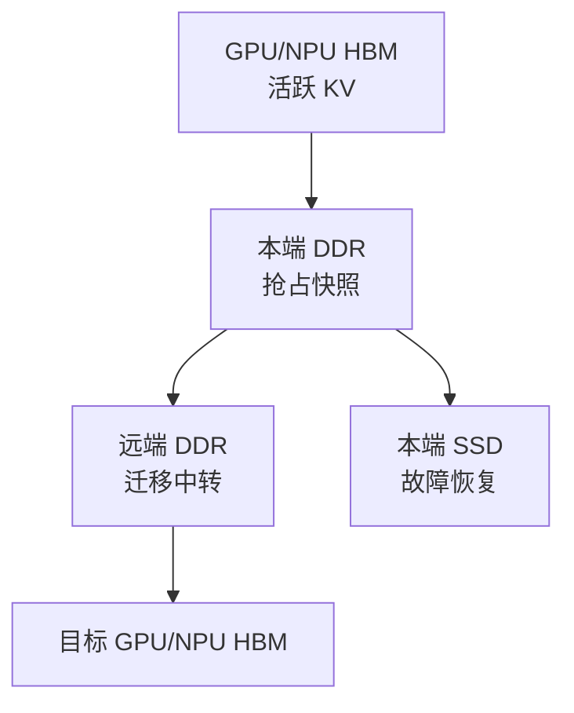
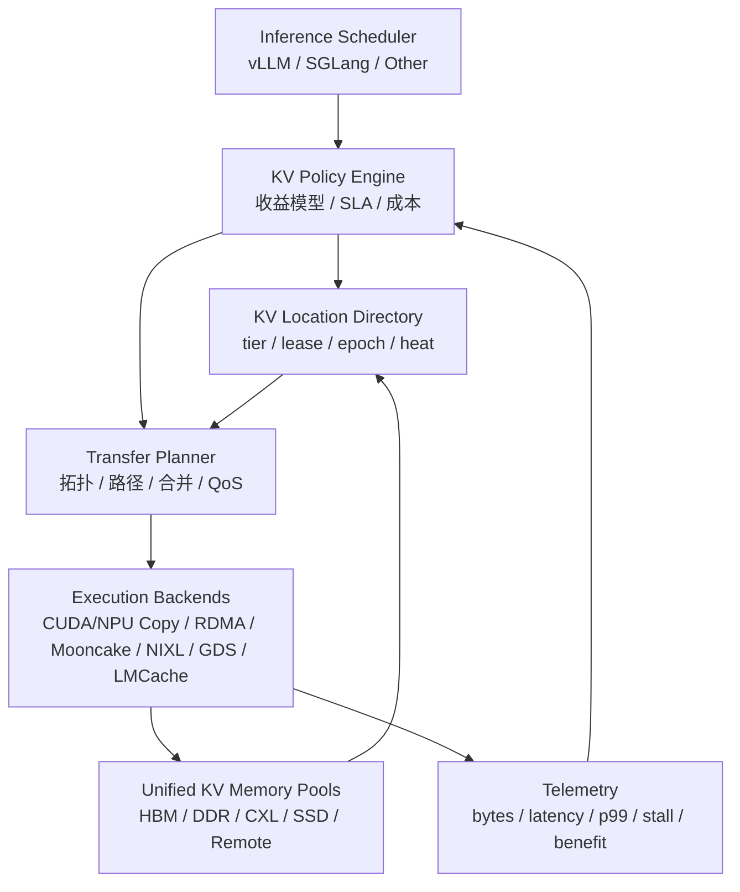

# 多介质协同服务 AI 推理 KVCache 的场景、指标与软硬件能力需求推演

**日期**：2026-06-26  
**上下文**：基于 vLLM、SGLang KVCache 管理与传输机制分析，进一步推演 GPU/NPU、本端 DDR、远端 DDR、本端 SSD、远端 SSD 等介质如何协同服务在线推理 KVCache，并从场景与指标反推软硬件架构增强需求。

---

## 1. 核心问题重述

问题不是“KVCache 放在哪里最好”，而是：

> 在不同请求生命周期、不同复用模式、不同资源压力下，GPU/NPU HBM、本端 DDR、远端 DDR、本端 SSD、远端 SSD 应该如何协同，让 KVCache 对 TTFT、TPOT、吞吐、尾延迟、成本、可用性这些关键指标产生正收益？

这个问题必须循环回答下面这组子问题：

1. **什么场景**会产生 KVCache 复用、卸载、加载、迁移、预取、回写需求？
2. **目标指标**是什么：TTFT、TPOT、QPS、p99、显存容量、成本、恢复时间，还是跨节点复用率？
3. **KVCache 数据路径**是什么：HBM->DDR、DDR->HBM、HBM->远端 DDR、DDR->SSD、SSD->HBM，还是多段流水？
4. **收益是否大于代价**：节省的 prefill/decode compute 是否大于传输、排队、元数据查询和资源争用成本？
5. **当前架构痛点**是什么：带宽不够、延迟太高、小块随机、元数据热点、缺少一致性、缺少 QoS，还是缺少统一对象语义？
6. **需要增强什么软硬件能力**：拓扑感知、统一 KV 对象、层级内存池、RDMA/GDS/CXL/NVLink 路径、租约、预取策略、带宽隔离等。

---

## 2. 存储介质角色定位

### 2.1 介质分层

| 层级 | 介质 | 位置 | 典型容量 | 典型延迟 | 典型带宽 | KVCache 角色 |
|---|---|---|---:|---:|---:|---|
| L0 | GPU/NPU HBM | 本端加速器 | 最小 | 最低 | 最高 | 活跃 decode window、当前 batch、极热 prefix |
| L1 | 本端 DDR | 本端 CPU host | 中等 | 低 | 中高 | 热/温 KVCache、GPU eviction 缓冲、H2D staging、短期会话续接 |
| L2 | 远端 DDR | 远端节点 host | 大 | 中 | 受网络限制 | 跨实例共享热门 prefix、PD 分离传递、请求迁移 |
| L3 | 本端 SSD | 本端 NVMe | 很大 | 高 | 中 | 冷 KV、长上下文 checkpoint、重启恢复、本地持久化 |
| L4 | 远端 SSD/对象存储 | 远端存储池 | 极大 | 最高 | 受网络与存储限制 | 跨集群共享、离线预热、超长上下文归档、灾备 |

### 2.2 关键判断

KVCache 的介质协同不是按容量从快到慢简单淘汰，而应按 **指标目标 + 请求阶段 + 复用概率 + 路径成本** 动态选择：

```text
是否加载外部 KV =
  节省的计算时间
  - 数据传输时间
  - 元数据查询时间
  - 传输排队时间
  - 对当前 batch 算子的干扰成本
  > 0
```

如果只追求命中率，会把大量冷 KV 从 SSD 或远端 DDR 拉回 GPU，反而拉高 TTFT 和 p99。真正的目标是 **有效命中率**：

```text
有效命中率 = 对 TTFT/TPOT/p99/成本产生正收益的 KV 命中 / 全部可命中的 KV
```

---

## 3. 场景、介质协同与关键指标

### 3.1 场景一：热门系统 Prompt / 公共 Prefix 复用

#### 业务形态

大量请求共享相同系统 prompt、工具说明、RAG 模板、企业知识库前缀。例如客服、代码助手、Agent 工具调用模板。

#### 目标指标

| 指标 | 目标 |
|---|---|
| TTFT | 显著降低，因为公共 prefix prefill 可跳过 |
| QPS | 提升，因为 prefill GPU compute 被减少 |
| p99 TTFT | 降低热点 prefix 的排队抖动 |
| 成本 | 降低单位 token GPU 计算成本 |

#### 介质协同路径



#### 最优协同方式

1. 冷启动时从远端 SSD 或本端 SSD 读取公共 prefix 到远端 DDR/本端 DDR。
2. 热度升高后在多个节点本端 DDR 做副本。
3. 当本节点请求即将调度时，提前从本端 DDR 加载到 HBM。
4. 对超高热 prefix，可常驻 HBM 或在 NVLink 域内多 GPU 复制。

#### 当前架构痛点

| 痛点 | 影响 |
|---|---|
| 多请求同时 miss 同一 prefix | 远端 DDR 或 SSD 被重复读取，形成流量风暴 |
| 只知道是否命中，不知道命中在哪一层 | scheduler 无法判断是否值得加载 |
| KV block/page 不连续 | 传输 descriptor 数过多，降低有效带宽 |
| 热点 prefix 缺少副本策略 | 热点集中打爆单节点或 metadata server |

#### 能力增强需求

| ID | 需求 |
|---|---|
| HOTPREFIX-SW-REQ-001 | KVCache 系统应提供 single-flight 机制，同一 KV key 在同一节点或同一调度域内同时只允许一个底层 load。 |
| HOTPREFIX-SW-REQ-002 | KV directory 应记录 KV object 所在 tier、热度、最近加载耗时、当前 in-flight 状态和副本位置。 |
| HOTPREFIX-SW-REQ-003 | Scheduler 应基于 `saved_prefill_time > transfer_cost` 决定是否加载远端/SSD KV，而不是只基于命中。 |
| HOTPREFIX-HW-REQ-001 | 集群应支持高带宽低延迟 GPU-GPU 或 Host-Host 复制路径，例如 NVLink/NVSwitch、RDMA 或 CXL fabric。 |
| HOTPREFIX-HW-REQ-002 | NIC/交换网络应支持 KVCache 流量与 RPC/控制面流量隔离，避免热点 prefix 复制影响在线请求响应。 |

---

### 3.2 场景二：长上下文首次响应

#### 业务形态

用户输入数万到数十万 token 上下文，或 Agent 恢复历史会话。KVCache 复用可以跳过大段 prefill。

#### 目标指标

| 指标 | 目标 |
|---|---|
| TTFT | 主要优化对象，长上下文 prefill 极贵 |
| p99 TTFT | 避免 SSD/远端读取导致极端尾延迟 |
| 显存容量 | 不要求全量历史常驻 HBM |
| 成本 | 用低成本存储换取少量恢复延迟 |

#### 介质协同路径



#### 最优协同方式

1. 长上下文 KV 在请求结束或会话空闲时落到本端 SSD/远端 SSD。
2. 新请求到来后先查询 storage hit length，只对收益高的 prefix 执行加载。
3. SSD->DDR 使用大块顺序 IO，减少随机小 IO。
4. DDR->HBM 使用按层加载，与模型前向逐层 overlap。
5. 对末尾少量 token 可选择重算，避免为小段 KV 触发大 IO。

#### 当前架构痛点

| 痛点 | 影响 |
|---|---|
| SSD IO 粒度与 KV page 粒度不匹配 | 4KB 小 IO 或大量小文件导致吞吐低 |
| GDS/DirectIO 对齐不满足 | 退化到 CPU bounce buffer，DDR 带宽被额外消耗 |
| 全量加载后才开始计算 | TTFT 被 SSD 读取完全阻塞 |
| 缺少分段收益判断 | 加载很短尾部 prefix 不划算 |

#### 能力增强需求

| ID | 需求 |
|---|---|
| LONGCTX-SW-REQ-001 | KV storage 应支持 range/page group 查询，返回连续命中长度、所在介质、预估读取时间。 |
| LONGCTX-SW-REQ-002 | 框架应支持分段加载，允许前 N 层或前 M page 到达后即开始计算。 |
| LONGCTX-SW-REQ-003 | KVCache 应支持“末尾重算策略”，当剩余命中长度小于阈值时不再触发外部加载。 |
| LONGCTX-SW-REQ-004 | 存储层应将 KV page 聚合为适合 SSD 的 segment，避免每 page 一个小对象。 |
| LONGCTX-HW-REQ-001 | 本端 SSD 应支持高队列深度、O_DIRECT、稳定 p99 read latency，并暴露介质拥塞指标。 |
| LONGCTX-HW-REQ-002 | GPU 平台应支持 GDS 或等价能力，使 SSD->GPU/DDR 路径减少 CPU bounce copy。 |

---

### 3.3 场景三：多轮对话会话续接

#### 业务形态

用户多轮对话，中间有短暂停顿。活跃会话需要快速恢复；非活跃会话不能长期占用 HBM。

#### 目标指标

| 指标 | 目标 |
|---|---|
| TTFT | 会话续接首 token 快 |
| TPOT | decode 阶段不被后台回写干扰 |
| 显存利用率 | 空闲会话及时下沉 |
| 用户体验 | 多轮间隔后仍保持低延迟 |

#### 介质协同路径



#### 最优协同方式

1. 活跃会话 KV 留在 HBM。
2. 短暂空闲后下沉到本端 DDR，保持快速恢复。
3. 长时间空闲后落盘到本端 SSD 或远端 SSD。
4. 用户恢复前可通过请求预测或网关信号预取到 DDR。
5. 只恢复需要继续 attention 的最近上下文窗口，过旧 KV 可摘要化或重算。

#### 当前架构痛点

| 痛点 | 影响 |
|---|---|
| HBM eviction 只看显存压力，不看会话恢复概率 | 可能驱逐马上会继续的会话 |
| 后台 D2H 回写影响 decode TPOT | copy engine 与 compute 争用 |
| 会话 KV 与 prefix KV 生命周期不同但共用策略 | 热度判断失真 |
| 缺少会话级 SLA | VIP 会话和普通会话争用同一缓存池 |

#### 能力增强需求

| ID | 需求 |
|---|---|
| SESSION-SW-REQ-001 | KVCache manager 应区分 prefix object 与 session object，分别采用热度、TTL 和淘汰策略。 |
| SESSION-SW-REQ-002 | 会话 KV 应支持状态机：HBM active、DDR warm、SSD cold、expired，并可按租户策略配置 TTL。 |
| SESSION-SW-REQ-003 | 后台 D2H/SSD 写入应有 bandwidth budget，不得无界抢占在线 decode 资源。 |
| SESSION-SW-REQ-004 | 调度器应支持会话恢复概率输入，例如网关连接状态、用户活跃度、SLA 级别。 |
| SESSION-HW-REQ-001 | GPU/NPU 平台应提供独立 copy engine 或 QoS 能力，使 D2H 回写对 decode kernel 干扰可控。 |

---

### 3.4 场景四：Prefill/Decode 分离

#### 业务形态

Prefill worker 负责长 prompt 计算，Decode worker 负责后续 token 生成。Prefill 产生 KV 后需要快速转移给 Decode。

#### 目标指标

| 指标 | 目标 |
|---|---|
| TTFT | Prefill 完成后 decode 立即启动 |
| TPOT | Decode 不因 KV 接收阻塞每步生成 |
| 集群吞吐 | Prefill/Decode 资源可独立扩缩 |
| 网络效率 | 减少跨节点重复复制 |

#### 介质协同路径



#### 最优协同方式

1. 同节点或同 NVLink 域内优先 GPU-GPU 复制。
2. 跨节点优先 RDMA write/read，避免落本端 SSD。
3. 若 decode worker 未就绪，KV 先进入远端 DDR pool，decode 后续拉取。
4. Decode 可按层等待，避免全量 KV 到齐才开始。
5. Prefill worker 释放 KV 前必须确认 decode 已接收或远端 pool 已持久化。

#### 当前架构痛点

| 痛点 | 影响 |
|---|---|
| Producer push 与 consumer pull 模式割裂 | 不同框架 connector 难统一 |
| Decode worker 分配 block 后才知道远端传输目标 | 控制面往返增加 |
| KV 发送完成与 block 释放缺少全局租约 | 可能读写竞态 |
| 跨 TP/PP rank 的 KV 映射复杂 | 错 rank 或错 layout 会造成不可恢复错误 |

#### 能力增强需求

| ID | 需求 |
|---|---|
| PDDISAGG-SW-REQ-001 | KV object manifest 必须记录 TP/PP/CP rank、layer range、layout、dtype、page/block size 和 model version。 |
| PDDISAGG-SW-REQ-002 | Prefill->Decode 传输应支持 push、pull、store-and-forward 三种模式，并由 planner 选择。 |
| PDDISAGG-SW-REQ-003 | 框架应支持按层或按 block group 的 readiness signal，使 decode 可渐进启动。 |
| PDDISAGG-SW-REQ-004 | KV block 释放必须受 lease/fence 保护，直到远端确认接收或持久化。 |
| PDDISAGG-HW-REQ-001 | 集群内应提供 RDMA/NVLink/NVSwitch 可选路径，并向软件暴露 GPU/NIC/NUMA 拓扑。 |
| PDDISAGG-HW-REQ-002 | 网络应支持大流量 KV transfer 的拥塞控制和优先级，避免干扰 token streaming RPC。 |

---

### 3.5 场景五：显存压力、抢占与请求迁移

#### 业务形态

高 QPS 下 GPU HBM 不足，部分请求被抢占；或为负载均衡/故障处理，需要迁移请求到其他 worker。

#### 目标指标

| 指标 | 目标 |
|---|---|
| TPOT | 抢占/迁移不显著拖慢其他请求 |
| p99 | 避免大规模 eviction 导致尾延迟飙升 |
| 吞吐 | 显存压力下仍保持稳定服务 |
| 可用性 | 节点故障后可恢复部分会话 |

#### 介质协同路径



#### 最优协同方式

1. 抢占时优先写本端 DDR，因为写入延迟最低。
2. 若请求可能迁移，异步复制到远端 DDR。
3. 若需要故障恢复，后台落本端 SSD 或远端 SSD。
4. 恢复时优先从本端/远端 DDR 拉取，SSD 作为兜底。
5. 对低价值请求可直接丢弃 KV 重算，避免拖累高优先级请求。

#### 当前架构痛点

| 痛点 | 影响 |
|---|---|
| 抢占策略只关心显存释放，不关心未来恢复成本 | 可能释放了昂贵 KV |
| 迁移时 KV 与 scheduler 状态分离 | 请求状态与 KV 位置不一致 |
| 缺少增量 checkpoint | 每次迁移都传全量 KV |
| 写回风暴 | 多请求同时抢占时 DDR/NIC/SSD 被打满 |

#### 能力增强需求

| ID | 需求 |
|---|---|
| PREEMPT-SW-REQ-001 | Scheduler 应在抢占决策中纳入 KV 重算成本、KV 大小、会话优先级和外部存储可用性。 |
| PREEMPT-SW-REQ-002 | KVCache 应支持增量 checkpoint，只写新生成或变化的 page/block。 |
| PREEMPT-SW-REQ-003 | 请求迁移协议应同时迁移 scheduler state、KV object location 和 lease。 |
| PREEMPT-SW-REQ-004 | 系统应提供抢占写回限速，保证在线 decode 的 TPOT 不被集体 D2H/SSD 写入打爆。 |
| PREEMPT-HW-REQ-001 | 本端 DDR 与 SSD 路径应具备可观测队列深度和尾延迟指标，供抢占策略避开拥塞路径。 |

---

### 3.6 场景六：多租户与成本优化

#### 业务形态

多个租户共享同一推理集群，SLA、预算、模型、上下文长度不同。

#### 目标指标

| 指标 | 目标 |
|---|---|
| 成本 | 冷 KV 下沉到低成本介质 |
| SLA | 高优租户获得更高缓存保留和加载优先级 |
| 公平性 | 避免单租户 KV 占满 DDR/SSD |
| 可观测性 | 能解释某个租户为何 TTFT 变差 |

#### 介质协同路径

高优租户：HBM + 本端 DDR + 远端 DDR 副本。  
普通租户：HBM 短驻 + 本端 DDR warm + SSD cold。  
低优/离线租户：尽量重算或 SSD 按需恢复。

#### 当前架构痛点

| 痛点 | 影响 |
|---|---|
| KVCache 资源通常按全局池管理 | 租户隔离不足 |
| 命中率高的租户可能挤占所有缓存 | 低优先级请求反而拖累高优先级 |
| 成本指标没有反馈到 eviction/store 策略 | SSD 与远端 DDR 使用不可控 |

#### 能力增强需求

| ID | 需求 |
|---|---|
| TENANT-SW-REQ-001 | KVCache manager 应支持按 tenant/model/session 设置 HBM、DDR、SSD 配额。 |
| TENANT-SW-REQ-002 | KV load/store 请求应携带 priority、deadline、tenant id 和 cost class。 |
| TENANT-SW-REQ-003 | Eviction 策略应支持 SLA-aware 与 cost-aware，不得仅按 LRU/LFU。 |
| TENANT-SW-REQ-004 | 观测系统应输出按租户维度的 KV hit tier、bytes、latency、eviction、重算成本。 |
| TENANT-HW-REQ-001 | 网络和存储设备应支持流量分类或队列隔离，保障高优先级 KV transfer。 |

---

## 4. 从指标反推协同策略

### 4.1 TTFT

TTFT 最受 prefill compute、KV load latency、调度排队影响。

| 协同策略 | 适用条件 | 风险 |
|---|---|---|
| HBM 常驻热门 prefix | 极高复用、prefix 较短 | 挤占 decode 活跃 KV |
| 本端 DDR 预取到 HBM | 复用概率高、H2D 可与调度 overlap | H2D 抢 copy engine |
| 远端 DDR 拉取 | 本端未命中且远端带宽充足 | 网络尾延迟 |
| SSD 恢复长上下文 | prefill 重算极贵 | SSD p99 可能超过收益 |

推论：TTFT 优化需要 **提前性**。等请求已经进入 GPU batch 再从远端 SSD 拉 KV，通常太晚。必须在 admission、queueing、routing 阶段提前查询和预取。

### 4.2 TPOT

TPOT 主要受 decode kernel、KV memory access、batch shape 和后台传输干扰影响。

| 协同策略 | 适用条件 | 风险 |
|---|---|---|
| decode 活跃 KV 留 HBM | 所有在线 decode | HBM 容量不足 |
| 后台 store 限速 | 有持续 decode | store 延迟变长 |
| layerwise load | decode 前几层可先跑 | 实现复杂 |
| D2H 延后到 step 间隙 | token streaming 敏感 | 释放 HBM 不及时 |

推论：TPOT 优化要求 KVCache 外部化不能抢占 decode 关键路径。load/store 必须具备 QoS 与可取消能力。

### 4.3 QPS/吞吐

吞吐受 prefill 计算占比、HBM 容量和 batch 连续性影响。

| 协同策略 | 收益 |
|---|---|
| 公共 prefix 复用 | 降低 prefill FLOPs，提高可服务请求数 |
| HBM->DDR offload | 增大可同时容纳上下文数 |
| DDR/SSD 分层 | 降低 HBM 压力，使 batch 更稳定 |
| 远端共享 cache | 减少多节点重复 prefill |

推论：吞吐优化需要跨节点共享 KV，但共享必须避免元数据与网络瓶颈。

### 4.4 p99 与稳定性

KVCache 系统最容易伤害 p99，因为其路径包含网络、SSD、metadata server、memory registration、queueing 等不稳定因素。

| 风险 | 对策 |
|---|---|
| SSD 尾延迟 | timeout + partial load + fallback recompute |
| 远端 DDR 拥塞 | path quality 感知 + 本地副本 |
| 元数据 server 热点 | hierarchical directory + local cache |
| 小对象风暴 | segment 聚合 + batch IO |
| copy engine 拥塞 | bandwidth budget + priority stream |

推论：p99 优化要求 KVCache 加载是 **可放弃的优化**，不是不可中断的依赖。超时后应回退重算或部分命中。

### 4.5 成本

| 介质 | 成本特征 | 适合对象 |
|---|---|---|
| HBM | 最贵 | 极热、活跃 decode |
| DDR/CXL | 中等 | warm session、热 prefix |
| 本端 SSD | 低 | 长上下文冷 KV、会话 checkpoint |
| 远端 SSD | 最低/可共享 | 跨集群冷 KV、离线预热 |

推论：成本优化要求 KVCache 对象具有生命周期和热度预测，不能把所有历史 KV 都按同等优先级保存。

---

## 5. 当前软硬件架构不足

### 5.1 软件不足

| 类别 | 不足 | 后果 |
|---|---|---|
| 统一对象模型 | 不同框架使用 block hash、page hash、chunk、slot mapping 等不同语义 | 跨框架复用困难 |
| 位置目录 | 缺少 KV object 多 tier location 状态 | Scheduler 不知道从哪取、值不值得取 |
| 成本模型 | 命中查询与传输收益解耦 | 命中但不划算的 KV 被加载 |
| QoS | load/store 缺少带宽、deadline、priority | KV 传输干扰 decode |
| 一致性 | in-flight write/read 状态不统一 | 可能读未完成 KV 或释放过早 |
| 取消机制 | storage/network IO 发出后难取消 | 失效请求继续消耗资源 |
| 元数据扩展 | metadata server 容易热点 | 热门 prefix 场景 p99 劣化 |
| 观测 | 缺少 per-object/per-tier/per-path 指标 | 无法解释 TTFT/TPOT 波动 |

### 5.2 硬件不足

| 类别 | 不足 | 后果 |
|---|---|---|
| GPU copy engine | 与 compute 共享资源，QoS 控制弱 | H2D/D2H 影响 TPOT |
| PCIe/NUMA | GPU-NIC-CPU-SSD 拓扑复杂但上层不可见 | 传输走远路径 |
| SSD DirectIO/GDS | 对齐和 queue depth 要求高 | 退化到 bounce buffer |
| 网络 | KV 大流量与控制面/RPC 混跑 | token streaming 和调度被干扰 |
| CXL memory | 软件生态尚未完全 KVCache 化 | 只能作为普通内存，缺少 tier 策略 |
| NPU 异构 | DMA/layout API 不统一 | 框架难做通用 KVCache 后端 |

---

## 6. 必要软硬件架构增强需求

### 6.1 统一 KVCache Object Schema

| ID | 需求 |
|---|---|
| KVOBJ-SW-REQ-001 | 系统必须定义统一 KV object key，至少包含 model id、tokenizer id、prefix hash、block/page index、layer range、rank mapping、dtype、layout、page size、version。 |
| KVOBJ-SW-REQ-002 | KV object manifest 应支持多 buffer component，例如 K、V、MLA latent、SWA、Mamba state、draft KV。 |
| KVOBJ-SW-REQ-003 | KV object 应记录校验信息和兼容性 hash，防止不同模型、不同 TP 切分、不同 layout 误读。 |

### 6.2 分层 Location Directory

| ID | 需求 |
|---|---|
| DIR-SW-REQ-001 | directory 应记录每个 KV object 的 tier location：HBM、本端 DDR、远端 DDR、本端 SSD、远端 SSD。 |
| DIR-SW-REQ-002 | directory 应记录状态：ready、writing、reading、evicting、expired、corrupt。 |
| DIR-SW-REQ-003 | directory 应支持本地缓存和负缓存，降低热门 miss 对 metadata server 的压力。 |
| DIR-SW-REQ-004 | directory 应支持 lease 与 epoch，读者必须持有有效 lease 才能使用 KV。 |

### 6.3 成本感知 Policy Engine

| ID | 需求 |
|---|---|
| POLICY-SW-REQ-001 | policy engine 应基于 saved compute、transfer latency、queue depth、tail risk、tenant priority 决定 load/store/prefetch。 |
| POLICY-SW-REQ-002 | policy engine 应支持 fallback：超时后 partial hit、重算、降级到短 prefix。 |
| POLICY-SW-REQ-003 | policy engine 应将 TTFT/TPOT 实际收益反馈到阈值调优。 |
| POLICY-SW-REQ-004 | policy engine 应支持多目标优化：低 TTFT、高吞吐、低成本、低 p99 可按业务配置权重。 |

### 6.4 拓扑感知 Transfer Planner

| ID | 需求 |
|---|---|
| PLANNER-SW-REQ-001 | transfer planner 应感知 GPU/NPU、NUMA、NIC、SSD、CXL switch、NVLink/NVSwitch 拓扑。 |
| PLANNER-SW-REQ-002 | planner 应在 GPU-GPU、GPU-DDR、DDR-RDMA、DDR-SSD、SSD-GPU 等路径中选择最低综合成本路径。 |
| PLANNER-SW-REQ-003 | planner 应将非连续 block/page 合并为 segment，减少 descriptor 数。 |
| PLANNER-SW-REQ-004 | planner 应支持 push、pull、store-and-forward、broadcast、replicate 多种传输模式。 |

### 6.5 统一内存池与分层配额

| ID | 需求 |
|---|---|
| MEMPOOL-SW-REQ-001 | 系统应统一管理 HBM、DDR、CXL、SSD staging buffer 的容量、碎片和配额。 |
| MEMPOOL-SW-REQ-002 | 内存池应支持 tenant/model/session 级 quota。 |
| MEMPOOL-SW-REQ-003 | HBM allocator 应优先保持 decode 活跃 KV 连续性，同时为外部 load 预留弹性窗口。 |
| MEMPOOL-SW-REQ-004 | DDR/CXL pool 应支持 pinned/registered memory cache，降低 RDMA/GDS 注册开销。 |

### 6.6 QoS 与隔离

| ID | 需求 |
|---|---|
| QOS-SW-REQ-001 | KV transfer 请求应携带 priority、deadline、tenant id、request phase、expected bytes。 |
| QOS-SW-REQ-002 | 系统应对 H2D、D2H、RDMA read/write、SSD read/write 分别限速。 |
| QOS-SW-REQ-003 | Decode 关键路径应拥有高于后台 store/prefetch 的资源优先级。 |
| QOS-HW-REQ-001 | GPU/NPU 平台应暴露 copy engine 队列、利用率、拥塞和优先级控制能力。 |
| QOS-HW-REQ-002 | 网络与 SSD 应支持多队列隔离，至少可区分在线高优 KV、后台 KV、普通 RPC。 |

### 6.7 硬件增强方向

| ID | 需求 |
|---|---|
| HW-NVLINK-REQ-001 | GPU fabric 应支持高效 GPU-GPU KV 复制和广播，并向软件暴露拓扑距离。 |
| HW-RDMA-REQ-001 | RDMA/NIC 应支持高效小批量 descriptor 聚合、注册缓存和拥塞反馈。 |
| HW-GDS-REQ-001 | SSD/GPU 直连路径应支持稳定低尾延迟、stream-ordered IO、对齐检查与 fallback 指标。 |
| HW-CXL-REQ-001 | CXL memory 应作为显式 tier 暴露 latency/bandwidth/NUMA distance，而不是被软件当作普通 DDR。 |
| HW-NPU-REQ-001 | NPU 生态应提供标准 KV page DMA、layout transform、host registered memory 接口。 |
| HW-OBS-REQ-001 | 硬件应提供 per-path telemetry：GPU copy、PCIe、NIC、SSD、CXL switch 的延迟、带宽、错误与队列深度。 |

---

## 7. 建议目标架构



### 7.1 与现有 vLLM/SGLang 的结合

| 框架 | 短期改造 | 中期演进 |
|---|---|---|
| vLLM | 在 KVConnector metadata 中加入 tier、bytes、deadline、priority、expected benefit | 将多个 connector 的策略上移到统一 KV Policy Engine |
| SGLang | 将 HiCache hit/load/store 指标反馈给动态阈值策略 | 将 HiRadixCache 的 node state 与全局 Location Directory 对齐 |
| Mooncake | 强化 RDMA/NVLink 路径、批量 descriptor 合并、热点副本 | 成为 remote DDR/object tier execution backend |
| NIXL | 强化多 backend descriptor 与 DirectIO/GDS 路径 | 成为统一 transfer planner 的跨介质执行层 |
| LMCache | 强化 chunk object schema 与多进程共享 | 成为跨进程/跨框架缓存服务后端 |

---

## 8. 结论

GPU/NPU、本端 DDR、远端 DDR、本端 SSD、远端 SSD 对 KVCache 的价值并不是线性层级关系，而是共同构成一个面向不同指标的协同系统：

- **HBM** 服务 TPOT 和活跃 decode，是最稀缺的执行层缓存。
- **本端 DDR** 服务 TTFT 与显存扩展，是 warm KV 和抢占恢复的关键层。
- **远端 DDR** 服务跨节点复用、PD 分离和迁移，是集群级热 KV 池。
- **本端 SSD** 服务长上下文、会话 checkpoint 和故障恢复，是低成本容量层。
- **远端 SSD** 服务跨集群共享、冷 KV 归档和离线预热，是全局容量层。

未来高性能 KVCache 架构的核心不是再增加一个 cache backend，而是建立：

1. 统一 KV object schema；
2. 分层 location directory；
3. 成本感知 policy engine；
4. 拓扑感知 transfer planner；
5. 多介质统一内存池；
6. 带 QoS 的传输执行层；
7. 面向 TTFT/TPOT/p99/成本的闭环观测与自调优。

只有这样，KVCache 才能从“命中就加载”的局部优化，演进为“按业务指标选择最优介质与最优路径”的系统级能力。
