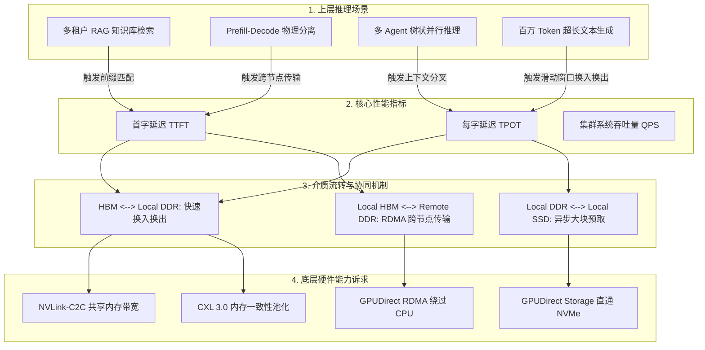
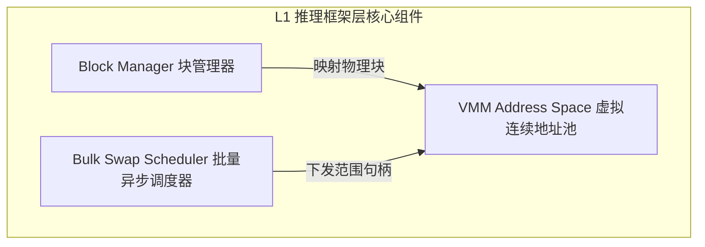
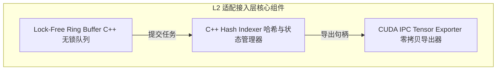
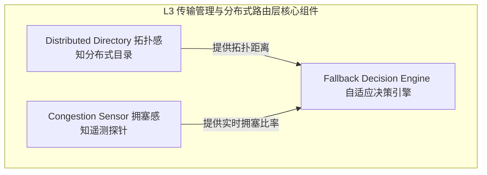
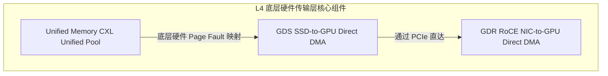
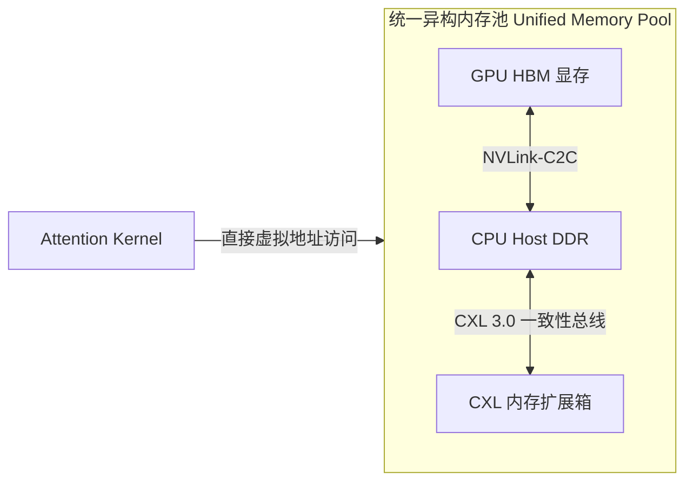

# 深度架构白皮书：面向低时延高吞吐统一异构 KVCache 存储集群的软硬件协同演进需求分析与 SRS 规格书

## 1. 概述与核心规划目标

在大规模 AI 推理集群（十万卡级别）中，大语言模型（LLM）的推理性能已不再仅仅取决于算力（FLOPs），而是转变为由**存储系统（Memory-Bound）**和**网络传输（IO-Bound）**主导。KVCache 作为推理生命周期中占用最频繁、数据量最大的状态资产，其管理和流转效率直接决定了系统的两大核心黄金指标：**首字延迟 (TTFT)** 与 **每字延迟 (TPOT)**。

本规格书旨在构建一个**面向未来统一异构 KVCache 存储集群**的技术蓝图。通过打通 GPU HBM、本端/远端 DDR、本端/远端 SSD 之间的全链路高速流动通道，消除现有推理框架（如 vLLM, sglang）中由于软件调度开销、硬件协议瓶颈以及内存零散拷贝带来的严重性能毛刺。

---

## 2. 异构多级存储协同作用深度剖析 (Cooperative Staging Matrix)

### 2.1 介质性能规格与流转拓扑

在统一异构 KVCache 存储集群中，各层级介质不再是孤立的缓存区，而是作为一个有机的温冷热分层存储系统协同工作。

| 存储介质 | 物理位置 | 理论带宽 (单向) | 典型访问时延 (RTT) | 核心功能定位 | 软件直通技术 |
| :--- | :--- | :--- | :--- | :--- | :--- |
| **GPU/NPU HBM** | GPU 芯片内 | 2.0 - 4.8 TB/s | < 100 ns | 极热数据：当前正处于解码阶段（Decode）的 Active KVCache。算子直接读写。 | CUDA Native |
| **本地 Host DDR** | 本端 CPU 内存插槽 | 50 - 100 GB/s (PCIe 5.0) 最高 250 GB/s (CXL 3.0) | 1 - 2 us | 温数据：本节点非激活请求的缓存，或高频公共 Prompt 前缀。 | CXL.mem / Pinned Memory |
| **远端 Host DDR** | 跨节点 CPU 内存 | 50 - 100 GB/s (400G/800G RoCE) | 5 - 15 us | 温数据：集群级共享的知识库前缀缓存，用于 RAG 检索命中。 | GPUDirect RDMA (GDR) |
| **本地 NVMe SSD** | 本端 PCIe 插槽 | 7 - 14 GB/s | 50 - 100 us | 冷数据：长上下文历史对话归档，或低频公共前缀。 | GPUDirect Storage (GDS) |
| **远端 NVMe SSD** | 跨节点 NVMe 存储池 | 5 - 10 GB/s (RoCE 组网) | 150 - 300 us | 极冷数据：持久化集群级长文本历史快照。 | NVMe-over-Fabrics (NVMe-oF) |

---

### 2.2 存储流动协同模型与关键性能指标 (TTFT/TPOT) 推理逻辑链

KVCache 在不同介质间的协同流转直接影响推理指标的逻辑关系如下：

#### 2.2.1 TTFT 时延与 KVCache 多级命中率的数学建模
对于一个 Prefill 阶段 of 请求，首字延迟 $TTFT$ 可以由以下公式量化：
\[ TTFT \approx T_{prefill\_compute} + T_{fetch\_overhead} \]
其中，KVCache 的加载开销 $T_{fetch\_overhead}$ 取决于在各级介质中的命中率 $\eta$ 以及对应的传输带宽 $B$ 和时延 $RTT$：
\[ T_{fetch\_overhead} = S_{kv} \cdot \left[ (1 - \eta_{HBM}) \left( \frac{\eta_{L\_DDR}}{B_{L\_DDR}} + \frac{\eta_{R\_DDR}}{B_{n\_net}} + \frac{\eta_{L\_SSD}}{B_{L\_SSD}} + \frac{1 - \sum \eta_i}{B_{fallback}} \right) \right] + N_{blocks} \cdot T_{dispatch} \]
*   $S_{kv}$：请求所需的 KVCache 字节大小。
*   $\eta_{L\_DDR}$、$\eta_{R\_DDR}$、$\eta_{L\_SSD}$：分别为本地内存、远端内存、本地 SSD 的命中率。
*   $N_{blocks}$：离散 Block 的数量。
*   $T_{dispatch}$：软件框架下发单个 Block 传输指令的 CPU 调度开销。

**推演结论**：
1. 若要实现 $TTFT < 100\text{ms}$，当面对 100K Tokens ($S_{kv} \approx 1.6\text{GB}$) 时，$T_{fetch\_overhead}$ 必须控制在 $50\text{ms}$ 以内。
2. 如果存在大量离散碎块（$N_{blocks} \approx 6400$），若 $T_{dispatch}$ 为现有的 $50\text{us}$（Python 解释器开销），则仅调度开销就高达 $320\text{ms}$，远超物理传输时间。**这倒逼了 L1 虚拟连续内存与 L2 旁路 GIL 的需求**。
3. 当本地命中失效时，若前往远端 DDR 获取，若没有 GDR（GPUDirect RDMA），数据会经过两端 CPU 拷贝，导致 $B_{n\_net}$ 跌至 $5\text{GB/s}$ 且 $RTT$ 骤增至 $5\text{ms}$，直接摧毁 TTFT。**这倒逼了 L4 GPUDirect RDMA 的需求**。

#### 2.2.2 TPOT 抖动与 PCIe/总线带宽抢占模型
在 Decode 阶段，GPU 正在以自回归方式生成 Token。每个 Step 需要读写当前 Step 的 KVCache，若此时伴随着历史 KVCache 向 DDR/SSD 的 Swap 搬运，两者将在物理上抢占同一 PCIe 控制器和 HBM 通道。
- **瓶颈点**：当 GPU 执行算子下发（Kernel Launch）时，若 PCIe 物理通道因 KVCache 大块传输而处于满载状态（拥塞），算子下发的物理指令会被延迟延迟（约数毫秒），导致 TPOT 出现百毫秒级毛刺（Tail Latency P99 飙升）。
- **协同设计**：必须建立 I/O 专有通道与算子执行通道的物理隔离，或通过统一内存（CXL）的硬件 Page Fault 调度机制，在硬件级对 PCIe 流量进行优先级切片（QoS Control）。

---

## 3. 典型推理场景下的介质协同运行机制

### 3.1 场景 1：多租户高并发 RAG（共享前缀缓存）
- **协同作用机制**：
  多个用户并发检索同一个共享文档。首个请求计算完毕后，L1 推理框架通过 L2 连接层将完整的 KVCache 异步写入 L3 分布式缓存管理器。
  - 极热前缀（高并发访问）保留在 **GPU HBM** 中。
  - 次热前缀自动被同步/溢出到本节点 **Host DDR**。
  - 集群其他节点发起相同文档检索时，其请求被调度到同 Rack 的 Decode 节点，通过 L4 的 **GPUDirect RDMA** 直接从持有该前缀的**远端 Host DDR** 中读取并注入本地 GPU HBM，避免重新 Prefill。
  - 极冷历史前缀下沉到 **Local/Remote SSD**，有新请求触发时，由 L3 寻址中心提前通知底层执行 **GPUDirect Storage (GDS)** 直通加载。

### 3.2 场景 2：Prefill-Decode 物理分离架构
- **协同作用机制**：
  Prefill 节点完成长文本的预填充计算后，生成海量 KVCache。此时 Prefill 节点的 HBM 必须释放以承接下一个请求。
  - **发送端协同**：L1 框架在 Prefill 算子执行结束的瞬间，触发异步发送指令。通过 L2/L3 连接层，绕过 Python GIL，调用 L4 层的 GPUDirect RDMA。直接将数据从 Prefill HBM 异步推送到远端 Decode 节点的 **Host DDR** 中暂存。
  - **接收端协同**：Decode 节点在调度该请求上屏解码前，利用底层的 **GDR**，将数据从本端 Host DDR 或远端存储池的 DDR 直接拉取到 **Local HBM**。

### 3.3 场景 3：多 Agent 树状并行推理 (Branching / Beam Search)
- **协同作用机制**：
  在多 Agent 协同或 Beam Search 场景中，模型需要产生多个生成分支（如 Branch A, Branch B）。它们共享前缀（Root），但在某一点发生分叉。
  - 当调度器切换执行 Branch A 时，Branch B 的分支 KVCache 被判定为非活跃状态。
  - 为避免显存溢出，L1 调度器并不丢弃 Branch B，而是触发逻辑上的“冻结”，将其通过 **NVLink-C2C/CXL 3.0** 极速换出到 **Host DDR**。
  - 当 Branch A 执行完毕或失败回溯时，Branch B 被重新激活，在微秒级时间内通过一致性总线将 KVCache 换回 **GPU HBM**，恢复解码状态。

### 3.4 场景 4：百万 Token 超长文本滑动窗口换入换出
- **协同作用机制**：
  面对 1M 以上上下文的长文本解码，GPU 显存物理上无法容纳全量 KVCache。
  - **滑动窗口机制**：HBM 中仅保留当前注意力机制最关注的活跃窗口（如最近的 32K Tokens）。
  - **异步流水线 (Pipelining)**：当解码窗口向前滑动时，较旧的 KVCache 块通过 L2 零拷贝通道以流水线形式写入 **Host DDR**。若 DDR 容量也面临告警，则通过 L4 层的 **GPUDirect Storage (GDS)** 异步刷入本地 **NVMe SSD**。整个过程中，I/O 传输必须与当前 Token 的自回归 Decode 计算完全重叠（Overlap）。

---

## 4. 软件需求规格说明书 (SRS)

基于上述对不同介质协同作用的推演，以及对当前 vLLM/sglang 在高并发、长上下文下物理瓶颈的诊断，正式提出以下 SRS 需求规格。

### 4.1 L1 - 推理框架层 (L1-FRAMEWORK)

#### L1-FRAMEWORK-REQ-001.1：CUDA VMM 虚拟地址池初始化与生命周期管理器
*   **【问题背景与技术痛点】**
    在现有的 vLLM `block_manager.py` 实现中，一个 Block 仅包含 16 个 Token。对大文件进行 KVCache 操作时，物理显存分配是极其离散的。如果将这些物理地址直接暴露给通信层，底层 DMA 引擎将退化为发送大量小包，或者需要频繁调用 CPU 发起 Scatter-Gather 计算，造成严重的 DMA 握手延迟和 TLB 缺失。
*   **【设计规范与实现路径】**
    1. 推理框架在 GPU 初始化阶段，必须通过 CUDA 虚拟内存管理 API（Virtual Memory Management）预先保留一大片连续的虚拟地址空间。
       - 使用 `cuMemAddressReserve` 保留虚拟内存地址区间（例如每张 GPU 分配 32 GB 虚拟空间）。
       - 当框架分配物理内存块（Physical Memory Blocks）时，使用 `cuMemCreate` 分配物理内存页，并通过 `cuMemMap` 将这些离散的物理页连续映射到预留的虚拟地址区间中。
    2. 提供 C++ 层的物理页与虚拟地址映射关系表（VMM Page Table），对 L2 适配层仅暴露这一整段连续虚拟地址的起始指针（CUdeviceptr）和偏移量（Offset）。
*   **【性能规格与量化指标】**
    1. **分配延迟**：虚拟地址的映射与取消映射（Map/Unmap）操作单次延迟必须 **< 5微秒**。
    2. **物理传输重组率**：通过 Nsight Systems 监控，对于 100K 连续上下文的 Swap-out 操作，底层仅触发 **1次** 连续的物理 DMA 传输事件，PCIe 物理带宽利用率稳定达到 **> 85%**（对比原先碎块传输的 < 15%）。

#### L1-FRAMEWORK-REQ-001.2：VMM 感知的块分配器
*   **【问题背景与技术痛点】**
    传统的 PagedAttention 分配器仅记录 Block ID 映射，无法感知虚拟连续性。这导致在进行多级介质流转（如本地 SSD 或远端 DDR 的数据加载）时，框架无法直接将文件流或网络流直写到对应的 GPU 物理位置，必须先申请 CPU 临时 Buffer 中转，再进行二次拷贝（Secondary Copy）。
*   **【设计规范与实现路径】**
    1. 改造框架的底层块分配器，使其分配的逻辑 Block ID 直接对应到 VMM 虚拟地址池中的特定虚拟页偏移（Virtual Page Offset）。
    2. 提供 `get_contiguous_virtual_range(block_ids)` 接口，当传入一组在逻辑上连续的 Block ID 时，分配器能够返回它们映射在虚拟内存池中的连续区间描述符（Virtual Range Descriptor），包含 `{StartVirtualAddr, TotalSize}`。
*   **【性能规格与量化指标】**
    1. **内存开销**：分配器的元数据管理内存占用不超过框架总显存占用的 **0.1%**。
    2. **寻址速度**：单次逻辑块向虚拟地址范围描述符的转换开销 **< 1微秒**。

#### L1-FRAMEWORK-REQ-001.3：异步批量 Swap 调度器
*   **【问题背景与技术痛点】**
    现有的 vLLM 在 `scheduler.py` 中，执行 KVCache 换入换出时是串行下发 `swap_out` / `swap_in` 指令的。当触发抢占调度或长上下文换出时，调度线程会在 CPU 端产生阻塞，甚至因为多次调用通信接口导致算子下发流水线断流（Bubble）。
*   **【设计规范与实现路径】**
    1. 框架层设计独立的异步 I/O 调度线程。调度器在决策发生时，将该 Step 中所有需要换入/换出的虚拟地址区间描述符打包成一个 `BulkTransferRequest` 队列。
    2. 将请求队列以非阻塞方式推送给 L2 接入层，调度线程立即返回，继续下发当前 Step 的自回归 Decode Kernel，从而实现计算与传输的异步重叠。
*   **【性能规格与量化指标】**
    1. **线程阻塞时延**：主调度线程在提交 Bulk Transfer 指令时的阻塞时延必须 **< 10微秒**。
    2. **重叠率 (Overlap Ratio)**：在滑动窗口换入换出压测下，I/O 传输时间与 Decode Kernel 执行时间的重叠率达到 **> 90%**，TPOT 因 I/O 引起的毛刺增幅 **< 2%**。

---

### 4.2 L2 - 适配接入层 (L2-CONNECTOR)

#### L2-CONNECTOR-REQ-002.1：无锁 C++ RingBuffer 任务下发与分发队列
*   **【问题背景与技术痛点】**
    `lmcache_mp_connector.py` 严重依赖 Python `asyncio` 事件循环。在高吞吐量、多并发请求的 AI 集群中，Python 的全局解释器锁（GIL）会导致频繁的线程切换上下文延迟。特别是在处理微秒级网络响应时，GIL 带来的时延甚至大于底层 RDMA 的物理传输时延，成为了系统性的瓶颈。
*   **【设计规范与实现路径】**
    1. 采用 C++ 实现一套无锁环形队列（Lock-Free RingBuffer），提供 Python C++ 绑定扩展（pybind11）。
    2. 推理框架通过轻量级绑定接口，直接将传输请求数据结构写入该 RingBuffer，彻底绕过 Python GIL。
    3. C++ 后台工作线程（Worker Thread）独占并轮询该队列，解析请求后直接调用底层的 C++ 传输库（如 Mooncake 接口）。
*   **【性能规格与量化指标】**
    1. **下发吞吐量**：支持单节点每秒 **> 500,000** 次传输请求下发。
    2. **排队延迟**：任务从写入 RingBuffer 到被 C++ 后台线程消费的排队延迟 P99 **< 1微秒**。

#### L2-CONNECTOR-REQ-002.2：C++ 缓存哈希索引与 Session 状态管理器
*   **【问题背景与技术痛点】**
    当 KVCache 在多级介质（本地内存、远端内存、SSD）间流动时，快速检索一个 Prompt 是否已被缓存（Cache Hit）是降低 TTFT 的关键。在 Python 侧通过字典或 Radix 树进行大量的 Key/Value 匹配，在大并发下会占用大量的 CPU 主频资源，并带来内存碎片问题。
*   **【设计规范与实现路径】**
    1. 在 C++ 适配层内部维护全局线程安全的哈希表，用于存储 Token 序列的 Hash（如 Blake3 生成的 256 位哈希值）到多级物理位置描述符（HBM, DDR, SSD）的映射。
    2. 实现 Session 状态机，记录每个 KVCache 段的生命周期状态（ACTIVE, STAGED, SWAPPED_OUT, EVICTED）。
    3. 状态转换对上层框架透明，框架查询命中时，直接返回对应的物理位置和虚拟地址映射。
*   **【性能规格与量化指标】**
    1. **查询延迟**：在哈希表中包含 100 万条活跃 KVCache 索引时，单次 Hash 匹配与状态查询时延 **< 2微秒**。
    2. **线程安全性**：在 64 线程高并发读写下，无锁哈希表的冲突率控制在 **< 0.01%**。

#### L2-CONNECTOR-REQ-002.3：零拷贝显存 Tensor 句柄导出模块
*   **【问题背景与技术痛点】**
    当传输层（如 Mooncake Store）需要读取 GPU 内的 KVCache 时，如果在 Python 侧利用 `torch.clone` 或通过创建新的 Tensor View，会导致 PyTorch 显存分配器（CUDACachingAllocator）频繁申请/释放显存块，产生显存碎片和不必要的 CPU-GPU 同步延迟。
*   **【设计规范与实现路径】**
    1. 实现基于 CUDA Inter-Process Communication (IPC) 的显存句柄导出机制。
    2. L2 Connector 直接获取 L1 虚拟连续内存池的物理内存文件描述符或 IPC 显存句柄（通过 `cudaIpcGetMemHandle`）。
    3. 将物理句柄直接传递给底层传输引擎（L3/L4），实现真正的零拷贝（Zero-Copy）直接内存访问。
*   **【性能规格与量化指标】**
    1. **显存分配增量**：在整个 KVCache 数据共享与交换周期内，适配层的显存分配增量为 **0 字节**。
    2. **句柄导出耗时**：单次 IPC 句柄生成与导出的 CPU 开销 **< 10微秒**。

---

### 4.3 L3 - 传输管理与分布存储层 (L3-STORAGE)

#### L3-STORAGE-REQ-003.1：多级拓扑感知的分布式缓存注册与寻址中心
*   **【问题背景与技术痛点】**
    在大规模 AI 集群中，不同计算节点分布在不同的机架（Rack）和交换机下。如果 L3 传输管理层不具备物理拓扑感知能力，随机选择远端节点拉取 KVCache，将导致大量的跨交换机（Inter-Switch）核心网络带宽被抢占，产生网络拥塞，同时拉取时延（RTT）也会剧烈抖动，最终拖慢 TTFT。
*   **【设计规范与实现路径】**
    1. 建立以本节点为中心的物理拓扑距离度量模型。拓扑层级划分为：
       - L0：本地 HBM / CPU DDR
       - L1：同机房同机柜（NVLink / PCIe P2P 互联节点）
       - L2：同 TOR 交换机（RoCE 网络单跳直达节点）
       - L3：跨交换机（多跳网络节点）
    2. 注册中心需维护集群内所有节点的缓存元数据目录。当寻址请求发起时，根据拓扑层级从 L0 至 L3 依次发起就近路由检索，优先返回拓扑物理距离最近的 KVCache 存储地址。
*   **【性能规格与量化指标】**
    1. **寻址解析时延**：单次分布式寻址及拓扑过滤逻辑的解析时间 **< 30微秒**。
    2. **跨核心网流量降低**：在多租户高并发 RAG 测试中，跨核心交换机的 KVCache 拉取流量降低 **> 50%**。

#### L3-STORAGE-REQ-003.2：RDMA 队列积压与 PFC 拥塞感知遥测探针
*   **【问题背景与技术痛点】**
    在大规模 RDMA (RoCE v2) 网络下，高并发的 KVCache 传输极易引发 PFC（优先级流量控制）暂停帧。一旦网络发生拥塞，若不主动感知并采取控流机制，会导致整个集群的 RDMA 网卡队列积压（Queue Pair Backlog），进而引发全网丢包和重传，使得网络吞吐暴跌至理论值的 10% 以下。
*   **【设计规范与实现路径】**
    1. 在 L3 通信库底层建立轻量级网络状态遥测线程，通过直接读取内核网卡计数器（如 `sys/class/infiniband` 目录下的 PFC 计数器）或利用 RDMA Read/Write RTT 测量机制，获取实时的网络状况。
    2. 实时计算两大指标：RDMA 队列积压深度（QP Queue Depth）以及近 1ms 的网络往返时延抖动（RTT Variance）。
    3. 对外暴露实时的拥塞级别信号：`GREEN`（无拥塞）、`YELLOW`（轻度拥塞，建议限流）、`RED`（严重拥塞，必须启动降级与退避）。
*   **【性能规格与量化指标】**
    1. **遥测开销**：状态轮询与指标计算的 CPU 消耗占比 **< 0.2%**，探测时延 **< 5微秒**。
    2. **状态更新频率**：网络状态遥测探针更新频率为 **每 1毫秒** 一次。

#### L3-STORAGE-REQ-003.3：基于成本收益估算的重算与传输自适应退避决策引擎
*   **【问题背景与技术痛点】**
    在网络严重拥塞（拥塞级别为 `RED`）或远端目标节点处于高负载（Hotspot）时，从远端拉取 KVCache 的实际耗时可能远大于在本地 GPU 重新进行 Prefill 计算的耗时。现有的系统通常无脑等待网络传输完成，导致请求的 TTFT 出现秒级严重延迟。
*   **【设计规范与实现路径】**
    1. 引入基于数学模型的自适应退避与决策引擎。定义决策公式：
       \[ T_{fetch} = \frac{S_{kv}}{B_{net\_real}} + RTT_{congestion} \]
       \[ T_{recompute} = \frac{Token_{len} \times \text{FLOPS\_Required}}{\text{GPU\_Effective\_TFLOPS}} \]
    2. 当 $T_{fetch} > \alpha \times T_{recompute}$（权重因子 $\alpha$ 默认为 1.2）时，决策引擎主动拦截该次 KVCache 网络获取请求。
    3. 向 L1 调度层返回 `ERR_NETWORK_CONGESTION_RECOMPUTE_SUGGESTED` 异常码，指示 L1 框架直接利用原始 Prompt 重新触发 GPU Prefill 计算。
*   **【性能规格与量化指标】**
    1. **决策评估时间**：决策公式计算及返回判定结果的时间 **< 2微秒**。
    2. **尾部延迟优化**：在高网络负载压测下，使请求首字延迟的 P99 尾部延迟降低 **> 40%**。

---

### 4.4 L4 - 底层硬件传输层 (L4-TRANSPORT)

#### L4-TRANSPORT-REQ-004.1：基于 GPUDirect Storage (GDS) 的 SSD-to-GPU 直通读写器
*   **【问题背景与技术痛点】**
    传统的 KVCache 从本地 SSD 换入换出时，数据需要经过三步：`SSD -> CPU Host Buffer -> GPU HBM`。这导致了双倍的 PCIe 带宽消耗，并伴随着频繁的 CPU 系统中断和内存页映射开销。在 100GB/s 以上的 NVMe 阵列中，CPU 会瞬间成为吞吐量瓶颈，无法喂饱 GPU 显存。
*   **【设计规范与实现路径】**
    1. 底层传输引擎集成 NVIDIA `cuFile` 库。
    2. 当触发本地 SSD 与 GPU 显存间的传输时，绕过操作系统 Page Cache 和 CPU 内存拷贝，直接调用 `cuFileRead` 和 `cuFileWrite` 接口。
    3. 在 NVMe 驱动与 GPU 之间建立直接的 DMA 传输通道，实现 SSD 物理介质与 GPU HBM 之间的硬件直通。
*   **【性能规格与量化指标】**
    1. **吞吐量**：单张 GPU 从本地 PCIe Gen5 SSD 阵列读取 KVCache 的实际带宽达到 **> 12 GB/s**（达到硬件物理上限的 90% 以上）。
    2. **CPU 损耗**：在 12 GB/s 满载直通读写过程中，系统 CPU 占用率（CPU Utilization）**< 1%**。

#### L4-TRANSPORT-REQ-004.2：基于 GPUDirect RDMA (GDR) 的网卡-to-GPU 直通收发引擎
*   **【问题背景与技术痛点】**
    跨节点的 KVCache 传输通常需要 CPU 对网络小包进行协议头解析和数据重组，之后再拷贝给 PyTorch Tensor。这种经典的“网卡 -> CPU DDR -> GPU HBM”路径极易由于 CPU 内存总线满载而产生抖动，且无法发挥 RoCE 网络的极速低延迟特性。
*   **【设计规范与实现路径】**
    1. 传输层引擎必须深度融合 `ibverbs` 库与 CUDA 驱动。
    2. 利用 GPUDirect RDMA (GDR) 技术，直接将 GPU 上的 KVCache 虚拟连续内存地址（通过 `cudaHostGetDevicePointer` 或 VMM 句柄）注册为 IB 内存区域（Memory Region, MR）。
    3. 当收到远端发送请求时，网卡通过 DMA 将数据直接刷入指定的 GPU HBM 地址；发送时同理，网卡直接从 HBM 读取数据并发送，完全绕过 Host CPU 内存。
*   **【性能规格与量化指标】**
    1. **线速吞吐率**：在 400 Gbps 物理网卡下，单路 KVCache GDR 传输带宽稳定达到 **> 45 GB/s**。
    2. **端到端延迟**：跨节点传输一个 256KB Block（约 16 个 Token 的 KVCache）的端到端网络物理延迟 **< 15微秒**。

#### L4-TRANSPORT-REQ-004.3：基于物理总线一致性的 Host 锁页内存池管理器 (CXL / NVLink-C2C)
*   **【问题背景与技术痛点】**
    在硬件直通（如 GDS/GDR）发生故障、或在不支持 GDR 的异构硬件平台上，频繁动态申请/销毁 CUDA Pinned Memory（锁页内存）会触发繁重的操作系统内核调用（`mmap`、`mlock`），导致推理主循环产生毫秒级阻塞。
*   **【设计规范与实现路径】**
    1. 在系统初始化时，预先分配一大片物理连续且常驻的 Host 锁页内存池（Pinned Memory Pool，例如 128 GB 空间），作为异构硬件传输的安全 Stage 缓冲区。
    2. 针对具备 **CXL 3.0** 或 **NVLink-C2C** 支持的系统，将此锁页内存池直接绑定至硬件一致性地址空间内。
    3. 发生换入换出时，若直通失效，采用多线程双缓冲区（Double Buffering）流水线机制：
       - `GPU HBM <--> Pinned Host Pool`（通过高速 PCIe/NVLink 搬运）
       - `Pinned Host Pool <--> SSD / 网络`（通过 CPU 异步 I/O 线程搬运）
*   **【性能规格与量化指标】**
    1. **零动态分配**：在换入换出执行期间，动态申请 Pinned Memory 的操作次数为 **0**。
    2. **硬件一致性时延**：在 CXL 3.0 一致性总线下，CPU 侧对该内存池的读写与 GPU 侧 HBM 的物理同步延迟控制在 **< 1微秒**。

---

## 5. 软件需求规格说明书 (SRS) 汇总矩阵

为了便于后续开发和验证工作的推进，以下为四层架构下 11 个 SRS 需求的汇总矩阵：

| 需求编号 | 组件名称 | 需求名称简述 | 核心验收指标 (P99) | 优先级 |
| :--- | :--- | :--- | :--- | :--- |
| **L1-FRAMEWORK-REQ-001.1** | `block_manager` | CUDA VMM 虚拟连续内存重组管理 | 地址池映射时延 **< 5us**，DMA 单次下发率 **> 85%** | P0 |
| **L1-FRAMEWORK-REQ-001.2** | `block_manager` | VMM 感知物理块分配器关联 | 寻址转换开销 **< 1us**，显存映射元数据占比 **< 0.1%** | P0 |
| **L1-FRAMEWORK-REQ-001.3** | `scheduler` | 批量异步 Swap 调度流水线化 | 调度下发阻塞时延 **< 10us**，传输重叠率 **> 90%** | P0 |
| **L2-CONNECTOR-REQ-002.1** | `ring_buffer` | 旁路 Python GIL 的无锁 C++ 队列 | 单节点下发吞吐 **> 50万 QPS**，入队延迟 **< 1us** | P0 |
| **L2-CONNECTOR-REQ-002.2** | `hash_manager` | C++ 哈希索引与 Session 状态管理 | 100万 Key 检索匹配时延 **< 2us**，读写冲突率 **< 0.01%** | P0 |
| **L2-CONNECTOR-REQ-002.3** | `ipc_exporter` | 基于 CUDA IPC 句柄的零拷贝导出 | 适配层生命周期显存增量为 **0 字节**，导出耗时 **< 10us** | P0 |
| **L3-STORAGE-REQ-003.1** | `topology_route` | 多级拓扑感知的分布式寻址路由 | 拓扑寻址解析时延 **< 30us**，跨核心网段流量降低 **> 50%** | P0 |
| **L3-STORAGE-REQ-003.2** | `telemetry_probe` | RDMA 队列积压与 PFC 拥塞遥测 | 遥测线程 CPU 消耗 **< 0.2%**，拥塞更新频率 **每 1ms** | P1 |
| **L3-STORAGE-REQ-003.3** | `decision_engine` | 自适应限流与重算退避决策引擎 | 评估公式计算时延 **< 2us**，P99 尾部延迟降低 **> 40%** | P1 |
| **L4-TRANSPORT-REQ-004.1** | `gds_driver` | GPUDirect Storage (GDS) 直通 | SSD 直读吞吐 **> 12 GB/s**，双端 CPU 占用率 **< 1%** | P0 |
| **L4-TRANSPORT-REQ-004.2** | `gdr_driver` | GPUDirect RDMA (GDR) 网卡直通 | 400G 网卡直通吞吐 **> 45 GB/s**，传输延迟 **< 15us** | P0 |
| **L4-TRANSPORT-REQ-004.3** | `cxl_host_pool` | CXL/NVLink 锁页内存池管理器 | Pinned Memory 动态分配次数为 **0**，同步时延 **< 1us** | P1 |

---

## 6. 终局展望：基于统一内存（Unified Memory）的无感流动

前述的四个软件层与硬件加速技术（GDS/GDR）虽然极大地压榨了现有物理总线和网络的性能上限，但从系统演进的长远角度来看，这种“主动式软件控制流转”的本质仍是一种局部的工程妥协。

面向下一个十年，随着 **NVIDIA NVLink-C2C** 以及 **CXL 3.0 / CXL 4.0** 一致性内存共享协议的硬件普及，AI 集群架构将全面走向**“真·统一内存池（Unified Memory Pool）”**时代：

在这个终局状态下：
1. **软件调度被完全降维打击**：推理框架（L1）不再需要显式维护复杂的 Swap 调度器，也不需要外部的 `LMCache` 或 `Mooncake` 数据流引擎。KVCache 只是申请在一片包含“本地 HBM + 本地 DDR + CXL 远端内存扩展”的全局统一地址空间（Unified Address Space）中。
2. **硬件级透明流转**：当 GPU 执行 Attention Kernel 时，如果遇到本显存未命中（Page Fault）的 KVCache，硬件层面的内存控制器将自动以缓存行（Cache Line）级粒度，通过底层 CXL/NVLink 总线发起预取，同时由硬件自动完成虚拟地址到物理介质的映射与数据搬运。
3. **软件开发返璞归真**：软件逻辑退化为对简单指针的读写。开发者可以彻底告别异步拷贝事件循环、复杂的 RPC 通信原语和繁琐的多级存储维护，大模型推理集群将获得前所未有的极致低延迟与高吞吐性能。
