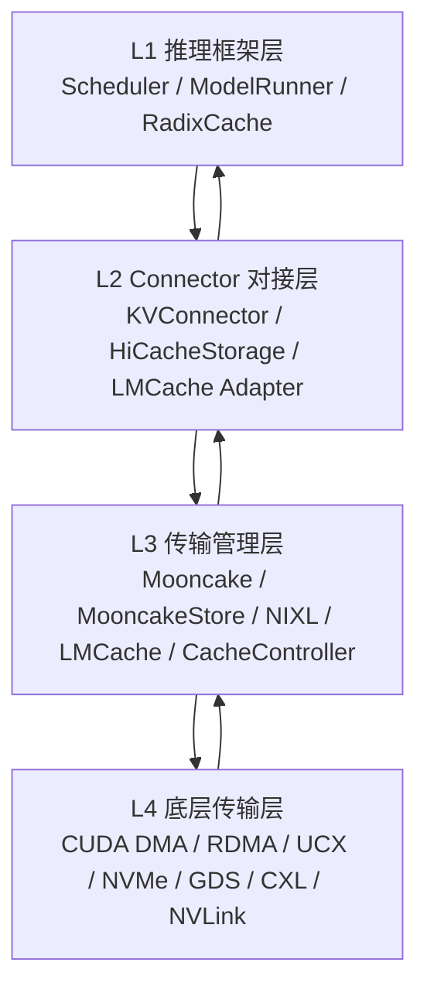
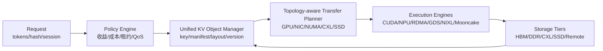

# vLLM 与 SGLang KVCache 管理、传输与未来架构推演分析报告

**报告日期**：2026-06-25  
**分析对象**：

- `D:\codes\vllm\vllm`，HEAD `3fd9d2d35714e80b4cb3fcd3c408a0398fa2525f`
- `D:\codes\sglang\sglang`，HEAD `a17753e449fb4a33070de071942da9cff1e2010e`

**核心结论**：vLLM 与 SGLang 的 KVCache 扩展路线已经明显分化。vLLM 更像“框架调度器 + Connector 可插拔传输”的架构，KVCache 外部化主要经由 `KVConnectorBase_V1`，在调度输出与模型前向之间插入 load/store。SGLang 更像“Radix/HiRadix 缓存树 + 分层缓存控制器 + 多存储后端”的架构，L1 GPU、L2 Host、L3 Storage 被整合进 prefix cache 生命周期，并通过 page 粒度的 CPU/GPU 与存储 IO 来提升复用率。面向未来 AI 集群，单点 Connector 已不足以解决 GPU/NPU、本地 DDR、本地 SSD、远端 DDR、远端 SSD 间的频繁流动问题，下一代 KVCache 系统需要演进为具备拓扑感知、介质感知、QoS 感知、租约一致性、统一内存池和主动预取能力的分布式缓存操作系统。

---

## 1. 分析范围与四层模型

本文按如下四层划分分析 KVCache 的管理与传输：

| 层次 | 名称 | 典型组件 | 主要职责 |
|---|---|---|---|
| L1 | 推理框架层 | vLLM、SGLang scheduler/model runner/cache tree | 决定何时触发 KVCache 命中查询、加载、卸载、预取、回写与释放 |
| L2 | Connector 对接层 | vLLM MooncakeConnector、MooncakeStoreConnector、NixlConnector、LMCacheConnector；SGLang HiCache storage backend、PD disaggregation connector、LMCache radix adapter | 将框架内 token/block/page 语义翻译为传输后端可理解的 key、descriptor、addr/size、session、metadata |
| L3 | 传输管理层 | Mooncake TransferEngine、MooncakeDistributedStore、NIXL agent/wrapper、LMCache daemon/adapter、SGLang CacheController | 管理远端会话、内存注册、对象存在性查询、批量 get/put、租约、后台线程、流水化与完成事件 |
| L4 | 底层传输层 | CUDA memcpy/kernel、RDMA/UCX、NVMe/GDS、文件系统、网络、PCIe/NVLink/CXL、NPU DMA | 执行实际字节迁移，负责 H2D/D2H、GPU-GPU、GPU-SSD、Host-Remote Host、Host-SSD 等数据路径 |

### 1.1 四层交互示意图



---

## 2. vLLM KVCache 管理与传输分析

### 2.1 vLLM 总体架构

vLLM v1 将 KVCache 外部化能力收敛在 `vllm/distributed/kv_transfer/kv_connector/v1/base.py` 的 `KVConnectorBase_V1`。其核心边界如下：

| 侧别 | 接口 | 作用 |
|---|---|---|
| Scheduler | `get_num_new_matched_tokens(request, num_computed_tokens)` | 在分配 GPU KV blocks 前查询外部缓存命中，返回可跳过计算的 token 数 |
| Scheduler | `update_state_after_alloc(request, blocks, num_external_tokens)` | GPU blocks 分配后，将目标 block id 绑定到即将 load 的外部缓存 |
| Scheduler | `build_connector_meta(scheduler_output)` | 将本轮 load/store/remote prefill 等元数据注入给 worker |
| Scheduler | `request_finished(request, block_ids)` | 请求完成时判断是否需要延迟释放 blocks，或触发 producer send/store |
| Worker | `bind_connector_metadata(metadata)` | 接收 scheduler 元数据 |
| Worker | `start_load_kv(forward_context)` | 在模型前向前或前向中发起加载 |
| Worker | `wait_for_layer_load(layer_name)` | 支持 layerwise load 时逐层等待 |
| Worker | `save_kv_layer(layer_name, kv_layer, attn_metadata)` | 支持 layerwise store |
| Worker | `wait_for_save()` | 前向后等待或收割保存任务 |
| Worker | `get_finished(finished_req_ids)` | 将 worker 完成状态回传 scheduler |
| Worker | `register_kv_caches(kv_caches)` | 注册本 rank 的 KV tensor 地址、布局、block size |

模型前向流程位于 `vllm/v1/worker/kv_connector_model_runner_mixin.py`。worker 将 `scheduler_output.kv_connector_metadata` 绑定到 connector，随后调用 `start_load_kv(get_forward_context())`；前向结束后调用 `wait_for_save()`、`get_finished()` 等方法。对于支持 `prefer_cross_layer_blocks` 的 connector，vLLM 会尝试将多层 KV cache 组织为跨层连续 block，从而把原本“每层每 block 多描述符”的传输压缩为“跨层 block 描述符”。

### 2.2 vLLM native OffloadingConnector

相关代码：

- `vllm/distributed/kv_transfer/kv_connector/v1/offloading_connector.py`
- `vllm/distributed/kv_transfer/kv_connector/v1/offloading/scheduler.py`
- `vllm/distributed/kv_transfer/kv_connector/v1/offloading/worker.py`
- `vllm/v1/kv_offload/base.py`
- `vllm/v1/kv_offload/cpu/spec.py`
- `vllm/v1/kv_offload/cpu/manager.py`
- `vllm/v1/kv_offload/cpu/gpu_worker.py`

#### 2.2.1 触发时机

| 动作 | 触发位置 | 触发条件 | 说明 |
|---|---|---|---|
| 命中查询 | Scheduler `get_num_new_matched_tokens` | 新请求或 chunked prefill 进入调度 | 根据 `Request.block_hashes` 查询 CPU offload manager；若 block 正在写入未完成，返回异步等待 |
| 加载 | Scheduler `update_state_after_alloc` + Worker `start_kv_transfers` | GPU blocks 已分配，且外部命中 token 可加载 | 构造 load job，将外部 CPU block 映射到本轮目标 GPU block ids |
| 卸载/保存 | Scheduler `_build_store_jobs` + Worker `prepare_store_kv/start_kv_transfers` | prefill 产生新的 offloadable blocks；默认 `offload_prompt_only=True` | store 通常延后到下一 engine step，避免阻塞当前 token 输出 |
| 防止覆盖 | Scheduler pending store 追踪 | GPU block 即将复用但仍有 in-flight store | 通过 block fence/flush 机制避免未写完即复用 |

#### 2.2.2 传输单位、大小与方式

| 维度 | 结论 |
|---|---|
| 逻辑单位 | offloaded block。可配置为多个 GPU KV block 的聚合，`block_size_factor = offloaded_block_size / gpu_block_size` |
| key 粒度 | `(block_hash, group_idx)`，兼容 attention group、sliding window、SSM 等 |
| 大小公式 | `kv_bytes_per_offloaded_block = kv_bytes_per_gpu_block * block_size_factor`；per worker CPU page size 约为 `kv_bytes_per_offloaded_block / world_size` |
| 默认配置 | `offload_prompt_only=True`；CPU 容量通过 `cpu_bytes_to_use` 配置；若未设置 offloaded block size，则通常按 GPU block size 对齐 |
| 传输方法 | `SingleDirectionOffloadingHandler.transfer_async` 将非连续 block 展开为 src/dst/size 数组，调用 `ops.swap_blocks_batch` 批量执行 |
| 并发方式 | D2H/GPU->CPU 与 H2D/CPU->GPU 分方向串行化、流上异步执行；D2H 等待 compute stream，H2D 可使用 `SRC_ACCESS_ORDER_ANY` |

vLLM native CPU offload 的关键特点是：业务层面按“prefix block 命中/保存”触发，但底层传输已尽量批处理为 `swap_blocks_batch`，避免每个 block 单独调用一次 memcpy。若跨层连续布局可用，则单个 block 传输可覆盖所有层 KV；否则需要对多层、多 region、多 block 生成更多 copy descriptors。

### 2.3 vLLM MooncakeConnector：P2P producer/consumer 传输

相关代码：`vllm/distributed/kv_transfer/kv_connector/v1/mooncake/mooncake_connector.py`

#### 2.3.1 触发时机

| 角色 | 动作 | 触发时机 |
|---|---|---|
| Consumer | remote prefill load | `kv_transfer_params.do_remote_prefill=True` 时，scheduler 在 `get_num_new_matched_tokens` 返回远端 prompt token 数 |
| Consumer | 接收目标 block 绑定 | `update_state_after_alloc` 在 GPU blocks 分配后记录本地 block ids |
| Producer | remote decode send | `do_remote_decode=True` 且请求完成，`request_finished` 收集需要发送的 block ids |
| Producer | 延迟释放 | 若仍需发送 block，`request_finished` 可返回 delay-free，防止发送前 KV 被释放 |

#### 2.3.2 传输单位、大小与方式

| 维度 | 结论 |
|---|---|
| 注册单位 | 每个 KV cache tensor/region 注册为 base pointer + region length |
| block 大小 | `block_len = cache.stride(0) * element_size`，即 KV tensor 第 0 维一个 block 的字节跨度 |
| 传输描述符 | `(src_ptr, dst_ptr, length)`；连续 block 通过 `group_concurrent_contiguous` 合并 |
| 传输方式 | Mooncake `TransferEngine.batch_transfer_sync_write(remote_session, src_ptrs, dst_ptrs, lengths)`，producer 通过 RDMA write 推送 |
| 控制面 | ZMQ/msgspec 通知传输请求、会话信息与完成状态 |

MooncakeConnector 适合 prefill/decode 分离或跨实例 KV 迁移。它的传输粒度较接近真实内存 block 地址，在连续 block 场景可合并；在非连续 block 场景则生成多个 descriptor 批量提交。

### 2.4 vLLM MooncakeStoreConnector：共享 KV 池

相关代码：

- `vllm/distributed/kv_transfer/kv_connector/v1/mooncake/store/connector.py`
- `vllm/distributed/kv_transfer/kv_connector/v1/mooncake/store/scheduler.py`
- `vllm/distributed/kv_transfer/kv_connector/v1/mooncake/store/worker.py`
- `vllm/distributed/kv_transfer/kv_connector/v1/mooncake/store/data.py`

#### 2.4.1 触发时机

| 动作 | 触发时机 | 说明 |
|---|---|---|
| lookup | Scheduler `get_num_new_matched_tokens` | 按 block hash 查询 MooncakeDistributedStore 是否已有 prefix KV |
| load | `update_state_after_alloc` 标记 `can_load=True`，worker `get_finished()` 中发起 | 设计上 `start_load_kv` 可为空，实际 I/O 由后台线程与 worker 完成回收驱动 |
| store | Scheduler `build_connector_meta` 为 scheduled new/cached reqs 构造 `ReqMeta` | 只保存 prefill/chunked 区间，decode 后续 token 通常跳过 |
| preemption | `build_connector_meta` | 处理被抢占请求，避免无效目标 blocks |

#### 2.4.2 传输单位、大小与方式

| 维度 | 结论 |
|---|---|
| key 单位 | page/block hash，对应一段 token 的 KV；`_block_size` 与 `_hash_block_size` 来自 `resolve_kv_cache_block_sizes` |
| value 单位 | 一个 key 可对应多 buffer 描述符，即多段 `(addr, size)`，取决于布局、跨层 block、K/V 拆分和 TP rank |
| put | `batch_put_from_multi_buffers(keys, addrs, sizes, replicate_config)` |
| get | `batch_get_into_multi_buffers(keys, addrs, sizes)` |
| 默认容量 | `global_segment_size` 与 `local_buffer_size` 默认均为 4 GiB；可启用 SSD offload，默认 disk staging buffer 约 1280 MiB |
| 并发模型 | 独立 sending/recving thread，支持批量 exists、批量 put/get、磁盘 offload 子批拆分 |

MooncakeStoreConnector 将 KV 从“点对点块迁移”抽象为“分布式对象池 get/put”。其优势是跨请求、跨 worker、跨节点共享；代价是命中一致性、对象生命周期、复制策略和后端容量管理更复杂。

### 2.5 vLLM NixlConnector

相关代码：

- `vllm/distributed/kv_transfer/kv_connector/v1/nixl/connector.py`
- `vllm/distributed/kv_transfer/kv_connector/v1/nixl/worker.py`
- `vllm/distributed/kv_transfer/kv_connector/v1/nixl/scheduler.py`

#### 2.5.1 触发时机

| 动作 | 触发位置 | 说明 |
|---|---|---|
| 注册 | Worker `register_kv_caches` | 按 topology 将 KV cache 切分为 NIXL memory descriptors，并注册本地 xfer handle |
| 加载 | Worker `start_load_kv` | 对 `reqs_to_recv` 构造 READ 传输，从远端 rank 拉取 KV |
| 保存 | Connector `wait_for_save` | 若启用 host buffer，会先 `save_kv_to_host`；P2P 场景主要由远端 READ 拉取 |
| 完成 | `_pop_done_transfers` | 轮询 NIXL transfer handle 状态，通知 request 完成 |

#### 2.5.2 传输单位、大小与方式

| 维度 | 结论 |
|---|---|
| 单位 | NIXL descriptor id，通常对应某个 KV region 中的 block 或 block 子片段 |
| 地址格式 | 注册时把 `(base_addr, size, memory_type)` 转为 NIXL descriptors；传输时只传 descriptor ids |
| 传输模式 | consumer pull，`make_prepped_xfer("READ", local_desc_ids, remote_desc_ids)` 后 `transfer(handle)` |
| 后端 | `nixl_backends` 默认 `["UCX"]`，可扩展 RDMA/UCX/GDS/文件或对象后端能力 |
| host buffer | `kv_buffer_device=="cpu"` 时，通过 host transfer buffer 将 device KV 与 NIXL DRAM 注册区桥接 |

NixlConnector 的特点是显式描述符注册与 READ 拉取模型。它适合把多种传输后端统一到 descriptor/xfer abstraction 之下，也更容易扩展租约、拓扑和跨后端路径选择。

### 2.6 vLLM LMCacheConnector

相关代码：`vllm/distributed/kv_transfer/kv_connector/v1/lmcache_connector.py`

vLLM 侧 LMCacheConnector 是薄适配层，实际逻辑委托给 `lmcache.integration.vllm.vllm_v1_adapter.LMCacheConnectorV1Impl` 或 native adapter。vLLM 暴露给 LMCache 的边界仍是 `KVConnectorBase_V1`，包含 scheduler 命中查询、分配后状态更新、metadata 构造、worker load/store/layerwise save/load 等。若 `use_layerwise` 启用，connector 可逐层加载，降低一次性 H2D 阻塞，但需要模型前向在每层调用 `wait_for_layer_load`。

---

## 3. SGLang KVCache 管理与传输分析

### 3.1 SGLang 总体架构

SGLang 的核心机制是 radix/prefix cache 与 HiCache 分层缓存：

- L1：GPU KV pool，服务在线 decode/prefill 的直接命中。
- L2：Host KV pool，保存被驱逐或被选择性备份的 KV。
- L3：Storage backend，可为 file、MooncakeStore、NIXL、HF3FS、AIBrix、EIC、SIMM 或 dynamic backend。

主要代码：

- `python/sglang/srt/mem_cache/hiradix_cache.py`
- `python/sglang/srt/managers/cache_controller.py`
- `python/sglang/srt/mem_cache/hicache_storage.py`
- `python/sglang/srt/mem_cache/memory_pool_host.py`
- `python/sglang/srt/mem_cache/storage/backend_factory.py`

### 3.2 HiRadixCache：业务层触发

| 动作 | 触发时机 | 说明 |
|---|---|---|
| L1 命中 | `match_prefix` | 返回 GPU resident prefix；同时识别 evicted-but-backed host hit |
| L1->L2 备份 | `_inc_hit_count` / `write_backup` | 非 write-back 模式下，当节点命中次数达到阈值，写入 host pool |
| L1 eviction 写回 | `evict` | write-back 模式中，GPU 节点驱逐前若未备份，先 D2H 备份并等待 |
| L2->L1 加载 | `init_load_back` / `load_back` / `ready_to_load_host_cache` | 找到 host-backed prefix 且长度超过阈值，分配 GPU slots 后 H2D 加载 |
| L2->L3 写入 | `_finish_write_through_ack` 后 `write_backup_storage` | Host 备份完成后异步写入 storage backend |
| L3->L2 预取 | `prefetch_from_storage` / `check_prefetch_progress` | 根据新输入 tokens 和 prefix hash 查询 storage，按策略等待、超时或 best-effort |
| L3 hit 查询 | `query_storage_hit_length` | 不加载数据，仅查询可复用 prefix 长度 |

SGLang 的触发点比 vLLM 更深入 prefix cache 生命周期：不仅在“调度一个请求前”查外部命中，也在节点命中次数、GPU 驱逐、storage prefetch 阈值和 prefetch 策略上做分层动作。

### 3.3 HiCacheController：L1/L2/L3 控制面

相关代码：`python/sglang/srt/managers/cache_controller.py`

| 接口/结构 | 功能 |
|---|---|
| `CacheOperation(host_indices, device_indices, node_id, priority)` | 描述 L1<->L2 的 token/page 索引迁移 |
| `StorageOperation(host_indices, token_ids, last_hash, hash_value, prefix_keys)` | 描述 L2<->L3 storage 写入 |
| `write(device_indices)` | 为 device token indices 分配 host slots，入队 D2H |
| `start_writing()` | 合并写队列，在 write stream 上调用 host pool `backup_from_device_all_layer` |
| `load(host_indices)` | 为 host token indices 分配 GPU slots，入队 H2D |
| `start_loading()` | 合并 load 队列，在 load stream 上逐层调用 `load_to_device_per_layer` |
| `prefetch()` | 查询 storage 命中并准备 host slots |
| `_page_transfer()` | 按 `STORAGE_BATCH_SIZE=128` page 子批执行 storage get |
| `_page_backup()` | 按 page 子批执行 storage set |

#### 3.3.1 传输单位、大小与方式

| 路径 | 传输单位 | 大小公式 | 方式 |
|---|---|---|---|
| L1 GPU -> L2 Host | token/page indices，通常按节点 value 长度 | MHA all-layer page bytes = `2 * layer_num * page_size * kv_heads_per_rank * head_dim * dtype_bytes` | host pool kernel/direct/NPU backend，D2H all layers |
| L2 Host -> L1 GPU | token/page indices，逐层加载 | per-layer page bytes = all-layer page bytes / layer_num | `load_to_device_per_layer`，每层 event 与 forward overlap |
| L2 Host -> L3 Storage | page，最多 128 page/batch | `page_size * get_size_per_token()`，或按 K/V component 拆分 | `batch_set_v1/v2`、零拷贝或 bounce buffer |
| L3 Storage -> L2 Host | page，最多 128 page/batch | 同上 | `batch_get_v1/v2`，支持 timeout/best-effort/wait-complete |

### 3.4 Host KV Pool：实际 CPU/GPU 数据搬运

相关代码：`python/sglang/srt/mem_cache/memory_pool_host.py`

MHA host pool 支持多种布局：

| 布局 | 特点 | 对传输的影响 |
|---|---|---|
| `layer_first` | 按 layer 组织，接近 GPU 计算布局 | H2D/D2H 对逐层 overlap 友好，但 L3 对象可能拆成多 layer K/V |
| `page_first` | 按 page 组织，page 内包含多层 KV | 对 storage zero-copy 友好，可用较少 descriptor 表达完整 page |
| `page_first_direct` | page-first 且直接传输 | 更适合 NIXL/Mooncake 等后端直接注册 host buffer |
| `page_head` | page/head 维度优化 | 适配特定模型与 kernel |

`load_to_device_per_layer` 负责 H2D，每次按层将 host KV 写回 device KV pool。`backup_from_device_all_layer` 负责 D2H，一次覆盖所有层。底层可通过自研 JIT kernel、`sgl_kernel.kvcacheio`、direct copy 或 NPU Ascend kernel 完成布局转换与拷贝。

### 3.5 SGLang MooncakeStore 后端

相关代码：`python/sglang/srt/mem_cache/storage/mooncake_store/mooncake_store.py`

| 维度 | 结论 |
|---|---|
| 初始化 | `MooncakeDistributedStore.setup(...)`，支持 metadata server、global segment、local buffer、protocol、device name、master server、SSD offload path |
| buffer 注册 | `store.register_buffer(ptr, size)` 注册 host pool 或 side pool buffer |
| key 粒度 | page hash；hybrid/pool v2 下会扩展为 KV、Mamba、SWA、Indexer、draft 等 component keys |
| exists | `batch_exists` 或 v2 component exists，按 all/trailing pages 策略汇总 |
| get/set | 通过 host pool `get_page_buffer_meta(host_indices)` 获得 `(ptr, size)`，再执行 zero-copy batch get/put |
| standalone storage | 可通过 Mooncake host tensor allocator 分配 store 可管理内存 |

SGLang 的 MooncakeStore 后端与 vLLM MooncakeStoreConnector 的相似点是“对象池 + 多 buffer zero-copy”；差异是 SGLang 的对象入口来自 HiCache 的 page/pool transfer，而 vLLM 的对象入口来自 scheduler 中的 block hash/load/store spec。

### 3.6 SGLang NIXL storage 后端

相关代码：`python/sglang/srt/mem_cache/storage/nixl/hicache_nixl.py`

| 维度 | 结论 |
|---|---|
| agent | 使用 `nixl_agent` 与 plugin backend，支持 FILE/OBJ 等 selector |
| zero-copy 条件 | host pool 布局为 `page_first` 或 `page_first_direct`，且 DirectIO 对齐满足要求 |
| fallback | 若 DirectIO/page alignment 不满足，退化为 page-aligned mmap bounce buffer |
| exists | 对 K/V component key 调用 `agent.query_memory` |
| get/set | `initialize_xfer(direction, host_descs, storage_descs, agent_name)`，`transfer` 后轮询完成 |
| batch | 每次最多 `STORAGE_BATCH_SIZE=128` page，经 `_batch_preprocess` 展开为 host ptr/size 与 storage desc |

NIXL 后端的优势是能把 FILE、OBJ、RDMA 等不同介质封装成统一 xfer descriptor；对 KVCache 来说，关键实现点是 host page 布局与 DirectIO/GDS 对齐，否则 bounce buffer 会引入额外内存流量。

### 3.7 SGLang LMCache 集成

相关代码：`python/sglang/srt/mem_cache/storage/lmcache/lmc_radix_cache.py`

SGLang 的 LMCache 不是 HiCacheStorage backend，而是替代 radix cache 的 `LMCRadixCache`：

| 模式 | 触发与传输 |
|---|---|
| MP | `match_prefix` 时通过 `LMCacheMPConnector.lookup_kv` 查询 daemon；`init_load_back` 分配 slots 后 `retrieve_kv(LoadMetadata)`；请求完成时 `store_kv(StoreMetadata)` |
| IP | 使用 `LMCacheLayerwiseConnector`；`start_load_kv` 后由 layer transfer counter 在前向中逐层加载 |

传输单位是 LMCache chunk/page，大小由 `lmcache_connector.chunk_size()` 决定。LMCache 的价值在于跨进程/跨实例复用与成熟缓存策略，但框架需处理 slot mapping、session 结束、stream 同步和本地 radix tree 的一致性。

---

## 4. 四层接口边界与信息格式

### 4.1 L1 -> L2：推理框架到 Connector

| 框架 | 主要接口 | 传递信息 |
|---|---|---|
| vLLM | `get_num_new_matched_tokens` | request id、prompt tokens、block hashes、num computed tokens、KV group 信息 |
| vLLM | `update_state_after_alloc` | 已分配 GPU block ids、外部命中 token 数、block hash 与 group 映射 |
| vLLM | `KVConnectorMetadata` | load/store jobs、remote session、req ids、block ids、完成状态 |
| SGLang | `match_prefix/init_load_back/prefetch_from_storage` | token ids、prefix hash、radix node id、host/device indices、page size |
| SGLang | `HiCacheStorageExtraInfo` | prefix keys、TP/PP/CP rank、pool name、hybrid pool extra info |

### 4.2 L2 -> L3：Connector 到传输管理层

| Connector | L3 调用 | 格式 |
|---|---|---|
| vLLM Offloading | CPUOffloadingManager + transfer handler | block key、src/dst block id、group size、data_ref、byte ptr array |
| vLLM Mooncake P2P | TransferEngine | remote session、src ptr list、dst ptr list、length list |
| vLLM MooncakeStore | MooncakeDistributedStore | key list、multi-buffer addr list、size list、replicate config |
| vLLM NIXL | NIXL wrapper | local/remote xfer handle、descriptor ids、READ op、notification id |
| vLLM LMCache | LMCache adapter | tokens/chunks、slot mapping、layer id、request id |
| SGLang HiCache | CacheController | host indices、device indices、node id、priority |
| SGLang MooncakeStore | MooncakeDistributedStore | page/component key、host ptr/size metadata |
| SGLang NIXL | NIXL agent | host descriptors、storage descriptors、READ/WRITE op |
| SGLang LMCache | LMCache connector | token ids、kv indices、offset、request/session id |

### 4.3 L3 -> L4：传输管理层到底层传输

| L3 | L4 能力诉求 | 典型实现 |
|---|---|---|
| CacheController | 低开销 H2D/D2H、布局转换、逐层 overlap | CUDA stream、custom kernel、NPU DMA kernel |
| Mooncake TransferEngine | 远端内存注册、RDMA write、session 管理 | RDMA/UCX/TCP，registered memory |
| MooncakeDistributedStore | 分布式对象存储、remote DDR/SSD tier、zero-copy get/put | RDMA + metadata server + optional SSD offload |
| NIXL | 多 backend descriptor xfer、文件/对象/内存统一 | UCX/RDMA/FILE/OBJ/GDS plugin |
| LMCache | chunk cache、进程间共享、可能的多级后端 | daemon、shared memory、network/storage backend |

---

## 5. vLLM 与 SGLang 对比

| 对比项 | vLLM | SGLang |
|---|---|---|
| 核心抽象 | KVConnector | HiRadixCache + HiCacheController + StorageBackend |
| 触发主线 | scheduler allocation 前后、model runner 前向前后 | prefix tree 命中、节点热度、GPU eviction、storage prefetch |
| 传输基本单位 | GPU block/offloaded block/descriptor | page/token indices，默认 storage 子批 128 page |
| 跨层优化 | `prefer_cross_layer_blocks` + uniform KV cache | `page_first/page_first_direct` host layout |
| P2P | MooncakeConnector、NIXLConnector | PD disaggregation Mooncake/NIXL connector |
| 共享存储 | MooncakeStoreConnector、LMCacheConnector | HiCacheStorage backends、LMCache radix |
| layerwise load | LMCache 与部分 connector 支持 | HiCache H2D 天然逐层，LMCache IP 逐层 |
| 主要优势 | Connector 边界清晰，便于多后端接入 | 缓存生命周期深入 prefix tree，L1/L2/L3 管理一体化 |
| 主要风险 | 多 Connector 语义差异大，策略分散 | CacheController 与 storage backend 强耦合，策略复杂度高 |

---

## 6. 面向 AI 集群的技术推演

### 6.1 场景设定

未来在线推理集群中，KVCache 需要在以下介质间频繁流动：

- GPU/NPU HBM：最低访问延迟，直接服务 attention。
- 本地 DDR/CXL memory：中等延迟，高容量，适合作为 L2。
- 本地 SSD/NVMe：高容量，适合冷 prefix、会话续接、长上下文 checkpoint。
- 远端 DDR：跨 worker 复用，适合热门系统 prompt、长会话迁移、PD 分离。
- 远端 SSD/对象存储：最低成本容量层，适合冷启动、离线预热、跨集群共享。

### 6.2 传输量需求模型

以 MHA 为例，单 rank 上一个 KV page 的字节数近似为：

```text
KV_page_bytes = 2(K,V) * num_layers * page_size_tokens
              * num_kv_heads_per_rank * head_dim * dtype_bytes
```

单次业务加载若命中 `N` 个 page，则：

```text
Load_bytes = N * KV_page_bytes
TTFT_saved_compute ≈ skipped_prefill_tokens / prefill_throughput
Net_gain = TTFT_saved_compute - transfer_latency(Load_bytes, path)
```

当 `transfer_latency` 超过被跳过 prefill compute 的收益时，外部 KV 命中反而会降低 TTFT。因此 KVCache 系统不能只看命中率，还必须看“路径收益”。

### 6.3 不同介质能力诉求

| 路径 | 关注指标 | 技术诉求 |
|---|---|---|
| HBM <-> HBM | us 级延迟、TB/s 级带宽、拓扑距离 | NVLink/NVSwitch、GPU direct P2P、descriptor coalescing |
| HBM <-> DDR | PCIe/NVLink-C2C 带宽、pinned memory、copy engine 并发 | page/block 聚合、逐层 overlap、避免小拷贝风暴 |
| HBM <-> SSD | O_DIRECT/GDS 对齐、队列深度、IO 粒度 | cuFile/GDS、4K/2M 对齐、批量大 IO、冷热分层 |
| DDR <-> remote DDR | RDMA 延迟、NIC 带宽、NUMA locality | memory registration cache、RDMA read/write 选择、租约 |
| DDR <-> remote SSD | metadata 查询开销、对象分片、尾延迟 | 批量 exists/get、异步 prefetch、Bloom/filter、本地索引 |
| NPU HBM <-> host | DMA kernel 能力、布局转换成本 | device-specific kvcacheio、page-first 标准化 |

### 6.4 业务痛点

| 痛点 | 表现 | 根因 | 优化方向 |
|---|---|---|---|
| 流量风暴 | 多请求同时加载热门 prefix，NIC/PCIe/DDR 瞬时打满 | 缺少 single-flight 与热点广播 | per-key inflight 合并、multicast/NVSwitch SHARP、local fanout |
| 小块随机传输 | 每次很多不连续 block/page，descriptor 数过多 | prefix block 分配碎片化 | contiguous allocator、defrag、跨层 page-first |
| 传输与算子互相阻塞 | H2D 抢占 copy engine，attention kernel 等待 | load/store stream 缺少 QoS | stream priority、per-layer load、copy budget |
| 存储命中无收益 | L3 命中但读取慢于重算 | 未建模收益 | cost model：compute_saved 与 transfer_cost 联合决策 |
| 元数据瓶颈 | batch_exists/metadata server 成为热点 | key 粒度太细，集中式索引 | hierarchical index、local negative cache、range hash |
| 复用率与一致性冲突 | KV 被提前释放、覆盖或读到未完成写入 | 生命周期与租约不足 | lease、epoch、write-complete fence、refcount |
| 跨框架割裂 | vLLM/SGLang/LMCache/Mooncake/NIXL 语义不一致 | 缺少统一 KV object schema | KVCache object manifest 标准化 |

### 6.5 最新技术栈的影响

公开资料显示，NVIDIA NVLink/NVLink Switch 正在强化 rack-scale GPU 间 all-to-all 高带宽互联。NVIDIA 官方 NVLink 页面列出第六代 NVLink 每 GPU 3.6 TB/s、Rubin NVL72 总聚合带宽 260 TB/s，并支持 72 GPU 全互联域。NVIDIA GDS 文档强调 GPU memory 与 storage 之间可走直接 DMA 路径，避免 CPU bounce buffer，并支持 CUDA stream 有序异步 IO。CUDA Programming Guide v13.3 仍将 Unified Memory、Virtual Memory Management、Extended GPU Memory 作为核心 CUDA feature。CXL Consortium 官网在 2026 年页面上显示 CXL 4.0 specification 已发布，带宽从 64 GT/s 提升到 128 GT/s，并增强 memory RAS。

这些技术对 KVCache 的启示如下：

| 技术 | 对 KVCache 的影响 |
|---|---|
| NVLink/NVSwitch | GPU 间 KV 复制和 PD 分离可从“跨主机网络传输”转为“rack 内 GPU fabric 复制”；适合热门 prefix fanout、decode worker 迁移 |
| GPUDirect Storage | L3 SSD 可绕过 CPU bounce buffer 直接进入 GPU memory，但要求显式 IO、对齐与较粗粒度批量传输；适合长上下文冷 KV 恢复 |
| CUDA Unified Memory / VMM | 可提供统一虚拟地址与按需迁移抽象，但 fault-driven reactive 访问对在线推理尾延迟不友好；更适合作为地址管理与大页映射能力，而非完全依赖缺页加载 |
| CXL memory | 本地/池化 DDR 可成为更大 L2，支持内存扩展与共享；但仍需软件层做热度、带宽、NUMA/CXL switch 拓扑调度 |
| NIXL/UCX/RDMA | 把远端 DDR、文件、对象存储抽象为 descriptors，有利于统一传输调度 |
| NPU DMA/异构加速器 | KVCache object schema 需要摆脱 CUDA-only 假设，显式描述 layout、dtype、head partition 与 device backend |

---

## 7. 未来高性能 KVCache 管理方式

### 7.1 总体方向：KVCache Memory OS

未来 KVCache 不应只是“框架旁路的 cache connector”，而应演进为 KVCache Memory OS：



其核心能力包括：

1. 统一 KV object schema：以 `(model_id, tokenizer_id, block_hash, layer_range, tp_rank, pp_rank, dtype, layout, page_size, quantization, version)` 描述对象。
2. 多级介质目录：每个 KV object 可同时存在于 HBM、local DDR、CXL memory、remote DDR、local SSD、remote SSD，并有 location vector。
3. 路径成本模型：动态估计每条路径的 latency、bandwidth、queue depth、failure rate、tail latency。
4. 主动预取与准入控制：只有当 `saved_compute > transfer_cost + contention_cost` 时才加载。
5. single-flight 与热点广播：同一 key 多请求并发加载时只发起一次底层 IO，然后本地 fanout。
6. QoS 感知 copy：将 KV load/store 与 attention compute、多模态前后处理、sampling、network response 分开限速。
7. 租约与一致性：KV 写入未完成前不可被 lookup 视为 ready；读者持 lease，写者持 epoch。
8. 可观测性：每个 KV object 的 hit tier、transfer path、bytes、descriptor count、stall time、TTFT delta、TPOT delta 可追踪。

### 7.2 推荐架构

| 模块 | 职责 |
|---|---|
| KV Object Manifest | 定义对象元信息、layout、分片、版本、校验和 |
| Location Directory | 维护 object 在各 tier 的位置、状态、租约、热度 |
| Policy Engine | 决策 load/store/prefetch/evict/replicate |
| Transfer Planner | 选择 Mooncake/NIXL/GDS/CUDA copy 等路径，合并 descriptors |
| Memory Pool Manager | 管理 HBM/Host/CXL/SSD staging buffer，支持跨框架配额 |
| QoS Scheduler | 控制带宽、copy engine、NIC、SSD queue 使用量 |
| Framework Adapter | 对接 vLLM KVConnector、SGLang HiCache、LMCache |
| Telemetry & Autotuner | 采集指标并自动调整 page size、batch size、tier policy |

### 7.3 策略建议

| 场景 | 建议 |
|---|---|
| 热门系统 prompt | 在 remote DDR/多 GPU HBM 做主动复制；用 single-flight 防止惊群 |
| 长上下文会话恢复 | L3 SSD/remote SSD 保存 page-first KV；恢复时按前几层/关键 prefix 分阶段加载 |
| PD 分离 | Prefill worker 产出 KV 后直接 RDMA/NVLink 推送到 decode worker；decode 侧按 layerwise wait |
| GPU 内存紧张 | GPU L1 只保 decode 活跃 window；冷 prefix 下沉到 DDR/CXL |
| 跨机迁移 | location directory 先迁移目录 lease，再异步迁移 KV；避免请求路径同步等待全量 KV |
| 多租户 | 每 tenant 配 KV budget、带宽 budget、SSD quota、TTL 与优先级 |

---

## 8. SRS 需求分析

### 8.1 L1-推理框架层需求

| ID | 需求 |
|---|---|
| L1-vLLM-REQ-001 | vLLM 应在 scheduler block allocation 前提供外部 KV 命中查询接口，输入至少包含 request id、block hashes、num computed tokens、KV group 信息，输出可跳过 token 数与是否异步等待。 |
| L1-vLLM-REQ-002 | vLLM 应在 GPU block allocation 后提供 load target binding，将外部 KV object 与本轮目标 GPU block ids 显式绑定。 |
| L1-vLLM-REQ-003 | vLLM 应对 in-flight store 的 GPU block 建立 fence，防止 block 释放或复用早于 D2H/remote store 完成。 |
| L1-vLLM-REQ-004 | vLLM 应保留并完善 cross-layer block 分配能力，使 connector 可声明偏好并获得跨层连续 KV cache。 |
| L1-vLLM-REQ-005 | vLLM 应提供 connector 级 QoS budget，包括每 step 最大 load bytes、store bytes、descriptor count 和等待时间。 |
| L1-vLLM-REQ-006 | vLLM 应将 KV load/store 对 TTFT、TPOT、stall time 的影响纳入 scheduler 反馈，支持动态禁用低收益外部命中。 |
| L1-SGLang-REQ-001 | SGLang 应继续以 HiRadixCache 作为 L1/L2/L3 触发中心，明确记录每个 radix node 的 HBM/Host/Storage 状态和 epoch。 |
| L1-SGLang-REQ-002 | SGLang 应将 `load_back_threshold`、`write_through_threshold`、prefetch threshold 从静态参数升级为基于收益模型的动态参数。 |
| L1-SGLang-REQ-003 | SGLang 应对 storage prefetch 支持 request-level cancellation，避免已失效请求继续占用 SSD/NIC/DDR 带宽。 |
| L1-SGLang-REQ-004 | SGLang 应在 scheduler 中显式暴露 KV transfer stall metrics，用于区分算子瓶颈、H2D 瓶颈和 storage 瓶颈。 |
| L1-SGLang-REQ-005 | SGLang 应统一 HiCache 与 LMCache radix 的命中、加载、保存指标，便于跨后端调优。 |

### 8.2 L2-Connector 对接层需求

| ID | 需求 |
|---|---|
| L2-KVConnector-REQ-001 | Connector 应声明自身支持的传输方向、粒度、布局、跨层 block、layerwise load、远端读写、store backend 类型。 |
| L2-KVConnector-REQ-002 | Connector metadata 应包含 object key、source location、destination block/page ids、byte size、descriptor count、deadline、priority 和 QoS class。 |
| L2-KVConnector-REQ-003 | Connector 应支持 single-flight key 合并，多个请求等待同一外部 key 时不得重复触发底层 IO。 |
| L2-MooncakeConnector-REQ-001 | Mooncake P2P connector 应对非连续 block 自动合并连续 descriptor，并输出 coalescing ratio 指标。 |
| L2-MooncakeConnector-REQ-002 | Mooncake P2P connector 应支持 producer push 与 consumer pull 两种模式，以适配 PD 分离与迁移场景。 |
| L2-MooncakeStoreConnector-REQ-001 | MooncakeStore connector 应为每次 batch_get/batch_put 输出按 tier 的命中、失败、字节数与耗时。 |
| L2-MooncakeStoreConnector-REQ-002 | MooncakeStore connector 应支持 KV object 的 TTL、replica count、tenant quota 与优先级。 |
| L2-NIXLConnector-REQ-001 | NIXL connector 应将 descriptor id 与 KV object manifest 绑定，避免不同 layout/model 混读。 |
| L2-NIXLConnector-REQ-002 | NIXL connector 应支持 backend path selection，按 UCX/RDMA/GDS/FILE/OBJ 的实时质量选择路径。 |
| L2-LMCacheConnector-REQ-001 | LMCache connector 应向框架暴露 chunk size、layerwise 支持、后端 tier、daemon backlog 与预计等待时间。 |
| L2-SGLangStorage-REQ-001 | HiCacheStorage backend 应统一 v1/v2 API 的结果语义，明确 partial hit、all hit、trailing hit 与失败重试语义。 |
| L2-SGLangStorage-REQ-002 | HiCacheStorage backend 应标准化 `PoolTransfer`，支持 KV、SWA、Mamba、draft、indexer 等 side pool 的一致 key schema。 |

### 8.3 L3-传输管理层需求

| ID | 需求 |
|---|---|
| L3-TransferManager-REQ-001 | 传输管理层应维护分层 location directory，记录每个 KV object 在 HBM、DDR、CXL、SSD、remote DDR、remote SSD 的位置与状态。 |
| L3-TransferManager-REQ-002 | 传输管理层应支持 lease/epoch/write-complete fence，防止读取未完成或过期 KV object。 |
| L3-TransferManager-REQ-003 | 传输管理层应提供异步批量接口：`batch_exists`、`batch_get`、`batch_put`、`batch_delete`、`batch_extend_lease`。 |
| L3-TransferManager-REQ-004 | 传输管理层应将小 descriptor 合并为大 IO，同时保留 page/block 级失败回滚能力。 |
| L3-TransferManager-REQ-005 | 传输管理层应实现带宽整形，分别约束 H2D、D2H、RDMA、SSD read、SSD write、metadata QPS。 |
| L3-TransferManager-REQ-006 | 传输管理层应提供路径质量指标：p50/p99 latency、effective bandwidth、queue depth、error rate、retry count。 |
| L3-Mooncake-REQ-001 | Mooncake TransferEngine 应暴露 memory registration cache 命中率和注册耗时，避免注册路径成为在线瓶颈。 |
| L3-MooncakeStore-REQ-001 | MooncakeStore 应支持对象热度驱动的 DDR/SSD tier migration 和副本放置策略。 |
| L3-NIXL-REQ-001 | NIXL agent/wrapper 应支持 descriptor 生命周期管理，自动回收失效 handle 并避免 descriptor 泄漏。 |
| L3-NIXL-REQ-002 | NIXL FILE/GDS 后端应暴露 DirectIO 对齐检查结果，并在 fallback 到 bounce buffer 时上报额外 copy bytes。 |
| L3-LMCache-REQ-001 | LMCache daemon 应支持多租户隔离、backpressure 与 request cancellation。 |
| L3-CacheController-REQ-001 | SGLang CacheController 应支持按 layer、按 page、按 request 的可取消 load/store 队列。 |
| L3-CacheController-REQ-002 | SGLang CacheController 应对 H2D 逐层 event 与 forward layer wait 做可观测化，输出每层等待时间。 |

### 8.4 L4-底层传输层需求

| ID | 需求 |
|---|---|
| L4-CUDA-REQ-001 | 底层 H2D/D2H 应使用独立 CUDA stream 与可配置 priority，并提供 copy engine 利用率指标。 |
| L4-CUDA-REQ-002 | CUDA kernel copy 路径应支持 page-first 与 layer-first 的双向布局转换，并尽量 fused copy + transpose。 |
| L4-GDS-REQ-001 | SSD 到 GPU 的直接路径应支持 O_DIRECT、buffer/offset/size 对齐校验、stream-ordered cuFile IO。 |
| L4-GDS-REQ-002 | GDS fallback 到 CPU bounce buffer 时必须向 L3 上报，供策略层降低该路径权重。 |
| L4-RDMA-REQ-001 | RDMA 路径应支持批量注册、注册缓存、remote key 生命周期管理和链路失败重试。 |
| L4-NVLink-REQ-001 | NVLink/NVSwitch 路径应被拓扑管理器建模为低延迟高带宽 GPU-GPU tier，支持 GPU 间 KV 复制与 fanout。 |
| L4-CXL-REQ-001 | CXL memory 应作为 DDR 扩展或共享池纳入 tier 模型，暴露 NUMA/CXL switch 距离、带宽与 RAS 状态。 |
| L4-NPU-REQ-001 | NPU 后端应提供等价的 page/block DMA 与布局转换接口，避免上层写死 CUDA tensor layout。 |
| L4-SSD-REQ-001 | SSD 层应支持大页聚合、队列深度控制、冷热分区、wear/latency 监控与异步取消。 |
| L4-Network-REQ-001 | 网络层应输出 per-path congestion、ECN/drop/retry 指标，并支持 KV transfer 与普通 RPC 的流量隔离。 |

---

## 9. 落地路线图

| 阶段 | 目标 | 关键工作 |
|---|---|---|
| P0 | 统一观测 | 在 vLLM/SGLang 中统一记录 KV hit tier、bytes、descriptor count、wait time、TTFT/TPOT delta |
| P1 | 单机优化 | page/block coalescing、cross-layer/page-first layout、H2D layerwise overlap、copy QoS |
| P2 | 多机共享 | MooncakeStore/NIXL/LMCache 统一 object schema、lease、single-flight、remote DDR tier |
| P3 | SSD/CXL 扩展 | GDS/NIXL FILE、CXL memory tier、SSD prefetch/cancellation、cost model |
| P4 | KVCache Memory OS | 统一 location directory、policy engine、transfer planner、multi-framework adapter |

---

## 10. 参考来源

### 10.1 本地代码

- vLLM `vllm/distributed/kv_transfer/kv_connector/v1/base.py`
- vLLM `vllm/v1/worker/kv_connector_model_runner_mixin.py`
- vLLM `vllm/distributed/kv_transfer/kv_connector/v1/offloading/*`
- vLLM `vllm/v1/kv_offload/*`
- vLLM `vllm/distributed/kv_transfer/kv_connector/v1/mooncake/*`
- vLLM `vllm/distributed/kv_transfer/kv_connector/v1/nixl/*`
- vLLM `vllm/distributed/kv_transfer/kv_connector/v1/lmcache_connector.py`
- SGLang `python/sglang/srt/mem_cache/hiradix_cache.py`
- SGLang `python/sglang/srt/managers/cache_controller.py`
- SGLang `python/sglang/srt/mem_cache/hicache_storage.py`
- SGLang `python/sglang/srt/mem_cache/memory_pool_host.py`
- SGLang `python/sglang/srt/mem_cache/storage/backend_factory.py`
- SGLang `python/sglang/srt/mem_cache/storage/mooncake_store/mooncake_store.py`
- SGLang `python/sglang/srt/mem_cache/storage/nixl/hicache_nixl.py`
- SGLang `python/sglang/srt/mem_cache/storage/lmcache/lmc_radix_cache.py`
- SGLang `python/sglang/srt/disaggregation/mooncake/conn.py`

### 10.2 公开技术资料

- NVIDIA CUDA Programming Guide v13.3, Unified Memory / VMM / Extended GPU Memory, last updated 2026-05-27: <https://docs.nvidia.com/cuda/cuda-programming-guide/index.html>
- NVIDIA GPUDirect Storage Overview Guide v1.18: <https://docs.nvidia.com/gpudirect-storage/overview-guide/index.html>
- NVIDIA NVLink and NVLink Switch official page: <https://www.nvidia.com/en-us/data-center/nvlink/>
- CXL Consortium homepage and CXL 4.0 specification download page: <https://computeexpresslink.org/> and <https://computeexpresslink.org/cxl-specification/>
