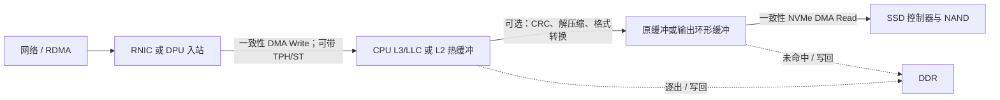
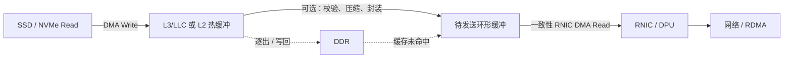

# Cache Stashing 与 DPU—SSD 直通：KVCache 落盘技术总结

> 基于本目录根目录下 5 篇讨论稿归并整理，并以标准组织、Linux 内核和厂商一手资料校核。  
> 核验日期：2026-07-31。文中“发布年份”指首次公开规范、公告或可核验产品资料的年份，不等同于所有平台的量产年份。

## 技术摘要

Cache stashing 的本质不是增加一次拷贝，而是改变 DMA 数据在一致性域内的首个落点：让刚到达的 I/O 数据优先进入 CPU 的 L2/LLC，或者让设备读取刚由 CPU 生成、仍驻留在缓存中的数据，从而减少“设备写 DDR—CPU 再读 DDR—设备再读 DDR”的往返。PCIe TPH/Steering Tag 只提供提示和目标信息；真正是否注入、注入 L2 还是 LLC，由主机 Root Complex、CPU/SoC 一致性互连及固件实现决定。

对 KVCache 落盘，选择原则可以先归纳为三句：

1. **大块、CPU 不需要查看或变换的载荷**：优先真正的 PCIe P2P、DPU 本地直通或 GPU Direct 路径；它们最有机会把主机 DDR 数据面降到 0。
2. **CPU 必须做应用 CRC、解压缩、格式转换或索引更新的载荷**：L2/L3 stashing 更有价值，因为数据本来就要被 CPU 消费；但必须切成可控的小块，而不能试图把数十 GiB KVCache 整体放进缓存。
3. **更现实的最优方案是混合路径**：描述符、队列元数据和小控制块定向到 L2；需要 CPU 处理的短生命周期数据块放 L3；大块透明载荷走 P2P；CRC 与解压缩尽量在同一硬件流水中融合。

在本文的统一模型中，以 RNIC 入站字节数为 1×、解压比为 2:1，传统冷缓冲路径在“CRC 关/开 × 解压关/开”四种组合下的主机 DDR 访存放大分别为 **2×、3×、6×、7×**；若输入和解压输出都能在 SSD DMA 读取前保持 L3 热，且仍按普通写回缓存的保守语义计算，则分别为 **1×、1×、3×、3×**。0× 只是在严格的可复用环形缓冲中，旧脏行在逐出前被完整覆盖、并且所有消费者已完成时才可能逼近的工程上限，不应当作为普通 stashing 的默认承诺。

## 1. 范围、材料与术语

### 1.1 本文使用的讨论稿

本文只使用了当前目录根目录下的以下文件，未使用任何子目录中的文档：

- [IO stash技术分析.md](./IO%20stash技术分析.md)
- [IO.md](./IO.md)
- [stash crc on off ddr write and read.md](./stash%20crc%20on%20off%20ddr%20write%20and%20read.md)
- [RDMA 机制讨论.md](./RDMA%20机制讨论.md)
- [RDMA 机制讨论 补充稿.md](./RDMA%20机制讨论%20补充稿.md)

五份稿件共同讨论了 RDMA 的 QP/WQE/CQ/Doorbell/DMA 路径、I/O cache stashing、CRC 与解压缩导致的 DDR 流量、RNIC—SSD P2P、KVCache 大小，以及 DPU/SSD 厂商方案。本文保留这些讨论的主线，但对“L3 等于 0 次 DDR”“TPH 本身保证注入”“所有零拷贝都绕过主机内存”等表述作了边界校正。

### 1.2 三个容易混淆的概念

| 概念 | 准确定义 | 不等于什么 |
|---|---|---|
| Cache stashing / cache injection | I/O Requester 通过一致性互连或 PCIe 提示，把数据优先放到指定 CPU 缓存附近 | 不是把 LLC 当作永久、可寻址的独立内存，也不自动保证不会写回 DDR |
| PCIe TPH / Steering Tag | Requester 在 TLP 中携带逐事务处理提示及平台相关目标标签 | TPH 只是可选提示；不等于主机一定支持，也不等于一定进入 L2 |
| P2P / direct / zero-copy | 两个 PCIe 设备直接交换，或不需要 CPU 执行 memcpy | “CPU-copy-free”不必然“host-memory-free”；有些零拷贝仍以主机 DDR 为 DMA 缓冲区 |

### 1.3 本文所说的 CRC

至少要区分四个保护域：

- 以太网 FCS、RoCE ICRC 等链路/传输 CRC：通常由 RNIC 处理，不要求 CPU 再扫描载荷。
- KVCache 对象或分片的应用 CRC：用于端到端对象完整性，可能要求 CPU/DPU 对整个载荷扫描。
- NVMe Protection Information（PI/DIF）：按逻辑块提供 Guard/Application/Reference Tag；NVMe 2.0 还扩展了 32/64 位 CRC。它能替代一部分块级保护，但不一定等价于应用对象 CRC，参见 [NVM Express 对 NVM Command Set 与 PI 的说明](https://nvmexpress.org/the-nvm-command-set-new-specification-features-and-more/)。
- SSD 控制器内部 ECC、NAND LDPC：属于介质内部保护，不等价于主机到应用的端到端校验。

后文主表中的“开启 CRC”特指：**CPU 对 RNIC 收到的压缩态/原始入站字节单独执行一次应用 CRC 扫描**。

## 2. Cache stashing 的发展过程

| 年份 | 里程碑 | 解决的问题 | 技术边界 |
|---:|---|---|---|
| 2008 | [PCI-SIG TLP Processing Hints ECN](https://pcisig.com/PCIExpress/ECN/Base/TLPProcessingHints) | 设备可按事务携带 Processing Hint 和 Steering Tag，让平台关联缓存或其它处理资源 | 规范明确是 optional hint；目标和具体动作由平台解释 |
| 2012 | [Intel DDIO 技术简报](https://www.intel.com/content/dam/www/public/us/en/documents/technology-briefs/data-direct-i-o-technology-brief.pdf) | 将 I/O 数据的主要源/目的地从内存推进到 Xeon LLC；设备写可 Write Allocate/Update，设备读可命中 LLC | 目标是 LLC，不是指定核心 L2；脏行仍受普通缓存替换和写回规则约束 |
| 2013 | Arm 发布 AMBA 5 CHI 基础协议 | 为多核、加速器和一致性 I/O 构建可扩展片上互连 | 初版 CHI 是基础；cache stashing 在后续 Issue B 中明确 |
| 2017 | [AMBA 5 CHI Issue B](https://developer.arm.com/community/arm-community-blogs/b/soc-design-and-simulation-blog/posts/introducing-new-amba-5-chi-protocol-enhancements) | 明确定义 I/O/加速器把关键数据放到消费 CPU 缓存附近的 cache stashing | 是 SoC 协议能力；最终缓存层级、容量和策略取决于 SoC 实现 |
| 2018 | [Linux 4.20 PCI P2PDMA](https://docs.kernel.org/4.20/driver-api/pci/p2pdma.html) | 形成绕开主机 DDR 的另一条分支：NVMe CMB、RNIC 与 nvmet 直接协作 | 这不是 stashing，而是设备到设备直通；拓扑、BAR/CMB 和驱动协同要求更高 |
| 2024—2025 | Linux 上游 TPH 框架进入实用阶段；Linux 6.13 于 2025 年发布 | 内核提供 TPH 发现、启用、获取 CPU Steering Tag、写端点 ST 表的通用 API | 仍需 CPU、BIOS/ACPI、Root Complex、端点和驱动全部支持，参见 [Linux TPH 文档](https://docs.kernel.org/PCI/tph.html) |
| 2025 | [AMD Smart Data Cache Injection（SDCI）](https://www.amd.com/content/dam/amd/en/documents/epyc-technical-docs/white-papers/58725.pdf) | 以 PCIe TPH/ST 将入站 I/O 定向到 Zen 5 指定 CCX 关联的 L2 | 当前公开的完整链路主要围绕 AMD EPYC、Solarflare NIC、sfc/Onload；不是任意 NIC 自动可用 |
| 2025 | [NVIDIA ConnectX-8 固件加入 MKey 级 TPH/ST](https://docs.nvidia.com/networking/display/connectx8firmwarev40461006/changes%2Band%2Bnew%2Bfeatures) | RNIC 可在 MKey 创建时关联 ST，补齐高性能端点侧的定向能力 | 端点只提供标签；最终是否注入及注入哪里仍取决于主机平台 |

这条演进路线可以概括为：**先有“提示标准”，再有“平台自动注入 LLC”，随后出现 SoC 原生 stash 事务，最后才逐渐形成端点、内核、BIOS 与 CPU 协同的可编程 L2 定向链路。**

## 3. 双向处理流程

### 3.1 RNIC/DPU → SSD：KVCache 落盘

完整流程如下：

1. **控制面准备**：软件建立 RDMA QP/CQ，注册并固定分块环形缓冲，创建 NVMe 队列，确定 NUMA/CCD、RX queue、CPU worker 与 NVMe queue 的亲和性。对 TPH/ST 平台，还要为目标 CPU/内存取得 Steering Tag，并编程到 RNIC 的队列、MSI-X 或 MKey 表项。
2. **网络完整性处理**：RNIC 完成以太网 FCS、RoCE ICRC、包重组和 RDMA 地址/权限检查。此阶段的硬件 CRC 不计入 CPU 载荷扫描。
3. **入站 DMA**：RNIC 对注册物理页发起 DMA Write。Intel DDIO 可自动把一致性 I/O 写分配到 LLC；AMD SDCI/支持 TPH 的平台可依据 ST 定向到某个 CCX 的 L2；Arm SoC 可通过 CHI stash 事务完成类似动作。
4. **可见性与完成**：RNIC 写入 CQE 或完成标志。消费者必须遵守 DMA 内存屏障、CQ 语义和缓冲区所有权；“收到 RNIC 完成”只表示数据到达主机一致性域，不表示 SSD 已持久化。
5. **可选处理**：CPU、DPU 或加速器执行应用 CRC、解压缩、量化反变换、元数据生成。CRC 与解压缩若能融合到一次读取中，可减少一次完整载荷扫描。
6. **NVMe 提交**：软件把最终缓冲的物理页/SG list 提交给 NVMe。SSD 的 DMA Read 必须保持 I/O 一致性；若数据仍在缓存，平台可能通过 snoop/LLC 命中供给，避免 DDR 读取。实际平台也可能先触发写回，因此必须用 IMC/LLC 计数器验证，不能只看 API 名称。
7. **持久化完成**：只有收到 NVMe 写完成，并在需要时使用 FUA/Flush 满足掉电语义，才可重用该 KVCache 分片。RNIC CQE、CPU CRC 完成和 NVMe durable completion 是三个不同事件。

若使用真正的 DPU—SSD P2P，则第 3—6 步可改为 RNIC/DPU DMA 直接进入 NVMe CMB、SSD BAR 可发布内存或 DPU 本地内存，再由 SSD 消费；主机 L2/L3 和 DDR 不进入数据面。此时仍可能发生 DPU 板载 DDR 读写，不能把“主机 DDR 为 0”误写成“系统所有内存流量为 0”。

### 3.2 SSD → RNIC：KVCache 回读或远端发送

反向流程与落盘基本对称：

1. CPU/DPU 提交 NVMe Read，SSD 从 NAND/控制器缓存取数。
2. SSD DMA Write 到主机缓冲。如果平台像 Intel DDIO 一样对该 I/O 自动分配 LLC，或 SSD/集成 NVMe 控制器本身能发 TPH/CHI stash，数据可先进入缓存；若在 AMD SDCI 平台上使用普通、不支持 TPH 的 NVMe SSD，则不能假定它会定向到 L2。
3. CPU 可在缓存中执行校验、压缩或封装。若完全不需要 CPU 处理，则这一步应跳过。
4. RNIC 对同一缓冲执行一致性 DMA Read，数据仍热时可能由缓存一致性路径供给，然后发往网络。
5. 所有设备完成后才能重用环形槽。若 SSD 不能 cache-inject、RNIC 读取前发生逐出，路径退化为 SSD 写 DDR + RNIC 读 DDR，即 2×。

真正的反向 P2P 则是 SSD/CMB → RNIC BAR 或 DMA engine → 网络，同样需要 provider、client、orchestrator 三方驱动协作。Linux 当前文档给出的典型实现正是 NVMe PCI 驱动发布 CMB、RDMA 驱动作为 client、nvmet 负责组织双向数据流，参见 [Linux PCI P2PDMA 文档](https://www.kernel.org/doc/html/latest/driver-api/pci/p2pdma.html)。

## 4. KVCache 落盘的 DDR 访存放大模型

### 4.1 口径与假设

| 符号/假设 | 定义 |
|---|---|
| `P` | RNIC/DPU 收到的入站载荷字节数；所有放大倍数以 `P` 为分母 |
| `U` | 解压后的最终写盘字节数 |
| `ρ = P/U` | 压缩比；数值示例取 `ρ = 0.5`，即 `U = 2P` |
| `A_DDR` | `(DDR Read 字节 + DDR Write 字节) / P` |
| 传统路径 | 冷缓存、RNIC 先写主机缓冲，CPU 处理，SSD 再从主机缓冲读取 |
| L3 热路径 | RNIC 写入、CPU 读取及 SSD 读取均在逐出前发生；脏数据仍按普通 write-back 语义最终写回一次 |
| 写输出 | 假设解压器按整缓存行生成新数据，未额外计算 Read For Ownership（RFO）；RFO 敏感性后文单列 |
| 忽略项 | WQE/CQE、NVMe SQ/CQ、页表和元数据相对大块载荷很小，未计入主数据放大 |

### 4.2 通用公式

| CRC | 解压缩 | 传统 DDR Write | 传统 DDR Read | 传统总量与放大 | L3 热、正常写回的总量与放大 |
|---|---|---:|---:|---:|---:|
| 关 | 关 | `P` | `P`（SSD） | `2P`，`A=2` | `P`，`A=1` |
| 开 | 关 | `P` | `P`（CRC）+ `P`（SSD） | `3P`，`A=3` | `P`，`A=1` |
| 关 | 开 | `P + U` | `P`（解压）+ `U`（SSD） | `2P + 2U`，`A=2+2/ρ` | `P+U`，`A=1+1/ρ` |
| 开 | 开 | `P + U` | `P`（CRC）+ `P`（解压）+ `U`（SSD） | `3P + 2U`，`A=3+2/ρ` | `P+U`，`A=1+1/ρ` |

解释：

- 不解压时，传统路径至少包含 RNIC 写一次和 SSD 读一次，因此是 2×；单独 CPU CRC 再增加一次读，成为 3×。
- 解压时，压缩态输入要写、读各一次，解压态输出也要写、读各一次，因此在 2:1 解压下是 `2P + 2(2P) = 6P`；独立 CRC 再加 `P`，成为 7×。
- 热 L3 路径消除了 CPU 与 SSD 的 DDR 读取，但普通写回缓存最终仍可能把输入脏行 `P`、输出脏行 `U` 各写回一次，因此不是天然 0×。

### 4.3 1 GiB 入站、2:1 解压的详细计算

取 `P=1 GiB`；开启解压时 `U=2 GiB`。

| CRC | 解压 | 传统 DDR Write | 传统 DDR Read | 传统总量 / 放大 | L3 热且输出也热：Write / Read / 总量 / 放大 | 相对传统节省 | 仅输入热、输出在 SSD 读前已冷 | 冷缓存退化 | 严格瞬态环形理想值 |
|---|---|---:|---:|---:|---:|---:|---:|---:|---:|
| 关 | 关 | 1 GiB | 1 GiB | 2 GiB / **2×** | 1 / 0 / 1 GiB / **1×** | 50.0% | 不适用 | **2×** | 可逼近 **0×** |
| 开 | 关 | 1 GiB | 2 GiB | 3 GiB / **3×** | 1 / 0 / 1 GiB / **1×** | 66.7% | 不适用 | **3×** | 可逼近 **0×** |
| 关 | 开 | 3 GiB | 3 GiB | 6 GiB / **6×** | 3 / 0 / 3 GiB / **3×** | 50.0% | 3 GiB 写 + 2 GiB 读 = **5×** | **6×** | 可逼近 **0×** |
| 开 | 开 | 3 GiB | 4 GiB | 7 GiB / **7×** | 3 / 0 / 3 GiB / **3×** | 57.1% | 3 GiB 写 + 2 GiB 读 = **5×** | **7×** | 可逼近 **0×** |

表中四种结果代表四个不同工程状态：

- **L3 热且正常写回**：CPU/NVMe 的读取都命中缓存，但每个脏字节以后仍写回一次；这是本文用来比较“stashing 前后”的主口径。
- **仅输入热、输出冷**：解压输出流太大或 SSD 启动太晚，输出先写回 DDR、随后又被 SSD 读取，因此两种解压场景都是 5×。
- **冷缓存退化**：CPU 或 SSD 消费之前输入也被逐出，回到 2×/3×/6×/7×。
- **严格瞬态环形理想值**：缓冲槽在所有消费者完成后，被下一批数据逐行完整覆盖，而且旧脏行尚未逐出；旧内容没有持久化到 DDR 的语义需求，才可能长期逼近 0×。普通 `free()`、换页或缓存逐出不会自动满足这个条件。

### 4.4 以 20 GiB KVCache 块为例

以 Llama-3-70B 风格的 GQA 参数做容量示例：80 层、8 个 KV heads、head dimension 128、FP16，则每 token KVCache 为：

`2(K/V) × 80 × 8 × 128 × 2 Byte = 327,680 Byte = 320 KiB/token`

batch 16、每序列 4096 token 时，总量恰为：

`320 KiB × 16 × 4096 = 20 GiB`

下表中的 2:1 压缩仅用于展示计算，不代表某种 KVCache 压缩算法的实测保证。

| 网络/落盘表示 | CRC | `P` 入站 | `U` 写盘 | 传统主机 DDR | L3 热、正常写回 | 仅输入热、输出冷 | 严格瞬态理想值 |
|---|---|---:|---:|---:|---:|---:|---:|
| 未压缩入站，原样写盘 | 关 | 20 GiB | 20 GiB | 40 GiB（2×） | 20 GiB（1×） | — | 可逼近 0 |
| 未压缩入站，原样写盘 | 开 | 20 GiB | 20 GiB | 60 GiB（3×） | 20 GiB（1×） | — | 可逼近 0 |
| 2:1 压缩入站，压缩态原样写盘 | 关 | 10 GiB | 10 GiB | 20 GiB（2×） | 10 GiB（1×） | — | 可逼近 0 |
| 2:1 压缩入站，压缩态原样写盘 | 开 | 10 GiB | 10 GiB | 30 GiB（3×） | 10 GiB（1×） | — | 可逼近 0 |
| 2:1 压缩入站，解压后写 20 GiB | 关 | 10 GiB | 20 GiB | 60 GiB（6×） | 30 GiB（3×） | 50 GiB（5×） | 可逼近 0 |
| 2:1 压缩入站，解压后写 20 GiB | 开，独立扫描 | 10 GiB | 20 GiB | 70 GiB（7×） | 30 GiB（3×） | 50 GiB（5×） | 可逼近 0 |
| 2:1 压缩入站，解压时融合 CRC | 开，融合 | 10 GiB | 20 GiB | 60 GiB（6×） | 30 GiB（3×） | 50 GiB（5×） | 可逼近 0 |

这个例子也说明：20 GiB 不是 L3 容量问题，而是**流式窗口问题**。假设可用于 I/O 的有效缓存窗口是 64 MiB，单路输入为 50 GB/s，理论驻留时间只有约 `64 MiB / 50 GB/s ≈ 1.34 ms`；多队列、解压后的扩张流和其它核心竞争还会继续缩短它。工程约束应写成：

`输入在途字节 + 输出在途字节 + 竞争余量 < 可用 stash cache 容量`

而不是“KVCache 总量小于 LLC”。

### 4.5 CRC、融合与 RFO 的敏感性

| 情形 | 传统路径额外主机 DDR 流量 | 热 L3 路径 | 说明 |
|---|---:|---:|---|
| RNIC 完成 FCS/RoCE ICRC | 0 | 0 | 网络硬件完成，不应再计一次 CPU 扫描 |
| CPU 独立 CRC 压缩态输入 | `+P` 读 | 通常 0 次 DDR 读 | 主表采用此口径 |
| CPU 独立 CRC 解压态输出 | `+U` 读 | 输出仍热时通常 0 次 DDR 读 | 若 CRC 发生得太晚，可能从 DDR 读 `U` |
| 解压缩硬件同时产出 CRC | 0 个额外完整扫描 | 0 | NVIDIA DOCA Compress 的解压任务可返回 CRC；类似融合是优先方向，参见 [DOCA Compress](https://docs.nvidia.com/doca/archive/3-1-0/doca%2Bcompress/index.html) |
| SSD/NVMe PI 硬件校验 | 0 个 CPU 完整扫描 | 0 | 只在保护域、块格式和端到端语义与应用需求一致时可替代应用 CRC |

若 CPU 对全新的解压输出缓冲使用普通 write-allocate store，且平台不能合并整行写，可能发生 `U` 字节的 RFO 读取。对 `ρ=0.5`，这会给所有解压行再增加 2×：传统 6×/7× 变成 8×/9×，热 L3 的 3× 变成 5×。应使用整缓存行输出、预清零/已驻留 ring、合适的 non-temporal store 或硬件解压器，并用 IMC Read 计数器确认。

## 5. Cache stashing 的完整软硬件依赖

### 5.1 硬件依赖

| 层次 | 必要能力 | 关键检查 |
|---|---|---|
| CPU/SoC 一致性域 | Intel DDIO、AMD SDCI 或 Arm CHI stash 等真实 cache injection 能力 | 明确目标是 LLC、L2 还是 system cache；确认 DMA Write/Read 的一致性语义 |
| PCIe Root Complex/Host Bridge | 能解析或正确转发 TPH/ST；设备间 P2P 时能在目标拓扑中路由 TLP | TPH Capability、ACS 设置、Root Port 层级、跨 Host Bridge 是否在 allowlist |
| RNIC/DPU 端点 | 支持一致性 DMA；定向 L2 时需要 TPH/ST 与可编程队列/MKey/中断映射 | 端点 capability、固件版本、每 RX queue/MKey 的 ST，禁止错误使用 No-Snoop |
| SSD/NVMe 控制器 | 能从主机一致性地址读取；反向 stashing 还要求 SSD 或集成控制器能 cache-inject | 普通 SSD 往往没有可编程 ST；不要假定 AMD SDCI 会自动覆盖任意 NVMe 设备 |
| Cache/内存系统 | 足够的短时有效 cache 容量、可观测的替换行为、同 NUMA/CCD 本地性 | LLC/L2 占用、I/O way/配额、内存带宽、跨 socket/CCD 流量、缓存污染 |
| P2P 专用资源 | NVMe CMB、可发布的 PCI BAR/DMABUF，或 DPU 自有 PCIe Root Complex 与 DMA engine | provider memory 的容量/对齐、CPU 不得直接 memcpy MMIO、热拔插撤销流程 |
| 可选变换加速器 | DPU 压缩/CRC、Intel IAA/DSA/QAT、FPGA/SmartSSD | 算法兼容性、输入输出位置、是否能把 CRC 与解压融合、是否引入新的本地 DRAM 放大 |
| RAS 与持久化 | PCIe AER、IOMMU 隔离、NVMe PI、SSD PLP、FUA/Flush | cache completion 不等于 durable completion；故障恢复必须按 NVMe 语义设计 |

### 5.2 软件依赖

| 层次 | 必要能力 | 典型实现/检查 |
|---|---|---|
| BIOS/固件/ACPI | 开启 DDIO/SDCI/TPH；向 OS 提供平台相关 ST | AMD SDCI 需要较新 BIOS；Linux 通过 PCI Firmware `_DSM` 获取 CPU ST |
| Linux 内核 | TPH、IOMMU/DMA、P2PDMA、DMABUF、NVMe/RDMA 支持 | AMD 公布的 SDCI 栈要求 Linux 6.13+ 或回移补丁、`CONFIG_PCIE_TPH=y`；P2P 需内核判断拓扑兼容 |
| RNIC/DPU 驱动 | 启用 TPH、将 ST 写入端点、维护 queue/MKey 与 CPU affinity | AMD Solarflare `sfc`/Onload；NVIDIA mlx5/ConnectX 固件；错误驱动只会得到普通 DMA |
| RDMA 栈 | MR 注册、页固定、SG list、QP/CQ、完成与内存屏障 | 缓冲物理页必须在预期 NUMA 节点；完成后再交给 CRC/解压/NVMe 阶段 |
| 存储栈 | O_DIRECT、NVMe queue、SPDK 或合适的内核 block path；P2P 时能接受特殊页 | Linux P2PDMA 的 provider/client/orchestrator；并非所有 `read/write`、O_DIRECT 或文件系统都接受 P2P MMIO 页 |
| 应用数据面 | 分块 ring、双/多缓冲、引用计数、超时、背压和故障回退 | 一个槽只有在 RNIC、CPU/DPU 变换、NVMe 完成全部结束后才能覆盖；理想 0× 依赖这一生命周期 |
| CPU/队列亲和性 | RX queue、IRQ、worker、NVMe queue 与目标 cache/CCD 对齐 | AMD 文档要求尽量在同一 CCD 读取；跨 NUMA 会降低命中并增加互连流量 |
| CRC/解压库 | 能选择 CPU、DPU 或硬件路径并报告算法/结果 | DOCA Compress、Intel QPL/IAA、Intel DML/DSA 或自研 SIMD；应支持 CRC 与解压融合 |
| 可观测性 | 能测量 LLC/L2 命中、IMC 读写、写回、PCIe 与 DPU 本地 DRAM | Intel 提供 DDIO/CHA/IMC PMU 指南；上线前必须用硬件计数器证明，而不是用 CPU 利用率推断 |
| 安全与多租户 | IOMMU/SR-IOV 隔离、缓存 QoS、side-channel 与 DoS 控制 | stashing 会改变共享缓存占用；P2P 会扩大设备可 DMA 的地址域，二者都要做租户隔离 |

[AMD Onload SDCI 要求](https://docs.amd.com/r/en-US/ug1586-onload-user/Requirements)公开列出了 Zen 5+、BIOS、Linux 6.13+、`CONFIG_PCIE_TPH`、支持版本的 Solarflare 驱动和 Onload/ef_vi；这是目前最清晰的端到端依赖清单之一。[Linux TPH 文档](https://docs.kernel.org/PCI/tph.html)也明确指出：内核只负责发现，驱动必须主动启用并把 ST 编程到设备。

## 6. 厂商在 cache stashing 上的软硬件布局

下表只列公开一手资料能确认的能力。未公开不代表芯片内部绝对没有类似功能，但不能据此承诺端到端可用。

| 厂商/标准 | 首次公开年份 | 硬件布局 | 软件/固件布局 | 当前成熟度与边界 |
|---|---:|---|---|---|
| [PCI-SIG TPH](https://pcisig.com/PCIExpress/ECN/Base/TLPProcessingHints) | 2008 | PCIe Requester 在 TLP 中携带 PH/ST；Root Complex 可关联缓存或其它系统资源 | 端点 capability、ST table；平台固件定义 ST | 行业基础协议；只是提示，不保证 cache injection |
| [Intel DDIO](https://www.intel.com/content/www/us/en/developer/articles/technical/ddio-analysis-performance-monitoring.html) | 2012 | Xeon IIO/CHA/LLC 一致性路径；入站 DMA 可分配 LLC，出站 DMA Read 可由缓存供给 | 对软件透明、默认启用为主；通过 uncore PMU、NUMA/IRQ 亲和性调优 | 大规模成熟；目标是 LLC，不提供通用的“指定核心 L2”语义；旧资料中的固定 10% LLC 不能直接外推到所有新代 Xeon |
| [Arm AMBA 5 CHI Issue B](https://developer.arm.com/community/arm-community-blogs/b/soc-design-and-simulation-blog/posts/introducing-new-amba-5-chi-protocol-enhancements) | 2017 | Request Node、Home Node、CPU cache/system cache 之间的原生一致性 stash 事务 | SoC 固件、驱动和队列需要选择目标节点/处理单元；实现由 SoC 厂商决定 | 协议完整、产品实现分散；适合集成 DPU/SSD 控制器的 Arm SoC，不等于所有 Arm 服务器的外接 PCIe 设备自动支持 |
| [AMD SDCI](https://www.amd.com/content/dam/amd/en/documents/epyc-technical-docs/white-papers/58725.pdf) | 2025 | Zen 5+ EPYC；PCIe TPH/ST 把 RX 写定向到指定 CCX 关联 L2；No-ST 模式只更新已存在缓存行 | BIOS；Linux 6.13+；`CONFIG_PCIE_TPH`；Solarflare `sfc`；Onload/ef_vi 9.1+；`EF_TPH_MODE` | 当前公开链路最接近“可编程 RNIC→L2”；效果依赖同 CCD、及时读取和未被逐出，参见 [SDCI Modes](https://docs.amd.com/r/en-US/ug1586-onload-user/SDCI-Modes) |
| [NVIDIA ConnectX-8 TPH/ST](https://docs.nvidia.com/networking/display/connectx8firmwarev40461006/changes%2Band%2Bnew%2Bfeatures) | 2025 | ConnectX-8/SuperNIC 端点可在 MKey 创建时关联 TPH/ST，ST index 指向含实际 ST 的 MSI-X entry | 对应固件、MKey/verbs/驱动配置；需与主机 TPH API、IRQ affinity 协同 | 已公开端点侧能力；它本身不决定落入 Intel LLC、AMD L2 还是被主机忽略，必须做平台组合验证 |
| Linux 通用 TPH 框架 | 2025（Linux 6.13） | 无新增芯片；连接支持 TPH 的主机与端点 | `pcie_enable_tph()`、`pcie_tph_get_cpu_st()`、`pcie_tph_set_st_entry()` | 生态使能层；不是独立硬件产品，也不能弥补不支持 TPH 的 BIOS/Root Complex/端点 |

## 7. 厂商在 DPU—SSD 直通上的软硬件布局

“直通”至少分为三类：A）真实 PCIe endpoint-to-endpoint P2P；B）DPU 自身拥有 NVMe/PCIe Root Complex，在存储 target 内部转发；C）DPU 向主机模拟 NVMe、后端走 NVMe-oF。只有 A/B 能较有把握地声明存储数据面不经过主机 DDR；C 通常能卸载主机 CPU，但是否绕过主机内存取决于具体数据缓冲位置。

| 厂商/方案 | 公开年份 | 硬件布局 | 软件布局 | 直通类型与主机 DDR 判断 | 主要边界 |
|---|---:|---|---|---|---|
| [AWS Nitro](https://docs.aws.amazon.com/whitepapers/latest/security-design-of-aws-nitro-system/the-components-of-the-nitro-system.html) | 2017 | 独立 Nitro Card for VPC/EBS/Local NVMe，定制 SoC、PCIe SR-IOV、硬件加密 | AWS 固件、Nitro Hypervisor、EBS/ENA/NVMe 接口 | 封闭的 B/C 类系统级卸载；主机 CPU 控制面和软件 bounce 被显著移除 | 不是客户可采购并自由编程的通用 DPU—SSD P2P 方案；AWS C5 从 2017 年起采用完整 Nitro 架构 |
| [Linux PCI P2PDMA](https://www.kernel.org/doc/html/latest/driver-api/pci/p2pdma.html) | 2018 | NVMe CMB/BAR 作为 provider，RNIC 为 client；同 Root Port/已知可用 Host Bridge | NVMe PCI + RDMA + nvmet 作为 provider/client/orchestrator，或 DMABUF 路径 | A 类；正确实现时主机 DDR 数据面可为 0 | CMB 容量与 SSD 支持有限；CPU 不能把 P2P MMIO 当普通内存 memcpy；跨 Root Port 默认可能被阻断 |
| [Broadcom Stingray PS1100R](https://www.broadcom.com/company/news/product-releases/40966) | 2018 | 100G NIC、8×Arm A72、PCIe Gen3、板载 DDR、crypto/RAID/dedup；JBOF 内通过 PCIe switch 接 NVMe | NVMe-oF RoCEv2/NVMe-TCP target、SPDK 与厂商存储软件；[官方性能白皮书](https://docs.broadcom.com/doc/broadcom-stingray-100G-NVMe-oF-performance)展示 Stingray+PCIe switch+NVMe | B 类存储 target；远端数据进入 target 后无需目标 x86 主机 DDR | 较早且成熟，但代际带宽较旧；可能使用 Stingray 板载 DDR，主机 DDR 为 0 不代表板上内存为 0 |
| [NVIDIA BlueField-3 + DOCA STA/SNAP](https://docs.nvidia.com/doca/archive/3-0-0/DOCA%2BSTA/) | BlueField-3：2021；STA：2025 | 400G DPU、Arm 核、DPA、板载 DDR、PCIe Gen5；可与直连 NVMe 建 P2P topology；自托管平台可挂多块 SSD | DOCA STA、DPA、SPDK/NVMe-oF target；SNAP 提供 NVMe/virtio-blk 仿真 | STA 是明确的 A/B 类；正确拓扑时主机 DDR 可为 0；SNAP 的“零拷贝”则要逐 backend 判断 | STA 公开文档要求专用 patched P2P kernel 或支持 P2P 的 BFB/DOCA 版本；非 offload 命令仍回应用层 |
| [Marvell OCTEON 10](https://www.marvell.com/content/dam/marvell/en/public-collateral/embedded-processors/marvell-octeon-10-dpu-platform-product-brief.pdf) | 2021 | Arm Neoverse N2、DDR5、PCIe Gen5、多 DMA/crypto/packet accelerators | SDK、DPDK、VPP、SPDK、KVM/容器 | 具备构建 B 类直通 target 的硬件积木 | 公开材料未给出像 DOCA STA 那样的通用、可核验 RNIC↔NVMe P2P 成品链路；需 OEM/客户集成，不能默认 0× |
| [Intel Mount Evans / IPU E2000](https://download.intel.com/newsroom/2022/corporate/vision/Intel-IPU-Roadmap-Fact-Sheet.pdf) | 2022 | 200G ASIC IPU，硬件 NVMe 仿真、可编程 packet engine、QAT crypto/compression | IPDK 22.07、SPDK、DPDK、P4；[Virtual Block Storage](https://ipdk.io/documentation/Recipes/VirtualBlockStorage/)支持 NVMe/virtio 与 NVMe-TCP/RDMA 后端 | 主要是 C 类 NVMe 仿真/远端存储卸载；可免主机 CPU 存储栈，但公开资料不足以把所有路径都标为 host-DDR-free | 后端、vDPA、host buffer 与具体 IPU 固件决定数据落点；“虚拟盘本地化”不等于 SSD endpoint P2P |
| [AMD Pensando Salina](https://www.amd.com/content/dam/amd/en/documents/pensando-technical-docs/product-briefs/pensando-salina-product-brief.pdf) | 2024 公告；2025 计划可用 | 400G、PCIe Gen5、P4 pipeline、Arm cores、DDR5；可模拟 NVMe VF，并带 AES-XTS、digest/存储服务加速 | PCIe NVMe 命令在 DPU 终止并转换为 NVMe/TCP；标准 inbox NVMe 驱动；2026 年 AMD 已公开强调 DPU-managed NVMe 扩展 KVCache | 主要是 C 类；对 CPU offload 很强，但公开资料没有证明所有 KVCache 数据都绕过 host/GPU memory | [AMD 2026 AI networking](https://www.amd.com/en/blogs/2026/ai-networking-built-for-scale.html)给出 KVCache 方向，但完整 P2P 拓扑、API 和 DDR 计数仍需产品验证 |

## 8. KVCache 场景：DPU—SSD 直通与 L2/L3 stashing 对比

| 维度 | DPU—SSD 真直通/P2P | Cache stashing 到 L2/L3 |
|---|---|---|
| 主机 DDR 放大 | 理想且真实 P2P 时为 **0×**；但可能转移为 DPU 板载 DDR 放大 | 热、正常写回时通常仍有 1× 或 `1+1/ρ`；严格环形才可能逼近 0×；冷时退化 |
| CPU 是否能处理载荷 | CPU 看不到 P2P MMIO/设备内存，或不能安全当普通 RAM 使用；若要 CPU CRC/解压，需回读或转移到 DPU/SSD 加速器 | 强项；CPU 可直接在缓存里 CRC、解压、解析和更新元数据 |
| CRC/解压 | 最适合在 DPU/SSD 硬件中融合；若设备不支持算法，直通优势会被回拷打破 | 可用成熟 CPU SIMD/IAA/DSA；热缓存能减少读流量，但解压输出膨胀仍占缓存 |
| 数据规模 | 适合数 MiB—数十 GiB 的连续大载荷，不占主机 cache | 只能覆盖短时流式窗口；L2 更适合描述符/头部，L3 适合有界 chunk，不适合整个 20 GiB 对象 |
| 拓扑要求 | 高：同 PCIe switch/root hierarchy、ACS/IOMMU、provider BAR/CMB、驱动协作 | 中：需要支持注入的 CPU/SoC、Root Complex 和端点；不必要求 SSD 暴露 P2P 内存 |
| 软件复杂度 | 高：provider/client/orchestrator、热拔插撤销、特殊页、SPDK/DOCA/厂商栈 | 中：标准主机内存语义较容易接入，但需要亲和性、ring 生命周期、TPH 配置与 PMU 验证 |
| 延迟与抖动 | 少一层主机缓存/DDR，稳定性通常更好；小 I/O 仍受队列、doorbell 和固件影响 | 命中时延迟低；缓存竞争、逐出和跨 NUMA 会带来尾延迟抖动 |
| 缓存污染 | 不污染主机 LLC/L2 | 高吞吐流可能挤压应用工作集；必须限额、分块、动态回退 |
| 隔离与安全 | IOMMU/P2P 地址域、设备固件和多租户撤销更复杂 | 共享 cache side-channel/DoS 风险更明显，但主机内存管理模型更成熟 |
| 持久化语义 | 仍必须等 NVMe durable completion/FUA/Flush | 同样必须；缓存命中不提供持久性 |
| 最适工作负载 | 大块、原样、CPU 不触碰；或 DPU 已具备全部变换能力 | CPU 必须立即消费；小块/中块、控制面密集、可在缓存驻留时间内完成 |

对 KVCache 最重要的判断不是“哪项技术绝对更快”，而是**写盘前谁必须触碰数据**：

- 如果 KVCache 已在 GPU/HBM 中形成、只需原样持久化，先把它拉到 RNIC 再放主机 L3 通常不是最短路径；GPU—SSD direct 更合理。
- 如果网络传来的是压缩 KVCache，而 SSD 要保存解压格式，CPU/DPU 必须生成 `U`；此时 stashing 或 DPU 硬件解压比纯 P2P 更合适。
- 如果 SSD 可以保存压缩态，延迟解压到回读时，则网络、PCIe、SSD 写入和 DDR 压力都会按压缩比下降；这往往比微调 cache hit 更有数量级价值。
- 如果算法必须由 CPU 执行，则把 input chunk 定向 L2/L3、解压 output 立刻交给 NVMe，是合理中间态；如果 DPU 支持相同算法与 CRC，迁移到 DPU 并接 P2P 通常更优。

## 9. 其它值得考虑的 KVCache 传输加速方案

| 方案 | 核心价值 | 适用条件与限制 |
|---|---|---|
| [NVIDIA GPUDirect Storage](https://docs.nvidia.com/gpudirect-storage/overview-guide/index.html) | NVMe 或存储 NIC 的 DMA engine 直接读写 GPU memory，绕过 CPU bounce buffer | KVCache 本来就在 GPU 时优先级很高；需要支持的 GPU、驱动、文件系统/O_DIRECT、PCIe 拓扑；兼容模式会退回主机内存 |
| DPU 上融合解压 + CRC + NVMe 写 | 一次读取同时完成变换和校验，随后直接写 SSD；避免 CPU 和主机 DDR | 算法必须匹配硬件。DOCA Compress 支持硬件 Deflate/LZ4 解压并产出 CRC；其它 DPU 能力需逐型号确认 |
| CPU 内建加速器 | [Intel IAA/QPL](https://www.intel.com/content/www/us/en/developer/tools/query-processing-library/overview.html)可做 Deflate/Huffman 与 CRC-64；[Intel DSA](https://www.intel.com/content/www/us/en/products/details/processors/xeon/features/data-streaming-accelerator.html)可做 CRC/DIF 与 copy | 减 CPU cycles，不天然消除 DDR；只有与热缓存、融合操作、NUMA 亲和性结合才会降低内存流量 |
| Computational Storage / SmartSSD | 在 SSD 侧做解压、过滤、校验或格式处理，减少 CPU/GPU/RAM 往返 | 算法开发和可移植性成本高；[Samsung 第二代 SmartSSD（2022）](https://news.samsung.com/us/samsung-electronics-develops-second-generation-smartssd-computational-storage-drive-upgraded)是公开案例 |
| 压缩态持久化与 KV 量化 | 同时减少网络、PCIe、DDR、SSD 写量和介质写放大 | 要评估回读延迟、随机访问、精度损失、分块索引和模型兼容；通常是系统收益最大的算法路径之一 |
| SPDK/用户态 NVMe、io_uring 注册缓冲 | 减少 syscall、上下文切换、block stack 和额外 memcpy；提高批处理与队列并行 | “零拷贝”可能仍以主机 DDR 为共享缓冲；要与 stashing/P2P 分开计账 |
| CXL.mem 扩展/池化内存 | 将 KVCache 的容量层从昂贵 DDR/HBM 扩展到可池化内存；CXL 2.0 已定义 memory pooling | 解决容量与共享，不等于 SSD 直通；延迟、带宽和一致性仍高于 CPU cache，参见 [CXL Consortium 说明](https://computeexpresslink.org/blog/compute-express-link-cxl-2-0-specification-memory-pooling-questions-from-the-webinar-part-1-2389/) |
| NVMe PI 与设备内 Copy | 用块级硬件保护替代一部分 CPU CRC；设备内部 Copy 避免“读到主机再写回” | 只适合保护域/复制语义吻合的场景；不能自动替代跨网络的应用对象校验 |
| 分级动态路由 | 小元数据→L2，需 CPU 变换的 chunk→L3，大透明 payload→P2P，跨 Root 不支持时→DDR fallback | 需要运行时监测 cache 压力、队列延迟、P2P topology 和变换能力，但最符合真实混合流量 |

## 10. 推荐的混合架构

建议把数据面拆成四条可选择的路径，而不是只实现一个全局开关：

| 判定条件 | 推荐路径 | 原因 |
|---|---|---|
| CPU 不触碰，DPU/SSD 支持同表示 | DPU—SSD P2P | 主机 DDR 可为 0，避免 cache 污染 |
| KVCache 起点/终点是 GPU，CPU 不触碰 | GPUDirect RDMA/GDS | 避免 GPU→主机→SSD 的额外一跳 |
| CPU 必须 CRC/解析，数据块很小 | 定向 L2 stashing | 最低 CPU 首次访问延迟，适合 header、descriptor、index |
| CPU 必须解压/格式变换，中等 chunk | L3 stashing + 流式双环 | 容量大于 L2、仍可减少 input/output 的 DDR 读取 |
| DPU 能融合解压与 CRC | DPU 变换 + P2P 到 SSD | 同时获得 CPU offload 与 host-memory-free 数据面 |
| P2P/TPH 不受支持或缓存压力过高 | 明确的 DDR fallback | 先保证正确性、可持久化和可观测性，避免静默性能退化 |

一个实用的数据分层是：

- **L2**：CQE、WQE shadow、KV 索引、对象头、校验元数据和短控制消息。
- **L3/LLC**：几百 KiB 到数 MiB 的可及时消费 chunk；大小应由测得的驻留时间动态限制。
- **P2P/DPU 本地内存**：大块、无需 CPU 读取的 KV payload。
- **DDR/CXL tier**：回退、排队吸收和跨设备共享，不把它伪装成零拷贝。

## 11. 讨论稿中几个观点的统一结论

1. **“L3 stashing 后 DDR=0×”只能作为严格条件下的上限。**普通 write-back cache 的脏行最终可能写回；本文的主比较采用 1×/3×保守值，并另列 0×理想 ring。
2. **Intel DDIO 是 LLC 技术，不是任意目标 L2。**当前公开的可编程 L2 定向代表是 AMD SDCI + TPH/ST；Arm CHI 能表达 stash，但产品行为由 SoC 定义。
3. **TPH 是提示，不是数据注入引擎。**端点、BIOS/ACPI、Root Complex、CPU 和驱动必须全部连通，主机可以不采纳提示。
4. **P2P 不能只用“同一 CPU 插槽”判断。**Linux 需要 provider、client、orchestrator，并检查 Root Port/Host Bridge、ACS、BAR/CMB、IOMMU 和驱动生命周期。
5. **零拷贝必须注明口径。**CPU 不执行 memcpy、数据仍进 host DDR，与真正绕过 host memory 是两回事。
6. **完成不等于持久化。**RNIC CQE 只证明入站 DMA 完成；SSD completion 也要结合 FUA/Flush 和 PLP 才能定义掉电后的 durable point。

## 12. 验证方法、局限与下一步

### 12.1 必测指标

- 主机 IMC DDR Read/Write 字节数，并按 `P` 归一化；这是判断 2×/3×/6×/7× 是否下降的主证据。
- LLC/L2 的 I/O allocate、hit、miss、eviction、writeback；Intel 可参考 [DDIO Performance Monitoring](https://www.intel.com/content/www/us/en/developer/articles/technical/ddio-analysis-performance-monitoring.html)。
- PCIe 上行/下行 TLP、P2P route、ACS 重定向、IOMMU fault；确认数据没有因拓扑退化绕回主机内存。
- DPU 板载 DDR 读写和 accelerator bytes；避免只把放大从主机搬到 DPU。
- CPU cycles、cache miss、CRC/解压吞吐、NVMe queue latency、端到端 p50/p99/p999。
- RNIC completion、变换完成、NVMe completion、FUA/Flush durable point 四个时间戳。

### 12.2 最小实验矩阵

每个数据点至少覆盖：CRC 开/关 × 解压开/关 × stashing 开/关 × P2P 开/关；再对以下变量扫描：

- 4 KiB、64 KiB、256 KiB、1 MiB、4 MiB、16 MiB chunk；
- 单队列到多队列、单租户到 cache 压力并发；
- 同 CCD/NUMA 与跨 CCD/NUMA；
- 输出立即提交 NVMe 与整对象完成后再提交；
- 冷缓存、热缓存、严格可复用 ring；
- 应用 CRC 独立扫描、与解压融合、NVMe PI 三种保护方式；
- 正常 cached store、避免 RFO 的整行/NT store、硬件解压输出。

验收时应同时报告“理论公式、IMC 实测、LLC/TPH 证据、P2P 拓扑、DPU 本地内存流量”。只有端到端数据一致，才能声称某条路径实现了 1× 或 0×。

### 12.3 局限

- 本文 DDR 表格是可审计的流量模型，不是某台服务器的基准测试；具体平台可能因 cache writeback、snoop 实现、RFO、IOMMU、NUMA 和 SSD 控制器行为出现偏差。
- 厂商表只覆盖截至 2026-07-31 可由公开一手资料确认的能力；云厂商或定制芯片可能有未公开实现。
- KVCache 的压缩率、可接受精度、分块格式和回读局部性由模型与推理框架决定，本文 2:1 只用于计算示例。
- 公开资料中的“zero-copy”“direct”“hardware offload”口径不统一，因此本文只在能确认 endpoint-to-endpoint 或 DPU-owned storage path 时把主机 DDR 标为 0×可达。

### 12.4 建议下一步

1. 先在目标服务器上确认 CPU、BIOS、RNIC 固件、Linux、驱动和 NVMe 拓扑，做一份 capability matrix。
2. 用 1 MiB 分块 ring 实现传统 DDR 基线和 L3 hot path，跑本文四种 CRC/解压组合，验证 2/3/6/7 与 1/1/3/3 的趋势。
3. 再启用真正 P2P，单独记录主机 DDR 和 DPU DDR；若主机 DDR 非 0，定位是拓扑 fallback、provider memory 不支持还是软件 bounce。
4. 将 CRC 融合到解压，比较“单独扫描”和“一次流水”的差异；同时测试压缩态直接落盘。
5. 最终实现按 chunk 大小、CPU touch、cache 压力和 P2P 可达性动态选路的混合策略，而不是把 stashing 或直通固定为唯一通道。
