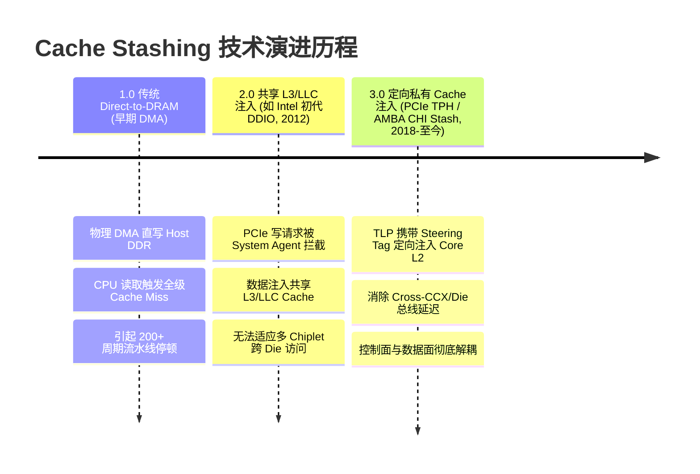
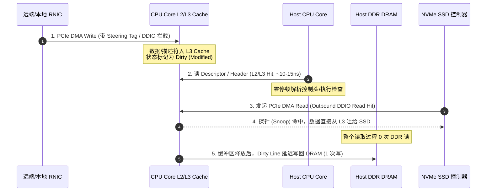
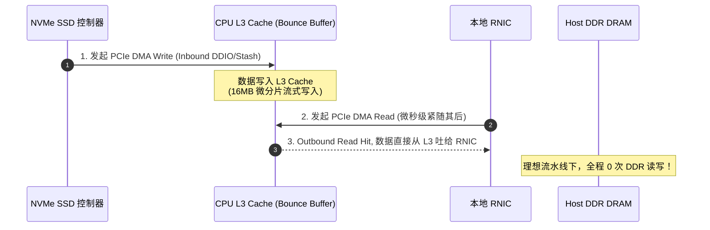

# Cache Stashing 技术与 DPU 直通架构深度总结报告

## 摘要

随着数据中心网络迈向 400Gbps/800Gbps 时代以及大语言模型（LLM）推理中 KV Cache 分层存储（Tiered Storage）需求的爆发，传统以 CPU 为中心的 DRAM 中转架构面临严峻的“内存墙”（Memory Wall）与流水线停顿（Pipeline Stall）瓶颈。

本报告基于系统级微架构与第一性原理，深入解析 **Cache Stashing（定向缓存隐匿/注入）** 技术的演进脉络、双向数据流路径、软硬件依赖配套及各大厂商布局。同时，针对 RNIC/DPU 到 SSD 的 KV Cache 落盘场景，在开启/关闭 CRC 校验及解压缩等多种组合下，定量演算对比了 Cache Stashing 与 Direct-to-DRAM 模式下的 DDR 访存放大倍数。此外，本报告对 DPU-SSD PCIe P2P 直通与 Cache Stashing 方案进行了多维对比，并阐述了其它加速传输方案与系统范式演进。

---

## 1. Cache Stashing 技术的发展过程

Cache Stashing（或称 Direct Cache Access / Direct Cache Injection）的核心物理本质是：**利用外设（如网卡、NVMe 控制器）数据传输的空闲时间，将 CPU 即将消费的控制元数据或临时 Payload 精准“推送”至距离 CPU Core 最近的私有/共享 Cache 中，切断物理 DRAM 高延迟对 CPU 执行流水线的惩罚。**

其演进过程可划分为三个阶段：



### 1.1 阶段一：传统 Direct-to-DRAM（DMA 模式）
* **运行机制**：外设 DMA 直接读写物理 Host DDR DRAM。
* **核心痛点**：在 100G+ 网络下，每秒处理数据包过亿（pps > 1 亿），单核处理预算不足 10ns。CPU 轮询或接收中断读取网卡描述符时，触发 DRAM 访问（60~100ns 延迟），导致 CPU 流水线频繁发生严重的 Pipeline Stall。

### 1.2 阶段二：共享 L3/LLC 缓存注入（Intel 初代 DDIO / 早期 DCA）
* **运行机制**：2012 年 Intel 在 Ivy Bridge-EP 架构中首次推出 **DDIO (Data Direct I/O)**。外设发起的 PCIe DMA Write 被 CPU System Agent 拦截，不写 DRAM，直接写入 Socket 级共享的 L3/LLC Cache。
* **局限性**：随着 AMD Zen 架构（多 CCX/CCD）及 Intel 异构 Tile/NUMA 架构的普及，L3 变为分布式结构。若网卡将数据写入 Die A 的 L3 Slice，而消费线程绑定在 Die B 的 Core 上，跨 Mesh/Fabric 总线抓取远端 L3 依然产生 30~50ns 延迟。且海量 Payload 极易造成 L3 缓存污染（Cache Pollution）。

### 1.3 阶段三：定向私有 Cache 注入（Direct-to-L2 / Steering Tag）
* **运行机制**：基于 PCIe 规范中的 **PCIe TPH (TLP Processing Hints)** 机制，PCIe 写报文头中附带 **Steering Tag (ST)**。CPU Uncore 识别后，绕过共享 L3，将数据/描述符直接推进负责该队列的 CPU Core **私有 L2 Cache**（时延 10~15ns）或本地 CCX 缓存中。
* **代表规范**：AMD SDCI (Smart Data Cache Injection)、Intel Extended DDIO / TPH Steering、Arm AMBA 5 CHI Cache Stashing 协议 (`StashLPID`, `StashOnceUnique`)。

### 1.4 设计哲学的终极转变：控制面与数据面分离
现代微架构使用 Stash 特性的黄金法则为：**绝对不 Stash 海量原始 Payload，仅精确 Stash 生产者-消费者握手窗口内的极小控制元数据（描述符、Header、CQE、Doorbell Flag）。** 有限的 SRAM 资源专服务于低延迟控制响应，大块 Payload 则交由数据面直通（P2P）或写回 DRAM。

---

## 2. Cache Stashing 在 RNIC 与 SSD 之间的双向处理流程

Cache Stashing 的处理流向取决于**数据的生产者（Producer）与消费者（Consumer）**的相对位置。

### 2.1 方向一：RNIC 到 SSD（网络入站落盘 / Swap-Out）

当网络侧传入 KV Cache 或存储数据块并最终落盘至 SSD 时，流程如下：



1. **入站 DMA 拦截**：RNIC 接收网络 RoCEv2 报文，硬件解析 Header/Descriptor 与 Payload。带 Steering Tag 的 DMA Write TLP 被 System Agent 拦截，写入 CPU Core 的 L2/L3 Cache。Cache Line 状态标记为 `Dirty`。
2. **CPU 零停顿处理**：绑核的 CPU 轮询线程直接在本地 L2/L3 Cache 命中描述符，执行校验、查表或指针更新，无任何 DRAM 访问延迟。
3. **SSD 命中读取**：NVMe SSD 控制器向该 Buffer 发起 PCIe DMA Read。CPU Snoop Controller 探测到 L3 Cache 命中（Outbound Read Hit），数据直接由 L3 片上 SRAM 通过 PCIe 吐给 SSD 控制器。
4. **延迟写回**：当操作系统释放该 Memory Buffer 时，脏 Cache Line 被淘汰（Evict）并发生有且仅有一次的写回（Writeback）到 DRAM。

---

### 2.2 方向二：SSD 到 RNIC（SSD 读出出站 / Prefix Cache 匹配）

当从本地 SSD 读取 KV Cache 并通过网络发送给远端节点时（例如 Prefix Cache 命中匹配），利用 L3 作为 Bounce Buffer 的流程如下：



1. **SSD 写入 L3**：NVMe SSD 控制器发起 PCIe DMA Write，开启 Stash/DDIO，Payload 直接写入 CPU 的 L3 Cache。
2. **微分片 (Micro-chunking) 流水线**：采用 16MB~32MB 滑动窗口分片。SSD 刚写完一小块分片，RNIC 紧接着发起 PCIe DMA Read。
3. **RNIC 读取命中 L3**：RNIC 的 DMA Read 请求触发 CPU Snoop Controller 命中 L3，数据直接从 L3 SRAM 封装为 PCIe CplD 吐给 RNIC 发往网络。
4. **零 DDR 带宽效益**：在时域局部性满足的前提下，L3 充当了 2TB/s 带宽的高速硬件 Bounce Buffer，**物理 DDR 读写次数完全降为 0 次**。

---

## 3. RNIC/DPU 到 SSD KV Cache 落盘场景：DDR 访存放大倍数定量对比

本节选取大模型推理中 **RNIC/DPU 接收网络 KV Cache 并落盘至 NVMe SSD** 的典型场景，深入对比：
1. **传统 Direct-to-DRAM 模式**
2. **开启 Cache Stashing 到 L3 模式（Hot L3 / 未溢出）**
3. **DPU 硬件 Offload + PCIe P2P 直通模式**

### 3.1 物理建模与变量定义
* **有效原始 Payload 数据量**：$P$（如 $1\text{ MB}$）。
* **网络压缩场景**：假设网络传输压缩数据量为 $P_c$（设压缩率 $50\%$，即 $P_c = 0.5P$），经 CPU/硬件解压后还原为原始数据量 $P$。
* **CRC 校验特征**：只读操作，仅读取数据计算 4 字节 Checksum，**不会修改 Payload 本身，不产生 Dirty Writeback**。
* **解压缩特征**：读取压缩数据 $P_c$，解压生成新数据 $P$ 并写入内存（产生 $P$ 级别的 Dirty Write）。

---

### 3.2 详细计算数据对比表

> **基准说明**：DDR 访存放大倍数定义为 $\frac{\text{DDR 物理读流量} + \text{DDR 物理写流量}}{\text{最终解压后的有效数据量 } P}$。

| 场景组合 | 处理逻辑与物理流向 | 架构模式 | DDR 物理写流量 | DDR 物理读流量 | DDR 总流量 | 带宽放大倍数 | DDR 读带宽节省率 |
| :--- | :--- | :--- | :--- | :--- | :--- | :--- | :--- |
| **场景一**<br>不开 CRC<br>未开启解压 | RNIC 入站 $\rightarrow$ SSD 出站落盘 | **Direct-to-DRAM** | $1.0P$ (RNIC写) | $1.0P$ (SSD读) | $2.0P$ | **$2.0\times$** | 基准 (0%) |
| | | **Cache Stashing 到 L3** | $1.0P$ (L3淘汰写回) | $0.0P$ (SSD命中L3) | $1.0P$ | **$1.0\times$** | **节省 100% 读带宽** (总流量降50%) |
| | | **DPU + P2P 直通** | $0.0P$ | $0.0P$ | $0.0P$ | **$0.0\times$** | **彻底旁路 DDR** (100%) |
| **场景二**<br>开启 CRC<br>未开启解压 | RNIC 入站 $\rightarrow$ CPU算CRC $\rightarrow$ SSD落盘 | **Direct-to-DRAM** | $1.0P$ (RNIC写) | $2.0P$ (CPU读 + SSD读) | $3.0P$ | **$3.0\times$** | 基准 (0%) |
| | | **Cache Stashing 到 L3** | $1.0P$ (L3淘汰写回) | $0.0P$ (CPU/SSD全命中L3) | $1.0P$ | **$1.0\times$** | **节省 100% 读带宽** (总流量降66.7%) |
| | | **DPU + P2P 直通** | $0.0P$ (DPU硬化CRC) | $0.0P$ | $0.0P$ | **$0.0\times$** | **彻底旁路 DDR** (100%) |
| **场景三**<br>不开 CRC<br>开启解压缩<br>($P_c=0.5P$) | RNIC写 $P_c$ $\rightarrow$ CPU解压写 $P$ $\rightarrow$ SSD读 $P$ | **Direct-to-DRAM** | $1.5P$ ($P_c$写 + $P$写) | $1.5P$ ($P_c$读 + $P$读) | $3.0P$ | **$3.0\times$** | 基准 (0%) |
| | | **Cache Stashing 到 L3** | $1.0P$ (解压后$P$写回) | $0.0P$ ($P_c$与$P$全命中L3) | $1.0P$ | **$1.0\times$** | **节省 100% 读带宽** (总流量降66.7%) |
| | | **DPU + P2P 直通** | $0.0P$ (DPU硬化解压) | $0.0P$ | $0.0P$ | **$0.0\times$** | **彻底旁路 DDR** (100%) |
| **场景四**<br>开启 CRC<br>开启解压缩<br>($P_c=0.5P$) | RNIC写 $P_c$ $\rightarrow$ CPU解压写 $P$ $\rightarrow$ CPU算CRC $\rightarrow$ SSD读 $P$ | **Direct-to-DRAM** | $1.5P$ ($P_c$写 + $P$写) | $2.5P$ ($P_c$读 + $P$读解压 + $P$读CRC) | $4.0P$ | **$4.0\times$** | 基准 (0%) |
| | | **Cache Stashing 到 L3** | $1.0P$ (解压后$P$写回) | $0.0P$ (CPU/SSD全命中L3) | $1.0P$ | **$1.0\times$** | **节省 100% 读带宽** (总流量降75%) |
| | | **DPU + P2P 直通** | $0.0P$ (DPU硬化解压+CRC) | $0.0P$ | $0.0P$ | **$0.0\times$** | **彻底旁路 DDR** (100%) |

---

### 3.3 物理归因与第一性原理推导

1. **为什么 Cache Stashing 始终能将 DDR 读流量降为 $0.0P$？**
   因为 L3 Cache 在物理上充当了片上 SRAM 缓存池。RNIC 写入 L3 后，CPU 读（做 CRC/解压）与 SSD 读（做落盘）均在 **2TB/s 的片上 SRAM 内完成**。数据读取完全在 L3 Cache Hit 阶段消化，不再产生物理 DDR DRAM 读事务。
2. **为什么 1.0P 的 DDR 物理写无法被 Cache Stashing 消除？**
   因为网卡/CPU 更新的是 L3 Cache 中的数据，物理 DDR DRAM 里的旧数据是脏的。只要数据最终要释放，L3 中的 Dirty Cache Line **物理上必须发生且仅发生 1 次写回（Writeback）到 DRAM** 的动作。
3. **为什么 DPU 直通能做到 0 物理读写？**
   DPU 芯片内部集成了硬化的 CRC32/64 Engine 和 LZ4/Deflate 解压 Engine。数据在 $100\text{G}\sim 400\text{G}$ 线速经过 DPU 时顺便完成解压和 CRC 校验，随后通过 **PCIe P2P DMA** 直接发往 NVMe SSD，**全过程 Zero-Host-CPU & Zero-Host-DRAM**。

---

## 4. Cache Stashing 技术的完整软硬件依赖配套

Cache Stashing 特性无法自动生效，必须依赖从 **PCIe 协议层** 到 **片上互联总线**、**操作系统** 及 **用户态应用框架** 的“四位一体”协同设计：

```
+-----------------------------------------------------------------------------------+
|                  Cache Stashing 完整软硬件生态依赖栈                                |
+-----------------------------------------------------------------------------------+
|  [应用/框架层] : DPDK (PMD 轮询) / SPDK / Linux XDP                                |
|                 -> 建立 Queue与 CPU Core (IRQ Vector) 绑核映射                      |
+-----------------------------------------------------------------------------------+
                                          │
                                          ▼
+-----------------------------------------------------------------------------------+
|  [操作系统层] : Linux Kernel (CONFIG_PCIE_TPH) + ACPI _DSM 表                      |
|                 -> 解析 ACPI 引导表，向网卡/外设分配 Steering Tag (ST)             |
+-----------------------------------------------------------------------------------+
                                          │
                                          ▼
+-----------------------------------------------------------------------------------+
|  [ CPU 片上层] : Root Complex / System Agent + 片上 Mesh/CHI 总线 + L2/L3 Cache    |
|                 -> 识别 TPH 报文，拦截 DMA 注入目标 Core L2 ( MESI 状态标 Dirty )  |
+-----------------------------------------------------------------------------------+
                                          │
                                          ▼
+-----------------------------------------------------------------------------------+
|  [ PCIe 设备层] : PCIe Endpoint (RNIC / NVMe) + Header-Data Split 机制             |
|                 -> 支持 PCIe TPH 规范，在 TLP 报头附带 Steering Tag                |
+-----------------------------------------------------------------------------------+
```

1. **PCIe Endpoint 层**：网卡/NVMe 控制器必须支持 **PCIe TPH (TLP Processing Hints)** 规范，且具备 **Header-Data Split（头尾分离）** 能力，避免大块 Payload 误入 L2 造成 Cache 污染。
2. **CPU & 片上互联层**：System Agent 支持拦截 PCIe 写 TLP；片上总线（如 ARM AMBA 5 CHI）支持 `StashLPID` 事务；片上 Cache 具备硬化降级机制（L2 满退 L3，L3 满淘汰回 DRAM）。
3. **操作系统与固件层**：内核开启 `CONFIG_PCIE_TPH` 驱动支持，ACPI 配置 `_DSM` 方法分配 Steering Tag。
4. **数据面框架层**：DPDK/SPDK 用户态框架建立 Rx/Tx 队列与 CPU 绑定（Pinned Cores），写出足迹极小（Lean Footprint）的 Polling Handler，确保几百纳秒内的消费时效性。

---

## 5. 各大厂商 Cache Stashing 软硬件布局矩阵

以下汇总了 Intel、AMD、Arm 生态及 NVIDIA 在 Cache Stashing 方向的技术布局与发布年份：

| 厂商/生态 | 代表性硬件/芯片产品 | 硬件特性与协议名称 | 目标 Cache 层级 | 软件生态与驱动/SDK 支持 | 发布年份 |
| :--- | :--- | :--- | :--- | :--- | :--- |
| **Intel** | **CPU**: Xeon Scalable 4th/5th/6th Gen (Sapphire/Emerald/Granite Rapids)<br>**NIC/IPU**: Intel E810, IPU E2000 | **DDIO (Data Direct I/O)**<br>**Extended DDIO**<br>+ PCIe TPH Cache Steering | 目标 Core 所在 **LLC Slice** 甚至 **私有 L2 Cache** | • **Linux Kernel**: `CONFIG_PCIE_TPH`<br>• **数据面**: DPDK PMD, SPDK NVMe Polling<br>• **隔离**: Intel RDT / CAT (Cache 隔离) | DDIO初代: **2012**<br>Ext-DDIO: **2023** |
| **AMD** | **CPU**: EPYC 9004 (Genoa/Bergamo), EPYC 9005 (Turin)<br>**DPU**: Pensando Salina / Pollara | **AMD SDCI** (Smart Data Cache Injection)<br>+ PCIe TPH Steering Tag | 目标 CCX 的 **私有 L2 Cache** (1~2MB) | • **Linux Kernel**: 原生支持 ACPI TPH Steering Tag<br>• **驱动绑定**: Broadcom/Mellanox 网卡 + DPDK<br>• **存储**: SPDK NVMe-oF CQE 直接注入 | **2022** (EPYC 9004 发布) |
| **Arm 生态**<br>*(AWS, Ampere, 阿里)* | **IP/CPU**: Neoverse N1/N2/V1/V2/V3, DSU-110/120<br>**芯片**: AWS Graviton3/4, AmpereOne, 倚天 710 | **AMBA 5 CHI** Cache Stashing 协议 (`StashLPID`, `StashOnceUnique`) | 核心 **私有 L2 Cache** 或 **Cluster L3** | • **总线驱动**: AMBA CHI 架构驱动<br>• **云端生态**: AWS Nitro 硬件调度栈<br>• **数据面**: DPDK/SPDK 适配 AMBA CHI 格式 | CHI规范: **2016**<br>芯片落地: **2021** (Graviton3) |
| **NVIDIA** | **CPU**: Grace CPU (GH200 / GB200)<br>**DPU/NIC**: BlueField-3 DPU, ConnectX-7/8 | **NVLink-C2C CHI Stash**<br>+ PCIe TPH Cache Steering | Grace 核心 **私有 L2 Cache** (1MB) 与 System Cache | • **驱动栈**: NVIDIA Grace SoC 驱动<br>• **SDK**: DOCA SDK 异步事件通知<br>• **AI 框架**: CUDA / Triton / vLLM 握手 | **2023** (GH200 商用) |

---

## 6. 各大厂商 DPU 与 SSD 直通方案软硬件布局矩阵

以下汇总了主流厂商在 DPU 与 NVMe SSD 之间进行 PCIe P2P 直通及硬件卸载的技术布局与发布年份：

| 厂商 | 代表性 DPU / 加速器与存储硬件 | 直通协议与传输架构 | 硬件卸载引擎 (Inline Offload Engines) | 软件生态与存储框架 | 发布年份 |
| :--- | :--- | :--- | :--- | :--- | :--- |
| **NVIDIA** | **DPU**: BlueField-3 DPU<br>**NIC**: ConnectX-7 / ConnectX-8<br>**平台**: Grace Hopper / Blackwell | **GPUDirect Storage (GDS)**<br>+ PCIe P2PDMA<br>+ NVMe CMB / PMR | • **解压缩 Engine**: 线速 LZ4 / Deflate<br>• **校验 Engine**: 硬件 CRC32 / CRC64<br>• **加解密**: AES-XTS 硬件引擎 | • **存储 SDK**: NVIDIA DOCA Storage Stack<br>• **存储框架**: SPDK GDS Plugin, NVMe-oF<br>• **AI 集成**: TensorRT-LLM / vLLM Swap 插件 | GDS概念: **2020**<br>BF-3上市: **2023** |
| **AMD** | **DPU**: Pensando Salina / Pollara DPU<br>**SSD**: Alveo SmartSSD (FPGA CSD)<br>**平台**: EPYC + Pensando Helios | **PCIe P2PDMA**<br>+ NVMe CMB/PMR<br>+ CXL 2.0 / 3.0 Direct | • **压缩 Engine**: 硬件 LZ4 / ZSTD<br>• **完整性**: Pipeline 级 CRC64<br>• **安全**: 硬化 Crypto Engine | • **软件套件**: AMD Pensando Software Suite<br>• **内核模块**: Linux Kernel `p2pdma` / `p2pmem`<br>• **存储框架**: 开源 SPDK P2P DMA Driver | Pensando收购: **2022**<br>Salina: **2023** |
| **Intel** | **IPU**: Mount Evans (IPU E2000)<br>**加速器**: QAT (QuickAssist) / DSA<br>**平台**: Xeon Scalable Platform | **PCIe P2PDMA**<br>+ NVMe CMB/PMR<br>+ CXL 内存/存储直通 | • **QAT Engine**: 硬件 Deflate / LZ4 解压<br>• **DSA Engine**: 高速数据搬运与 CRC32C<br>• **IPU**: 流式硬件包过滤与校验 | • **驱动栈**: Intel IPU SDK, QAT Driver<br>• **存储框架**: SPDK P2PDMA Plugin<br>• **生态**: Linux Kernel NVMe target 卸载 | IPU E2000: **2021**<br>Xeon SPR: **2023** |
| **Arm 生态**<br>*(AWS, Marvell)* | **AWS**: Nitro V5 / V6 Card + Nitro SSD<br>**Marvell**: OCTEON 10 DPU (Neoverse N2)<br>**Fungible**: F1 DPU (已归入微软) | **定制 ASIC PCIe P2P 管道**<br>+ AMBA CHI P2P<br>+ NVMe 接口 | • **Nitro ASIC**: 硬件流式解压/CRC/EBS加密<br>• **OCTEON 10**: Inline Zip / Crypto 协处理器<br>• **Fungible**: TrueFabric 引擎 | • **AWS 平台**: Nitro Hypervisor / EBS 存储栈<br>• **Marvell**: OCTEON SDK, DPDK/SPDK<br>• **开源**: Linux Kernel Arm64 P2PDMA | Nitro初代: **2017**<br>Nitro V5: **2022**<br>OCTEON 10: **2021** |

---

## 7. KV Cache 传输场景：DPU 直通 SSD vs Cache Stashing 到 L2/L3 技术优劣势对比

在 KV Cache 传输与持久化存储场景中，两种方案并非竞争替代关系，而是**针对不同物理面（数据面 vs 控制面）的系统级分工**：

```
[ DPU 直通 SSD 方案 (P2P DMA) ]  ───► 瞄准【数据面落盘/换出 (Data Plane Offload)】: Zero-CPU, Zero-DRAM, 线速处理
[ Cache Stashing 方案 (L2/L3) ] ───► 瞄准【控制面事件/即时响应 (Control Plane Event)】: Zero-Stall, 10ns 极速命中
```

### 7.1 技术优劣势多维对比表

| 评估维度 | DPU 与 SSD 直通方案 (P2P DMA) | Cache Stashing 到 L2/L3 方案 |
| :--- | :--- | :--- |
| **适用物理面** | **数据面存储落盘与换出** (Swap-Out / Offload) | **控制面事件通知与即时 CPU 计算** (Token 生成调度) |
| **Host CPU 算力消耗** | **0%**（完全旁路 Host CPU） | 较高（需消耗 CPU Core 跑解压/CRC/逻辑） |
| **Host DRAM 带宽消耗** | **0**（完全走 PCIe P2P 局部 Switch 转向） | 较低或 1x（数据仍需延迟写回 DRAM） |
| **吞吐量物理瓶颈** | 受限于 PCIe 总线与 DPU ASIC 引擎线速 ($100\text{G}\sim 400\text{G}$) | **受限于 L3 Cache 容量**（未做微分片极易溢出爆仓） |
| **控制敏捷度与灵活度**| 低（依赖硬化逻辑，难以处理复杂动态控制分支） | **极高**（CPU 核心在 10ns 内拿到 Header 处理任意逻辑） |
| **硬件拓扑限制** | **较严格**（要求同一 PCIe Switch 或支持 P2P 的 RC） | **宽松**（只需系统支持 DDIO / TPH / CHI 协议） |

---

## 8. 针对 KV Cache 传输场景的其它加速方案

除了 DPU 直通 SSD 与 Cache Stashing，以下加速方案在现代 AI 大模型推理架构中同样具备极高价值：

### 8.1 GPUDirect Storage (GDS) / P2PDMA（GPU HBM $\longleftrightarrow$ NVMe SSD）
* **原理**：NVMe SSD 与 GPU HBM 之间直接通过 PCIe P2P DMA 传输，数据完全旁路 Host CPU 与 Host DRAM。
* **价值**：大模型 KV Cache 在 GPU 显存与 NVMe SSD 之间进行微秒级 Swap-in/Swap-out，显存换入换出吞吐达到 20GB/s~50GB/s。

### 8.2 GPUDirect RDMA (GDR)（远端 GPU HBM $\longleftrightarrow$ 本地 GPU HBM / Host DDR）
* **原理**：在 Disaggregated Prefill-Decode（PD 分离）架构中，Prefill 节点的 GPU HBM 数据由 RNIC 直接发起 PCIe Read，转化为 RoCEv2 发往 Decode 节点，直接写入 Decode 节点的 GPU HBM 或 Host DDR。
* **价值**：跨节点传输旁路两侧 Host CPU 与 Host DRAM，端到端传输延迟降低 50% 以上。

### 8.3 CXL.mem 内存池化与分层存储（CXL Tiered Memory）
* **原理**：通过 CXL 2.0/3.0 协议将共享 CXL DRAM 内存池挂载至 CPU/GPU 物理地址空间。
* **价值**：CPU/GPU 像访问本地内存一样直接使用 Load/Store 指令读写扩展 KV Cache，无需任何显式 DMA 拷贝。

### 8.4 可计算存储盘（Computational Storage Drives, CSD / SmartSSD）
* **原理**：将 CRC 校验与 LZ4/ZSTD 解压缩 Engine 直接硬化在 NVMe SSD 盘控芯片或 FPGA 内部。
* **价值**：“存储即计算”，数据直接 P2P 写入 SmartSSD，CRC 校验与解压在盘内部完成，连外部 DPU 加速器都不需要经过。

---

## 9. 额外重点关注内容：微架构演进与前沿实践

### 9.1 L3 Cache 溢出防御与微分片 (Micro-chunking) 算法

盲目将大块 Payload Stash 到 L3 会引发惨烈的 **Cache Thrashing（缓存抖动）**，导致 CPU 运行代码被冲刷（性能反向惩罚 $5.44\text{ ms}+$）。

在软件设计中，必须采用 **滑动窗口微分片算法（Micro-chunking Pipelining）**：

$$\text{Chunk Size} \le \frac{\text{L3 Cache IO Quota Size}}{2} \approx 16\text{ MB} \sim 32\text{ MB}$$

```
[ 生产者 (SSD/RNIC) ] ──(写 16MB)──> [ L3 窗口 ] ──(读 16MB)──> [ 消费者 (RNIC/CPU) ]
                                         │ (在 L3 循环，永远不溢出 DRAM)
```
生产者写完 16MB，消费者**立刻**读走 16MB。数据始终在 DDIO 配额内循环，彻底实现 Zero-DRAM 物理吞吐。

---

### 9.2 用户态内存语义直写 + 硬件解封（`block_table` 动态更新）

在 LLM 推理（如 vLLM / TensorRT-LLM）中，CPU 频繁向 GPU 传递 PagedAttention 的 `block_table` 更新项。传统调用 `cudaMemcpyAsync` 会引入 $3\sim 5\mu\text{s}$ 的驱动与 Copy Engine 硬件同步开销。

前沿闭源推理平台与 **vAttention (ASPLOS 2025)** 的优化范式为：

```cpp
// 1. 数据面：CPU 内存语义直写 (BAR1 / CXL / NVLink C2C)
gpu_block_table_ptr[slot] = new_block_id;

// 2. 物理写屏障：清空 CPU Store Buffer，保证数据先离开 CPU
_mm_sfence(); // 或 ARM64 下 asm volatile("dmb st" ::: "memory");

// 3. 控制面：直写 Flag，敲响通知
gpu_flag_ptr[0] = current_step_id;

// 4. GPU 端：CUDA Graph 入口节点使用 cudaStreamWaitValue32
// GPU 前端硬件调度器 (HWS) 自动在硬件层唤醒，零 CPU 派发开销，零 GPU SM 算力损耗！
```

这一范式消除了 `cudaMemcpy` 的固定延迟，将 `block_table` 更新耗时压缩至 **$< 300\text{ ns}$** 级别，为 Decode 阶段的 TPOT（Time-Per-Output-Token）提供了微秒级的极致平滑度。

---

## 10. 结论

1. **Cache Stashing 的核心定位**：解决**控制面（Control Plane）**事件通知、描述符与即时 CPU 计算的时延问题，消除了 CPU 轮询时的流水线停顿。
2. **DPU 直通 SSD 的核心定位**：解决**数据面（Data Plane）**大块 KV Cache 换出落盘开销，实现 **Zero-Host-CPU & Zero-Host-DRAM**。
3. **KV Cache 落盘倍数**：开启 Cache Stashing 到 L3 可消灭所有物理 DDR 读流量，将传统场景 3x~4x 的 DDR 访存放大降至 **1.0x**；而 DPU P2P 直通则实现 **0.0x** 的绝对旁路。
4. **系统设计总纲**：**控制流用 Cache Stashing（精准投递私有 L2），数据流用 DPU P2P 直通（局域总线转向）。** 软硬件全栈协同与控制/数据分离，是突破现代数据中心“内存墙”物理极限的唯一解。
