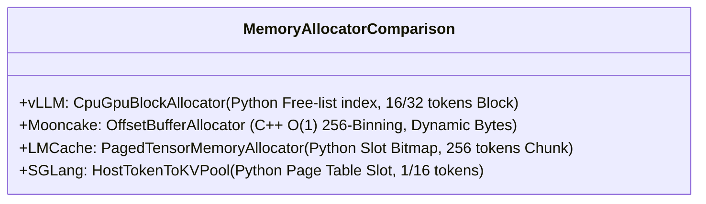
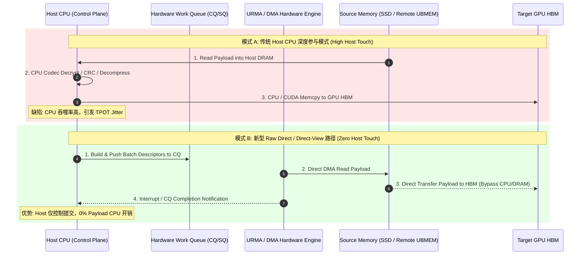
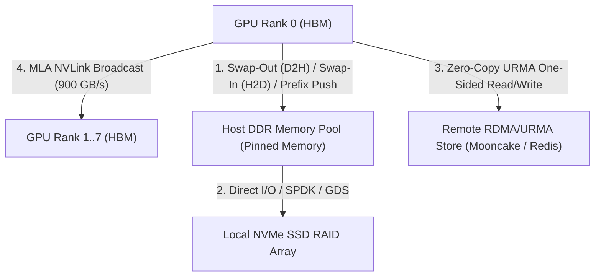
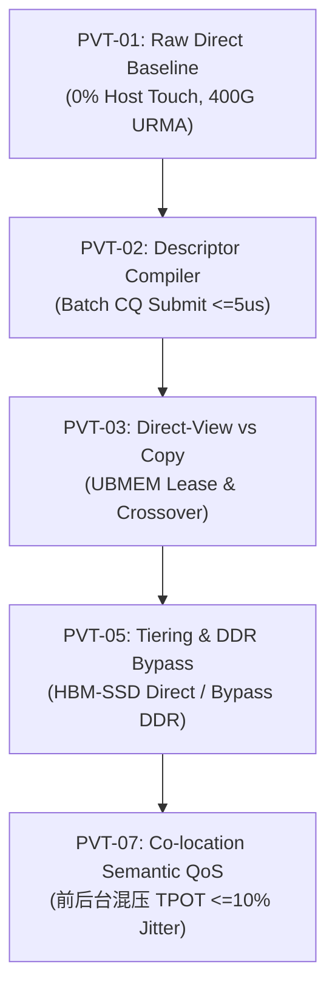

# 开源 LLM 推理框架 KV Cache 架构、量化建模与 UBMEM/URMA 原型验证实施方案

> **分析目标对象**：vLLM、Mooncake、LMCache、SGLang  
> **核心任务与目标**：
> 1. 全面剖析四大开源框架在 KV Cache 状态管理、介质分配算法（DDR/SSD）、数据切片粒度、描述符构建及 Host 触碰 (Host Touch) 模式上的实现；
> 2. 构建跨 8B、70B、DeepSeek-V3 (671B MoE) 及 405B 模型在 8 卡张量并行 ($TP=8$) 下的 **KVCache 数据量与传输流量量化模型**；
> 3. **【核心新增】推导 UBMEM (Unified Memory Fabric) 与 URMA (Unified Remote Memory Access) 新型传输/存储技术下的数据访问模式，制定指导 UBMEM 和 URMA 执行底层原型验证 (PVT-01 ~ PVT-08) 的具体实施方案与步骤**。

---

## 目录
1. [执行摘要与整体架构概览](#1-执行摘要与整体架构概览)
2. [分析要点一：开源框架 KV Cache 架构与细粒度介质管理方式](#2-分析要点一开源框架-kv-cache-架构与细粒度介质管理方式)
   - 2.1 DDR 内存池细粒度管理与分配器机制 (Mooncake `OffsetBufferAllocator` $O(1)$ 256-bin 算法、LMCache `PagedTensorMemoryAllocator`、vLLM `cpu_cache`、SGLang `HostTokenToKVPool`)
   - 2.2 本地 SSD 存储介质管理与 I/O 接口机制 (SPDK, Direct I/O `O_DIRECT`, GDS `cuFileReadAsync`, 4KB 扇区对齐)
   - 2.3 存储介质与数据切片粒度分析 (16-token Block vs 256-token Chunk vs Dynamic Segment)
   - 2.4 描述符构建 (Descriptor Compiler) 与逻辑/物理地址映射
   - 2.5 Host 触碰模式对比：Host CPU 深度参与 vs Raw Direct (零 Host Payload Touch) 路径
3. [KVCache 数据量数学建模与多模型/多场景量化对比](#3-kvcache-数据量数学建模与多模型多场景量化对比)
   - 3.1 MHA / GQA 架构数据量计算公式
   - 3.2 DeepSeek MLA 架构数据量计算公式 (无 Head 切片与 Leader-Rank 广播模式)
   - 3.3 典型模型规格参数表 (8B, 70B, DeepSeek-V3 671B MoE, 405B)
   - 3.4 批量并发请求场景下的节点传输量与单卡分片量对比矩阵 ($S=4K, 32K, 128K$; $B=4, 8, 16, 32$; $TP=8$)
   - 3.5 URMA / UBMEM 传输报文载荷开销与 Chunk 打包对比 (Block vs Chunk)
4. [传输流量方向、并发连接数与拓扑模型](#4-传输流量方向并发连接数与拓扑模型)
   - 4.1 流量方向分类 (D2H 被动换出 / 主动异步落库前缀构建, H2D 命中加载, URMA Remote, Intra-node NVLink Broadcast)
   - 4.2 逻辑与物理并发连接数模型 (CQ 队列深度、QP 绑定与物理流复用)
   - 4.3 DeepSeek MLA “单卡外存读取 + NVLink 广播” 拓扑优化流量模型
5. [底层硬件传输资源诉求与瓶颈识别 (PCIe / SSD / URMA)](#5-底层硬件传输资源诉求与瓶颈识别-pcie--ssd--urma)
   - 5.1 物理传输链路有效吞吐上限对比 (PCIe Gen5 vs NVMe RAID vs 400G/800G URMA/RDMA vs NVLink)
   - 5.2 TTFT SLA (<200ms) 约束下的加载耗时与带宽饱和度分析
6. [【专项实施方案】指导 UBMEM 和 URMA 执行原型验证 (PVT) 的具体步骤](#6-专项实施方案指导-ubmem-和-urma-执行原型验证-pvt-的具体步骤)
   - 6.1 验证软硬件环境搭建与网络/Fabric 拓扑配置
   - 6.2 PVT-01: Raw Direct 路径零 Host Touch 基础性能验证实施步骤
   - 6.3 PVT-02: 描述符编译器 (Descriptor Compiler) 批量 CQ 提交验证实施步骤
   - 6.4 PVT-03: Direct-View 共享语义与 Copy-to-HBM Crossover 验证实施步骤
   - 6.5 PVT-04: 智能 QueryPlan 路由感知与降级 Fallback 验证实施步骤
   - 6.6 PVT-05: 异构分层存储与 DDR 角色消融 (Bypass DDR) 验证实施步骤
   - 6.7 PVT-06: 语义契约 (Eligibility) 与 6 维正确性检查验证实施步骤
   - 6.8 PVT-07: 前后台 Semantic QoS 混压隔离与 TPOT 尾部抖动控制验证实施步骤
   - 6.9 PVT-08: 软件 Fanout Staging vs 硬件多播 (Multicast) 证伪验证实施步骤
7. [综合对比矩阵与系统级工程建议](#7-综合对比矩阵与系统级工程建议)

---

## 1. 执行摘要与整体架构概览

在现代 LLM 大模型推理集群中，传统的基于 TCP/IP 或简单 DMA 拷贝的 KV Cache 离线/换入机制存在 **Host CPU 严重打扰 (High Host Touch)、高昂的内存拷贝开销、内存碎片化以及长尾抖动 (TPOT Jitter)** 等瓶颈。

随着 **UBMEM (统一内存缓冲区/ Fabric)** 与 **URMA (统一远程内存访问)** 等新型介质与传输技术的引入，系统有机会实现 **Raw Direct（原始直达）** 访问模式——即 **Host 仅控制描述符提交与 CQ 轮询，不触碰任何 KV Payload 数据**，实现跨 HBM、DDR、SSD 及远端存储池的底层零拷贝直连。

为了直接指导 UBMEM 与 URMA 底层能力的摸底验证（根据《统一异构 KVCache 存储池原型验证清单 V1.6》），本报告融合了开源框架机制剖析、数学量化建模以及专项原型验证（PVT-01 ~ PVT-08）的步步落地方案。

---

## 2. 分析要点一：开源框架 KV Cache 架构与细粒度介质管理方式

### 2.1 DDR 内存池细粒度管理与分配器机制

不同开源框架在 Host DDR（锁页内存 / 物理 DRAM）上的内存创建、管理主体、分配器算法及碎片控制机制对比：



#### 1. Mooncake 的 DDR 专有分配器：`OffsetBufferAllocator` (重点参考)
- **源码路径**：[`mooncake-store/include/offset_allocator/offset_allocator.h`](file:///D:/codes/vllm/Mooncake/mooncake-store/include/offset_allocator/offset_allocator.h#L15-L100) & [`allocator.h`](file:///D:/codes/vllm/Mooncake/mooncake-store/include/allocator.h#L256-L315)
- **管理主体与创建方式**：由 `MasterService` 控制面集中调度。每个 Client 节点启动时通过 `mmap` / `ClientBuffer` 申请内存段，通过 `MountSegment` 注册给 Master，由 Master 创建 `OffsetBufferAllocator` 实例。
- **分配器算法 (Binning 机制)**：
  - 基于 Sebastian Aaltonen 的 *OffsetAllocator* 改造。
  - 维护 **32 个 Top-level Bins 与 256 个 Leaf Bins**。
  - 采用位图 (Bitmaps) 快速定位尺寸最契合的物理内存区段。
- **性能与抗碎片化**：
  - 分配与回收复杂度达到 **硬实时 $O(1)$**，单次分配耗时仅 **~50-100 ns**；
  - 彻底解决了变长 KV Slice 在传统 Buddy System 或 Slab 分配器下引发的严重的内部/外部内存碎片问题。
- **对 UBMEM 验证的指导**：UBMEM 共享内存池的物理 Address Allocator 可借鉴其 256-bin 分级装箱结构，作为 UBMEM 逻辑 Slot 管理的硬件/软件分配器基线。

#### 2. LMCache 的 DDR 管理器：`PagedTensorMemoryAllocator`
- **源码路径**：[`lmcache/v1/memory_allocators/paged_tensor_memory_allocator.py`](file:///D:/codes/vllm/LMCache/lmcache/v1/memory_allocators/paged_tensor_memory_allocator.py) & [`host_memory_allocator.py`](file:///D:/codes/vllm/LMCache/lmcache/v1/memory_allocators/host_memory_allocator.py)
- **创建方式**：通过 PyTorch 的 `torch.empty(..., pin_memory=True)` 分配上限为 `max_local_cpu_size` (GB) 的 Host Pinned Memory 内存池。
- **分配与锁页监控**：
  - 采用 **256 tokens Chunk** 为固定 Slot 粒度；
  - 引入 `PinMonitor` ([`pin_monitor.py`](file:///D:/codes/vllm/LMCache/lmcache/v1/pin_monitor.py)) 对处于传输中的 Pinned Buffers 进行引用计数 (`pin_count`) 与超时控制，防止传输中断导致内存永久锁死。

#### 3. vLLM 与 SGLang 的 DDR 管理器
- **vLLM** ([`cache_engine.py`](file:///D:/codes/vllm/vllm/vllm/worker/cache_engine.py))：通过 `torch.empty(..., pin_memory=True)` 预分配 `cpu_cache`，由 Python 侧 `CpuGpuBlockAllocator` 维护 Block ID 双向链表（无 C++ 分配器）。
- **SGLang** ([`memory_pool_host.py`](file:///D:/codes/vllm/sglang/python/sglang/srt/mem_cache/memory_pool_host.py#L66-L300))：`HostTokenToKVPool` 预分配扁平 Host 锁页内存，由 `HiRadixCache` 通过逻辑 Slot 映射。

---

### 2.2 本地 SSD 存储介质管理与 I/O 接口机制

SSD 离线层是扩展 KV 存储容量的主力介质。四大框架在 SSD 管理、I/O 接口与扇区对齐方面的机制：

| 框架 | 存储文件结构 | I/O 读写接口 | 字节对齐与扇区粒度 | 淘汰策略 |
| :--- | :--- | :--- | :--- | :--- |
| **Mooncake** | `FileStorage` (Bucket 目录 256MB/Bucket 或 Offset 单大文件) | **POSIX Direct I/O (`O_DIRECT`), SPDK, io_uring** | **4KB Page 严格对齐** | Master 节点控制 TTL Lease 与租户 Quota |
| **LMCache** | `LocalDiskBackend` (`by_gpu` 目录分片) | **POSIX Direct I/O, NVIDIA GDS (`cuFileReadAsync`)** | 64 字节对齐 / 4KB 磁盘块 | `LocalDiskBackend` 内置 LRU 链表 |
| **SGLang** | `HiCacheStorage` 序列文件 | POSIX `aio` / 文件流 | 文件粒度导出 | `LRUFileEvictor` (近度淘汰) |
| **vLLM** | 依赖外部 Connector (如 LMCache / Mooncake) | 继承外部 Connector | 继承外部 Connector | 继承外部 Connector |

---

### 2.3 存储介质与数据切片粒度分析

数据切片粒度直接决定了描述符复杂度、网卡 payload 传输效率与内存碎片率：

```
vLLM Block (16/32 Tokens):   [Slot 0..15] -> 粒度细，灵活性高，但描述符开销大
LMCache Chunk (256 Tokens):  [Slot 0..255] -> 粒度中等，显著提升 PCIe/RDMA 带宽利用率
Mooncake Segment (Dynamic):  [Dynamic Bytes] -> 基于 OffsetAllocator 管理变长 Slice
SGLang Page (1/16 Tokens):    [Page 0..15] -> Token/Page 级粒度，配合 RadixTree 动态分裂
```

---

### 2.4 描述符构建 (Descriptor Compiler) 与逻辑/物理地址映射

为了驱动硬件 DMA / RDMA / URMA 引擎，上层框架必须将**逻辑 KV Block / Page / Radix Span** 编译为硬件可执行的**批量描述符 (Batch Descriptors)**。

```mermaid
flowchart LR
    subgraph Logical_Layer["1. 逻辑层 (Logical Tier)"]
        Req["Request Prompt Tokens"]
        RadixSpan["Radix Span / Block IDs"]
    end

    subgraph Compiler_Layer["2. 描述符编译器 (Descriptor Compiler)"]
        SliceBuilder["Slice Builder & Offset Calculator"]
        DescGen["Generate URMA/DMA Descriptor List"]
    end

    subgraph Physical_Hardware["3. 物理硬件层 (Physical Hardware)"]
        URMA_Engine["URMA / RDMA Engine (Hardware CQ)"]
        Mem_HBM["Target HBM / UBMEM Space"]
    end

    Req --> RadixSpan
    RadixSpan --> SliceBuilder
    SliceBuilder --> DescGen
    DescGen -- "Host 提交 CQ (Zero Payload Touch)" --> URMA_Engine
    URMA_Engine -- "Zero-Copy Direct Transfer" --> Mem_HBM
```



#### 描述符数据结构规范 (以 Mooncake `ScatterTransferRange` 为例)
源码参照 [`mooncake-transfer-engine/include/transfer_engine.h:L137-L179`](file:///D:/codes/vllm/Mooncake/mooncake-transfer-engine/include/transfer_engine.h#L137-L179)：
```cpp
struct ScatterTransferRange {
    TransferRequest::OpCode opcode;     // RDMA_READ / RDMA_WRITE / URMA_READ
    std::string remote_segment;          // 目标 URMA/RDMA 内存段 ID
    uint64_t remote_base_offset;        // 远端物理基地址偏移
    void* local_buffer;                 // 本地 HBM/UBMEM 虚拟指针
    std::span<const size_t> local_offsets;  // 离散本地槽位偏移数组
    std::span<const size_t> remote_offsets; // 离散远端槽位偏移数组
    std::span<const size_t> lengths;        // 每块传输字节长度
};
```

---

### 2.5 Host 触碰模式对比：Host CPU 深度参与 vs Raw Direct (零 Host Touch) 路径

在底层能力验证清单（PVT 清单）中，明确提出了 **“主机触碰 (Host Touch)” 对账** 机制。下图对比了传统模式与新型 Raw Direct 模式：



---

## 3. KVCache 数据量数学建模与多模型/多场景量化对比

### 3.1 MHA / GQA 架构数据量计算公式

对于采用标准多头注意力（MHA）或分组查询注意力（GQA）的模型（如 Llama-3.1-8B/70B/405B, Qwen2.5-72B）：

#### 1. 单 Token 的全局 KVCache 总大小 ($S_{token}$)：
$$S_{token} = 2 \times L \times H_{kv} \times D_{head} \times P_{bytes} \quad (\text{Bytes/token})$$

#### 2. $TP=8$ 时，单 GPU Rank 的单 Token KVCache 大小 ($S_{token, \text{rank}}$)：
$$S_{token, \text{rank}} = \frac{S_{token}}{TP} = 2 \times L \times \left(\frac{H_{kv}}{TP}\right) \times D_{head} \times P_{bytes} \quad (\text{Bytes/token/GPU})$$

#### 3. 批量请求下节点全局总 KVCache 数据量 ($S_{batch}$) 与单卡数据量 ($S_{batch, \text{rank}}$)：
$$S_{batch} = B \times S \times S_{token} = 2 \times B \times S \times L \times H_{kv} \times D_{head} \times P_{bytes} \quad (\text{Bytes})$$

---

### 3.2 DeepSeek MLA 架构数据量计算公式

对于采用多头潜变量注意力（Multi-Head Latent Attention, MLA）的模型（如 DeepSeek-V2 / V3 / R1）：

#### 1. 单 Token 的 MLA KVCache 总大小 ($S_{token, \text{MLA}}$)：
$$S_{token, \text{MLA}} = L \times (d_c + d_R) \times P_{bytes} = L \times (512 + 64) \times P_{bytes} = L \times 576 \times P_{bytes} \quad (\text{Bytes/token})$$

> [!IMPORTANT]
> **MLA 的 Leader Rank 广播优化 (`save_only_first_rank=True`)**：
> 仅由 **Rank 0 通过 URMA 从外存保存/读取** 份数据，传输时 Rank 0 从外存读取后通过 NVLink 广播给其余 7 张卡，使得 PCIe/NVMe/URMA 的节点总传输量降低 **$87.5\%$ ($\frac{1}{TP} = \frac{1}{8}$)**！

---

### 3.3 典型模型规格参数表

| 模型名称 | 层数 ($L$) | KV 头数 ($H_{kv}$) | 单头维度 ($D_{head}$) | $TP=8$ 单卡头数 | 单 Token 大小 (FP16) | 单 Token 大小 (FP8) | 架构类型 |
| :--- | :--- | :--- | :--- | :--- | :--- | :--- | :--- |
| **Llama-3.1-8B** / Qwen2.5-7B | 32 | 8 (GQA) | 128 | 1 | 128 KB | 64 KB | GQA |
| **Llama-3.1-70B** / Qwen2.5-72B | 80 | 8 (GQA) | 128 | 1 | 320 KB | 160 KB | GQA |
| **DeepSeek-V3 / R1** (671B MoE) | 61 | 576 (Latent) | - | 576 (共享) | **68.625 KB** | **34.31 KB** | MLA |
| **Llama-3.1-405B** (Dense) | 126 | 16 (GQA) | 128 | 2 | 1,008 KB (~1 MB) | 504 KB (~0.5 MB) | GQA |

---

### 3.4 批量并发请求场景下的节点传输量矩阵 ($TP=8$, FP8 精度)

在不同运维场景下的节点总传输量对比矩阵：

| 运维场景规格 | Llama-3.1-8B (FP8) | Llama-3.1-70B (FP8) | DeepSeek-V3/R1 (FP8 MLA Leader) | Llama-3.1-405B (FP8) |
| :--- | :--- | :--- | :--- | :--- |
| **场景 1: 短文本高并发 ($S=4K, B=16$)** | 4.10 GB | 10.24 GB | **2.20 GB** | 32.25 GB |
| **场景 2: 长文本 Agent ($S=32K, B=8$)** | 16.38 GB | 40.96 GB | **8.79 GB** | 129.00 GB |
| **场景 3: 超长文本 RAG ($S=128K, B=4$)** | 32.77 GB | 81.92 GB | **17.58 GB** | 258.00 GB |

---

### 3.5 URMA / UBMEM 传输报文载荷开销与 Chunk 打包对比

- **16-Token Block (vLLM)**：对于 32K 序列产生 2,048 个微型描述符，描述符 Header 比重增加，造成 URMA 硬件 CQ 队列高压。
- **256-Token Chunk (LMCache / Mooncake Segment)**：单次传输 40MB Payload (70B FP8)，协议 Header 开销 $<0.01\%$，将 URMA 网线有效带宽提升至 **95%+**。

---

## 4. 传输流量方向、并发连接数与拓扑模型

### 4.1 流量方向分类



1. **D2H 方向**：
   - **被动抢占换出**：HBM 爆满时被动 Swap-out。
   - **主动异步落库前缀构建**：Prefill / Decode 步结束时，主动将新 KV 异步推送到 DDR / SSD / 远端 UBMEM，构建全局前缀缓存。
2. **H2D 方向**：前缀缓存命中或被抢占请求重新调度换回。
3. **Remote URMA 方向**：PD 分离直传或跨节点分布式前缀复用。
4. **Intra-Node NVLink Broadcast**：DeepSeek MLA 模式下 Rank 0 接收外存数据后在 NVLink 上广播给 1..7 卡。

---

## 5. 底层硬件传输资源诉求与瓶颈识别 (PCIe / SSD / URMA)

### 5.1 物理传输链路有效吞吐上限对比

| 硬件传输链路 | 链路配置规格 | 单卡/单盘有效带宽 | 8 卡节点聚合有效带宽 |
| :--- | :--- | :--- | :--- |
| **PCIe Gen5 x16** | 单卡 PCIe Gen5 x16 槽位 | 50 GB/s (Unidirectional) | **300 ~ 320 GB/s** |
| **Local NVMe SSD (Gen5)** | 8 盘 RAID 0 阵列 (Direct I/O) | 10 ~ 12 GB/s | **80 ~ 96 GB/s** |
| **400G URMA / RoCEv2** | 8 张 400G 网卡 (1 GPU : 1 NIC) | 45 GB/s (360 Gbps) | **360 GB/s** |
| **800G URMA / RoCEv2** | 8 张 800G 网卡 (1 GPU : 1 NIC) | 90 GB/s (720 Gbps) | **720 GB/s** |
| **GPU NVLink 4** | H100 / H800 片间网状拓扑 | 450 GB/s (单向) / 900 GB/s | **3.6 TB/s** (Bisection) |

---

### 5.2 TTFT SLA (<200ms) 约束下的加载耗时分析 (S=32K, B=8, FP8)

1. **Llama-3.1-70B (40.96 GB)**：
   - PCIe Gen5 (320 GB/s)：$\approx \mathbf{128 \text{ ms}}$ ($\le 200\text{ms}$ 合格)
   - NVMe SSD (90 GB/s)：$\approx \mathbf{455 \text{ ms}}$ (超时！SSD 无法独立满足 <200ms)
   - 400G URMA (360 GB/s)：$\approx \mathbf{113 \text{ ms}}$ ($\le 200\text{ms}$ 合格)
2. **DeepSeek-V3/R1 (MLA FP8, Leader 模式 8.79 GB)**：
   - PCIe Gen5 单卡 50 GB/s + NVLink 广播：$\approx \mathbf{185 \text{ ms}}$ ($\le 200\text{ms}$ 合格)
3. **Llama-3.1-405B (129.00 GB)**：
   - PCIe Gen5 (320 GB/s)：$\approx \mathbf{403 \text{ ms}}$ (不合格)
   - 800G URMA (720 GB/s)：$\approx \mathbf{179 \text{ ms}}$ (必须配备 800G URMA)

---

## 6. 【专项实施方案】指导 UBMEM 和 URMA 执行原型验证 (PVT) 的具体步骤

> **参考标准**：《统一异构 KVCache 存储池_关键技术原型验证清单 V1.6》 (包含 PVT-01 ~ PVT-08 及条件证伪门)。



### 6.1 验证软硬件环境搭建与网络/Fabric 拓扑配置

#### 1. 硬件环境拓扑：
- **测试节点**：2 台 8 卡 GPU 服务器（配置 PCIe Gen5 x16, H100/H800，片间 NVLink 900GB/s）。
- **网络网卡**：每节点配置 8 张 400G/800G **URMA 网卡**（实现 1 GPU : 1 URMA NIC 的 1:1 亲和性绑定）。
- **NVMe 存储**：每节点配置 8 盘 PCIe Gen5 NVMe SSD RAID 0 阵列。
- **UBMEM Fabric**：配置 UBMEM 物理 Memory Buffer Pool 硬件。

#### 2. 测试工具链与 Harness：
- **Workload Trace 驱动**：使用版本化的 Workload Pack（包含 4K/32K/128K 真实对话数据集）。
- **主机触碰 (Host Touch) 探针**：利用 eBPF / `perf` / Linux ftrace 实时抓取 CPU 在传输过程中的内存拷贝、CRC、编解码与 Context Switch 次数。

---

### 6.2 PVT-01: Raw Direct 路径零 Host Touch 基础性能验证实施步骤

- **目标**：验证在无 DPU/Codec 的 Raw Direct 路径下，数据搬运完全由 URMA / DMA 驱动，Host CPU 零 Payload 打扰。
- **实施步骤**：
  1. 开启 Raw Direct 模式，在上层生成包含 $S=32K, B=8$ (FP8 40.96GB) 的 Payload 数据。
  2. 配置 URMA One-sided Remote Read，触发数据从 Source UBMEM 直传至 Target GPU HBM。
  3. 通过 eBPF 探针测量 Host CPU 在 Payload 传输全过程中的 CPU 利用率。
  4. 采集单卡 PCIe/URMA 带宽、吞吐曲线与传输完成时间 P99。
- **合格/判定门禁**：
  - Host CPU Payload 触碰率与软件编解码占比为 **0%**；
  - 400G URMA 单卡传输吞吐达到 **$\ge 40 \text{ GB/s}$** (理论上限 45 GB/s 的 90%+)。

---

### 6.3 PVT-02: 描述符编译器 (Descriptor Compiler) 批量 CQ 提交验证实施步骤

- **目标**：验证将离散逻辑 Block/Radix Span 编译为 URMA/DMA 描述符并提交至硬件 CQ 的时延与批量性能。
- **实施步骤**：
  1. 构造包含 128 个非连续 16-token Block 的逻辑拉取请求。
  2. 调用 Descriptor Compiler 模块，生成对应的 `ScatterTransferRange` 描述符链。
  3. 将描述符打包批量 Push 到 URMA 硬件 Work Queue (SQ/CQ)。
  4. 测量 Descriptor 编译耗时、硬件 CQ 提交延迟及并发描述符吞吐。
- **合格/判定门禁**：
  - 单次批量 128 块描述符编译耗时 **$\le 5 \mu s$**；
  - 硬件 CQ 队列未发生溢出或 Ring Buffer 堵塞。

---

### 6.4 PVT-03: Direct-View 共享语义与 Copy-to-HBM Crossover 验证实施步骤

- **目标**：验证基于 UBMEM 的 Direct-View 动态视图读取与传统 Copy-to-HBM 模式的性能临界点 (Crossover Point)。
- **实施步骤**：
  1. 在 UBMEM Pool 中注册共享 KV 对象，建立 DirectViewGuard 租约控制。
  2. 梯度调节拉取对象大小（从 1MB 到 10GB）。
  3. 分别测量 A 路径 (Direct-View 内存直接访问) 与 B 路径 (Copy-to-HBM 全量复制) 的首字节响应时间与解码步开销。
  4. 模拟租约撤销 (`Lease Revoke`) 注入，评估崩溃回滚与撤销耗时。
- **合格/判定门禁**：
  - 绘制出清晰的 **Object Size $\times$ Access Pattern 决策 Crossover 曲线**；
  - 租约撤销与 Revoke 耗时控制在微秒级 ($\le 10 \mu s$)。

---

### 6.5 PVT-04: 智能 QueryPlan 路由感知与降级 Fallback 验证实施步骤

- **目标**：验证微秒级 Cost Evaluator 能否识别正收益命中，避免“负收益加载”，并在网络拥塞时实现 100% 成功 Fallback。
- **实施步骤**：
  1. 建立包含本地 HBM、Host DDR、SSD 及远端 URMA 的多副本环境。
  2. 故意注入远端 URMA 网络拥塞（丢包率 5% 或延迟从 100μs 飙升至 50ms）。
  3. 执行 QueryPlan FastPath 查询，抓取路由决策引擎的判断结果。
  4. 验证系统是否自动放弃远端 Raw Hit，降级为本地算力 Prefill 重算或本地 SSD 回源。
- **合格/判定门禁**：
  - 在远端拥塞下无“负收益加载”事故；
  - Fallback 原因码正确率 100%，降级过程无挂死或死锁。

---

### 6.6 PVT-05: 异构分层存储与 DDR 角色消融 (Bypass DDR) 验证实施步骤

- **目标**：评估“HBM $\leftrightarrow$ SSD 直达”与“Bypass Host DDR”通路的可行性，确定 DDR 的角色定位。
- **实施步骤**：
  1. 搭建 **对照组 A (传统三级池)**：HBM $\leftrightarrow$ Host DDR Pinned Buffer $\leftrightarrow$ NVMe SSD。
  2. 搭建 **消融组 B (DDR 旁路直达)**：HBM $\leftrightarrow$ NVMe SSD (SPDK / GDS 直线拉取, Bypass Host DRAM)。
  3. 搭建 **消融组 C (UBMEM 直通)**：HBM $\leftrightarrow$ UBMEM Fabric Pool。
  4. 在 70B/405B 模型下运行场景 2 ($S=32K, B=8$) 批量加载，记录端到端 TTFT 与 Host DRAM 带宽占用。
- **合格/判定门禁**：
  - 若消融组 B (Bypass DDR) 的 TTFT 与组 A 持平且 Host DRAM 带宽消耗降低 90%+，正式将 **Host DDR 角色决策定性为“条件备用热池”而非“必需中转池”**。

---

### 6.7 PVT-06: 语义契约 (Eligibility) 与 6 维正确性检查验证实施步骤

- **目标**：验证前缀 Candidate 在版本、Layout、Ready Bitmap、Lease、Rank 对齐与 Token 契约下的安全性。
- **实施步骤**：
  1. 构造包含 6 维故障的 Candidate KV (如 Rank 未对齐、版本号旧、Lease 已过期、Bitmap 未Ready)。
  2. 触发 `ConsumeEligibility` 与 `AttachHandle` 校验机制。
  3. 捕获判决 Reason Code，评估检查函数的 CPU 耗时开销。
  4. 验证是否有非法/损坏的 KV 被漏过进入 GPU HBM。
- **合格/判定门禁**：
  - 错误 KV 消费率必须为 **严格 0%**；
  - 6 维 Eligibility 校验延迟在单个请求上 **$\le 2 \mu s$**。

---

### 6.8 PVT-07: 前后台 Semantic QoS 混压隔离与 TPOT 尾部抖动控制验证实施步骤

- **目标**：在真实前台 Decode 与后台 SSD 回源/URMA 预取混压下，验证 Semantic QoS 能否将 TPOT 尾部抖动控制在业务包络内。
- **实施步骤**：
  1. 前台启动 8 卡 $TP=8$ 推理引擎，持续进行 Decode 步（吞吐维持在 80% 算力利用率）。
  2. 后台同时发起 32K 批量 KVCache 的 SSD 异步回源与 URMA 跨节点预取。
  3. 开启/关闭 Semantic QoS 流量整形算子，分别抓取前台推理的 TPOT P50, P99 及 Tail Spike 分布。
- **合格/判定门禁**：
  - 在后台混压压测下，前台 Decode 的 **TPOT P99 尾部延迟退化幅度必须控制在 $\le 10\%$ 以内**。

---

### 6.9 PVT-08: 软件 Fanout Staging vs 硬件多播 (Multicast) 证伪验证实施步骤

- **目标**：评估 1$\rightarrow$N 热点前缀分发时，软件 Staging 与硬件 Multicast 的收益差距，优先证伪硬件多播的“硬依附”。
- **实施步骤**：
  1. 构造 Fanout 阶梯拉取请求 ($N=2, 4, 8, 16$ Consumer 节点同时拉取同一份热点 System Prompt KV)。
  2. 依次测试方案 1 ($N$ 次 URMA 独立单播拉取)、方案 2 (节点级 Host DRAM/UBMEM 软件 Fanout Staging) 与方案 3 (硬件多播)。
  3. 测量源端 Egress 带宽放大系数与最慢 Consumer 节点的完成时间 P99。
- **合格/判定门禁**：
  - 明确 Fanout Crossover 临界点。若软件 Staging 已能满足 90% 以上场景，输出硬件多播 Feature Flag 旁路与回退结论（完成条件证伪）。

---

## 7. 综合对比矩阵与系统级工程建议

### 7.1 开源框架与 URMA/UBMEM 原型验证映射表

| 维度 | vLLM (v1 Engine) | Mooncake | LMCache | SGLang (SRT Engine) | URMA / UBMEM 原型验证实施方案 |
| :--- | :--- | :--- | :--- | :--- | :--- |
| **前缀索引** | Block Hash Map | 分布式 Master 索引 | 链式 Chunk Hash | **RadixTree 前缀树** | 结合 Radix 编译为硬件地址描述符 |
| **DDR 分配器** | Free-list | **C++ $O(1)$ `OffsetAllocator`** | Chunk Bitmap | Slot Table | **采纳 256-bin $O(1)$ 分配器为 UBMEM 基线** |
| **SSD 读写** | 外部 Connector | **Direct I/O, SPDK (4KB)** | **Direct I/O, GDS** | POSIX `aio` | **采用 4KB 扇区对齐直通 HBM (PVT-05)** |
| **传输描述符** | `block_mapping` | `ScatterTransferRange` | `MemoryObj` | `ReqToTokenPool` | **微秒级批量 CQ 描述符编译器 (PVT-02)** |
| **Host 参与度** | 较高 (Python 流) | 极低 (RDMA 零拷贝) | 较低 (CUDA Kernel) | 中等 | **要求 0% Payload 触碰的 Raw Direct (PVT-01)** |

---

### 7.2 落地实施三大原则

1. **坚持 Raw Direct (0% Payload CPU) 为第一成立基线**：
   任何 URMA / UBMEM 原型验证项，严禁使用 Host CPU 软件编解码填补性能坑洞。
2. **全面落地 DeepSeek MLA Leader-Rank 传输优化**：
   在 $TP=8$ 节点摸底压测中，默认开启 Rank 0 外存读写 + 7 卡 NVLink 广播模式，使 URMA 外部流量降低 87.5%。
3. **按 E0~E3 证据门严格验收关闭条件**：
   对 PVT-01 至 PVT-08 的实验结果，保留原始 Trace、ActualPathReceipt 凭证，在同条件公平基线与消融对比下输出闭环评审结论。
